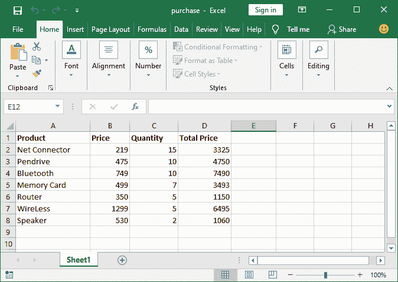
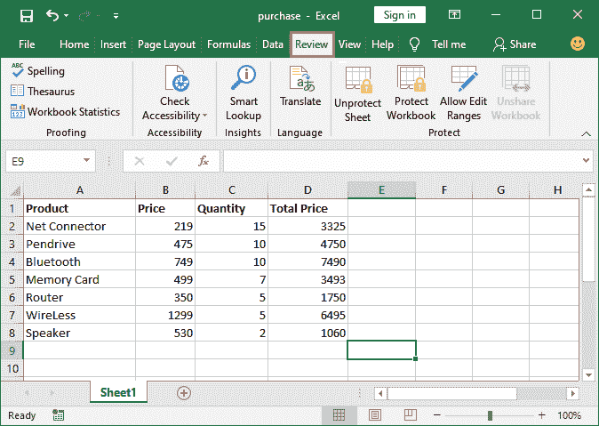
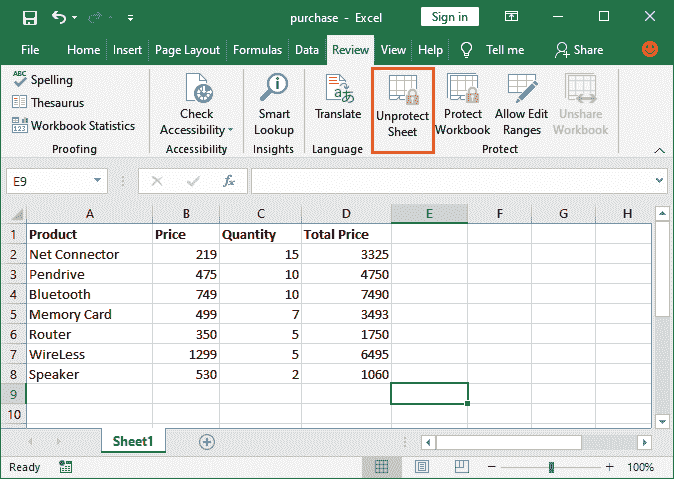
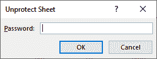
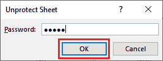
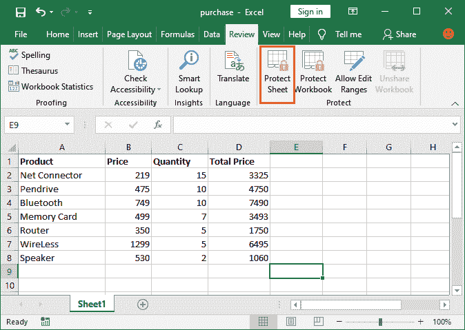

# 如何在 Excel 中解锁单元格？

> 原文：<https://www.javatpoint.com/how-to-unlock-cells-in-excel>

在 Excel 中，当单元格被锁定和保护时，它们是不可编辑的。锁定的单元格不能被更改，在解锁之前，任何人都不能更改其内容。出于数据安全的原因，单元格需要被锁定。这意味着我们锁定细胞，以确保数据安全，防止被任何人篡改。

因此，如果您想要修改锁定单元格中的任何内容或更改其中的某些内容，则需要解锁它们。只有这样，你才能操纵细胞的数据。

要使单元格再次可编辑，我们必须解锁锁定和受保护的单元格。本章将向你描述如何解锁细胞。

## 为什么细胞会被锁住？

有时，我们希望限制用户对某些特定或所有单元格进行更改。这个目标可以通过锁定目标细胞来实现。一旦它们被锁定，单元格就变得不可编辑。通过锁定单元格，其他用户可以读取文件数据，但不能在锁定的单元格中进行更改。

为此，您必须首先锁定目标单元格，然后保护它们以完成锁定过程。具体步骤详见 [**如何在 Excel 中锁定单元格**](how-to-lock-cells-in-excel) 章节。

## 锁定单元格的类型

[Excel](https://www.javatpoint.com/excel-tutorial) 单元格可以通过两种方式锁定。它们可以是**密码保护细胞**或者只是**锁定细胞**。

### 受密码保护的单元格

受密码保护的单元格需要文件所有者在解锁时设置密码。这些文件更安全，因为它们有密码保护。因此，没有正确的密码解锁，任何人都无法编辑它们。

> 请记住，如果密码丢失，将无法恢复。

有时候，这是密码保护单元格的一个缺点；如果忘记了密码，就无法解锁单元格。

虽然也可以不用设置密码就能保护细胞。因此，当您取消对锁定单元格的保护时，它不会要求任何密码，而是直接单击取消对它们的保护。

### 简单锁定单元格

这些单元格只是受保护的锁定单元格，没有任何密码。Excel 在解锁时不会询问密码。因此，无需密码即可轻松解锁。

如果有人不知道这个锁定功能，他们就无法解锁细胞。否则，电池很容易解锁。

### 解锁受密码保护的单元格

**第一步:**打开您的 Excel 工作表，您希望其单元格再次可编辑。可能部分或全部细胞都被锁定了。

这是我们用密码锁定/保护的 Excel 工作表。

**第二步:**不需要选择任何单元格，直接进入 Excel 菜单栏的**查看**选项卡即可。在这里，如果单元格被锁定，您将看到一个取消工作簿保护的选项，而不是“保护工作表”。

**第三步:**点击**未保护工作簿**解锁单元格，使其可编辑。

**第四步:**如果单元格有密码保护，会要求输入密码。

**第五步:**输入解锁细胞的密码，点击**确定**按钮。

**第 6 步:**一旦单元格解锁成功，取消工作表保护选项将被替换为保护工作表选项。请看下面的截图:

### 解锁简单锁定的单元格

**第一步:**打开您的 Excel 工作表，您希望其单元格再次可编辑。可能部分或全部细胞都被锁定了。

这是我们锁定/保护的 Excel 工作表。

**第二步:**不需要选择任何单元格，直接进入 Excel 菜单栏的**查看**选项卡即可。在这里，您将看到一个取消工作簿保护的选项，而不是“保护工作表”。

**第三步:**点击**未保护工作簿**解锁单元格，使其可编辑。锁定的单元格将自动解锁。

**第四步:**解锁单元格后，会看到**未保护工作表**选项被替换为保护工作表。意味着所有的细胞都被解锁了。

* * *