# 如何在 Excel 中比较两列？

> 原文：<https://www.javatpoint.com/how-to-compare-two-columns-in-excel>

当两列或多列包含复杂的数据时，不能仅仅通过看到它们来进行比较，Excel 为此提供了一些预定义的函数。

Excel 允许用户比较两列的值。使用不同的方法可以通过几种方式完成，例如 IF、MATCH 和 ISERROR 函数。无论您使用哪种方法，都将取决于数据结构和您想要从中获得什么。我们可以一次比较两列或更多列，也可以一次比较一行。

**例如**，

1.  逐行比较两列的数据，得到真或假的结果。
2.  比较两列，并突出显示两列中所有匹配的数据点(在两列中都可用)。相反，突出显示两列中的差异(不匹配的数据点)。

Excel 提供了各种比较方法和技巧。在本章中，我们将涵盖比较两个列所需了解的所有必要要点。在这里，我们将在本章中讨论以下主题:

1.  **通过精确行匹配比较两列**
    1.  逐行比较(简单比较)
    2.  使用 IF 公式进行逐行比较
    3.  突出显示匹配的行
2.  **比较两列并突出显示匹配项**
    1.  比较列并突出显示匹配项
    2.  比较列并突出显示不匹配

通常，当我们有一个具有复杂值的大数据集时，我们希望找出匹配和不匹配的数据。这些比较方法帮助用户使用这些方法获得预期的结果。

## 通过精确行匹配比较两列

这是最简单的比较方式。它是对两列或多列数据的逐行比较。我们可以使用三种不同的方法获得精确的行匹配来比较两列，即，

[**方法一:**逐行对比(简单对比)](#Method1)

[**方法二:**使用 IF 公式](#Method2)进行逐行比较

[**方法 3:** 高亮匹配行](#Method3)

这些比较方法仅用于两列或多列的逐行比较。当您只想在同一行而不是在整个数据集中查找匹配项时，这很有帮助。

通常，当您想要在整个选定的列中而不是在同一行中查找具有两个以上匹配项的所有值时，逐行比较两列不是一个好主意。

### 特征

*   您可以逐一比较两列的每一行值，并得到“真”或“假”的结果。
*   使用这些方法无法一次性比较两列的所有值。因此，比较两列的所有行需要时间。

### 方法 1:逐行比较

此方法用于比较同一行的两个单元格。这是一个简单的比较。这意味着我们可以逐行比较两列的数据，而无需使用任何典型的公式。例如-

下面是比较 A 和 b 两列第一行的公式。

```

=A1=B1

```

我们将逐行比较两列。

**返回值**

如果两个单元格具有完全相同的值，它将返回**真**。否则，结果将返回**假**。返回值存储在用户在比较时选择的另一列中。

**例**

现在，看看比较是如何实际发生的例子。

**第一步:**打开 Excel 工作表，选择要粘贴比较结果的单元格。

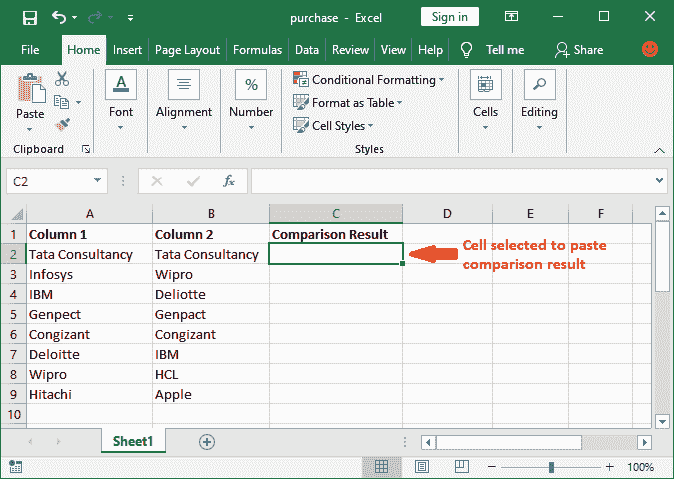

**第二步:**现在去公式栏，可以写公式了。

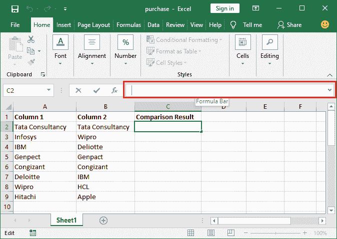

**第三步:**输入公式，逐行比较列。例如，

**=A2=B2** 比较 A、B 列第二行和“**按回车键**”。

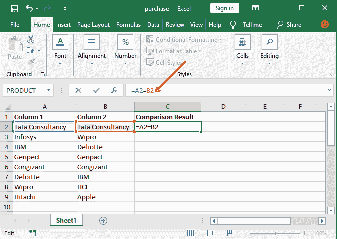

**第四步:**你会得到真或假的结果。看到它返回**真**，因为两个字符串完全相同。

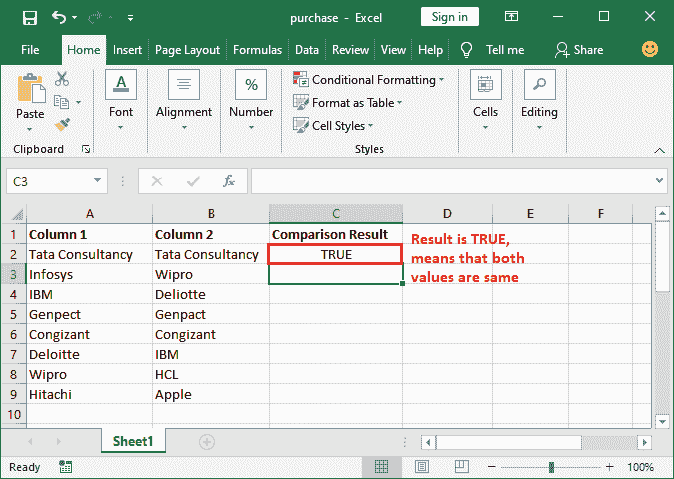

**步骤 5:** 现在，我们将向您展示一个值不匹配时的 FALSE 结果。我们将检查第 5 排<sup>。因此，键入以下公式:</sup>

**=A5=B5** 并按下**回车**键。

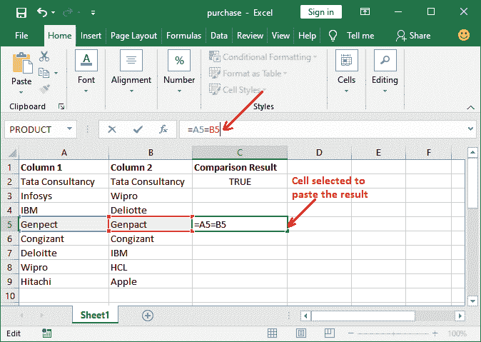

**第六步:**看到返回 FALSE，说明 A5 和 B5 不一样。两种拼写都没有变化。

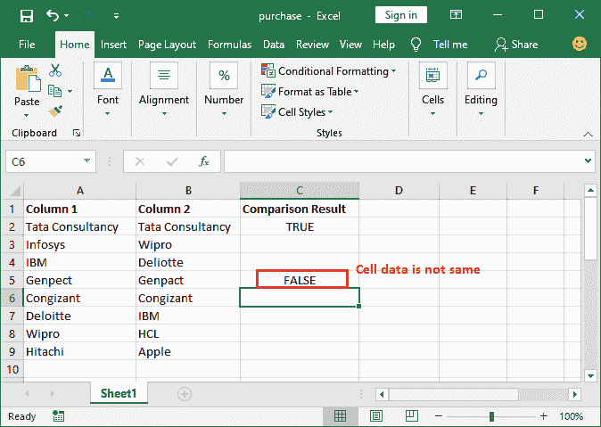

同样，您可以对其他行执行更多的比较。

### 方法 2:使用 IF 公式进行逐行比较

这个方法是比较两列的另一种方法。和上面的方法差不多。在此方法中，我们将使用 **IF 公式**逐行比较两列的数据。**例如-**

下面是使用 IF 公式比较两列(A 和 B)第一行的公式。

```

=IF(A1=B1, "Match", "Mismatch")

```

这一次，如果两列的值相同，它将返回**匹配**，但是如果没有找到完全匹配，它将返回**不匹配**作为结果值。

#### 注意:您也可以根据自己的需要自定义公式中的结果字符串。

**返回值**

如果两个单元格包含完全相同的数据，则返回第一个字符串。否则，它将返回您在 IF 函数中传递的第二个字符串**。**

 ****例**

现在，看看比较是如何实际发生的例子。

**第一步:**打开 Excel 工作表，选择要粘贴比较结果的单元格。

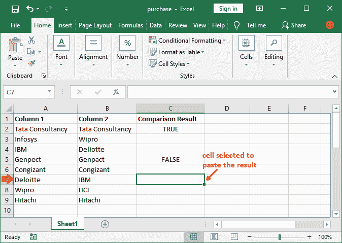

**第二步:**现在，转到公式栏，在这里写下公式，对第 7 <sup>行</sup>列进行逐行比较。例如，

**=IF(A7=B7，“匹配”、“不匹配”)并“按回车键”。**

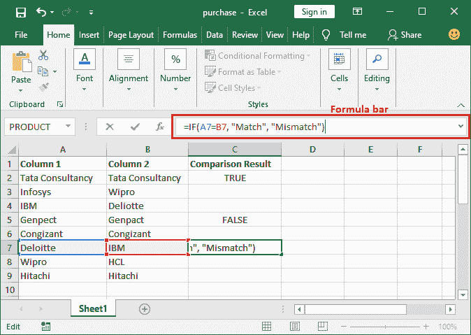

**第三步:**如果值相同，您将获得匹配结果；如果值不同，您将获得不匹配结果。看到它返回**不匹配**，因为两个字符串不一样。

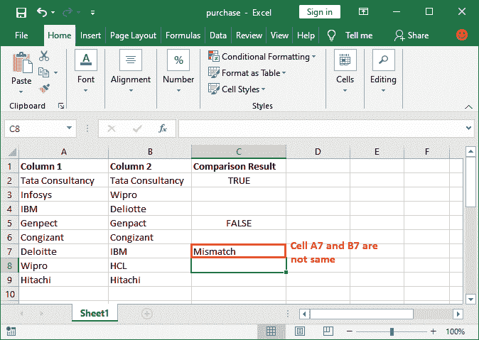

**第四步:**同样的，多检查一行数据，得到匹配结果。我们将使用以下公式检查第 9 行<sup>:</sup>

**=IF(A9=B9，“匹配”、“不匹配”)**并按下**回车**键。

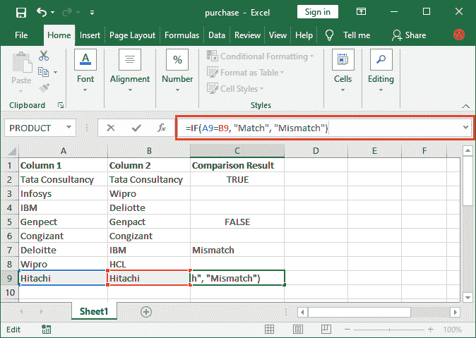

**第五步:**看其返回**匹配**作为结果，表示 A9 和 B9 相同。

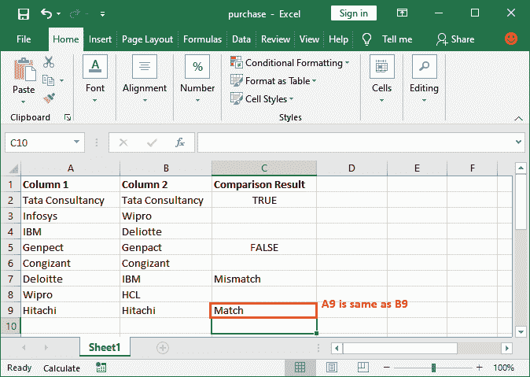

同样，您可以对其他行的数据执行更多的比较。

### 方法 3:突出显示匹配的行

这与上面两种方法有点不同。使用此方法，我们突出显示两列中具有相同数据的行。此方法使用条件格式。它不返回任何结果字符串；它突出显示匹配的数据行，而不是返回真或假。

#### 注意:你要对每一行逐一做比较。您不能同时检查多行数据。

通过突出显示匹配的数据而不是在第三列中获得结果，这是一种一次性比较多行的有用方法。通过一次比较并显示结果，节省了用户的时间。

**结果**

如果在两列的单元格中发现完全匹配，该行将突出显示。否则，如果找不到匹配项，该行将不会突出显示。

**例**

我们举个例子来一步步比较。

**第一步:**打开目标 Excel 文件，选择要检查值是否相同的行。

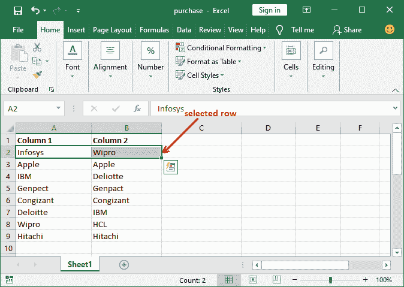

**第二步:**在**主页**选项卡中，您将在样式组下看到一个名为**条件格式**的选项。点击这个下拉列表。

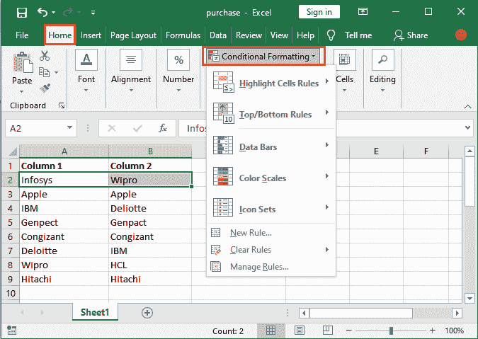

**第三步:**从下拉列表中，点击**新规则**，打开面板设置新的格式规则。

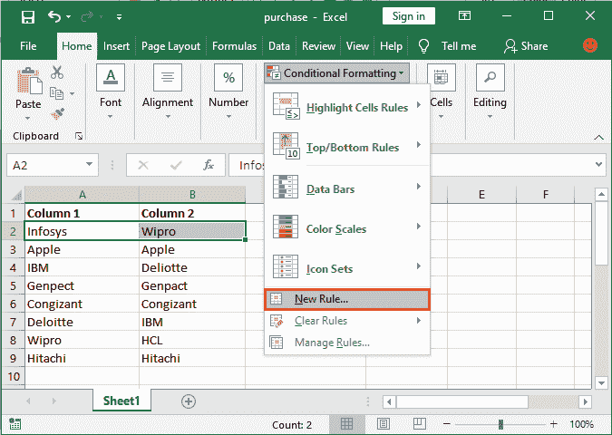

**第 4 步:**在这里，点击**使用公式从规则类型列表中确定要格式化**的单元格。

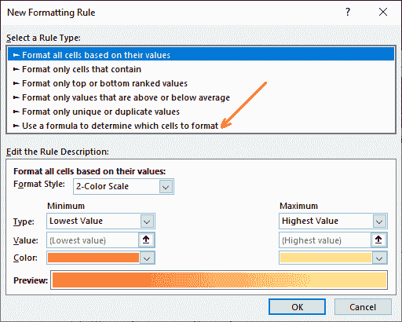

**第五步:**在这里，在公式字段内，用下面的格式指定要比较的单元格，例如: **=$A2=$B2** 。这个公式适用于第二行。

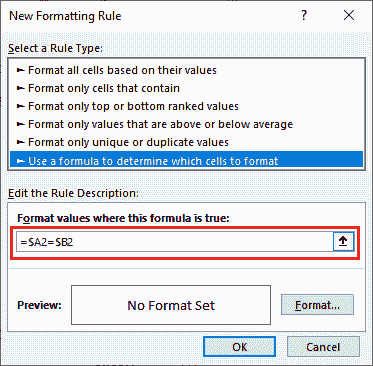

**第六步:**最后，点击**格式**按钮，指定匹配单元格的格式，在**预览框**中可以看到该单元格的预览。


**第 7 步:**在这里，导航到**填充**选项卡，选择一种背景颜色来突出显示匹配项，然后单击**确定**按钮。


**第 8 步:**查看预览部分内部的预览，看看找到匹配的行会是什么样子。完成所有工作后，点击**确定**按钮保存更改。

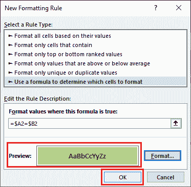

**步骤 9:** 您将看到所选行没有高亮显示，因为 A2 和 B2 单元格不包含相同的值。

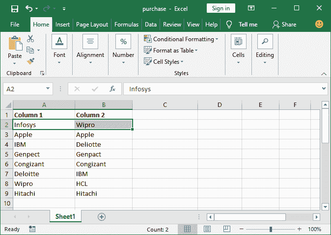

**步骤 10:** 按照相同的步骤，比较下一行数据。确保一切设置成功。现在，点击**确定**按钮获取结果。


**第 11 步:**看下面的截图，第 3 <sup>第</sup>行被突出显示，因为它在两列中获得了相同的数据。

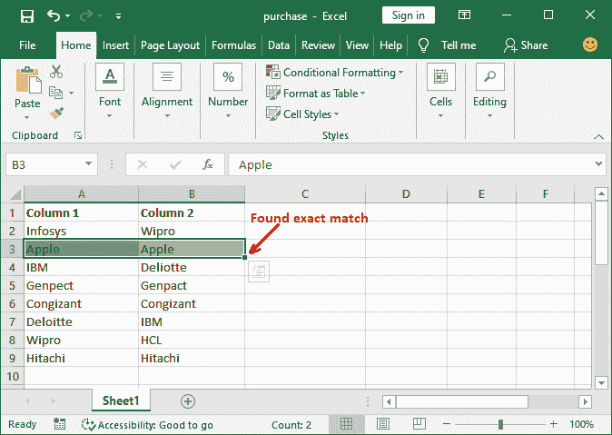

**步骤 12:** 同样，我们将逐个检查所有行。

比较两列中的所有行后，查看我们的 Excel 工作表；在两列中具有相同数据的行已被突出显示，并且保持原样。

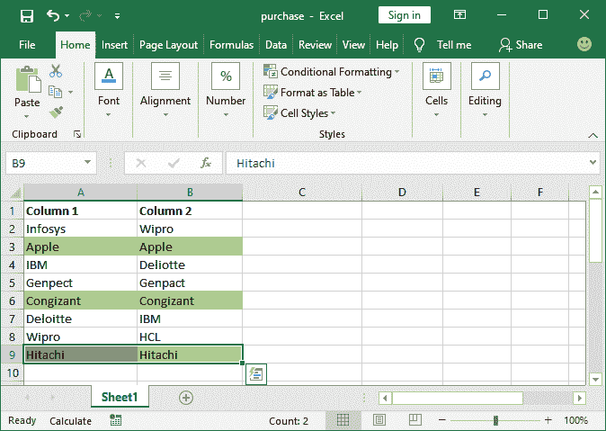

它将以您之前选择的格式突出显示所有匹配的数据行。

## 比较两列并突出显示匹配项

这种比较方法也是使用条件格式完成的。将一列数据与另一列值进行比较并在比较后突出显示匹配项是一种有用的方法。

它不仅用于在选定列的同一行中查找匹配项，还用于在整个选定数据集中查找匹配项。使用这种方法，我们突出显示至少有两个或两个以上匹配的单元格数据。**例如-**

通常，有匹配项可用，但不在同一行。在这个场景中，这些比较方法帮助用户找到匹配。如下图所示:

**功能**

*   两列的所有值都一次性进行比较。
*   通过一次将整个列与另一列进行比较，可以节省用户的时间。
*   您可以突出显示所有唯一值或重复值，视需要而定。

有两种方法可以比较列并显示它们的结果，即，

[**方法 1:** 比较列并突出显示匹配项](#CompareMethod1)

[**方法 2:** 比较列和高亮不匹配](#CompareMethod2)

### 比较列并突出显示匹配项

这种比较方法不同于逐行比较。它的工作原理不同。在这种方法中，我们在条件格式中使用重复功能。这意味着在成功比较后，重复的值将突出显示。

以下是比较两列并突出显示匹配项的步骤:

**列比较步骤**

**第一步:**打开你的目标 Excel 文件。这次使用选择全部 **Ctrl+A** 快捷键选择所有数据，在该快捷键中您要查找重复值。

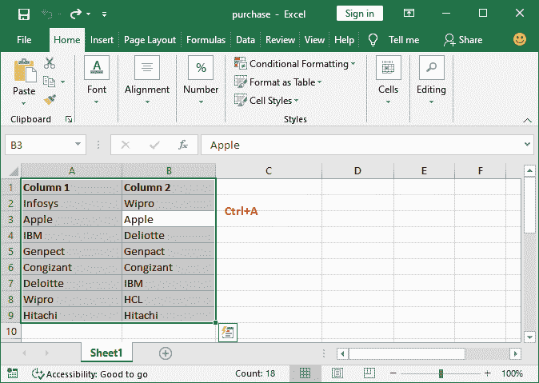

您也可以只选择两列。

**第二步:**在**主页**选项卡中，您将在样式组下看到一个**条件格式**选项。点击这个下拉列表。

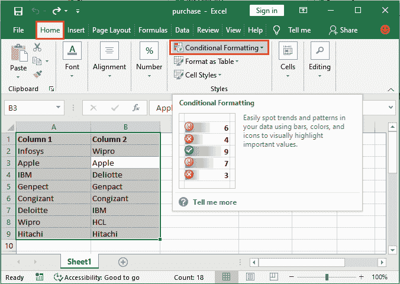

**步骤 3:** 在下拉列表中，将鼠标悬停在**突出显示单元格规则**选项上以展开更多选项，然后单击**重复值**。

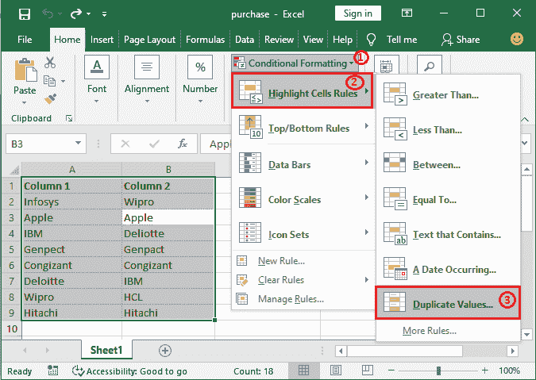

**步骤 4:** 现在，在重复值对话框中，确保在给定的下拉列表中选择了**重复**。如果没有，在此选择**复制**。

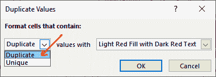

**步骤 5:** 接下来，指定高亮显示所选数据集中存在的重复值的格式颜色，并单击**确定**按钮。

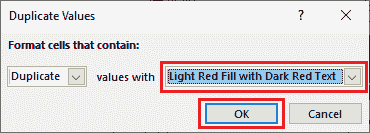

您也可以自定义给定颜色和字体以外的颜色和字体。这意味着您可以设置您的格式，以突出显示来自**自定义格式**的重复值。

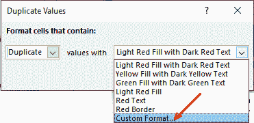

**第六步:**看到下面的截图，所有的重复值都用红色高亮显示。这种比较是针对整个选定数据，而不是逐行进行的。

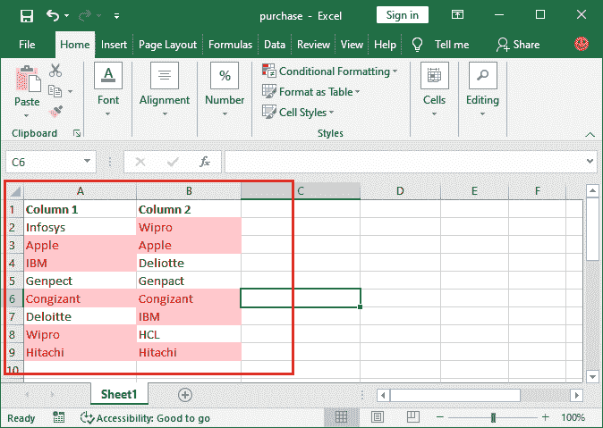

### 比较列并突出显示不匹配

这个方法与上面的方法几乎相同，但不同的是——在这个方法中，我们突出显示不匹配，而不是匹配。因此，它的工作原理相同，但结果不同。

在此方法中，我们在条件格式中使用重复功能，并突出显示选定列中不重复的值。它的步骤几乎和上面的一样。遵循以下步骤，了解如何做到这一点:

**列比较步骤**

在本例中，我们将使用相同的 excel 工作表，其中包含相同的内容。但这次，我们将突出显示该 Excel 工作表中存在的唯一值。

**第一步:**打开你的目标 Excel 文件，用 **Ctrl+A** 快捷键选择它的所有数据。您也可以只选择两列。


**第二步:**在**主页**选项卡中，您将在样式组下看到一个**条件格式**选项。点击这个下拉列表。


**步骤 3:** 在下拉列表中，将鼠标悬停在**突出显示单元格规则**选项上以展开更多选项，然后单击**重复值**。


**第 4 步:**这一次，从下拉菜单中选择**唯一的**来突出显示唯一的值，而不是重复的值。

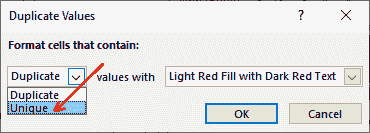

**步骤 5:** 选择一种格式以突出显示所选数据集中存在的唯一值。

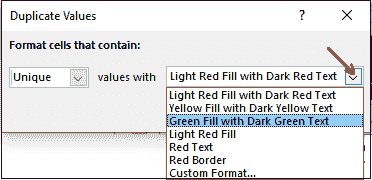

**第 6 步:**相应设置格式，然后点击这里的**确定**按钮。

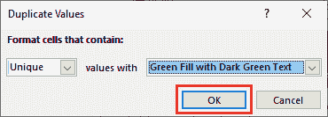

**步骤 7:** 可以看到所有唯一的值(在所选数据集中只有一个)都被高亮显示。所有值都会一次高亮显示。

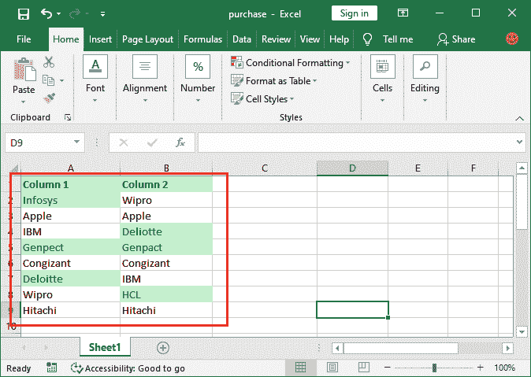

* * ***