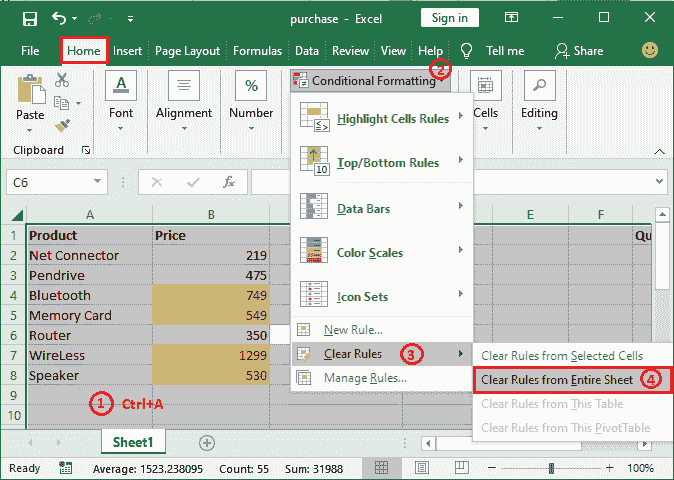

# Excel 中的条件格式

> 原文：<https://www.javatpoint.com/conditional-formatting-in-excel>

条件格式是 Excel 的一项特殊功能(格式功能)，用于通过格式化单元格来查找唯一值和重复值。该功能在各种电子表格应用程序中都可用，Excel 就是其中之一。

顾名思义，条件格式允许用户根据用户指定的一些条件来设置单元格及其数据的格式。使用条件格式，您可以用特定的颜色突出显示单元格，并用不同的字体突出显示其内容。

条件格式为用户提供了各种功能，使数据更具信息性和可读性。它还允许您格式化符合指定标准的单元格及其数据。

在本章中，您将学习条件格式的几种用法，以及如何将其应用于 Excel 工作表以使数据更有用。

### 本章涵盖的主题

以下是我们将在本章中讨论的主题-

*   [条件格式的特点](#Features)
*   [条件格式选项在哪里可用？](#Where)
*   [条件格式基础知识](#Basics)
*   [预设条件格式](#Pre-set)
    *   [突出显示单元格规则](#Highlight-Cell-Rules)
    *   [顶部/底部规则](#Top-Bottom-Rules)
    *   [数据条](#Data-Bars)
    *   [色标](#Color-Scales)
    *   [图标设置](#Icon-Sets)
*   [突出显示单元格](#Highlight-cells)
*   [在数据上应用数据条](#Apply-data-bars-on-data)
*   [对数据应用色标](#Apply-color-scales-on-data)
*   [清除条件格式](#Clear)
*   [定义自定义条件(新规则)](#Define)

## 条件格式的特点

Excel 支持多种条件格式功能，例如-

*   您可以用背景色突出显示单元格，使数据更有价值。
*   您也可以用特殊字体格式化单元格内容。
*   它还允许您格式化符合指定标准的单元格及其数据。
*   Excel 允许对数据设置条件，并根据以下条件设置单元格格式，如大于、小于、重复值、唯一值、相等(如果文本包含指定数据)。
*   您可以设置规则来格式化数据，也可以清除之前从选定单元格或整个工作表中设置的规则。
*   条件格式使您能够用数据做许多事情，比如您可以用数据设置图标，如指示器、形状、方向等。
*   出于分析目的，条件格式使数据对读者来说更具可读性和信息性。
*   出于电子表格的分析目的，条件格式是格式化数据的好选择。

## 哪里有条件格式选项？

在 Excel 中很容易找到条件格式选项，因为它出现在第一个 Excel 选项卡中。它出现在**主页**选项卡内，即**主页>样式>条件格式**。

在这些条件格式选项下，您将获得几个条件来应用和格式化电子表格数据。明智地选择并根据你的需要使用它们。

## 条件格式基础

在移动到在 Excel 电子表格上应用条件之前，让我们了解条件格式的基本概念。

### 如果-那么逻辑

条件格式逻辑基于 if-then 逻辑。它以这样一种 if-then 方式来格式化单元格。

**例如**，X 是某个条件，Y 是要应用于数据的格式。在这种情况下，如果满足 X 条件(如果为真)，则将对数据应用 Y 格式。

因此，它可以写成 X →Y。简单地说，它意味着如果 X 为真，则应用 Y。所有条件格式都遵循相同的逻辑。

### 预设条件

条件格式提供了用户通常需要的几种预设条件，如大于、小于、重复值、唯一值等。因此，为了节省用户编写公式的时间，Excel 为他们提供了一些预设条件。

以下是预设条件。你可以在这里使用它们中的任何一个。

Excel 有大量的预设条件库，用户通常希望使用函数来应用这些条件。

### 自定义条件

通常，预设条件不符合您想要应用的标准。Excel 允许您操作预设条件并定义您自己的自定义条件。这意味着您也可以创建规则来格式化数据。

从这里，您可以定义自定义条件。

### 应用多个条件

有时，数据需要应用多个条件才能得到您想要的确切结果。Excel 允许在单个单元格上应用多个条件。请注意，使用它们时要注意层次结构和优先级。

## 条件格式

在本章中，我们将简要讨论每种可能的预设条件，让您有一个概述。通过学习它们的基础知识，你可以很容易地相应地使用它们。当您导航到主页选项卡中的**条件格式**选项时，它会启用几个预设条件。

1.  突出显示单元格规则
2.  顶部/底部规则
3.  数据栏
4.  色阶
5.  图标集

### 突出显示单元格规则

此条件格式规则允许用户通过使用满足指定条件的预设条件来突出显示单元格。它向 Excel 用户提供这样的条件，如**大于、小于、介于、等于、包含文本、重复值**。

这些条件通常是比较运算符条件。

### 顶部/底部规则

此条件格式包含通过突出显示单元格来格式化单元格数据的顶部/底部规则。它通常用于从列的顶部或底部突出显示单元格，如顶部 10 个单元格或底部 5 个单元格。

上/下规则包含这样的预设条件，**前 10 项，后 10 项，前 10%，后 10%，高于平均水平**，以及**低于平均水平**。

### 数据栏

数据条是应用于 Excel 数据的彩色条，用于表示单元格的值。这些数据条不同于上述两种条件格式。它们用于清楚地显示单元格中包含的数据的高/低状态。

"**数值越高，条越长。同样，数值越低，条形**越短。

*   数据条是数据的图形表示。或者你可以说用图形的方式来显示数据。
*   数据栏通过根据单元格中的高值和低值用颜色突出显示单元格，帮助 Excel 用户根据整体数据显示上的清晰状态。
*   记住一点，数据条只适用于数字类型的数据。在字符串数据上，这些毫无价值。
*   条件格式提供了几种用于数据条表示的颜色。

借助一个例子，我们将在后面讨论数据条实际上是如何工作的。

### 彩色温标

在条件格式中，色标应用于一系列单元格。颜色指示每个单元格值在单元格范围内的位置。在 Excel 中，条件格式提供**十二种颜色**刻度来表示数据。

此色阶条件格式仅适用于 Excel 工作表中的数值。

### 图标集

在 Excel 中，可以通过不同的图标集来表示单元格数据。条件格式包含几种类型的图标集，如**方向、形状、指示器、等级**。

**例如，**通过使用方向图标集，可以在一列中以高、低和平均值三种方式表示数据。

这些图标集仅与 Excel 工作表中的数值一起附加，而不是与字符串数据一起附加。

## 突出显示单元格

我们将举一个例子，通过在列上放置特定条件来突出显示单元格。例如，突出显示数据大于某个值(由您指定用于条件格式)的所有单元格。

遵循给定的步骤:

**步骤 1:** 在 Excel 工作表中选择一个单元格区域，例如 B2 到 B8。

**第二步:**转到**主页**标签中的**条件格式**并点击。

**第三步:**将鼠标悬停在下拉列表中的**高亮显示单元格规则**，然后单击**大于**条件规则。

同样，您可以从这里选择任何其他条件并相应地执行操作。

**步骤 4:** 在这里，指定一个值，您要用它来检查所有选定的值。我们这里已经输入了 65。

**步骤 5:** 同时指定颜色以突出显示较大的值，并按下**确定**按钮。

**第六步:**看下面的截图，所有大于 65 的值都用黄色突出显示。

**第 7 步:**将 B5 单元格值更改为大于 500，然后按**回车**键。

**第八步:**看到单元格颜色自动变为黄色，单元格高亮显示。

## 清除条件格式

在 Excel 中，用户可以一次清除应用于 Excel 电子表格中单元格的所有格式。Excel 允许从整个工作表或选定的单元格(某些单元格)中清除条件格式。参见下面的两种方法-

### 1.清除整个工作表的格式

在**主页**选项卡中，转到**条件格式>清除规则>从整个工作表中清除规则**。

它将清除整个工作表中的所有预设和自定义条件规则。

**例如**

**步骤 1:** 选择所有单元格以清除整个工作表的格式，然后按照步骤清除整个工作表的格式规则。

**第二步:**点击**清除整个工作表中的规则**，将从整个工作表中删除所有格式。看下面的截图:

在这里，您可以看到整个工作表(所有单元格)的格式都被删除了。

### 2.清除选定单元格的格式

此外，您还可以从选定的单元格区域清除条件格式。步骤几乎一样。

在**主页**选项卡中，转到**条件格式>清除规则>清除选定单元格中的规则**。

**例如**

**步骤 1:** 选择从 B2 到 B7 的范围，但保留最后一个，即 B8，并对所选单元格使用清除格式规则。

**第二步:**点击**清除所选单元格中的规则**，格式将只从所选单元格中删除。请看下面的截图:

您可以看到仅从选定的单元格中删除了格式，而不是全部。

## 应用顶部/底部规则并突出显示单元格

条件格式允许六个预设的顶部/底部规则来突出显示单元格。它允许用户从列的顶部或底部突出显示单元格，如顶部 10 个单元格或底部 5 个单元格等。

上/下规则包含这样的预设条件，**前 10 项，后 10 项，前 10%，后 10%，高于平均水平**，以及**低于平均水平**。

查看顶部/底部规则如何应用于列的步骤:

**第一步:**选择一列(单元格区域)，进入**首页**标签内的**条件格式**。

**第二步:**点击此**条件格式**选项，导航至列表中的**顶部/底部规则**，然后从这里选择一个**规则**。

我们选择了**高于平均值**来突出显示高于平均值的值。

**第三步:**设置一种颜色来格式化单元格的颜色，点击**确定**按钮。

**第 4 步:**请注意，所有高于该列平均值的值都会高亮显示。

## 对数据应用数据条

条件格式由数据条组成。您可以在列中的数字数据上使用这些数据条，以图形方式表示单元格的值。查看如何实现的步骤:

**第一步:**选择一列(单元格区域)，进入**首页**标签内的**条件格式**。

**第二步:**点击这个**条件格式**选项，导航到列表中的**数据栏**，然后从这里选择任意一个**数据栏**。

**第三步:**现在，你可以看到列的每个单元格都是用横条表示的。

"**数值越高，条越长。同样，数值越低，条形**越短。

## 对数据应用色阶

条件格式由几个色标组成。您只能对列中的数字数据使用这些色标，以图形方式表示单元格的值。颜色指示每个单元格值在单元格范围内的位置。

请参见步骤如何完成以及如何表示数据:

**第一步:**选择包含数值数据的两列或多列(单元格区域)，进入**首页**标签内的**条件格式**。

**第二步:**点击这个**条件格式**选项，导航到列表中的**色标**，然后从这里选择任意一个**色标**。

**第三步:**现在可以看到选中列的数值数据是用色标表示的。

您可以注意到色标只应用于数字数据，而不是字符串。

## 对数据应用图标集

在 Excel 中，条件格式提供四种类型的图标集，即方向、形状、指示器和等级。您可以在列中的数字数据上使用这些图标集来表示列或单元格区域中的单元格值。我们将为您描述**方向图标集**。

以下是将图标集与单元格数据一起使用并表示它们的步骤:

**第一步:**选择包含数值数据的列(单元格区域)，转到**主页**选项卡内的**条件格式**。

**步骤 2:** 在这里，从条件格式选项列表中，点击**图标集**。当你点击它时，你会得到不同的图标集；你想选哪个就选哪个。

**步骤 3:** 现在，您将看到图标集附加了单元格值，并用箭头表示。

## 定义自定义条件

在 Excel 中，条件格式提供预设条件，还允许用户定义他们的自定义规则/条件。在主页选项卡中，转到**条件格式>新规则**。

从这里，您可以设置自定义规则。让我们举个例子来更好地理解。

**例如，**对两列进行行与行的比较，如果发现匹配，则突出显示单元格。

**第一步:**我们有这个数据集进行比较。选择要检查值是否相同的行。

在这里，我们只需查看数据，就可以轻松地比较简单的数据。但是对于复杂的数据，匹配值并不容易。

**步骤 2:** 现在，在**主页**选项卡下，转到**条件格式>新规则**。

**步骤 3:** 在这里，点击**使用公式从规则类型列表中确定要格式化**的单元格。

**第 4 步:**在这里，在公式字段内部，按照以下格式指定要比较的单元格，例如， **=$A2=$B2** 为第二行。

**第五步:**最后，点击**格式**按钮，指定匹配单元格的格式，在**预览框**中可以看到该单元格的预览。

**第 6 步:**在这里，导航到**填充**选项卡，选择一种背景颜色来突出显示匹配项，然后单击**确定**按钮。

**第 7 步:**查看预览部分内部的预览，看看找到匹配的行会是什么样子。完成所有工作后，点击**确定**按钮保存更改。

**第 8 步:**您将看到所选行没有高亮显示，因为 A2 和 B2 单元格不包含相同的值。

**步骤 9:** 按照相同的步骤，比较下一行数据。确保一切设置成功。现在，点击**确定**按钮获取结果。

**第 10 步:**看下面的截图，第 3 第行被突出显示，因为它在两列中获得了相同的数据。

**步骤 11:** 同样，我们将逐个检查所有行。比较两列后，查看 Excel 工作表，发现两列中具有相同数据的行已突出显示，并保持原样。

它将以您之前选择的格式突出显示所有匹配的数据行。像这样，我们可以在条件格式中定义自定义条件。

* * *