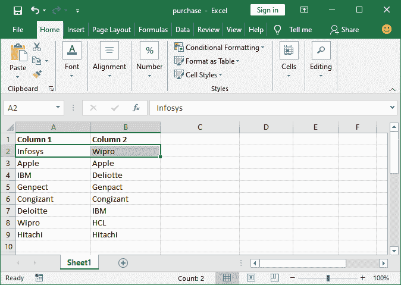
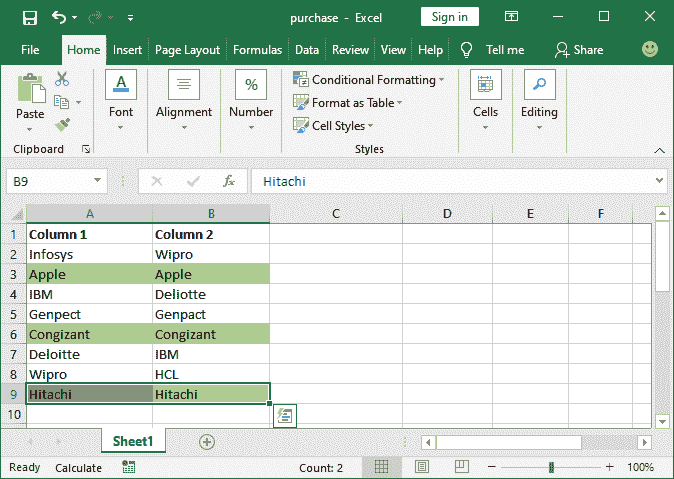

# 如何在 Excel 中定义条件格式的自定义规则？

> 原文：<https://www.javatpoint.com/how-to-define-custom-rules-for-conditional-formatting-in-excel>

Excel 允许用户定义自己的自定义条件格式规则/条件来格式化单元格数据。这些新的定制规则帮助用户根据它们格式化和突出显示数据。但是，条件格式提供了几个预设条件。

"**当预设条件没有自定义规则时，需要定义自定义规则。**”

条件格式的自定义规则是预设条件中没有定义的新规则。这意味着-用户需要定义在预设条件下何时不可用。否则，用户可以选择首选条件来格式化或突出显示 Excel 表格数据。

为自定义条件设置新规则时，您需要编写所需的公式，以便对所选数据应用自定义的条件格式。

### 为什么需要定义自定义规则？

如果没有选项满足您在预设条件中寻找的条件，您可以定义自己的自定义规则来格式化单元格的数据。为此，您需要在创建自定义规则时编写一个公式，以便对所选数据设置条件。

1.  如果数据符合定义的标准，选定的单元格将突出显示。否则，它们将保持不变。
2.  自定义规则通过定义用户自己的规则来帮助用户相应地格式化单元格。

### 在哪里设置新的自定义规则？

这里，我们有一些步骤来为条件格式创建自定义规则，还有一个示例来将该自定义规则应用于目标数据。您可以在 Excel 中定义新的自定义条件来设置用户定义的规则。

以下是您可以设置条件格式新规则的位置。

在**主页**选项卡中，转到**条件格式>新规则**。

从打开的面板中选择规则类型。要定义自定义条件，请单击最后一个选项“**”使用公式确定要格式化的单元格**。

从这里，您可以设置自定义规则。现在，让我们用一个例子来理解。

**例如-**

对于两列的逐行比较，没有预定义的条件格式规则。因此，我们将为此定义一个自定义规则，并在找到匹配项时突出显示该单元格；否则，不会。

### 设置新规则的步骤

以下是在 Excel 中定义自定义规则(新规则)以格式化单元格数据的步骤:

**第一步:**我们有这个数据集进行比较。选择要检查值是否相同的行。

在这里，我们只需查看数据，就可以轻松地比较简单的数据。但是对于复杂的数据，匹配值并不容易。

**步骤 2:** 现在，在**主页**选项卡下，转到**条件格式>新规则**。

**第三步:**点击最后一个选项**使用公式确定要格式化的单元格**从规则类型列表中选择规则类型。

**第 4 步:**在这里，在公式字段内部，按照以下格式指定要比较的单元格，例如， **=$A2=$B2** 为第二行。

**第五步:**最后，点击**格式**按钮，指定匹配单元格的格式，在**预览框**中可以看到该单元格的预览。

**第六步:**

*   在这里，导航到**填充**
*   选择背景颜色来突出显示匹配项。
*   点击**确定**

**第 7 步:**查看预览部分的预览，如果找到匹配，该行看起来如何。完成所有工作后，点击**确定**按钮并保存所有更改。

**第 8 步:**您将看到该行没有高亮显示，因为 A2 和 B2 不包含完全相同的值。

**步骤 9:** 按照相同的步骤，比较下一行数据。确保一切设置成功。现在，点击**确定**按钮获取结果。

**第 10 步:**看下面的截图，第 3 第行被突出显示，因为它在两列中获得了相同的数据。

**第 11 步:**同样，我们将逐个检查这里出现的所有行。

比较两列后，请查看 Excel 工作表，其中两列中具有相同数据的行已被突出显示，并且保持原样，没有突出显示。

它将以您之前选择的格式突出显示所有匹配的数据行。像这样，我们可以在条件格式中定义自定义条件。

* * *