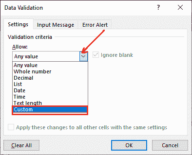

# 在 Excel 中应用数据验证

> 原文：<https://www.javatpoint.com/apply-data-validation-in-excel>

在 Excel 工作表上应用数据验证，以阻止用户向 Excel 单元格中输入无效数据。在前一章中，我们简要介绍了数据验证、它的优点、类型，以及所有关于数据验证的信息。现在，我们将向您展示如何在 Excel 工作表上实现数据验证。

在本章中，我们将通过一个示例逐步讨论每个验证。因此，直到本章结束，你将毫无疑问。我们将在这一章讨论的主题是-

*   [数据验证类型](#type)
*   [在列](#Apply-number)上应用数字验证
*   [列下拉列表验证](#Dropdown-list)
*   [创建并应用自定义验证](#Create-and-apply)
*   [查找有验证的单元格](#Find-cells)
*   [将验证从一列复制到另一列](#Copy-validation)
*   [清除所有验证](#Clear-all)

## 数据验证类型

以下是每个 [Excel](https://www.javatpoint.com/excel-tutorial) 用户在其 Excel 表单中使用的三类验证。有关详细信息，请参阅我们上一章(Excel 中的数据验证)。

*   预定义的数据验证(数字、小数、文本长度、日期和时间验证)
*   下拉列表数据验证(列表验证)
*   自定义数据验证(用户定义的验证)

尽管用户需要各种其他验证，但它属于预定义的数据验证，例如-数字、文本、长度、日期和时间验证。我们将描述每种类型的一种验证。

## 对列应用数字验证

我们将取一张 Excel 工作表，将**数字验证**放入其中一列，以限制输入。这里，我们有以下步骤对 Excel 工作表中的列应用数字验证。

**第一步:**打开 Excel 表，定义列名，指示用户在其中输入数据。

**第 2 步:**现在，选择一列要应用数字验证的列。例如，“年龄”列。

**第三步:**导航到 Excel 菜单栏中的**数据**选项卡，点击数据工具下的**数据验证**。

**第 4 步:**将打开默认数据验证面板，您将看到三个选项卡，即设置、输入消息和错误警报。

**步骤 5:** 在设置选项卡中，从**允许**下拉列表中选择一个验证。我们将选择**整数**，这将在面板上启用更多的设置。

**步骤 6:** 现在，从**数据**下拉列表中选择一个条件。例如，如果您选择**大于或等于**条件，您必须输入更多信息。

**步骤 7:** 为大于条件定义相应字段中的最小值。

根据此条件，用户在已验证列中输入的值必须大于或等于 20。这意味着员工的最低年龄必须是 20 岁。

#### 注意:先不要按“确定”按钮。

**设置输入信息**

**第 8 步:**导航至设置标签旁边的**输入信息**标签。

**第 9 步:**在此提供一个标题和一条自定义消息，该消息将在选择已验证的单元格时显示。

**设置错误警报**

**步骤 10:** 最后一步是-导航至**错误警报**标签。从列表中选择一种样式，停止、警告或信息。

**步骤 11:** 现在，在相应的字段中输入标题和警报消息，以在用户输入错误值时显示警报。

一切设置成功；点击**确定**按钮保存所有更改。

数字验证已成功应用于年龄列。在已验证列中输入一些数据，并检查有效性。

**输出 1:输入信息**

当用户选择带有验证的单元格时，Excel 会显示一条消息，该消息是在对单元格进行验证时设置的。此消息包含您可以在验证列中输入的值的类型。

请参见以下输出:

**输出 2:正确输入**

当用户在已验证的列中提供正确的输入并按下**回车**键时，不会出现错误，数据被成功接受。您将获得如下所示的输出:

**输出 3:报警信息**

最后一个输出是一条警告消息。当用户在已验证的单元格中输入不正确的值并按下**回车**键时，它会显示出来。输入错误值时查看输出。

在这里，要么重试，要么在同一单元格中再次输入该值，要么取消当前输入。

**输入错误数据类型时输出**

尽管有输入消息，但如果您也尝试在数字验证字段中输入文本输入，单元格将不接受该值，它将向您显示警告消息。

因此，所有的验证都以相同的方式工作。但是使用的方式和地点不同。

## 列的下拉列表验证

这种对列进行验证的方法与所有其他验证完全不同。当我们向你展示时，你会看到它是多么的不同。

这是一种输入验证，它向用户呈现预定义的选项，以向 Excel 工作表提供输入。因此，向 Excel 单元格提供输入的唯一选项是从下拉列表中选择输入值。

这里，我们有以下步骤对 Excel 工作表中的列应用列表验证。

**创建列表验证的步骤**

我们在之前使用的 Excel 工作表中增加了一列(性别)来定义该验证。

**步骤 1:** 选择此**性别**栏，导航至菜单栏中的**数据**选项卡。

**第二步:**点击数据工具部分下的**数据验证**。

**第三步:**在设置选项卡中，点击**允许**下拉按钮，并从中选择**列表**，为性别栏创建一个下拉列表。

**第 4 步:**在同一个设置选项卡中，在**源**字段中提供用逗号分隔的值。这些值将显示在已验证列的每个单元格旁边。

**第 5 步:**现在，如果您想提供任何输入消息，请移动到相应的选项卡，并在此输入自定义消息。

**第 6 步:**类似于错误输入时的停止、警告或信息警报，导航至数据验证面板中的**警报**选项卡。

**步骤 7:** 完成所有步骤，点击**确定**按钮，完成列表创建/验证过程。

为性别列的每个单元格输入创建一个下拉列表。因此，该列被验证。

**第 8 步:**请参见下面的输出，了解如何在已验证的单元格旁边添加下拉按钮，该按钮在选中单元格时启用。

**第 9 步:**点击下拉列表，从列表中选择正确的性别，在性别字段中输入。

**步骤 10:** 确保数值输入没有任何中断。

## 创建并应用自定义验证

除了所有这些内置的验证规则，您还可以使用自己的公式设置自定义验证。这些自定义验证允许用户定义他们自己的验证，这在预定义的验证列表中是不可用的。

自定义验证使用户能够编写自己的公式来验证数据。因此，它需要创作者输入一个公式。**例如**，自定义验证验证邮件地址。

### 创建自定义验证的步骤

这里，我们有以下步骤来创建自定义验证，并将其应用于 Excel 工作表的一列。在创建电子邮件自定义验证之前，我们将在以前使用的 Excel 工作表中添加一个电子邮件列。

**步骤 1:** 打开要定义自定义验证的 Excel 工作表。选择应用自定义验证的列，并导航至**数据**选项卡。

**第二步:**点击数据工具部分下的**数据验证**。

**第三步:**在设置选项卡中，点击**允许**下拉按钮，从列表中选择**自定义**定义自定义验证。

当您从列表中选择“自定义”时，它将启用另一个字段(公式)来定义您自己的公式。

**第 4 步:**在这里，在**公式**字段输入公式，创建自定义条件。当我们创建电子邮件验证时，请为其编写以下公式:

ISUMBER(FIND("@", F)

**步骤 5:** 现在，与其他预定义的验证类似，导航到**输入消息**选项卡，在将数据输入单元格之前向用户给出预输入指令。

我们只在这里提供了输入信息，而不是标题。

**步骤 6:** 转到最后一个错误警报选项卡，并在此定义警报消息。

自定义电子邮件验证已成功创建并应用于 Excel 工作表的第 F 列(电子邮件)。

**输出 1:无效邮件**

当用户输入无效(不带@符号)的电子邮件地址并按回车键时。已验证的 Excel 单元格不接受电子邮件，并显示错误警报。

点击**重试**按钮，重新输入 F2 单元格的电子邮件地址。

**输出 2:有效邮件**

现在，输入一个有效的电子邮件地址和@符号，然后查看结果。已验证的 Excel 单元格现在可以接受电子邮件，并且不会显示错误警报弹出窗口。

确保该电子邮件已被已验证的 Excel 单元格接受。

## 查找带有验证的单元格

通常，当我们不将输入消息和警告消息传递给已验证的单元格时，它们不会解释单元格是否已验证。在这种情况下，一个问题出现了，找到验证的细胞。

Excel 为用户提供了一项功能，可以在“转到”的帮助下查找所有具有验证的单元格。它将突出显示所有已验证的单元格和列。

以下是了解 Excel 工作表中所有已验证单元格的一些简单步骤:

**步骤 1:** 打开要查找已验证单元格的 Excel 工作表。

我们有一张带有一些验证的工作表。

**第二步:**按 **Ctrl+G** (转到的快捷键)打开转到面板，点击左下角的**特殊**按钮。

**第 3 步:**在“转到特殊”中，在列表中标记**数据验证**单选按钮。

将数据验证单选按钮下的**全部**保留为已标记，以查看所有验证，现在单击**确定**按钮。

**第四步:**在下面的 Excel 截图中，所有用灰色突出显示的单元格/列都是经过验证的单元格。

请注意，B 列(EMP_NAME)、C 列(AGE)和 E 列(GENDER)已被突出显示。这意味着这些是应用某些验证的列。

因此，这是在 Excel 工作表中查找具有有效性的单元格的方法。

## 将验证从一列复制到另一列

有好几次，我们需要对多个列进行相同的验证。在这种情况下，最好将验证从一列复制到另一列，而不是将其分别放在每一列上。

复制验证节省了用户将其单独放在每个列上的时间。复制验证并不复杂。它只是两步简单的复制和特殊粘贴过程。

现在，我们将通过一个例子向您展示如何使用您的 Excel 工作表。

**第一步:**我们有以下 excel 数据表。在本例中，我们将复制年龄列验证。

**第二步:**选择要复制验证的列/单元格，按 **Ctrl+C** 快捷键复制。

#### 注意:“不要简单地使用 Ctrl+P 粘贴，这样只能粘贴数据，不能验证。这一次您必须使用 Excel 的“特殊粘贴”选项来复制粘贴验证。”

**步骤 3:** 现在，转到要粘贴验证的列。在这里，如果您选择单个单元格，验证将仅应用于该单元格。如果选择整个列，验证将粘贴到所选列的所有单元格上。

**第四步:**右键点击选中的栏目，点击这里的**粘贴特殊**选项。

**第五步:**将打开粘贴专用对话框，在对话框中标记**验证**单选按钮，点击**确定**按钮完成操作。

验证现在从一列复制到另一列。您可以自己看到验证已被复制。

现在，我们来学习如何删除应用于 Excel 工作表的所有这些验证。

## 从 Excel 工作表中清除验证

通常，我们会对任何列应用错误的验证。在这种情况下，我们需要从该列中删除验证。Excel 允许用户从已验证的列或单元格中清除验证。

您可以从整个工作表或单个列中删除所有验证。这完全取决于你。两者的步骤完全相同。唯一的区别是-选择整个工作表以清除整个工作表中的所有验证，或者仅选择特定列以仅从一列中删除验证。

### 清除验证的步骤

我们有几个简单的步骤来清除 Excel 工作表中的验证。

**步骤 1:** 选择要移除验证的单元格范围或所有单元格。

我们已经选择了所有单元格(整个工作表)。

**第二步:**转到**数据选项卡>数据工具>数据验证**。

**第三步:**可能会询问以下消息，忽略该消息，只需点击**确定**。

**步骤 4:** 将打开一个数据验证标签，点击**清除所有**按钮，然后点击**确定**按钮。

**第 5 步:**已成功移除对所选单元格应用的所有验证，并且您的已验证工作表成为没有验证的普通 Excel 工作表。

* * *