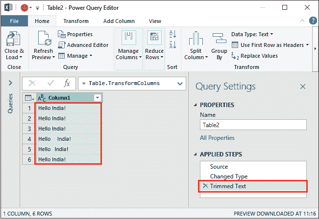

# 删除 Excel 中的空格

> 原文：<https://www.javatpoint.com/remove-spaces-in-excel>

通常，当您从外部来源复制数据并将其粘贴到 Excel 工作表中时，会获得一些额外的空间。这些空格可以是前导空格、尾随空格或中间空格。额外的空间是一个常见的问题，使数据不可读和无意义。

在 Excel 中，有三种不同的技术可以从 Excel 数据中删除多余的空格。Excel 还提供了一个 TRIM()函数来删除 Excel 数据中的空格。在本章中，我们将描述这些从数据中移除额外空间的方法。

### 带有空格的 Excel 数据

看几个 Excel 数据的例子(对于一个字符串 Hello World！)有多余和不必要的空间。

1.  在第一行中，您将看到数据没有包含额外的空间(Hello World！).
2.  下一行看起来和第一行一样。但实际上，在字符串的末尾添加了四个空格。这些空格称为尾随空格，不容易被发现。
3.  前导空格很容易发现，因为您还可以看到第三行数据中几乎没有空格。
4.  最后，看单词或字符之间的间距。这是中间空间的一个例子。

## 移除额外空间的技巧

*   使用 TRIM()功能删除空格
*   使用查找和替换方法删除空格
*   使用超级查询删除空格

### 使用 TRIM()功能删除空格

数据中的额外空间是一个非常常见的问题。有时，如果在错误的地方使用，它们会使数据不可读且毫无意义。因此，我们有一个解决方案。

**TRIM()** 函数是预定义的 Excel 函数，用于去除数据中多余的空格。该功能在 [Excel](https://www.javatpoint.com/excel-tutorial) 中很容易使用。它删除了单词中所有多余的空格。这些额外的空格可以是前导空格、尾随空格或中间空格；它移除了所有。它会在单词中找到多余的空格并删除它们。

**语法**

=TRIM(cell_number)

请看下面的例子:

**例**

我们有一个包含一些额外空格的 Excel 数据集。

现在，我们将在这个数据集的每个单元格上使用 TRIM()函数，并删除其中多余的空格。

**修剪 B2 细胞**

您可以看到 B2 单元格字符串不包含任何额外的空间，正如我们已经提到的信息。

对 B2 单元格执行下面的公式，看看它如何处理普通字符串。

=TRIM(B2)

按回车键获得修剪结果。

**修剪 B3 细胞**

现在，只需在 TRIM()函数中将单元格编号更改为参数值，然后查看结果。

=TRIM(B3)

按回车键，修剪后得到新字符串。

同样，当您对包含额外空格的其他单元格执行此 TRIM()操作时。所有额外的将被删除，您将获得如下所示的相同结果:

在 Excel 中使用 TRIM()函数的一个最大优点是——它只从数据中删除额外的空格，而不是所有必要的空格。

### 使用查找和替换方法删除空格

还有一种更简单的方法可以从 Excel 数据中删除空格，即查找和替换方法。通过使用 Excel 的“查找和替换”功能，您可以轻松地发现所有空格，并将其替换为不删除空格的内容。

通过选择单元格区域，可以一次替换多个值。查找和替换功能包含两个字段:**查找什么**和**替换为**。

**查找内容-** 在该字段中，用户需要提供他们希望替换的值。

**替换为-** 在该字段中，用户需要输入他们想要替换的值。

让我们借助一个例子来看看如何使用这个方法从数据中移除空间。

**例**，

我们在 Excel 中有以下数据集，其中包含一些额外的空格。

**步骤 1:** 选择要从中删除空格的单个单元格或单元格区域。

**第二步:**现在，按 **Ctrl+H** 快捷键，直接打开查找&替换对话框。

**步骤 3:** 在这里，分别在查找内容和替换为字段中提供值。

**用一个-** 去掉两个空格

a.导航到“查找内容”字段，按键盘上的**空格键**两次，添加两个空格字符。

b.同样，转到替换为字段，但这次只按一次**空格键**用一个空格替换指定的两个空格，然后按**全部替换**

**第四步:**更换完成后，会弹出一个对话框，显示一条信息。看下面的截图，做了 17 个替换。

按确定并关闭查找和更换面板窗口。

"**重复这个替换步骤，直到所有多余的空格都没有被替换掉。**”

**第五步:**替换成功后，看到删除空格后得到如下 Excel 数据集，因为选中单元格的空格已经被删除。

但是，您会注意到一些额外的空间也保留了下来。这是因为只有两个空格被替换为一个。如果一个字符串包含两个以上的空格，这就不好用了。

**删除所有空格-**

导航到“查找内容”字段，通过在键盘上一次按下**空格键**来输入一个空格。

下一步在更换什么字段，不提供任何内容，按**更换**进行逐一更换，同时按**全部更换**按钮进行一次全部更换。

参见下面的结果，总共进行了 40 次更换。

您可以看到所有空格(前导空格、尾随空格或中间空格)都已被删除。数据变成一个没有空格的单词串。

**查找问题&替换方法**

1.  当您只移除多余的空格，而不是全部时，此方法会失败。
2.  此外，您将尝试用一个空格删除两个空格来解决这个问题，但是当字符串包含两个以上的空格时，它也不起作用。

**解决方案**

在这种情况下，我们将建议您使用 TRIM()函数从字符串中删除所有额外的空格。

### 使用超级查询删除多余的空间

还有一种方法可以从 Excel 数据中删除多余的空格，即超级查询方法。这是我们描述的从 Excel 单元格保存的数据中删除空格的最后一种方法。这与上面两种方法有点不同。

Power query 基本上都是关于数据转换的，能够处理这种任务。那么，让我们看看 power query 如何帮助用户从数据中移除额外的空间。

**第一步:**选择一个数据范围，进入 Excel 菜单栏中的**数据**选项卡。我们有与前面示例中使用的相同的数据表。

**第二步:**在**数据**功能区选项卡中，点击**从表格**命令。

**第三步:**将打开一个对话框，选择范围。点击**确定**按钮。

**第四步:**会打开一个 power query 编辑器，你的 Excel 数据会自动变成 Excel 表格。

**第五步:**右键点击表格标题，选择**变换**，然后**修剪**。等等，它还不会移除多余的空间。你必须再走几步。

**第六步:**可以看到**前导空格和尾随空格**在这里都被去掉了，但是中间的空格没有。

现在，点击右上角的十字按钮，关闭高级查询编辑器面板。

在右侧面板中，您还可以看到**修剪文本**步骤显示在“应用的步骤”部分。

**第 7 步:**在关闭该窗口前会弹出一个窗口，点击**保留**按钮保留更改。

**步骤 8:** 请注意，已经加载了 6 行，将创建一个没有前导和尾随空格的表，显示如下:

根据用户的需要，这三种方法都同样有用。但个人会建议你用 Excel 的 **TRIM()函数**去掉多余的空格。

* * *