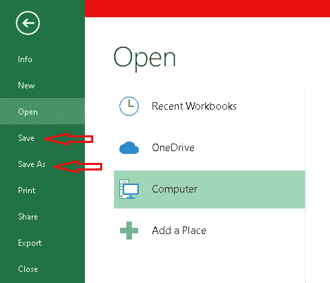
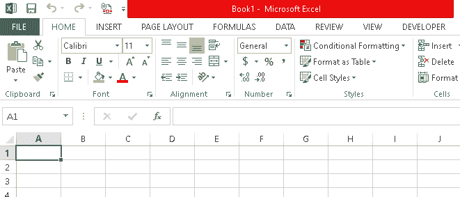
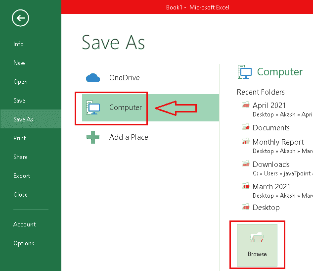
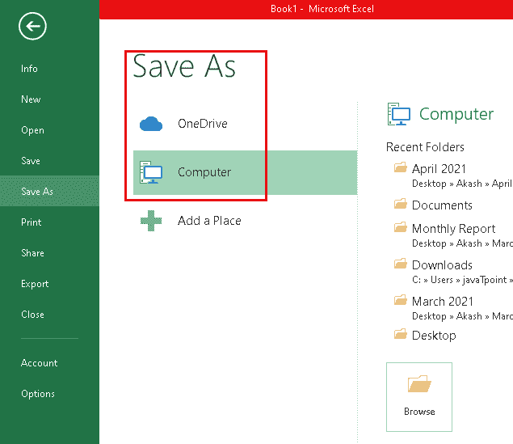
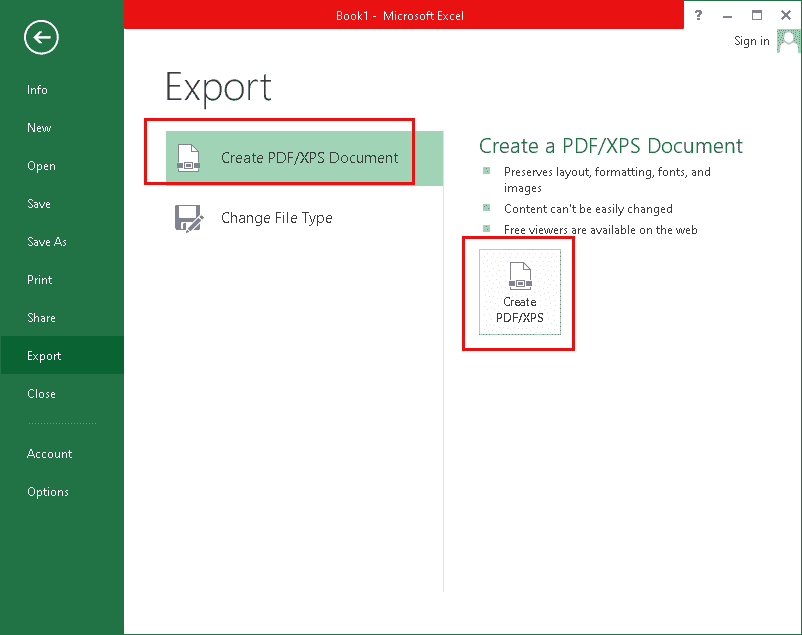
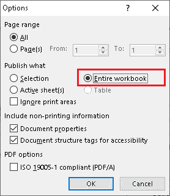
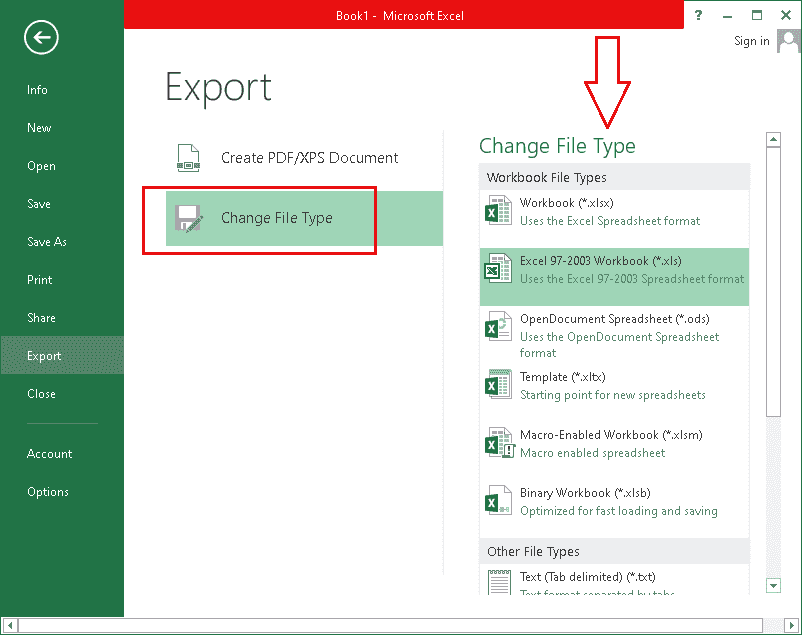

# 如何保存 Excel 文件

> 原文:[https://www.javatpoint.com/how-to-save-excel-file](https://www.javatpoint.com/how-to-save-excel-file)

微软 Excel 是目前全球最常用的电子表格软件之一。它有一系列独特的强大功能。每当我们在 Excel 中创建新的工作簿并将数据放入其中时，我们都必须保存它，这样我们就不需要在出现意外情况(即断电、关机、应用程序关闭等)时从头开始。)时有发生。我们可以打开一个保存的 Excel 文件，从之前离开的位置开始工作。

因此，知道如何保存 Excel 文件以便于访问、修改或共享是至关重要的。在本文中，我们将讨论一些简单的方法来理解如何将 Excel 文件本地保存在计算机上。本教程使用微软 Excel 2013 创建。但是，其他版本的流程是相同的。MS Excel 2013 或更高版本允许我们使用 OneDrive 将一个 [Excel](https://www.javatpoint.com/excel-tutorial) 文件保存到云端。此外，很少有其他选项(如导出、共享工作簿等。)让使用 Excel 更有效。

## 保存并另存为

在讨论方法之前，让我们先了解一下“**保存**”和“**另存为**命令的区别，因为 Excel 提供了这两个保存文件的基本选项。

*   **保存**:当我们创建一个新文件或者编辑一个已有文件时，我们通常使用‘保存’命令(快捷键- **Ctrl + S** )来保存当前文件中的某些更改。大多数人使用这个命令来保存 excel 文件，因为他们一直在处理同一个文件，并相应地保存更改。当我们使用“保存”命令时，我们只需要输入一个文件名并选择一个位置一次。一旦我们选择了文件名和位置，我们就可以通过点击“保存”按钮来保存更改。这将使用相同的文件名和位置保留对同一文件的所有相应更改。
*   **另存为**:当我们使用这个命令时，Excel 会创建一个工作簿的副本，并保持原始文件不变。此外，我们还可以选择输入新名称，并为工作簿的复制版本选择所需的位置。我们也可以使用同一个位置保存文件的副本；但是，文件名必须不同。如果文件名和位置相同，则使用此命令保存 Excel 文件的文件扩展名必须不同。

现在，让我们讨论使用这两个选项保存 excel 文件的步骤:

## 使用“保存”命令保存 Excel 文件

在大多数情况下，快速保存 Excel 文件可以防止丢失辛苦的工作。我们必须将文件保存在特定的位置，以便以后可以找到它。我们可以对现有文件进行更改，并使用相同的命令(保存命令)根据应用的更改保持文件更新。

我们可以按照下面讨论的步骤使用“保存”命令保存 Excel 文件:

*   首先，我们需要启动 Excel 软件来创建一个新文件。
    
    在这里，我们可以输入想要的数据。
*   在我们输入所有数据并完成工作后，我们需要从顶部导航栏点击“**文件**”选项卡。
    T3】
*   在这里，我们需要点击左侧面板中的**保存**按钮:
    
*   接下来，我们可以选择是将文件保存在本地(我们的案例)还是保存到云中。要在电脑上保存一个 Excel 文件，我们可以选择“**电脑**”。我们可以使用“**浏览**按钮选择一个特定的位置将其保存在电脑上。如果我们想将文件保存到云中，我们可以选择“ **OneDrive** ”。要使用云功能，必须有一个 OneDrive 帐户。
    
*   之后，会出现一个新窗口。在这里，我们需要为文件和文件类型选择所需的名称。一旦选择了文件名、文件类型和位置，我们需要点击**保存**按钮。excel 文件将以选定的名称和文件类型保存在选定的位置。此外，我们可以更改要保存的文件的位置。此外，如果我们正在处理一个现有的文件，并使用“保存”选项，将没有选择名称和位置的窗口。在这种情况下，更改将保存在相同位置的现有文件中。
    T3】

#### 注意:我们也可以从快速工具栏或通过键盘按快捷键“Ctrl +S”来访问“保存”命令。

## 使用“另存为”命令保存 Excel 文件

如果我们想将 Excel 文件保存到不同的位置，或者想通过添加更多数据来保存它而不影响现有的数据，我们可以使用“另存为”选项。它主要用于创建 Excel 文件的副本，同时保持原始文件不受更改的影响。例如，假设我们有一个 Excel 文件“数据 1”；在对数据 1 文件进行一些更改后，我们可以使用“另存为”选项创建文件“数据 2”。这将最终用更新后的数据创建一个数据 2 文件，数据 1 仍将与之前相同。此外，可以相应地更改 Data2 文件的内容。

以下是通过“另存为”命令保存 Excel 文件的步骤。

*   首先，我们需要打开一个现有的 Excel 文件，并根据需要对其进行更改。
*   接下来，我们需要从顶部导航面板点击“**文件**”选项卡。
    T3】
*   在下一个屏幕上，我们需要选择“**另存为**”选项。
    T3】
*   像“保存”命令一样，我们需要选择是将 Excel 文件保存在本地还是云上。要将 Excel 文件保存到计算机中，我们可以选择“**计算机**”或“ **OneDrive** ”。
    
*   选择所需位置后，我们需要输入“文件名”，然后从下拉菜单中选择“文件类型”。一旦我们完成了最后一步并填写了所有细节，我们需要点击“**保存**”按钮。这将使用选定的文件名和文件类型将所有更改保存到选定位置的新文件中。
    T3】

#### 注意:“另存为”不仅限于与现有文件一起使用。此命令还可以将新创建的 excel 文件保存到所需文件类型和文件名的特定位置。

## 导出工作簿

除了以上两种保存 Excel 文件的方法，我们还可以导出 Excel 文件，将其保存为一些特定的文件格式。但是，这种方法主要用于以 PDF 格式保存 excel 文件。但是，我们也可以相应地导出到其他格式。

### 将工作簿导出为 PDF

使用这种方法，我们可以将 Excel 文件保存为 PDF 格式。将工作簿导出为 PDF 格式主要有利于与未安装 Excel 软件的人共享文件。此外，PDF 允许其他人查看文档，但不允许他们编辑内容。

以下是将工作簿导出为 pdf 的步骤:

*   首先，我们需要从顶部导航面板中选择“**文件**”选项卡。
    T3】
*   接下来，我们需要从左侧栏中选择“**导出**”选项。
    T3】
*   在下一个屏幕上，我们需要选择选项“**创建 PDF/XPS 文档**”然后“**创建 PDF/XPS** ”。
    
*   之后，我们将在新窗口中输入 PDF 文件的名称，并选择将其保存在计算机上的位置。完成最后一步后，我们可以点击**发布**按钮，将 Excel 文件保存为 PDF 格式。
    T3】

根据 Excel 的默认设置，导出功能仅保存活动工作表。如果我们有几个工作表，并且想要导出所有工作表，我们需要点击“**选项**按钮，并选择“**整个工作簿**选项。“选项”窗口如下图所示:

需要注意的是，每当我们以 PDF 格式导出或保存 excel 文件时，必须在保存后检查工作簿数据。这很重要，因为 pdf 中的格式通常看起来不准确。在这种情况下，我们需要使用页面布局部分调整 Excel 文件中的格式，然后再次遵循整个过程，以正确的格式保存它。这适用于工作簿中的所有工作表。

### 将工作簿导出为其他文件格式

使用 Excel 中的导出功能，我们还可以将 Excel 文件或工作簿保存为许多其他文件格式/类型，而不仅仅是 pdf。此方法还可以在' **Excel 97-2003 工作簿()中保存一个 Excel 文件。xls)**’，这主要是对旧版 Excel 有利。因此，我们可以轻松地将最新版本的 Excel 中创建的文件与使用早期版本 Excel 的文件共享。导出功能提供的其他流行文件格式是**。CSV，。ODS，。XLSB，。XLTX** 还有更多。

以下是将工作簿导出到其他文件类型的步骤:

*   首先，我们需要从顶部面板选择“**文件**”选项卡。
    T3】
*   之后，我们需要点击左侧边栏中的“**导出**”按钮。
    T3】
*   接下来，我们需要从新窗口中选择选项“**更改文件类型**”。之后，我们将获得导出功能支持的所有文件格式的列表。在这里，我们可以选择所需的文件类型并继续下一步。要选择所需的文件格式，我们可以双击其名称或单击其名称，然后单击底部的“**另存为**”按钮。
    
*   在下一个窗口中，我们需要为要保存的文件输入所需的名称。此外，我们可以更改文件的保存位置。我们还可以使用“另存为类型”下拉菜单来更改文件类型，以各种其他文件格式保存 Excel 文件。选择完名称和位置后，我们可以点击**保存**按钮，以特定的格式和位置保存一个 Excel 文件。
    T3】

* * *