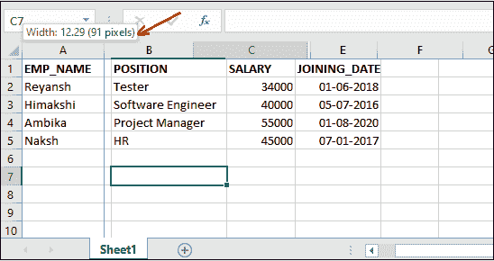
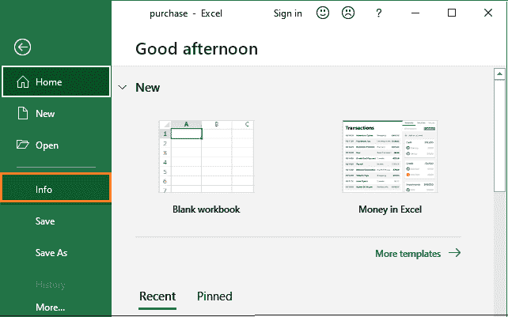
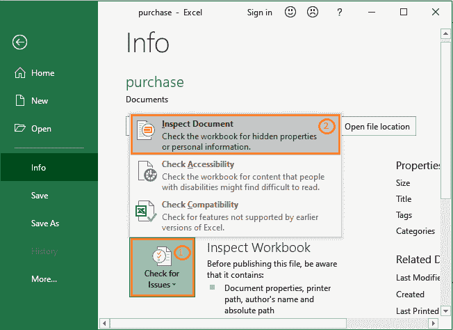

# 如何在 Excel 中取消隐藏列？

> 原文:[https://www.javatpoint.com/how-to-unhide-columns-in-excel](https://www.javatpoint.com/how-to-unhide-columns-in-excel)

当 Excel 用户不想显示存储在 Excel 工作表中的完整信息时，他们通常会隐藏这些列。隐藏列是一种解决方案，而不是删除它们。两列之间的一条双线对应于 Excel 工作表标题中的隐藏列。

隐藏列时，数据对用户不可见，但不会被删除。您可以随时取消隐藏该列及其数据，使其再次可见。本章将展示在 [Excel](https://www.javatpoint.com/excel-tutorial) 中取消隐藏列的方法。

## 如何让用户知道该列是隐藏的

两列之间的一条双线对应于 Excel 工作表标题中的隐藏列。见下面截图中的双线:


您可以通过将隐藏列的大小从双线向右增加来取消隐藏隐藏列。

此外，还有一种方法可以知道隐藏列。您还可以通过查看 Excel 列标题来了解隐藏列的总数。


在列标题中，我们在 d 列旁边有 G 列，这意味着有两列(E 和 F)隐藏在这里。

## 取消隐藏隐藏列

隐藏列并不难。有四种不同的方法可以使用**标准隐藏选项、文档检查器、使用宏或转到特殊功能**来取消隐藏列。我们将逐一详细描述所有这些方法。

1.  [取消隐藏选中的隐藏列](#selected-hidden-columns)
2.  [取消隐藏所有隐藏列](#all-hidden-columns)
3.  [如何取消隐藏第一列(A 列)](#first-column)
4.  [使用 VBA 脚本](#VBA-script)取消隐藏列
5.  [检查隐藏列总数](#total-number)

### 取消隐藏选定的隐藏列

这是在 Excel 工作表中取消隐藏选定隐藏列的标准方法。只需要两个简单的步骤。要取消隐藏所选列，我们将使用**标准隐藏选项**。

我们将解释这些步骤来取消隐藏 Excel 中的隐藏列，使数据对用户可见。请遵循以下步骤:

**第一步:**选择两列(上一列和隐藏列旁边的一列)。比如这里的 D 和 G。


**第二步:**现在，右键点击选中的列，点击列表末尾的**取消隐藏**选项。就这样。


**结果**

所选列之间的所有隐藏列都将被取消隐藏，您可以自己查看。请注意，列 E(工资)和列 F(入职日期)现在可见。


### 取消隐藏所有隐藏列

两列或多列可能隐藏在不同的位置，这可能需要时间来查找和取消隐藏它们。因此，这次我们将在 Excel 工作表中一次取消隐藏所有隐藏的列。无论是否有一个或多个隐藏列，此方法都将取消隐藏所有隐藏列。

这种方法也与上面要执行的一些和两个简单步骤相同。我们有几个步骤来取消隐藏 Excel 中的所有隐藏列，使数据对用户可见。请遵循以下步骤:

**第 1 步:**我们有以下 Excel 数据集，其中隐藏了两个以上的列。


**第二步:**在你的 Excel 电子表格中，点击左上角行和列开始处的小三角形。


**提示:**会选择整个工作表。不过，您也可以为此按下 **CTRL+A** 快捷键。

**第三步:**右键点击表格的列标题，会打开一个上下文菜单，点击**取消隐藏**选项。


#### 注意:如果您单击了选定的单元格而不是列标题，取消隐藏功能将不起作用。

**结果**

因此，所有隐藏的列都将在当前的 Excel 工作表中取消隐藏。C、E、F、I 和 J 列一次完成。


### 取消隐藏 Excel 工作表的第一列

通常，第一列也可以隐藏在 Excel 工作表中，用户只想取消隐藏该列，而不是全部。取消隐藏列似乎很容易，但是当您只需要显示最左边的一列，即列 A 时，它需要不同的方法。a 列之前没有其他列。

要取消隐藏 Excel 表格的第一列，我们将使用**转到选项**。查看该选项将如何使用。我们有以下 Excel 数据集，其中第一列 A 是隐藏的。


现在，按照以下步骤操作:

**第一步:**在 Excel 工作表中，导航至**主页>查找&选择>转到**打开转到对话框。


也可以使用 **F5** 功能键直接打开转到对话框。

**第二步:**在**参考**栏下，输入列号，即 A1，点击**确定**按钮。


您看不到，但单元格 A 现在已被选中。

**步骤 3:** 现在，在同一主页选项卡中，转到**单元格组**。在该单元格组中，点击**格式>隐藏&取消隐藏>取消隐藏栏**。


**第四步:**点击“取消隐藏”栏后，A 栏将被取消隐藏。请注意-没有其他列将取消隐藏，只有列 A(表格的第一列)将使用此方法取消隐藏。


请注意，列 A 现在是可见的，而其他隐藏的列尚未取消隐藏。

### 增加列的大小，使其可见

除此方法外，您还可以通过增加列的大小来取消隐藏特定的列(列 A)。甚至可以对列 Excel 工作表最左边的列)应用此方法。这种方法不需要执行任何复杂的步骤。它只是用鼠标拖动第一列。

为此，当光标如下图所示时，将鼠标放在第一列上:


双击选择它，然后向右移动光标以增加列 A(第一列)的大小。

它将看起来像一些东西，如下图所示，同时拖动。



请注意，现在可以看到列 A 了。像这样，您可以取消隐藏 Excel 工作表中的任何其他列。


### 使用 VBA 脚本取消隐藏列

除了以上所有方法，您还可以使用 VBA 取消隐藏列。VBA 允许用户为此编写代码，并执行该代码来取消隐藏列。

这完全取决于用户是否想通过编码取消隐藏列。使用以下宏代码(脚本):

```

Sub unhideAllColumns()
ActiveSheet.Cells.EntireColumn.Hidden = False
End Sub

```

通过在 Excel VBA 中执行此代码，所有隐藏的列将在当前活动的 Excel 工作表中取消隐藏。

同样，如果您也想取消隐藏隐藏行，请在 VBA 代码中使用以下脚本:

```

Sub unhideAllColumns()
ActiveSheet.Cells.EntireRow.Hidden = False
End Sub

```

### 检查隐藏列的总数

在 Excel 中，用户可以查找并计算 Excel 工作表中隐藏列的总数。Excel 具有**检查文档**功能，使用该功能可以检查隐藏列的数量。它将显示有关隐藏列和行的详细信息。

快速检查隐藏列的数量非常有用。以下是查找全部隐藏列的几个步骤。

**第一步:**打开目标工作表，点击**文件**标签。


**第二步:**在左侧面板中，首先点击**信息**选项。



**步骤 3:** 单击检查工作簿旁边的**检查问题**下拉选项，然后单击**检查文档**。



**步骤 4:** 在文档检查器面板中，向下滚动并确认**隐藏行和列**复选框已被标记。如果没有，标记后点击下方的**检查**按钮。


**第五步:**再次向下滚动，查看隐藏列/行数。它将显示当前活动的 Excel 文件的隐藏列数。


您可以点击**全部删除**按钮删除此处所有隐藏的列。

* * *