# 如何在 Excel 中添加水印

> 原文:[https://www.javatpoint.com/how-to-add-watermark-in-excel](https://www.javatpoint.com/how-to-add-watermark-in-excel)

水印是指有意放在不同文件上的文本、徽标或图案。换句话说，水印是指放置在数字数据或文件背景上的图片。有时，我们可能需要在 Excel 中添加水印，然后才能使其共享。在这种情况下，我们可以在不同的财务报告、工资条等原始数据后面创建/添加水印。

本文讨论的是如何在 Excel 中添加/插入一个[水印的过程。在讨论该过程之前，让我们先了解为什么水印是必不可少的:](https://www.javatpoint.com/watermark-in-excel)

## 为什么是水印？

在各种数字文件上看到水印是很常见的，包括文档和图像。人们添加水印通常有两个主要原因，例如:

*   **保护**:大多数个人和公司都把水印作为对其数字资产的一种保护。因为如今复制内容非常容易，水印多少增加了一层额外的安全性和所有权。这样，如果有人试图窃取某人的作品，不被抓住就不容易展示被盗的作品。但是，必须巧妙地使用水印，以防止窃贼修改资产并移除水印。
*   **营销**:如今，水印是营销和品牌推广的最佳方式之一。大多数公司和个人使用他们的标志或网站地址作为水印。这样，如果有人分享他们的内容，那些观看它的人可以很快知道它的来源。但是，水印的使用方式不应让观众感到不愉快。

人们可能需要在他们的 [Excel](https://www.javatpoint.com/excel-tutorial) 文件中使用水印还有很多其他原因。甚至我们也可以使用该功能来获得一些乐趣，或者使我们的文档在图形上更有吸引力。

现在让我们讨论向 Excel 添加水印的基本方法:

## 使用 Excel 在 Excel 中添加水印

大多数程序都带有一个名为“水印”的内置功能。例如，微软 Word 在“设计”标签下包含一个“水印”选项。但是，微软 Excel 没有任何可用于管理水印相关任务的直接选项。虽然在 Excel 中没有添加水印的专用功能，但我们可以使用两种替代方法来执行这项任务。

以下是使用 Excel 功能在 Excel 中添加水印的一些标准方法:

### 在 Excel 中添加文本作为水印

在 Excel 中添加文本作为水印是最容易访问和最有帮助的方法。这是一种替代方法，利用了 Excel 的“艺术字”功能。以下是在 Excel 文件中添加文本作为水印的步骤:

*   首先，我们需要打开一个要添加水印的 Excel 文件。之后，我们需要点击**插入**标签。
    T3】
*   接下来，我们需要从“**文本**组中选择“**插入艺术字**”选项。
    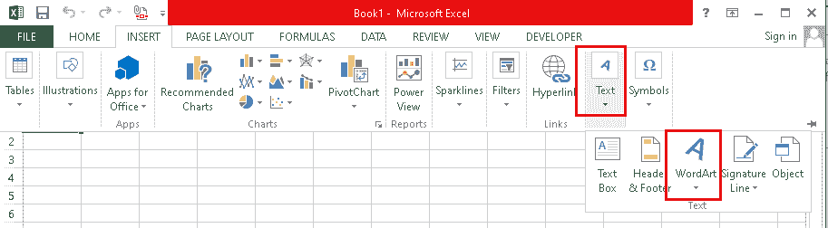
*   在下一个屏幕上，我们必须为文本选择所需的样式。添加水印后，始终建议使用浅色样式使数据可见。
    
*   点击想要的艺术字样式后，我们需要将文本“**你这里的文本**”替换为我们想要用作水印的文本。在我们的例子中，我们将默认文本替换为自定义文本，即 javaTpoint。
    T3】
*   一般在 excel 文件的内容上面加水印，因此要求我们进行调整。我们可以相应地调整文本的格式。我们还调整了水印文本的一些格式，以便水印不会重叠。例如，我们已经删除了“文本填充”颜色，改变了颜色，并旋转了一点水印，使它看起来很棒。
    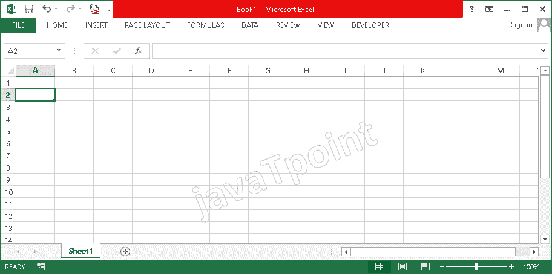

除此之外，我们还可以将这个水印(艺术字文本)保存为图像格式。为此，我们可以剪切/复制创建的文本水印，并将其粘贴到任何其他程序上，如 MS Paint、Photoshop 等。之后，我们可以使用“另存为”选项并选择所需的图像格式(即 PNG、JPED、BMP 等)。).这将最终在计算机上保存一张图像/图片，用于将来的处理。

### 在 Excel 中添加图像作为水印

由于在 excel 中没有直接添加水印的选项，我们可以在 Excel 工作簿中插入一个图像，并调整一些设置，使其看起来像水印。有各种方法，我们可以使用插入水印使用的图像。但是，下面讨论主要方法:

### 使用图像插入选项

这是在 Excel 中交替添加水印最简单的方法之一。但是，它不是普遍使用的。这是因为使用这种方法作为水印插入的图像通常与数据重叠。因此，要使用这种方法，我们必须有一个足够透明的图像来重叠。

以下是使用此方法在 Excel 中添加水印的步骤:

*   首先，我们需要打开一个要添加水印的 Excel 文件。之后，我们需要从顶部导航面板导航到“**插入**选项卡。
    T3】
*   接下来，我们需要选择“**图片**”平铺，如下图所示:
    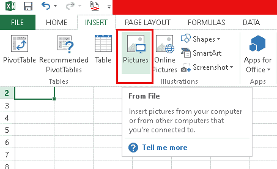
*   接下来，我们需要从存储器中选择图像，然后点击**插入**按钮。之后，图像将被插入到文件中。
    T3】
*   我们可以从“**格式**”选项卡调整图像的格式。有很多种格式选项可以将图像调整成水印的样子。使用格式选项，我们改变了水印的大小(高度和宽度)并稍微旋转了一下。这样，它看起来比以前更有吸引力和愉快。
    T3】

### 使用背景选项

这是在 Excel 中使用图像作为水印的另一种简单方法。大多数人不喜欢这种方法，只是因为图像在整个纸张上重复传播。因此，我们必须创建一个浅色的图像，并保持大尺寸，以免看起来尴尬。

以下是使用此方法在 Excel 中添加水印的步骤:

*   首先，我们需要打开一个要添加水印的 Excel 文件。之后，我们需要从顶部导航面板导航到“**页面布局**”选项卡。
    T3】
*   接下来，我们需要选择“**背景**”平铺，如下图所示:
    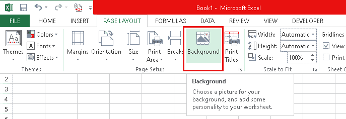
*   接下来，我们需要从存储器中选择图像，然后点击**打开**按钮。
    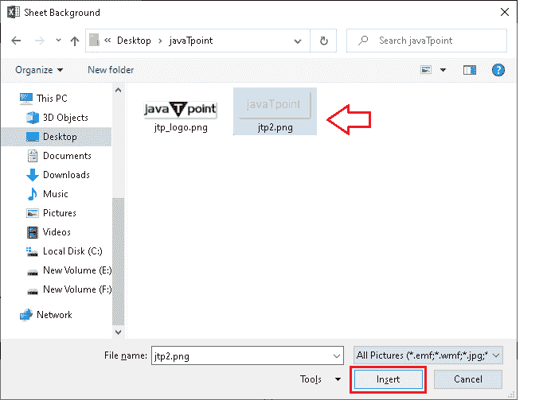
    之后，一个图像会被插入到一个文件中。
    

在上图中，我们可以看到水印图像覆盖了 excel 工作表的所有区域。此外，没有格式化选项来调整作为水印插入的背景图像的外观或其他属性。当我们使用这种方法添加水印时，水印只以数字方式显示。这意味着，如果我们对某个特定文档进行打印或硬拷贝，将不会有水印。

### 使用页眉/页脚选项

这是在 excel 文件中添加水印最常用的方法。虽然用这种方法插入水印有点长，但是更加稳定和灵活。我们获得了各种格式选项，有助于使图像看起来像水印一样完美。使用这种方法，我们只能在 excel 文件的页眉或页脚部分添加水印，并进一步调整格式以使其有意义。

以下是使用此方法在 Excel 中添加水印的步骤:

*   首先，我们需要启动一个要在其中添加水印的 Excel 文件。之后，我们需要从顶部导航面板导航到“**插入**选项卡。
    T3】
*   接下来，我们需要从“**文本**组中点击“**页眉&页脚**选项，如下图:
    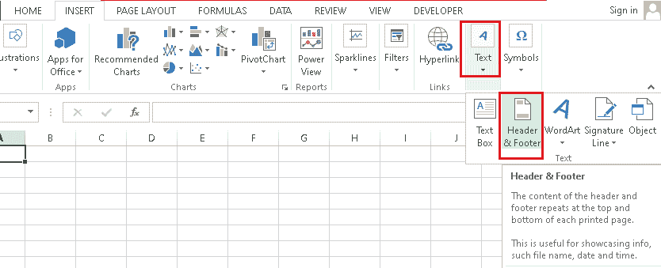
*   完成最后一步后，新的页眉和页脚将被添加到 Excel 文件中。每个(页眉或页脚)都有三个部分，即左、右和中。我们必须点击三个部分中的任何一个来添加水印。这里，我们选择中心框来添加水印。
    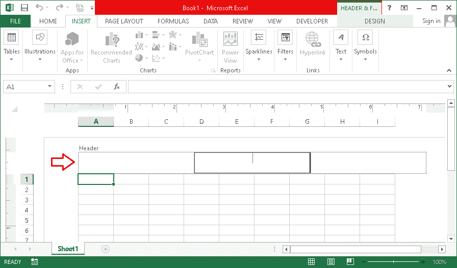
*   之后，我们需要从**设计**选项卡中点击**图片**选项，选择我们想要用作水印的图片(图像)。
    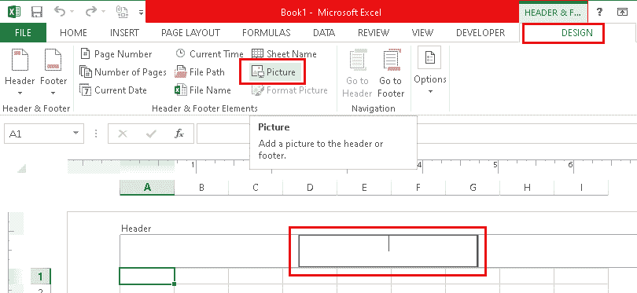
    这将添加文本“ **&【图片】**”是一个特定的框，这意味着特定的框中有图片。
    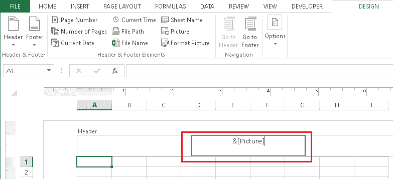
*   最后，我们需要点击任何单元格或任何其他区域来显示水印。
    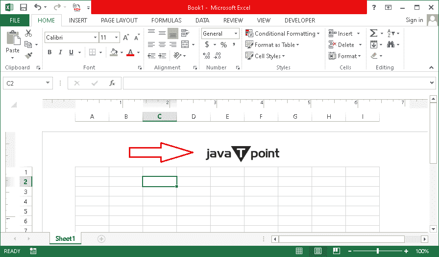
*   我们还可以使用在“**设计**选项卡下给出的选项“**格式化图片**”来调整各种格式化属性。
    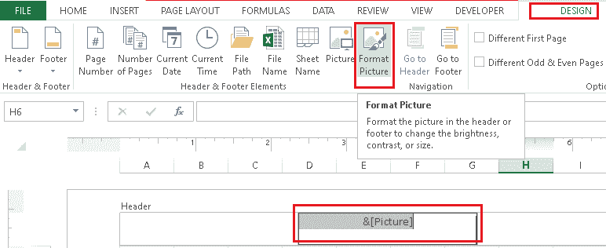
*   要使水印居中，我们需要将光标放在文本“ **&【图片】**”之前，然后按键盘上的“**回车**按钮，将图片移动到下一行。
    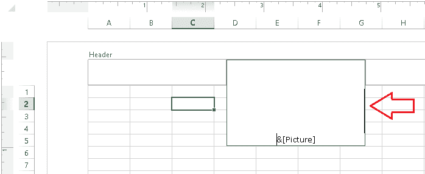
    这样，我们可以相应地重新定位水印。
    

需要注意的是，水印仅在页面布局模式下可见。在正常模式下不会显示。虽然水印在正常模式下不可见，但它仍然存在于文件中，并在打印预览模式或打印输出中显示。在这里，我们给页眉添加了水印，但是我们可以对页脚执行相同的过程。

## 使用第三方扩展/插件在 Excel 中添加水印

许多第三方扩展/插件/实用程序与 Excel 一起工作，并包含 Excel 的更多功能。这种扩展也有利于在 excel 中添加直接插入水印的选项。这将最终减少我们上面讨论的几个步骤。然而，这种扩展不能免费使用。

扩展名“**Excel Kutools**”就是这样一个选项，可以用来在 Excel 中快速添加水印。这种特殊的延期有 60 天的演示期；因此，我们可以在安装之日起的 60 天内试用它的功能。之后，我们必须购买此扩展以备将来使用。

以下是安装此扩展并进一步使用它在 Excel 中添加水印的步骤:

*   首先，我们需要导航到官方网站，在我们的计算机上下载这个扩展。要快速下载此扩展，我们可以使用**直接链接(如下所示)**并访问下载页面:**链接-**[https://www . extendoffice . com/download/kutools-for-excel . html](https://www.extendoffice.com/download/kutools-for-excel.html)
*   之后，我们需要点击选项“**点击这里开始下载**，下载就会开始。
    T3】
*   下载完成后，我们必须启动安装文件(KutoolsforExcelSetup.exe)来开始安装。启动安装程序后，我们必须允许管理员访问开始复制计算机上的必要文件。
    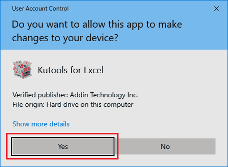
*   在下一个屏幕上，我们必须接受“**用户许可协议**，并点击“**安装**按钮。
    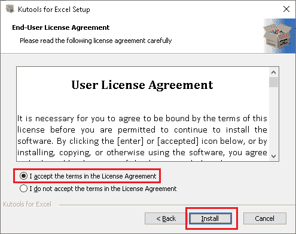
*   点击“安装”按钮后，安装将开始。这可能需要一些时间，具体取决于系统性能和存储可用性。
    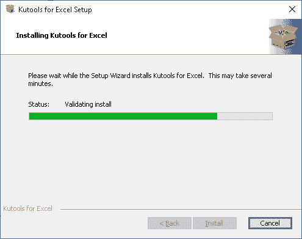
*   安装完成后，将使用 Excel 添加扩展。我们也可以通过选择复选框并点击“**完成**”按钮来使用 Kutools 启动 Excel。
    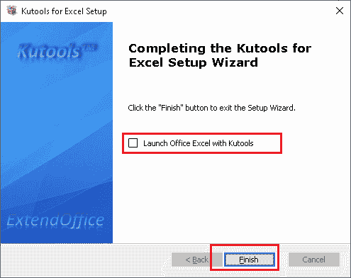
    除此之外，我们还可以取消勾选框完成安装，安装完 Kutools 后直接打开一个 Excel 文件。安装后，扩展及其功能将自动在那里列出。
    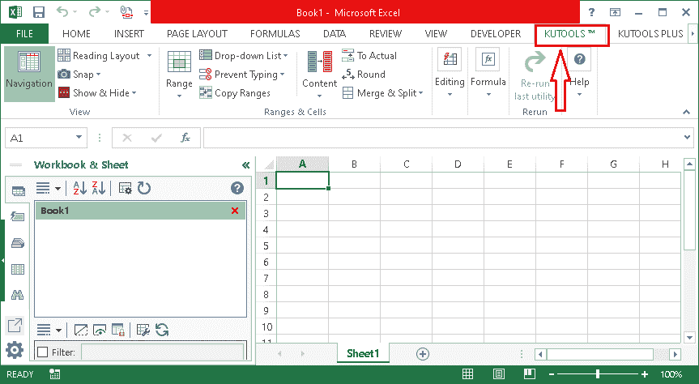
*   扩展名安装成功后，我们需要打开一个 excel 文件，在其中添加水印。接下来，我们需要点击标签“ **Kutools** ”。在库工具选项中，我们必须点击“**插入**，然后从列表底部选择选项“**插入水印**”。
    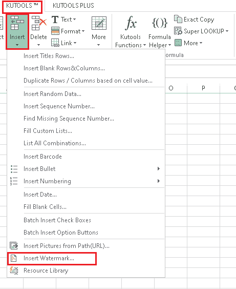
*   接下来，我们将获得“插入水印”窗口，它允许我们选择图片或插入文本来将其用作水印。
    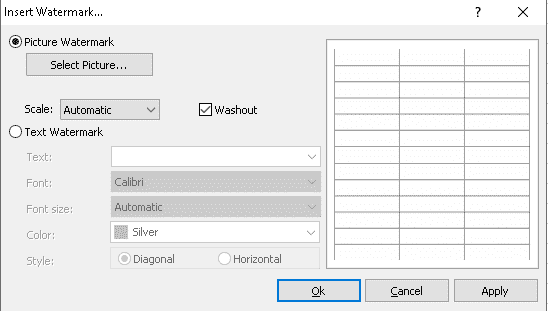
*   如果我们选择了“**图片水印**”选项，我们只需要从存储器中选择图片，选择缩放类型，然后点击“**确定**按钮。使用此扩展的最佳优势是“预览屏幕”，我们可以在其中检查水印。
    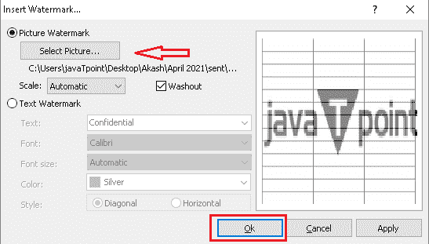
    根据应用的设置，所选图片将显示为水印。
    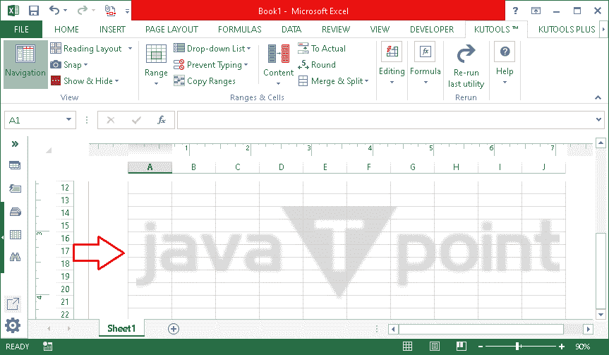
*   如果我们选择“**文本水印**”选项，我们需要在 Excel 中输入我们想要用作水印的文本。此外，还有一些内置的文本选项，我们可以选择，如机密，草稿，样本，不要复制等。
    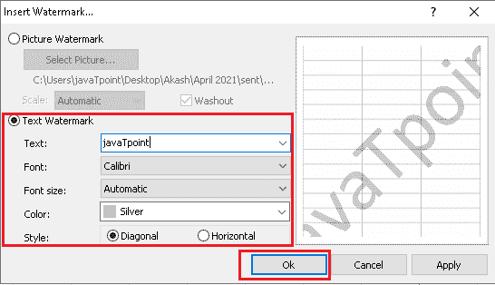
    选择文本后，我们需要为文本调整格式。格式选项包括字体、字号、颜色和样式。一旦我们为文本配置了属性，我们需要点击“**确定**按钮，水印将在 Excel 中添加。
    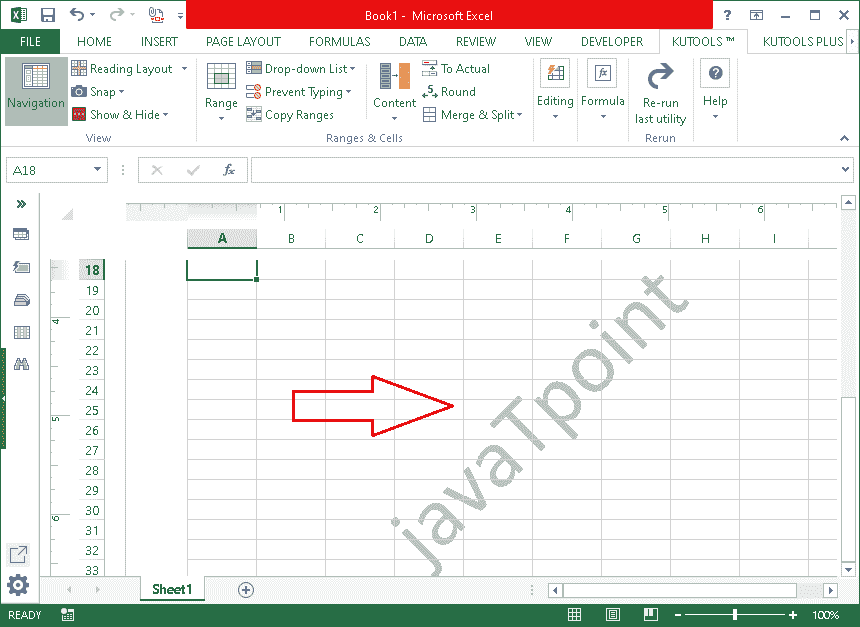

通过使用第三方扩展，我们可以让我们的任务变得更加容易。此外，我们还获得了许多其他专业功能，可以提高在 Excel 上工作的效率。

* * *