# 如何在 Excel 中去除水印

> 原文:[https://www.javatpoint.com/how-to-remove-watermark-in-excel](https://www.javatpoint.com/how-to-remove-watermark-in-excel)

Excel 是一个功能强大的电子表格软件，具有各种功能，但缺少水印选项。因此，大多数人遵循替代方法或使用第三方工具在 Excel 中插入水印。通过这种方式，他们主张所有权或推广他们的品牌。由于在 excel 中插入水印有一些替代选项，我们可能会以某种方式获得带有水印的 [Excel](https://www.javatpoint.com/excel-tutorial) 文件。如果我们想删除 Excel 文件中的[水印，我们必须手动或使用一些第三方工具来完成。这通常与在 Excel 中插入水印相反。](how-to-add-watermark-in-excel)

因为在 excel 中可以使用不同的方法添加[水印，所以我们可能需要遵循不同的方法从 excel 中移除水印。通常，我们可以尝试以下方法从 excel 文件中删除水印:](https://www.javatpoint.com/watermark-in-excel)

*   通过删除背景来移除水印
*   使用“页眉和页脚”功能删除水印
*   使用“转到特殊”功能删除水印
*   使用第三方工具移除水印

必须逐一尝试每种方法，直到水印从 Excel 文件中完全移除。

#### 注意:强烈建议在尝试上述任何方法移除 Excel 中的水印之前，先制作原始文件的副本。这是必不可少的一步，因为当我们走错路并丢失数据时，我们可以恢复数据。此外，我们应该将删除水印后的文件与原始文件进行比较，以确保我们只删除了水印。

现在让我们详细讨论上述每种方法，包括相应的步骤:

## 通过删除背景来移除水印

如果水印在每页上重复多次，它更有可能作为图像添加到背景中。更具体地说，通过导航到“页面布局”选项卡，然后选择“背景”选项来添加水印。这些类型的水印很容易去除。

以下是在 Excel 中删除作为工作表背景添加的水印的步骤:

*   首先，我们需要使用 MS excel 软件打开一个特定的 Excel 文件。
    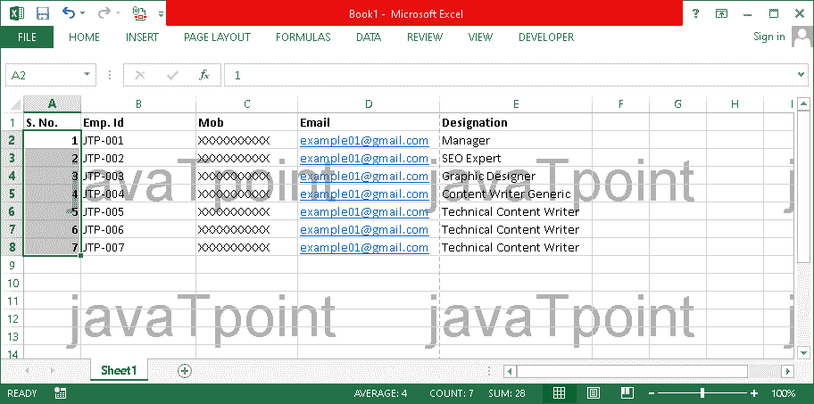
*   之后，我们必须从顶部导航菜单中点击“**页面布局**”选项卡。
    T3】
*   接下来，我们需要点击“**删除背景**选项，如下图所示:
    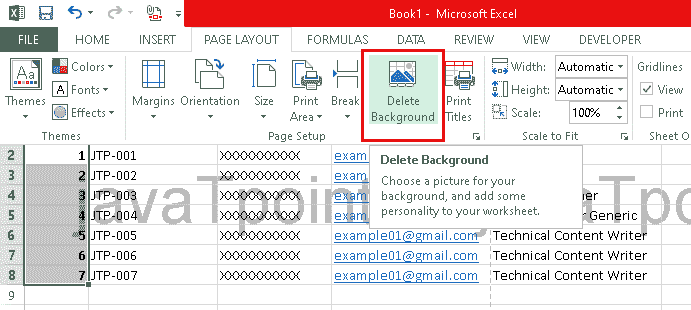
*   单击“删除背景”按钮后，水印将从所有工作表页面中移除。
    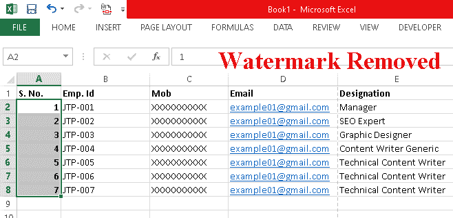

需要注意的是，“页面布局”选项卡中的“删除背景”按钮只有在添加水印作为背景时才可见。如果“删除背景”按钮不存在，这意味着水印是使用任何其他方法添加的。此外，当我们点击“删除背景”按钮时，按钮选项将从“删除背景”变为“背景”。

## 使用“页眉和页脚”功能移除水印

使用“页眉和页脚”功能在 excel 中插入水印是非常常见的。如果水印是图像，并且在每页上仅重复一次或两次(页眉或页脚，或者两者都重复)，则水印更有可能是使用 Excel 中的“页眉和页脚”插入的。有时，使用这种方法插入的水印在我们打开 excel 文件时不会显示。但是，每当我们打印相应的文件时，水印就会出现。这是因为在页眉/页脚中添加的水印仅出现在“页面布局”视图中。因此，我们需要从“**查看**选项卡中点击“**页面布局**选项，检查 Excel 文件的页眉/页脚是否有水印。

以下是在 Excel 中从页眉/页脚中删除图像的步骤:

*   首先，我们需要打开一个 Excel 文件，在其中我们想要删除或删除水印。我们必须确保选择了“**页面布局**”视图来显示添加在页眉/页脚中的水印。
    T3】
*   一旦水印可见，我们需要导航到“**插入**选项卡，并从“**文本**组”下给出的选项中单击“**页眉&页脚**”。
    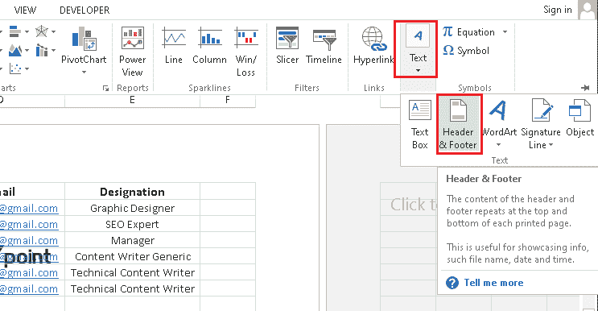
*   单击“页眉和页脚”后，所有页眉和页脚部分都将突出显示，插入其中的对象(如果有)也将显示。例如，如果有任何图像水印，文本“ **&【图片】**”将显示在页眉/页脚的相应部分。
    T3】
*   要删除水印，我们必须删除页眉/页脚中出现的文本“ **&【图片】**”。
    T3】
*   删除文字后，我们需要点击任意单元格或按键盘上的“ **Tab** ”按钮。通过这样做，数据将被实时更新，水印将被移除。
    T3】

在上面的图片中，我们可以看到水印完全从标题中移除。这就是为什么标题显示文本“**点击添加标题**”，意思是标题为空。

建议单击页眉和页脚的每个框，以确保当前文件中没有其他水印。

## 使用“转到特殊”功能删除水印

MS Excel 还允许我们插入一个艺术字对象，大多数人都把这个功能作为水印。更具体地说，我们可以使用艺术字对象插入文本水印。如果 excel 文件包含这种类型的水印，我们可以使用“转到特殊”功能将其删除。

以下是借助“转到特殊”功能删除作为艺术字对象插入的水印的步骤:

*   首先，我们需要确保水印是可见的。如果没有显示，我们需要通过从顶部菜单选项导航到**查看>页面布局**选项来切换到“**页面布局**视图。
    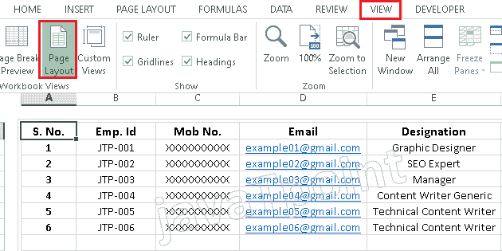
*   一旦水印可见，我们需要选择“**主页**选项卡，然后转到**查找&选择>转到特殊**。
    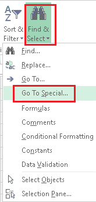
*   这将打开一个“转到特殊”窗口，如下图所示:
    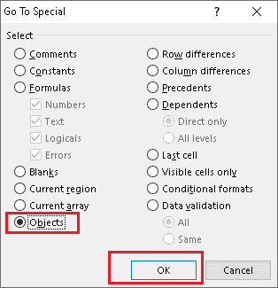
    在这里，我们需要勾选选项“**对象**，然后点击“**确定**按钮。
*   完成上一步后，将选择水印。这看起来像下图:
    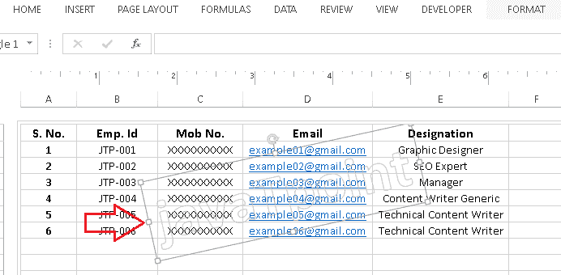
*   一旦选中水印，我们必须从键盘上按下“**删除**按钮，选中的水印将被完全删除。如果水印仍然显示，我们需要点击任何单元格或按下“标签”按钮来刷新数据。
    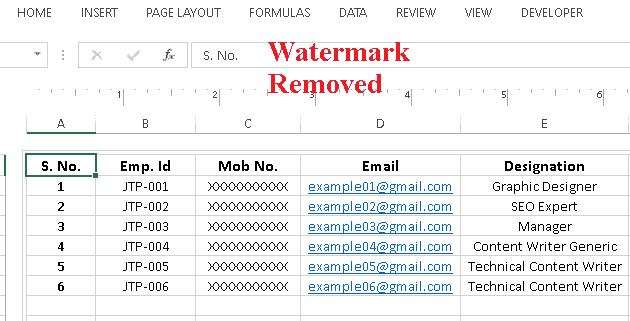
    水印移除后，我们可以保存相应的文件，避免按照相同的步骤从当前文件中删除水印。

需要注意的是，当我们使用“转到特殊”功能在 Excel 中移除水印时，其他对象(如图像和形状)也会被移除。因此，我们必须谨慎使用这种方法，并始终在移除水印后重新检查数据。

## 使用第三方工具移除水印

有时，水印是使用第三方工具添加的，因此，它们肯定不会使用上面讨论的方法删除。在这种情况下，我们需要尝试第三方工具来移除 Excel 中的水印。虽然有几种工具，但大多数都使用相同的算法。因此，我们可以尝试任何流行的第三方工具来执行此任务。

这里，我们使用的是流行的扩展/工具之一“**Excel Kutools**”。它让我们可以轻松地在 Excel 中执行各种高级任务。该扩展还允许我们在 Excel 中插入或删除水印。这种特殊的延期有 60 天的演示期；因此，我们可以在安装之日起的 60 天内试用它的功能。之后，我们必须购买此扩展以备将来使用。

以下步骤可以帮助安装此扩展，并进一步使用它来删除 Excel 中的水印:

*   首先，我们必须去 Kutools 的官方网站(也就是 www.extenoffice.com)在我们的电脑上下载这个扩展。要快速下载此扩展，我们可以使用**直接链接(如下所示)**并访问下载页面:**链接-**[https://www . extendoffice . com/download/kutools-for-excel . html](https://www.extendoffice.com/download/kutools-for-excel.html)
*   之后，我们需要点击选项“**点击这里开始下载**，下载就会开始。
    T3】
*   下载完成后，我们需要启动安装文件(KutoolsforExcelSetup.exe)来开始安装。启动安装程序后，我们必须允许管理员权限开始复制计算机上所需的文件。
    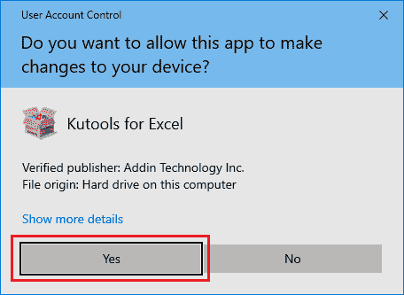
*   在下一个屏幕上，我们必须接受“用户许可协议”中的条款，并点击“**安装**”按钮。
    T3】
*   点击“安装”按钮后，安装将开始。这可能需要一些时间，具体取决于系统性能和存储可用性。
    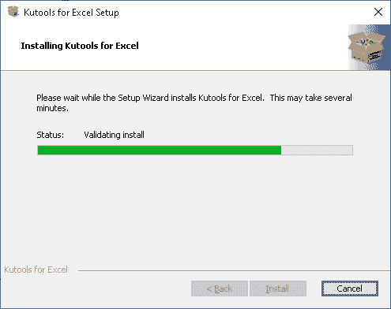
*   安装完成后，将使用 Excel 添加扩展。我们也可以通过选择复选框并点击“**完成**”按钮来使用 Kutools 启动 Excel。
    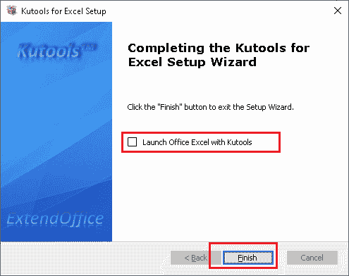
    除此之外，我们还可以取消勾选框完成安装，安装完 Kutools 后直接打开一个 Excel 文件。安装后，扩展及其功能将自动在那里列出。
    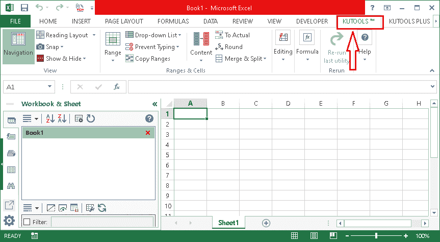
*   成功安装扩展名后，我们需要打开一个 excel 文件，从中删除水印。接下来，我们需要点击标签“ **Kutools** ”。在库工具选项中，我们需要点击“**删除**，然后从“编辑”组中选择选项“**删除水印**”。
    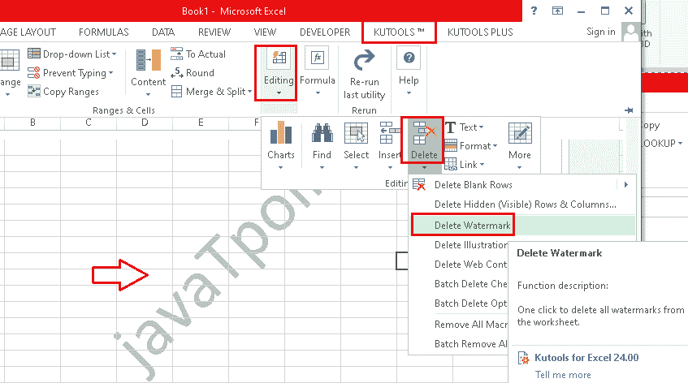

*   一旦我们点击列表中的“**删除水印**”选项，水印就会立即从 Excel 工作表中删除。然后，我们可以保存文件的副本，以避免以后执行相同的步骤。此外，该方法适用于文本水印和图像水印。

#### 注意:上面讨论的在 Excel 中移除水印的方法仅用于教育目的。我们不支持移除原始创作者的水印来主张所有权，以及不恰当地复制他人的作品。

* * *