# excel 中的 vlookup 公式

> 原文：<https://www.javatpoint.com/hlookup-formula-in-excel>

**HLOOKUP** 是一个**“水平查找**”来搜索最上面几行的值。它是一个 Excel 函数，帮助用户从 Excel 工作表的最上面一行搜索和检索数据。该函数的运行方式与其他 Excel 函数略有不同。

在 HLOOKUP 的名称中， **H** 是指**横**。这意味着搜索和检索操作是在向右移动的行上水平执行的。因此， **HLOOKUP** 也被称为**水平查找**。

#### 注意:与 MATCH()函数不同，它不返回匹配项的位置；它返回匹配的值。

HLOOKUP()是 [VLOOKUP()方法](https://www.javatpoint.com/excel-vlookup)的同辈。它根据定义范围内最上面的行查找值。基本上，它对 [Excel](https://www.javatpoint.com/excel-tutorial) 数据的标题执行两个(搜索和检索)操作。

## vlookup 的用途

像 MATCH()函数一样，HLOOKUP()也支持数据的精确和近似匹配。除此之外，它还支持通配符(*，？)运算符对 Excel 数据进行部分匹配。

用户可以使用这些运算符对数据执行部分匹配。它在定义的范围和行内查找数据。

## 语法和参数

HLOOK()函数由四个参数组成，下面是它的语法:

HLOOKUP(LOOKUP_value, table, row_index, [LOOKUP_range])

这里，前三个参数是必需的，LOOKUP_range 是可选的。

### 参数列表

| 参数 | 描述 |
| **LOOKUP_value** | 它是指定要在表的第一行中搜索的值。您可以将该值作为字符串或单元格引用传递。 |
| **表** | 这是要在其中搜索数据的单元格区域。例如 A1:H10 |
| **行 _ 索引** | 定义要从中检索数据的 Excel 表格的行号。例如 3(第 3 行) |
| **【LOOKUP _ range】** | 它是 HLOOKUP 函数的可选参数，包含一个布尔值(1，0)来执行相应的操作。

*   1 is an approximate match (default)
*   Match for exact values

 |

HLOOKUP()的这些参数值用逗号分隔。

## 返回值

1.  函数的作用是:返回用户正在寻找的值。
2.  如果在指定的细节内没有找到该值，则返回**# 不适用错误**。**# 不适用**指的是**值不可用**

## 需要记住的要点

以下是对 Excel 数据执行 HLOOKUP()函数时需要记住的一些要点。

*   HLOOKUP 是一个**不区分大小写的**因此， **Orange** 和 **ORANGE** 对它都是一样的。
*   第一个参数(LOOKUP_value)应该包含最上面一行的值。或者我们可以说，它一定是表格的标题之一。
*   HLOOKUP 函数支持通配符(*，？)用于数据的部分匹配。

## HLOOKUP()函数产生的错误

如果指定的值符合标准，HLOOKUP 函数将生成一个错误。这些错误是-

1.  # 不适用错误
2.  #VALUE！错误
3.  #REF！错误

### # 不适用错误

如果在指定的细节内没有找到该值，则返回**# 不适用错误**。**# 不适用**指的是**值不可用**错误。

### #VALUE！错误

如果 row_index 参数由小于 1 的值组成，即 row_index < 1\. LOOKUP() returns the **#Value！错误**。**# 价值！**指**值误差**误差。

row_index<1 = #Value!

例如，range_index 为 0 或小于 0。

### #REF！错误

如果 row_index 大于(>)表参数中的列数，即 row_index > 1。LOOKUP()返回 **#REF！错误**。**# 裁判！**指**无效单元格引用错误**错误。

row_index> number of columns in table parameter = #Value!

请记住- HLOOK()一次只会返回一个值或错误。

## 公式示例

让我们借助语法例子来理解。

**=HLOOKUP(“耳机”，B1:G10，5，0)**

在这里，

*   **耳机**是我们要找的一个列标题的值。
*   **B2:H9** 是您的 Excel 工作表中我们正在查找数据的范围。
*   **5** 是将搜索值的行号。
*   **0** 是可选的，但是这里指定了数据的精确匹配。

## 如何在 Excel 工作表上执行 HLOOKUP()？

HLOOKUP 函数的执行方式与其他 Excel 函数不同。让我们考虑一个例子来理解 HLOOKUP()函数的工作原理。

我们在 Excel 工作表中有一些电子产品 7 天(1 周)的销售数据。我们现在将使用 HLOOKUP()函数来查找特定日期的特定电子销售。这样，它将帮助我们非常容易地从大数据集中找到数据。

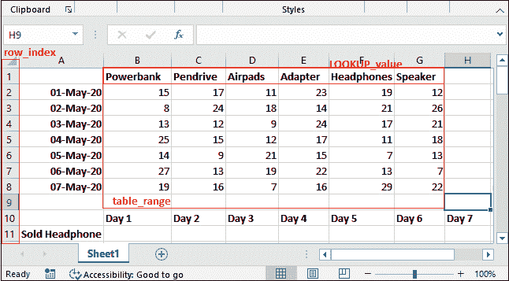

请参见以下步骤:

### 例 1

我们会发现耳机的单日销量。在这个例子中，我们查看了耳机的**第 3 天销售情况。为此，遵循 HLOOKUP 公式的一些简单步骤:**

**第一步:**选择一个储存结果的单元格，这样写 HLOOKUP 公式，如下图:

=HLOOKUP(“耳机”，B1:G8，4，0)

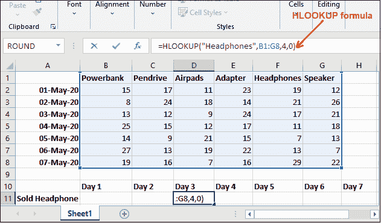

**第二步:**按下**回车**键，获得 5 月 4 日售出的耳机总数，看到返回 11。意味着 5 月 3 日日共售出 11 款耳机。

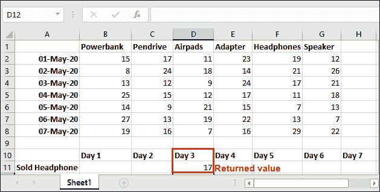

您可以通过手动查找数据来验证 HLOOKUP 公式是否正常工作。请参见下面如何验证:

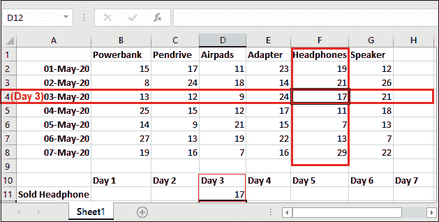

## 错误消息示例

以下是由 HLOOKUP()生成的每个错误(#N/A，#REF，#VALUE)的三个不同示例。这些错误及其示例描述如下。

### 示例 1:当没有找到完全匹配时-# 不适用错误

正如我们已经与您讨论过的，如果在指定的细节中没有找到值，HLOOKUP()函数将返回**# 不适用错误**。**# 不适用**指的是**值不可用**错误。

请参见下面的示例:

**第一步:**你可以看到我们正在查找 HLOOKUP()公式里面的**耳机**，参数值精确匹配(0)。但是在 Excel 表格中，标题是**耳机**，不一样。

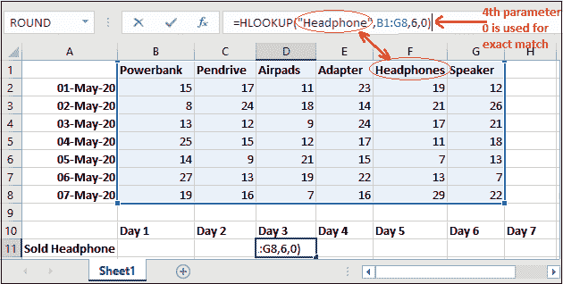

**第二步:**一旦为没有精确匹配的值写出公式(=HLOOKUP(“耳机”，B1:G8，6，0))，按下**回车**键，就会出现 **#N/A** 错误。

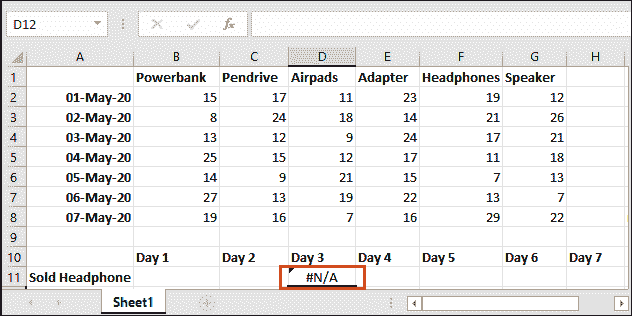

### 例 2:当 row_index >选定范围(表)- #REF！错误

HLOOKUP()函数返回 **#REF！错误**如果行索引参数值大于表参数中选择的列数。

row_index > number of columns selected in table parameter = #REF!

请参见下面的示例:

**第 1 步:**可以看到我们在 HLOOKUP()公式中选择了**表**参数在 **B1:G8** 之间的范围，即直到第 8 行。但是我们正在寻找 row_index 9，它不在定义的范围内。

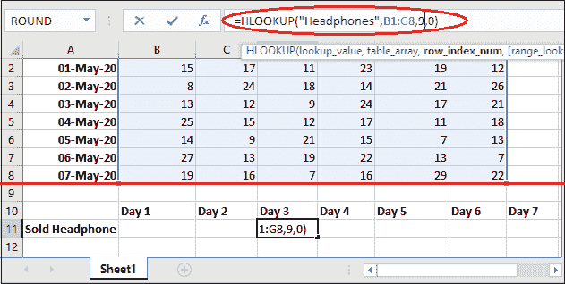

**第二步:**一旦写出 row_index 高于所选范围的公式(=HLOOKUP(“耳机”，B1:G8，9，0))，按下**回车**键，就会得到 **#REF！**错误如下所示。

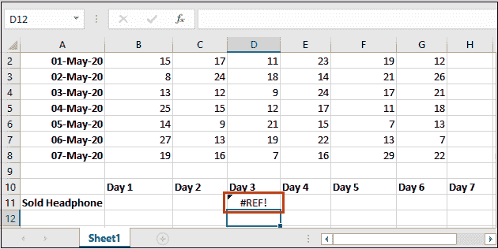

### 示例 3:当 row_index < 1 - #VALUE！错误

HLOOKUP()函数返回 **#VALUE！错误**如果行索引参数值小于目标 Excel 工作表中的 1。

row_index < 1 = #VALUE!

**# 值！**指**值误差**误差。

请参见下面的示例:

**第一步:**可以看到我们在 HLOOKUP()公式中选择了 **B1:G8** 之间的**表**参数的范围。但是我们要找的是 row_index = 0，小于 1，即该行在 Excel 工作表中不可用。

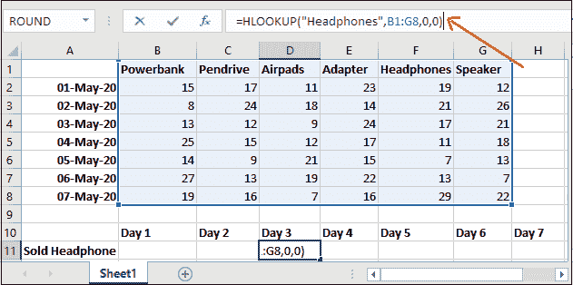

**第二步:**一旦写出 row_index 小于 1 的公式(=HLOOKUP(“耳机”，B1:G8，0，0))，按下**回车**键，就会得到 **#VALUE！**错误如下所示。

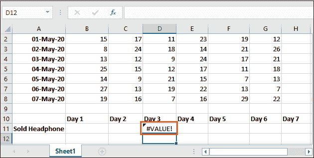

## HLOOKUP()中通配符的使用

HLOOKUP 函数可以使用通配符运算符。我们将在下面的示例中使用相同的 Excel 工作簿-

**第一步:**我们将查找名称以 p 开头的产品第四天的销售情况，为此，在第一个参数中使用星号(*)运算符，并复制以下公式:

=HLOOKUP("P* "，B1:G8，5，FALSE)

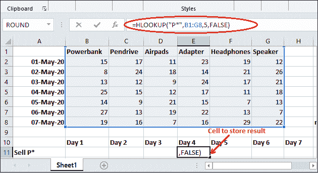

为了精确匹配，我们在第 4 个参数中使用了 **FALSE** 。

**第二步:**现在，按下**进入**按钮，获得名称以 p 开头的产品的第 4 个日卖出

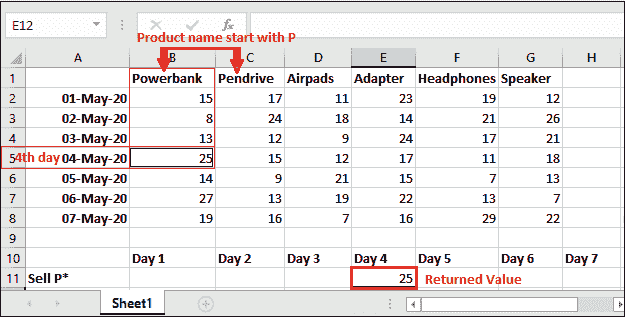

它找到第一个产品时返回第四天的值，该产品的名称以 p 开头。参见上面的结果。

同样，您可以在其中使用另一个通配符运算符。

* * *