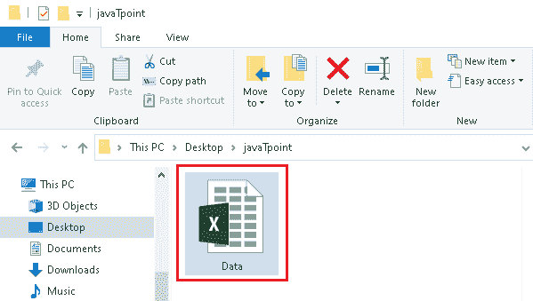
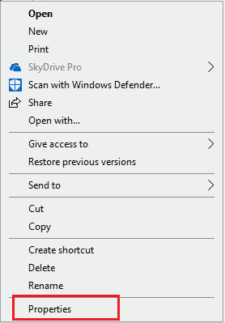
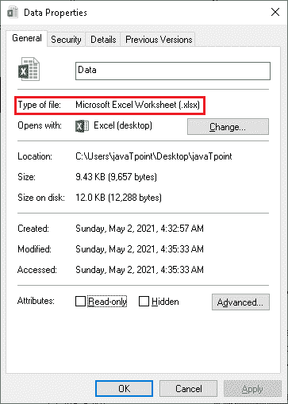
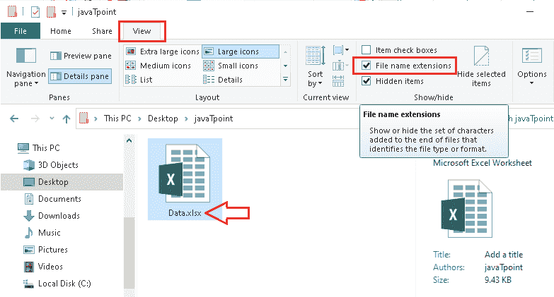
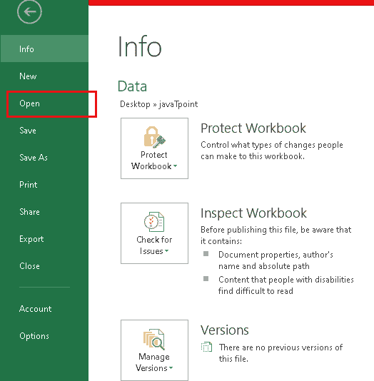
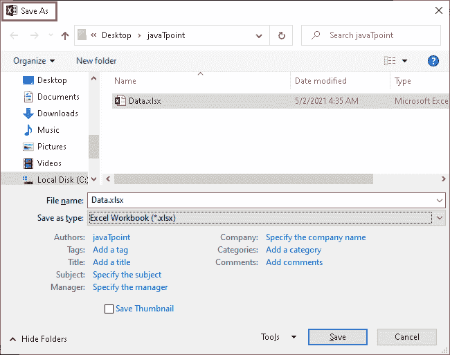
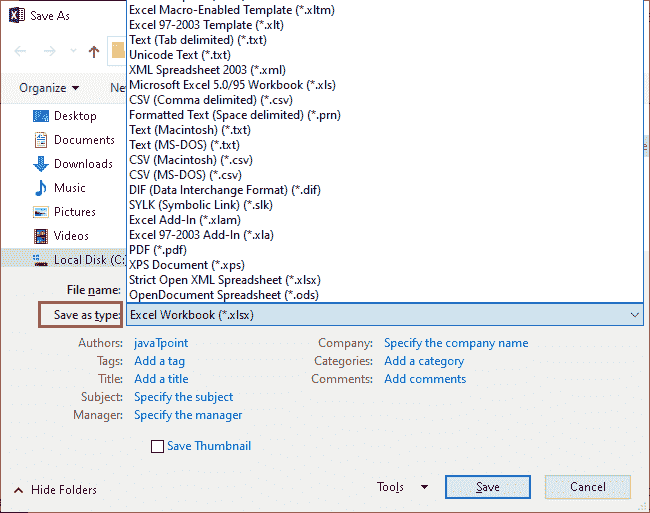

# Excel 的文件扩展名是什么？

> 原文:[https://www . javatpoint . com/excel 文件扩展名是什么](https://www.javatpoint.com/what-is-the-file-extension-for-excel)

微软 Excel 是最古老、使用最广泛的电子表格软件之一。随着时间的推移，该软件获得了许多升级，包括对随着时间推移出现的新扩展名或文件类型的支持。每个新的扩展都有完全不同的功能和用法。因此，我们应该知道 Excel 中最常用的各种扩展。

在本文中，我们讨论的是 [Excel](https://www.javatpoint.com/excel-tutorial) 中常用的文件扩展名。在讨论 Excel 文件扩展名之前，我们先了解一下文件扩展名的定义。

## 什么是文件扩展名？

一个[文件扩展名](https://www.javatpoint.com/file-extensions)主要是指在计算机文件(一个包含信息、数据或命令的对象)的末尾添加一个后缀来定义文件类型。通常，文件扩展名包含两到四个字符。此外，扩展名与文件名之间用点(。)签名。

例如，名为“Example.docx”的文件扩展名为。“docx ”,表示 word 文档文件。

## 为什么 Excel 文件扩展名很重要？

文件扩展名种类繁多。每个扩展名都提供了关于文件类型的必要信息。每个扩展名都有特定的作用，我们必须知道扩展名才能使用正确的软件打开文件。并非所有软件都支持所有文件扩展名。这样，Excel 文件扩展名可以帮助我们更好地了解文件类型及其包含的数据类型，即:

*   无论它包括 VBA(应用程序的 Visual Basic)还是宏，
*   文件是否是模板，
*   文件是否保存为旧版本的 Excel，
*   文件是否以常规旧版本保存，
*   文件格式是二进制还是 XML 文档等。

所有这些细节都可以通过文件扩展名获得。每个扩展都有一个描述性的名称，这有助于我们确定使用相应扩展的目的或技术。此外，在知道文件扩展名后，我们可以在不同的目录中排列/组织不同类型的文件。

## Excel 文件扩展名

虽然 Excel 有多种支持的文件扩展名，但我们将在下面讨论一些重要的扩展名:

### Excel 中的 XLSX 扩展

当 Excel 中不使用宏时，XLSX 扩展是 Excel 的默认扩展。该扩展基于 XML，主要用于 Excel 2007 和 Excel 2010。在 Excel 2007 之前，Excel 的标准文件扩展名是 XLS。在引入 XLSX 扩展名后，文件大小与 XLS 相比大幅减少。因此，下载和共享文件变得比以前容易得多。

除此之外，XLSX 是一个没有恶意代码的扩展。这是因为 XLSX 扩展不能存储 VBA 宏代码。但是，它可以使用和存储 Excel 中使用的所有函数。此外，其他类似的软件也支持此扩展，使得此扩展的文件可以在其他应用程序中访问。使用 XLSX 扩展名的主要缺点是，如果我们想在 Excel 2007 之前的版本中运行该文件，则无法使用此扩展名保存 Excel 文件。

### Excel 中的 XLS 扩展

如前所述，Excel XLS 扩展是 Excel 2007 之前最流行的扩展类型。后来换成了 XLSX。因此，XLS 扩展现在几乎已经过时，我们不再使用或看到这个扩展。但是，扩展仍在使用中，许多软件和工具仍可以选择将数据导出为 XLS 文件。因为 XLS 扩展名仍然存在于许多软件中的唯一原因是，有些人可能需要在 2007 年之前的 Excel 版本(即 Excel 2003)中打开文件。

由于 Excel 可以读取这个扩展名，所以我们可以在新的 Excel 版本中使用任何带有这个扩展名的旧文件，并继续对其进行处理。XLS 扩展名是从 Excel 2.0 版到 Excel 2003 版的默认文件扩展名。现在使用这个扩展有一些缺点。它需要更多的磁盘空间，可能包含恶意的 VBA 代码，并且比最新的扩展包含相对较少的行和列。

### Excel 中的 XLSM 扩展

每当我们在现有的 Excel 文件中包含 [VBA](https://www.javatpoint.com/vba) 宏并试图保存它时，我们都会看到一条通知，要保留 VBA 宏，我们必须保存一个扩展名为 XLSM 的文件。当 Excel 文件中有宏时，XLSM 扩展名是默认扩展名。这个扩展类似于 XLSX 扩展，但是对宏有额外的支持。

这种基于 XML 并启用宏的文件扩展名仅在 Excel 2007 及更高版本中有效。这意味着在 Excel 2007 之前，我们不能在 Excel 中使用此扩展。引入 XLSM 扩展主要是为了提高 Excel 文件的安全性，并保护它们免受恶意宏和病毒的侵害。此外，这个扩展还可以存储 Excel 中使用的所有其他函数。使用 XLSM 扩展的缺点是它比其他文件格式(如 XLSB)需要更多的磁盘空间。

### Excel 中的 XLSB 扩展

XLSB 扩展是 XLSX 和 XLSM 扩展的可选替代，用于保存 Excel 文件。但是，这种特殊的文件扩展名在打开和保存 Excel 文件方面比 XLSX 和 XLSM 快得多。这就是为什么 XLSB 扩展主要用于巨大的文件(超过 10 MB)。与 XLSX 和 XLSB 扩展不同，XLSB 扩展不使用 XML 格式来存储信息。相反，它使用二进制格式。

除此之外，XLSB 扩展使用相对较少的磁盘空间，因为数据是以二进制结构存储的。该扩展还可以存储 VBA 宏，因此，如果从不受信任的来源下载或获得这些文件，我们就不应该启动它们。由于 XLSB 扩展是在 Excel 2007 中引入的，因此我们无法在 Excel 2003 和更早版本中打开 XLSB 文件。此外，大多数第三方软件(如 OpenOffice、Capital IQ、彭博等)都不使用 XLSB 扩展。)，因此我们可能无法打开/导出现有文件。

### Excel 中的 XLTX 扩展

XLTX 扩展主要用于 Excel 模板。Excel 模板通常被定义为具有不同样式、功能和功能的格式化文件。这样，模板被创建并分类到单独的部分，并从 Excel 下载。此外，我们可以创建自定义模板，并使用 XLTX 扩展保存它们。

当我们经常从一个特定的点开始为不同的文件工作时，这个特定的扩展是有益的。因此，如果我们将该特定点保存为模板，则每次都可以将该模板用作其他 Excel 工作簿的起点。此外，我们可以使用“另存为”命令将我们的工作保存到一个新的 Excel 文件中，保留原始文件或模板不变。

### Excel 中的 XLTM 扩展

XLTM 是用于 Excel 模板的另一个扩展。然而，这个扩展是一个启用宏的扩展，它允许我们使用模板的 VBA 宏。更具体地说，我们可以使用 XLTM 扩展来保存带有附加宏支持的自定义 Excel 模板。

另一方面，我们可以随时使用这些文件(带有宏的 Excel 模板)作为包含宏的其他 Excel 工作簿的起点。

### Excel 中的 XLAM 扩展

XLAM 扩展主要用于保存外接程序数据。此扩展不常用于一般用途。它们作为外接程序工作，当我们启动这些文件时，它们可以在 Excel 中高效工作。需要注意的是，XLAM 文件提供了一些在 Excel 中使用的附加特性和功能。特别是，这些文件帮助我们添加/扩展了 Excel 的功能。它们还可以包括 VBA 宏、图像、功能区和带有表单的工作表。

带有 XLAM 的文件可以很容易地作为常规 Excel 文件启动。由于这些文件用于加载项，如果关闭，我们可能需要从 excel 设置(“文件”>“选项”>“加载项”)中启用加载项选项。因此，下次我们打开 Excel 时，我们将看到该特定外接程序的附加功能。

### Excel 中的 CSV 扩展

CSV(逗号分隔值)扩展名通常以纯文本格式保存工作簿。这意味着它不会在文件中存储任何公式或格式。但是，此扩展可以包含制表符、换行符和其他字符，以便在其他 Windows 系统上正确解释。此外，CSV 扩展仅保存活动工作表。

Excel 允许我们直接从 excel 本身导入或打开 CSV 文件。CSV 文件的主要应用包括明确使用数据进行导入和导出。因此，大多数数据库软件都支持这种扩展，以便我们可以导入/导出数据。由于此扩展名不包括公式和格式，文件通常很小。这使我们能够使用大量的数据。此外，我们可以使用无限制的行和列。使用 CSV 扩展名保存的 Excel 文件在打开和关闭过程中工作得更快。

### Excel 中的 ODS 扩展

ODS(开放文档电子表格)是一个扩展，旨在与 Excel 和其他软件如 OpenOffice、LibreOffice 等一起工作。说到 Excel，这个特殊的扩展并不支持所有的特性和功能。这就是为什么不经常使用 ODS 扩展的原因。当我们希望与其他办公应用程序的工作人员共享我们的 Excel 文件时，该扩展主要是有益的。

除此之外，当我们从某人那里收到 ODS 文件并将其打开/导出到 Excel 时，我们可能会在格式和功能(如表格、图表、条件格式等)方面看到一些问题。通常，我们会丢失 Excel 不支持的格式或功能，但 OpenOffice 支持。然而，ODS 扩展可以适当地存储文本和数据。

### Excel 中的 PDF 扩展

Excel 还允许以 PDF(可移植文档格式)扩展名保存工作表。虽然这个扩展在 Excel 中最不受欢迎，但有时却是最有帮助的。PDF 扩展主要用于我们可能需要与其他人共享或打印在纸上时。这是因为 PDF 保持文件的格式，因此它不会自动从一个系统转换到另一个系统。此外，以 PDF 格式保存的文档可以使用商业打印方法轻松复制，因为 PDF 保留了格式。

由于 PDF 扩展是在 Excel 2010 中引入的，因此无法在 Excel 2007 和更早版本中使用。此外，在 Excel 中打开 PDF 文件可能会导致一些格式问题，因为有不同的软件可以打开这种特定的文件格式，例如 Adobe Reader。

## 如何检查 Excel 文件扩展名？

我们可以尝试不同的方法来检查使用 Excel 保存的文件的文件扩展名。下面讨论检查文件扩展名的两种最简单的方法:

### 方法 1:

*   首先，我们需要打开保存文件的位置(即文件夹)。我们需要选择文件并用鼠标右键单击它。
    
*   在下一个屏幕上，我们需要点击列表底部的“**属性**”选项。看样子:
    
*   之后，我们将看到一个属性窗口。在这里，我们可以从“**常规**选项卡下检查文件类型或扩展名。参考下图:
    

### 方法 2

除了上面讨论的传统方法，我们还可以在文件资源管理器的“**视图**选项卡中标记“**文件扩展名**”框。这将在文件资源管理器中显示带有文件名的文件扩展名。

## 将 Excel 文件扩展名转换为其他格式

我们可以通过浏览 excel 中的**文件>另存为**，将现有 Excel 文件的扩展名转换为另一种格式。我们将在“**另存为类型**”文本旁边的下拉菜单中看到几种文件格式。但是，列表中可用的格式可能因活动工作表(图表工作表、工作表或任何其他类型的工作表)的类型而异。

让我们通过图片来深刻理解这一点:

*   首先，我们需要打开一个文件，我们想保存另一个扩展名。我们可以打开任何现有文件，方法是进入“**文件**”，然后点击列表中的选项“**打开**”。超越
    
*   一旦文件在 Excel 中打开，我们必须再次单击“**文件**”选项卡，并从列表中选择“**另存为**”选项。尽管如此，我们也可以使用键盘短键“ **F12** ”快速启动“另存为”对话框。
    
*   在“另存为”窗口中，我们将获得选择位置、输入文件名和选择文件类型(扩展名)的选项。我们可以从下拉列表中选择文件类型，如下图所示:
    
*   完成上一步后，我们需要点击“**保存**按钮，一个带有所选文件扩展名的新文件将被保存在所选位置。
    T3】

#### 注意:当我们以另一种文件格式更改或保存现有的 Excel 文件扩展名时，它的某些格式、功能或数据可能不会总是被传输。

Excel 中应该选择哪个文件扩展名？

为 Excel 文件选择正确的扩展名至关重要；否则，它可能会行为不端。这主要取决于用户的需求以及用户希望在 Excel 文件中使用什么类型的数据、功能或格式。

以下是为 Excel 文件选择最佳文件类型的一些有用要点:

*   如果我们想保存我们的 Excel 文件，在没有进一步编辑的情况下进行硬拷贝，建议选择 PDF 版本。这是因为当保存到其他文件扩展名时，某些格式可能会在打印后自动更改。此外，一旦 PDF 以正确的格式保存，打印时不会自动更改。再者，PDF 文件也很难编辑，所以没有其他人可以轻易更改数据。
*   如果 Excel 文件有 VBA 宏，并且文件比较大，建议使用 XLSB 扩展名。即使没有使用 VBA 宏，但是文件大小很大(超过 10 MB 左右)，我们也应该选择 XLSB 扩展名。此外，如果一个文件有 VBA 宏，并且大小小于 10 MB，那么使用 XLSM 扩展名是很好的。
*   如果需要用其他流行软件打开和编辑 Excel 文件，建议选择 ODF 扩展名或严格的 XLSX。
*   如果我们想保存一个 Excel 文件，用其他版本的 Excel 打开它，比如 Excel 2003 或更早版本，我们需要选择 XLS 扩展名。旧版本支持此扩展；但是，新版本的功能不会显示在旧版本中。

这些是我们可以选择的一些最常见的格式。然而，我们可以根据需求选择更多的选项。

* * *