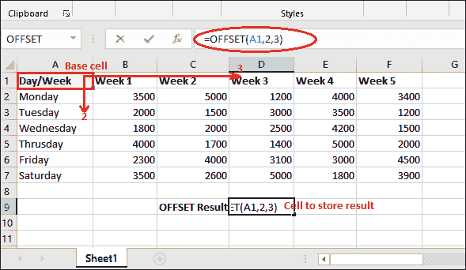
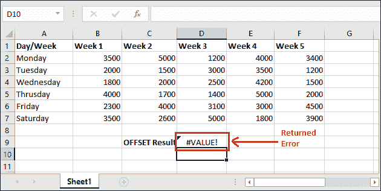

# Excel 中的偏移函数

> 原文:[https://www.javatpoint.com/offset-function-in-excel](https://www.javatpoint.com/offset-function-in-excel)

Offset()是一个 Excel 函数，用来获取一个范围的引用并返回给用户。这是一个有点棘手的功能，不太容易理解和使用。一旦你学会并得到它，你就可以很容易地在你的 Excel 工作表上使用它。

#### 注意:结果值可以是单个单元格或多个相邻单元格的范围。

本章将简要介绍偏置函数的功能及其语法和示例。你可以在 Excel 的**公式**页签内的**查找&引用**列表下找到这个查找功能(用户界面)。遵循我们完整的教程。

## 偏移量的使用()

使用 offset()函数，您可以在任何方向(左、右、上、下以及对角)直接移动到单元格。例如，

在棋盘上，车只能沿左、右、上、下直线移动，不能沿对角线移动。同样，使用 Excel 的其他功能，用户可以直接进入一个单元格。offset()功能使用户能够对角移动。

## 句法

以下是 offset()函数的语法。它接受其中的五个参数。

```

=OFFSET(reference, rows, cols, [height], [width])

```

在引用参数中提供一个起点，并提供要向左、向右、向上和向下移动的行数和列数。而高度和宽度是可选的。

## 参数列表

OFFSET()函数有五个参数，其中前三个是强制参数，其他是可选参数-

### 必需的参数

**参考(必选)-** 是起点，用作范围或通话参考。例如 A2、B5 等。它是基本细胞。

**行数(强制)-** 从起始参考值以上或以下的行数**。它可以是正数或负数。**

**列(必选)-** 列数**向左或向右的起始参考**值。此参数可以接受正值或负值。

### 可选参数

**【高度】(可选)-** 传递高度参数，得到需要返回的行数。此参数仅接受数值，并且必须是正数。

通常，此参数用于获取要返回的多个值。

**例如。，**如果高度为 1，则只返回一行数据。但是如果高度参数值是 2，那么目标单元格及其下面的单元格数据(多个值)将返回。

**【宽度】(可选)-** 传递宽度参数，得到要返回的列数之和。与**高度**参数一样，它也只接受一个数值，并且必须是正数。

**例如**如果值为 2，则返回所选单元格(由前三个强制参数选择)+和下一列单元格的总和。

#### 注意:您可以在另一个 Excel 函数中使用 OFFSET()函数来处理它在使用高度和宽度参数时返回的多个值。

现在，我们将在实践中说明该理论，并借助于示例，您将会得到更好的结果。

## 返回值

OFFSET()函数返回对范围的引用。该引用可以是单个单元格，也可以是多个单元格。

## 偏移警告

OFFSET()函数是一个**可变函数。**如果应用于 Excel 工作簿中的太多单元格，会降低该工作簿的处理速度。因此，您可以使用其他 Excel 函数来代替它，以保持更快的处理速度。

Excel 提供了一个返回引用的非易失函数，如 **INDEX()** 。它不会减慢工作簿的进程。

## 偏移示例

在开始直接在 Excel 工作表上学习 OFFSET 函数之前，请尝试借助语法示例来理解它。请参见下面的一些偏置语法示例:

| 公式 | 描述 |
| =偏移量(A2，4，3) | 

*   **A2** is that mean starting point of basal cell.
*   **4,3** refers to the fourth row and third column of the base cell.

得到的单元格值将是 D6。 |
| =SUM(OFFSET(A2，2，4，1，1)) | 

*   **A2** is that mean starting point of basal cell.
*   **2,4** refers to the second row and the fourth column from the starting point.
*   **1,1** refers to only one row and one column of data.

结果单元格值将仅为 E4。什么都不会总结，因为选中的单元格只有 E4。 |
| =AVERAGE(OFFSET(A2，2，4，2，1)) | 和上面的例子一样，

*   **A2** is the starting point (basic cell).
*   **2,4** refers to the second row and the fourth column from the starting point.
*   **2,1** refers to two rows and one column of data.

首先，使用前三个参数选择细胞 E4。然后，使用可选参数，下一行中的另一个单元格(E5)将被选择。
最后，计算并返回 E4 和 E5 的平均值。 |

## 需要偏移()函数

offset()函数在动态计算中非常有用。让我们用一个例子来理解为什么需要这个函数。我们有一个问题，可以通过 offset()解决。

**问题**

我们有一组 7 天的数据，我们想要计算过去 5 天的平均值。这可以很容易地用 Excel 的平均值公式来完成。

但问题是——我们最后又增加了一行(B8)，再次计算了最近 5 天的平均值。在这种情况下，我们必须更改目标列的范围，平均公式将为(=AVERAGE(B4:B8))。结果值现在也将改变。

**解决方案**

这个问题可以使用 offset()函数解决。它使用户能够获取单元格的引用，然后通过使用可选参数选择多个值来计算 SUM、AVERAGE 或其他运算。**例如**

=AVERAGE(OFFSET(A2，5，3，2，1))

## OFFSET()函数是如何使用的？

借助不同的示例，您现在将看到如何使用 OFFSET()函数。对于 OFFSET()函数的例子，我们有下面一组一个月的数据。


我们有一张工作表，包含一个月中每天的周报。我们现在将在此工作表上应用 OFFSET()公式。

## 没有高度和宽度参数

### 例 1

**第一步:**选择一个单元格，保存 OFFSET()函数返回的结果，并在公式栏中写入以下 OFFSET()公式。

=偏移量(A2，4，3)


**第二步:**在公式栏内写入 OFFSET()公式后，点击**回车**键，得到结果值。


请注意，在执行 OFFSET()函数时，已经返回了 3100。在这个例子中，我们只使用了前三个强制参数。

### 例 2

再看一个没有高度和宽度参数的 offset()函数的例子。对于这个例子，我们将使用相同的数据表，并且只更改参数。

**第一步:**选择一个单元格，保存 OFFSET()函数返回的结果，并在公式栏中写入以下 OFFSET()公式。

**偏移公式**

=偏移量(A1，2，3)



**第二步:**在公式栏内写入 OFFSET()公式后，点击回车键得到结果值。


请注意，在执行 offset()函数时，OFFSET()函数已返回 3000。

## 使用高度和宽度参数

在本例中，我们将使用 offset()函数中的高度和宽度(可选)参数。看看它的结果有多不同。

offset()函数通常返回多个值，这些值通过使用另一个函数来保存。这意味着您必须在另一个函数中传递 offset()来保存它返回的值。

### 例 1

在本例中，我们将在 SUM()函数中使用这个 offset()函数来获取 OFFSET()函数返回的值的总和(引用单元格)。在这里，我们将通过将高度值输入到 2 来从多行中选择单元格。

**计算有偏移的和的步骤**

请参见下面几个简单的步骤:

**第一步:**和上面的例子一样，选择一个单元格来保存 OFFSET()函数返回的结果，并通过在公式栏中写入高度和宽度参数来应用下面的 OFFSET()公式。

```

= OFFSET(A2,4,3,2,1)       //return the reference of D6 and D7 cell

```


**第二步:**现在，按回车键。它将产生一个**#价值！**错误，因为返回了多个值。



**第三步:**为了处理这个错误，我们将这个公式放在另一个函数里面。我们将使用 SUM()函数，该函数将返回由 offset()函数选择的单元格的总和。

```

= SUM(OFFSET(A2,4,3,2,1))

```


**第四步:**在公式栏内写入 OFFSET()公式后，点击回车键得到结果值。

请注意，它返回了单元格(D6，D7)的总和，这些单元格的引用返回偏移量()。


金额已经退回，即 8100。现在您已经了解了偏移函数如何使用可选参数。

### 例 2

查看带有可选参数(高度和宽度)的 offset()函数的另一个示例。在本例中，我们将使用 AVERAGE()内部的 offset()函数来获取 offset()函数返回的值(引用单元格)的平均值。

这一次，我们将通过将宽度值输入到 2 来从多列中选择单元格。

**计算有偏移的和的步骤**

请参见下面几个简单的步骤:

**第一步:**选择一个单元格，用 SUM()保存 OFFSET()函数返回的结果，并通过将 OFFSET()公式写入公式栏来应用以下带有高度和宽度参数的 OFFSET()公式。


**步骤 2:** 偏移量()将返回 D6 和 E6 像元的参考，因为宽度是 2。因此，两个单元格引用将返回，其和将计算并返回。


通过使用上述带有 SUM()函数的 offset()公式，计算结果 6100 已经返回。

### 示例 3:对一列的所有单元格求和

该 Excel 表中有 5 列包含 5 周的数据，其中每列包含 6 天的数据。举例说明使用 offset()函数对一列的所有单元格求和的示例。

**第一步:**使用 SUM()内部的以下 offset()公式获取一列的所有单元格的总和。

```

=SUM(OFFSET(A2,0,2,6,1))      //offset will return the reference of C2 to C7 cell

```


它将从起点开始查找同一行和第二列，然后计算该列六个单元格的总和。

**第二步:**按回车键，C 列六个单元格之和(按偏移量()引用返回)将返回所选单元格。查看下面的输出:


这里，总和是通过 offset()函数计算的。

offset()函数可能是 Excel 中最容易混淆的函数。

### 示例 3:对一行的单元格求和

在这个 Excel 表格中，您可以看到有 7 行包含 6 个不同的日期数据，其中每列包含一周的数据。借助一个简单的例子，我们将说明如何使用 offset()函数对一行的所有单元格(包含一些数据)求和。

**第一步:**使用 SUM()内部的以下 offset()公式，得到一行中所有要求和的单元格。

```

=SUM(OFFSET(A2,3,1,1,5))      //offset will return the reference of 6th row

```


它将从起点开始计算第五行和第一列，然后计算相对于第五行的五个单元格的总和。

**第二步:**按回车键，相对于第五行的五个单元格之和(参照返回偏移量())将返回所选单元格。查看下面的输出:


这里，总和是通过 offset()函数计算的。

* * *