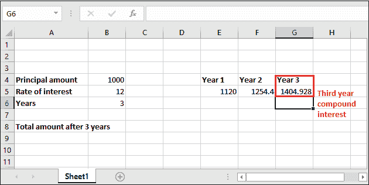
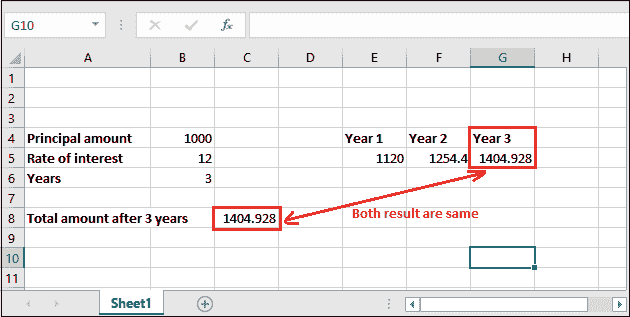

# Excel 中的复利公式

> 原文:[https://www . javatpoint . com/复利-excel 中的公式](https://www.javatpoint.com/compound-interest-formula-in-excel)

Excel 通常用于会计目的，以存储数据并对数据执行各种类型的操作。复利公式就是其中一个利用 Excel 的函数得到计算结果的公式。它是会计的一个组成部分，也是银行业中最常用的公式。

复利是单利的推进。单利只适用于所有年份的本金。但是复利适用于本金和一年后的利息。

在 Excel 教程的这一章中，我们将描述复利公式及其用法，以及如何在 Excel 工作表上使用它。

## 复利公式是什么？

复利的简单定义是 **-复利是按利息计算的利息。**复利公式用于计算用户在 Excel 中指定的某个金额的利息。

#### 注:对于复利，每年的本金金额是不同的。

复利是会计中使用的基本构件。它首先用一年的利率计算本金的利息，然后将本金和利息相加。借助下面的图示来理解它-


复利按一年的初始金额计算，然后用之前的金额累计利息。与单利不同，复利是一年后本金加上利息。

我们有两个计算复利的公式，本章将通过下面的例子详细讨论:

*   FV = PV * (1+r)
*   FV = PV * POWER((1+r)，n)

### 先决条件

Excel 用户必须熟悉一些先决条件，如下所示:

*   首先，用户应该了解 Excel 界面。所以，他们使用它没有任何问题。
*   在 Excel 工作表数据中应用复利公式之前，您应该熟悉一些基本术语，如本金金额、利率、单利等。
*   用户必须至少了解复利的基础知识，复利的定义、公式，以及复利与单利的不同之处。
*   另外，用户还应该知道使用 Excel 中的函数，比如 POWER()函数。其中一个复利公式需要 POWER()函数。您也可以使用^算子来代替 POWER()函数。
*   复利不同于单利。所以，不要混淆他们。

## 复利公式

下面是计算复利的一般公式。

### 用于单年计算的复利公式

这个复利公式只帮助计算一年的利息**。例如**如果要计算三年的复利，就要用这个公式对每一年逐一计算三次利息。

记住——在每一年，本金金额是不同的，这是通过计算前一年的复利实现的。

```

FV = PV * (1+r) 

```

在这里，

**FV** =未来值，

**PV** =现值(该现值指**本金金额)**

**r** =利率

#### 注:利率值以百分比表示。因此，在复利公式中使用它时，使用它的股息 100。**例如** 12% = 12/100。

在 Excel 工作表上应用公式时，可以直接将值放入公式中，或者提供相应的单元格编号并应用复利公式。

### 一般复利公式

这是复利的另一个公式，有助于直接计算任何一年的利息。它比上面那个快。这个公式包含一个额外的参数和一个数学**幂()**函数。

```

FV = PV * POWER((1+r), n) 

```

这个公式也可以写成=PV*((1+r)^n)，其中^用于幂()函数。

在这里，

**FV** =未来值，

**PV** =现值(该现值指**本金金额)**

**POWER()** =是 Excel 中用来计算一个数的幂的幂函数。它需要两个参数:数和幂。

**r** =利率

**n** =用户定义的计算利息的年数

**例如**，如果要计算 8 年的复利，可以用这个公式直接一次算出 8 年的复利。

我们将在 Excel 中定义一些计算复利的简单方法。

### 返回值

该公式返回未来值(FV)，用作计算复利的本金金额。

这个未来值(FV)是本金和利息(通过复利公式计算)的组合，即 **FV =本金+利息。**

## 如何在 Excel 中计算复利？

让我们从一个非常简单的计算 Excel 工作表数据利息的例子开始。一步也不要错过。因此，你会感到困惑。

我们在 Excel 工作表中有一些数据，其中初始余额(本金金额)为 1000，利率为 12%。现在，我们将逐一计算 3 年的复利。


**“利率始终以百分比为单位。因此，确保在其股息中始终使用 100。”**

### 1.计算每年的复利

仔细遵循每一步，不要错过任何一步，因为你会感到困惑:

**第一步:**转到存储计算复利的单元格，选择。然后在公式栏中，使用下面的复利公式计算第一年的利息。

= PV * (1+r)


**第一年复利**

**第二步:**或者直接将各自的值放入公式中，或者提供它们的单元格号，单元格号包含各自的数据。如下式所示-

=B4*(1+B5/100)


**第三步:**现在按**进入**键，在所选单元格中获取计算的 1 年复利。退回金额为 1120；请看下面的截图。


**第四步:**如果想找出唯一的利息值，从取回的未来价值金额(FV)中减去本金金额，即，

**利息=未来价值-本金**


这样，你就可以找到每年的利息。但是请记住，本金和未来价值每年总是不同的。

**第二年复利**

我们现在将使用新检索的本金金额计算下一年(第二年)的复利。这次本金是 1120(存储在 E5 单元格)，不是 1000。

**第一步:**选择一个单元格，保存新计算的复利金额，写第二年复利。

= PV * (1+r)


**第二步:**将下面的复利公式放到 Excel 的公式栏中。

=E5*(1+B5/100)


**第三步:**现在按**回车**键，在所选单元格中获取计算的第二年复利。退回金额 1254.4；请看下面的截图。


**第三年复利**

我们现在将使用新检索的金额(1254.4)计算第三年的复利。所以这次本金是 1254.4，存放在 F5 单元格。

**第一步:**将下面的复利公式放到 Excel 的公式栏中。

=F5*(1+B5/100)


**第二步:**现在按**进入**键，在所选单元格中获取计算的第三年复利。退回金额为 1404.928；请看下面的截图。



同样，你可以计算其他年份的复利。

### 2.计算复利的一般公式

在这个例子中，我们将使用这个= PV * POWER((1+r)，n)的复利公式。仔细遵循每一步，不要错过任何一步，因为你会感到困惑:

**第一步:**转到存储计算复利的单元格，选择。然后在公式栏中，使用下面的复利公式计算第一年的利息。

= PV * POWER((1+r)，n)

**第二步:**和上面的例子一样，你可以为需要的各个值提供单元格的引用，也可以直接输入值进行计算。

我们使用细胞参考。所以，我们的公式会像，=B4*POWER((1+B5/100)，B6)


**第三步:**按**进入**一次计算三年复利后得到总金额。

可以看到，应用复利 3 年后，返回值为 1404.928。


您还可以比较通过不同公式计算的复利的两个结果，注意结果是相同的。



### 每年复利期(每月、每季度、每年)

除了上面的例子，我们还有一个复利的例子。和上面的有点不一样。对于本例，我们在数据中增加了一项，即每年的**复利期。**这个术语指的是一年中给予用户多少次利息。

该复利期可以是每月、每季度、半年、每年，或您在提供数据时定义的任何期限。

让我们用一个真实的场景来理解:

**例如**众所周知，银行为他们在银行存钱提供复利。银行一年分三次按季度支付利息。根据本例，**每年复利期**的值为 3。

**该类型复利的公式**

```

= PV * POWER((1+r), n*p)

```

一切都和上面的公式一样。这里，p 是每年的周期。不用 POWER()函数，你也可以写出这个公式-

```

= PV * ((1+r) ^ (n*p))

```

### 例 3

**计算三年季度 CI 的步骤**

现在，让我们在 Excel 工作表数据上实际实现这个示例，并了解这个计算是如何进行的。

**第一步:**转到存储计算复利的单元格，选择。然后在公式栏中，使用下面的复利公式计算第一年的利息。

= PV * POWER((1+r)，n*p)


**第二步:**和上面的例子一样，你可以为需要的各个值提供单元格的引用，也可以直接输入值进行计算。

我们使用细胞参考。所以，我们的公式会是这样的，=B4*POWER((1+B5/100)，B6*B7)


**第三步:**按**进入**，看到 Excel 返回的计算复利为 **2773.079。**


用最简单的语言或术语来理解复利，即**“<u>利大于利</u>”。**

## FV()函数和复利

我们上面讨论的所有方法都是手工的。这意味着用户必须知道复利公式，知道它的基本术语和用法。如果用户对复利及其公式有很好的了解，他/她可以很容易地使用它，而不会浪费任何时间。

虽然我们已经在 Excel 中提供了复利和计算的详细描述，但是如果用户仍然没有得到这个，我们还有一个解决方案。Excel 提供 FV()函数，这是一个内置的 Excel 函数，用于计算复利。

### FV()函数

FV()指**未来值。**是 Excel 的内置函数，用来计算某个数值的复利。与上述方法类似，它也计算投资的未来价值。

它需要五个参数，其中最后两个是可选的。首先，看语法，然后我们将讨论它的参数。

### 句法

```

=FV(rate, nper, pmt, [pv], [type])

```

每个参数都属于一个特定的值，例如-

**利率(必需)—**利率参数包含要应用于每个期间金额的利率。

**nper(必选)-** 包含每年复利周期数。复利期是指一年内给用户多少倍的利息。可以是每月、每季度或每年。

**付款(必需)—**付款是每个期间的附加金额。它被表示为负数。这意味着该值必须是负数。如果 pmt 中没有值，那么将 0 作为它的值。

**pv(可选)—**Pv 指**本金投资，**为可选参数值。像 pmt 一样，如果 pv 中没有值，就把 0 作为它的值。

**输入(可选)-** 付款到期的时间。它也是一个可选参数，默认值为 0。这里， **0 代表期末**而 **1 代表期初。**

### 返回值

Excel 的 FV()函数返回投资的**未来值。**

### 例子

让我们举一个例子，了解 FV()函数如何使用它的参数。在我们定义一个简单的场景之前:

我们已经存了 3000 卢比，存了 4 年，年利率是每月复利的 7%。这意味着复利期是每月的，也就是这里的 12。没有额外的付款。

请参见下面的数据集:


现在，看详细解释；

1.  这里**速率**参数的值为 0.007/12。因为，正如你上面提到的，利率是每年 7%。
2.  对于 **nper，**为 4 * 12，即 4 年* 12 个月。
3.  **付款**参数将保持为空，因为没有涉及额外付款。
4.  Pv 值将为-3000，因为 pv 表示为负数。

因此，FV()公式如下-

=FV(0.007/12，4*12，-3000)

您也可以用 Excel 工作表的单元格引用替换这些值。

=FV(B4/B5，B6*B5，-B3)

**第一步:**选择保存计算结果的单元格，将创建的 FV()公式写入公式栏。


**第二步:**按下**回车**键，获得带息返还的**余额**。看到退回的金额是 3966.16。


**第三步:**你只能从 4 年和月复利期的返还金额中提取复利。看到结果:


同样，您可以计算其他数据的复利。希望你已经完全理解了如何在 Excel 中使用手工计算或使用内置公式计算复利。

* * *