# Excel 中的 FV()函数

> 原文：<https://www.javatpoint.com/fv-function-in-excel>

FV()是一个内置的 Excel 函数，用于财务计算。这里，FV()指的是**未来值。**该函数有助于计算复利，返回未来值。

在详细介绍 FV()函数之前，您需要对复利及其基本术语知之甚少。因为它用于计算复利和未来一年利息计算的未来值。

在本章中，我们将详细描述 FV()函数及其语法、参数和示例。

## 什么是复利？

复利是在第一年本金的基础上计算的金额，然后是利息。用户必须知道复利、它的基本术语和用法。如果用户对复利及其公式有很好的了解，就可以更容易、更快地学习和使用 Excel 的 FV()函数。

用最简单的语言或术语来理解复利，即 **<u>“利息重于利息”。</u>T3】**

虽然我们在前一章已经提供了复利及其手动计算的详细描述。但是也可以通过 Excel 内置的方法进行计算。Excel 提供 FV()函数，这是一个内置的 Excel 函数，用于计算复利。

### FV()函数

FV()指**未来值。**是 Excel 的内置函数，用来计算某个数值的复利。与手动复利方法类似，它也计算投资的未来价值。这个函数有点难懂。

复利是 FV()函数的基础。它可以定期计算，如每月、每季度、每半年或每年。相应地提供数据。

### 句法

复利有五个参数，其中最后两个是可选的。首先，看语法，然后我们将讨论它的参数。

```

=FV(rate, nper, pmt, [pv], [type])

```

每个参数都属于特定的复利值，例如-

| 参数 | 描述 |
| **速率(必需)** | 利率参数包含要应用于每个期间金额的利率。 |
| **nper(必需)** | 它包含每年的复利周期数。复利期是指一年内给用户多少倍的利息。可以是每月、每季度或每年。 |
| **pmt(必需)** | 付款是每个周期的附加金额。它被表示为负数。这意味着该值必须是负数。如果 pmt 中没有值，那么将 0 作为它的值。 |
| **pv （可选）** | Pv 指的是本金投资，是一个可选的参数值。像 pmt 一样，如果 pv 中没有值，就把 0 作为它的值。 |
| **类型(可选)** | 付款到期时传递此参数。它也是一个可选参数，默认值为 0。这里， **0 代表周期的结束**，而 **1 代表周期的开始。** |

### 返回值

Excel 的 FV()函数返回投资的**未来值。**复利的计算取决于以后的年份。

### 示例 1:无复利期的复利

让我们举一个例子，了解 FV()函数如何使用它的参数。在我们描述一个简单的场景之前:

**问题**

我们已经存了 3000 卢比，为期 4 年，年利率为 7%，按年复利计算。这意味着默认情况下复利期值为 1，或者您可以假设它没有额外的复利期。

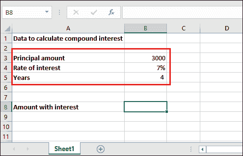

**解决方案**

对于这个问题，我们将直接把给定值放在 FV()公式里面，不做任何额外的计算，得到计算 4 年的复利。

因此，FV()公式如下-

```

=FV(B4, B5, ,-B3)

```

相应地为该值选择单元格引用。不要复制我们的。

或者

```

=FV(7%, 4, ,-3000)

```

*   **付款值**在此为空，因为问题中没有定义额外付款。

### 计算复利的步骤

**第一步:**选择保存计算结果的单元格，将创建的 FV()公式写入公式栏。

=FV(B4、B5、、-B3)

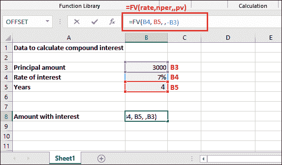

**第二步:**按下**回车**键，获得带息返还的**余额**。看到它四年的利息加本金是 3932.39。

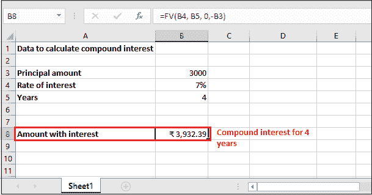

**第三步:**你只能从返还的金额中减去初始投资(本金)提取利息。见结果——932.39 复利超过 3000 卢比。

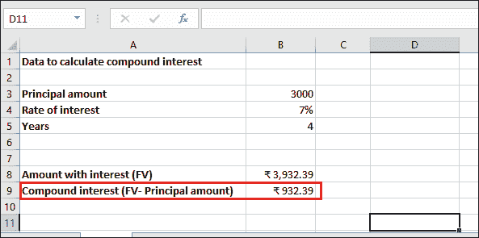

### 例 2:复利期复利

**问题**

我们有和上面例子一样的问题。我们已经存了 3000 卢比，为期 4 年，年利率为 7%**按月复利。**表示-本次复利周期为月，其值为 12。没有额外的付款。

请参见下面的数据集:

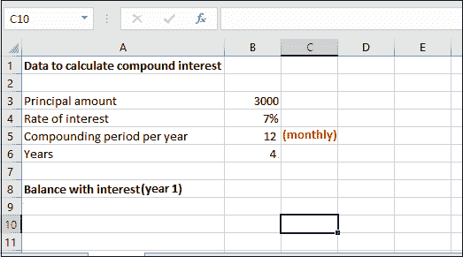

**解决方案**

这一次，FV()函数需要一些额外的计算，而不是直接传递参数值。因此，FV()公式如下-

```

  =FV(B4/B5, B6*B5, 0, -B3)

```

您也可以将这些值直接提供给公式，而不是单元格引用。

```

=FV(0.007/12, 4*12, 0, -3000)

```

**“记住，这个公式是以月复利期计算一年的复利。你必须计算每一年的复利，通过前一年的计算获得新的未来价值。”**

现在，看详细解释；

1.  这里**速率**参数将有 0.007/12。因为，利率是每年 7%的复合月利率(一年 12 个月)，正如你上面提到的。
2.  对于 **nper，**值将为 4 * 12，即 4 年* 12 个月，因为复利期为月。
3.  **付款**参数将保持为空，因为不包括额外付款。
4.  Pv 值将为-3000，因为 pv 表示为负数。

### 计算复利的步骤

**第一步:**选择保存计算结果的单元格，将创建的 FV()公式写入公式栏。

=FV(B4/B5，B6*B5，0，-B3)

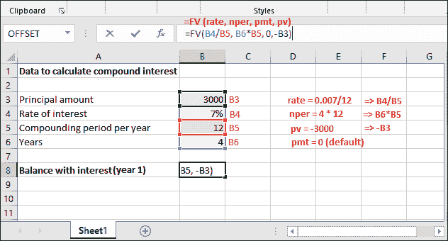

**第二步:**按下**回车**键，获得带息返还的**余额**。看到返回的未来价值金额是 3966.16，为期 1 年，按月复利。

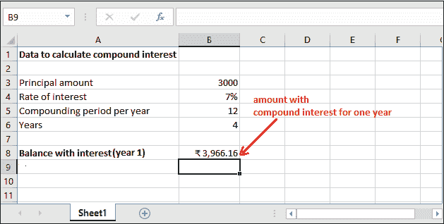

**第二年**

**第三步:**现在，我们用上一步返回的新**未来值**计算第二年的利息。

**=FV(B4/B5，B6*B5，0，-B8)**

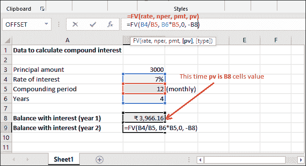

**第四步:**得到计算出的第二年复利(未来值)，即 5243.48。

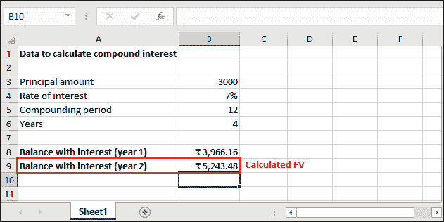

**第三年**

**第五步:**用下面的公式，用上一步返回的新的**未来值**计算第三年的利息。

**=FV(B4/B5，B6*B5，0，-B9)**

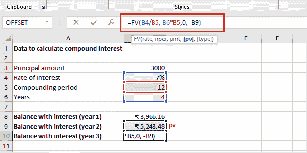

**第六步:**得到第三年计算的复利(未来值)，为 6932.16

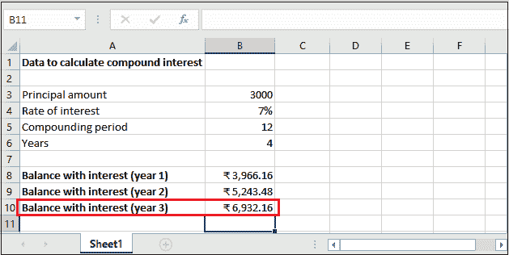

**第 4 年**

**第 7 步:**使用以下公式，我们将用上一步返回的新**未来值**计算第 4 年的利息。

**=FV(B4/B5，B6*B5，0，-B10)**

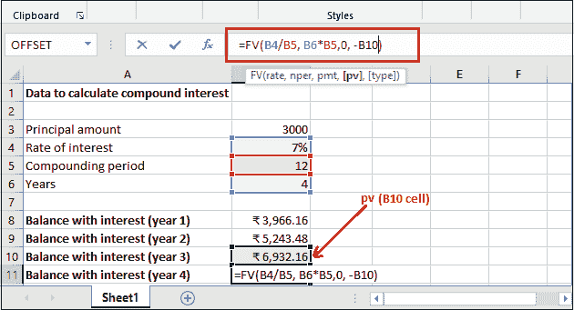

**第八步:**得到第四年计算的复利(未来值)，为 9164.69。

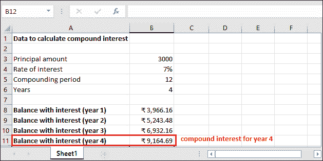

您只能从四年后按月复利期返还的最终金额中提取复利。看到的结果只有利息是 6164.69。

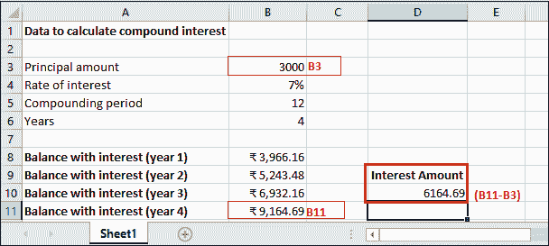

同样，您可以计算另一个数据集的复利。

## 另一个 FV()公式

再看一个使用简单易懂的 FV()公式的 FV()函数的例子。如果以前用过的公式很难理解。记住，它的工作原理完全相同。

```

=FV(R/N, Y*N,,-P)

```

在这里，

*   r 是年利率。
*   n 是每年的复利周期数。**比如**，你的复利期是年，N 会是 1。同样，如果复利期是季度，N 将是 4，如果复利期是月度，N 将是 12。
*   y 是计算利息的年数。
*   p 是初始投资的意思是本金，在这个函数中总是用负数。该本金金额值每年变化，为 FV()返回的**未来值**。

#### 注:对于此函数，现值(本金)始终为负，因为现值和未来值之间存在负相关关系。

### 例 3

我们已经存了 4000 卢比，期限为 2 年，年利率为 8%，每半年复利一次。请记住，没有额外的付款。

### 计算复利的步骤

**第一步:**选择保存计算结果的单元格，将创建的 FV()公式写入公式栏。

=FV(B4/B6，B5*B6，0，-B3)

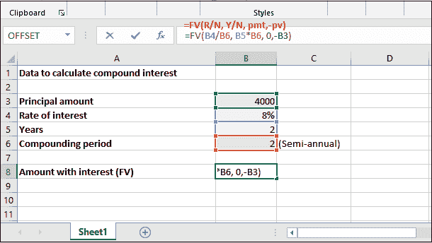

**第二步:**按下**回车**键，获得带息返还的**余额**。看到它第一年的本金还利息是 4679.43。

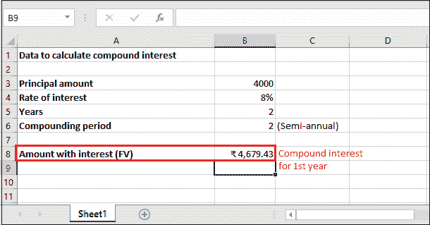

**第三步:**只有第一年的利息金额是 679.43。因为，可以从未来价值中减去本金，即**本金-未来价值。**

同样，您可以使用新的未来值来计算其他年份。

* * *