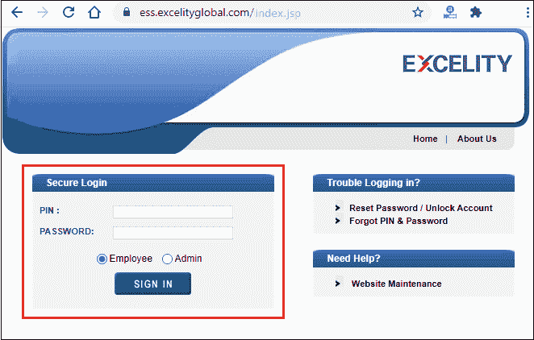
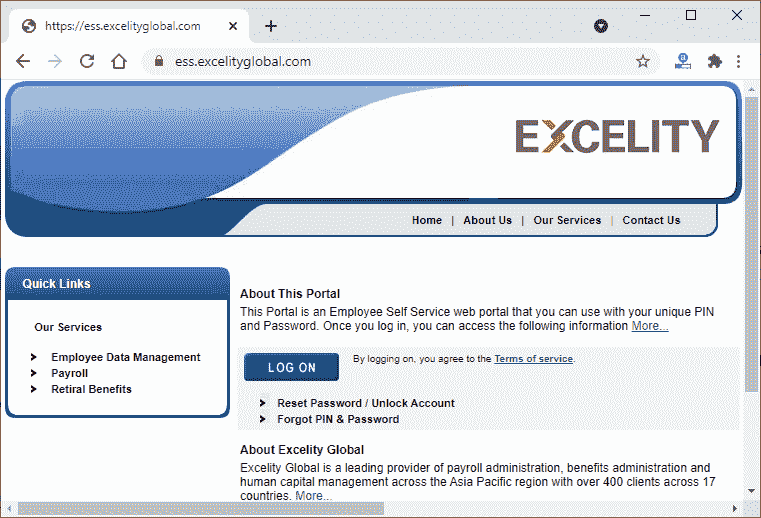
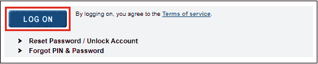
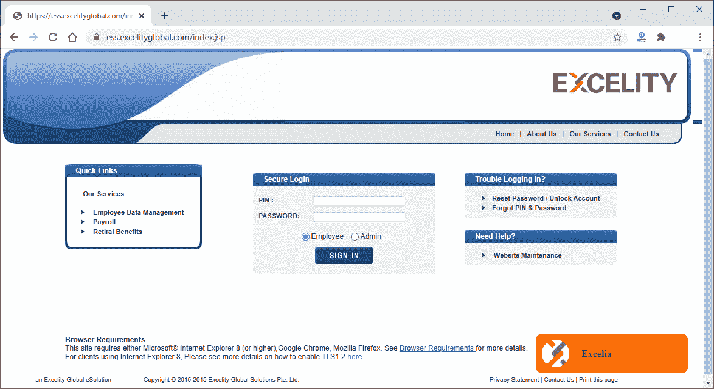
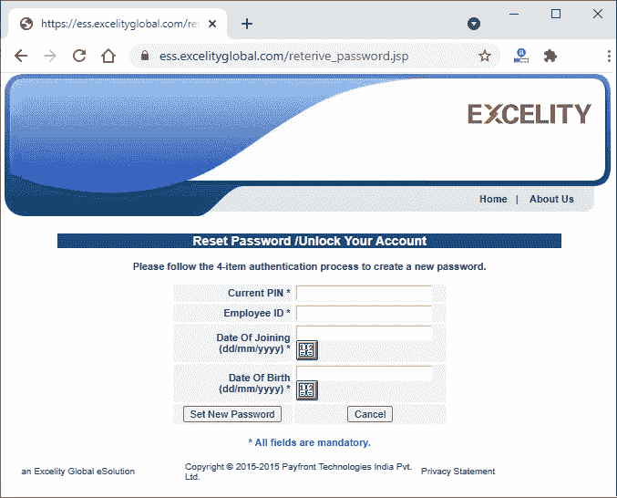
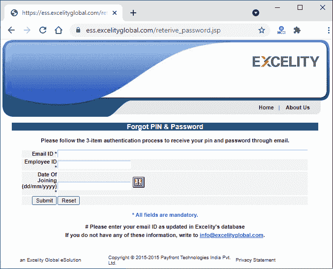

# 卓越登录

> 原文:[https://www.javatpoint.com/excelity-login](https://www.javatpoint.com/excelity-login)

卓越是员工自助服务的在线门户。可以使用唯一的个人识别码和密码进行访问，但您必须是注册用户。通过自动化使用它的各种功能，它减少了管理的人力。

卓越是一个运行在网络上的**云 HCM(人力资本管理)解决方案**。它帮助组织通过 It 管理和操作所有员工数据。卓越性帮助用户使工作变得简单方便。

在这篇关于卓越门户网站的教程中，我们将给出关于卓越的最佳信息。我们将尝试简要介绍这个卓越门户网站的每一个细节，这有助于您轻松理解和使用它。

## 关于卓越全球

卓越全球是亚洲最大的 HCM(人力资本管理)服务提供商之一，与 500 多个客户合作。一些卓越的全球客户是 NASSCOM，福布斯，Adobe，QBE，优步和更多。其薪资发放合作伙伴分布在多个国家，如印度、中国、新加坡、马来西亚和菲律宾。

知道 excelsibility 现在是全球、印度和亚太地区最大的薪资服务提供商后，您一定很感激。它已被任命为薪资和福利外包合作伙伴。

卓越全球提供最新的 HRMS 流程。它是该地区领先的人力资源外包服务合作伙伴。卓越拥有 22 年左右的经验，其**总部**位于新加坡**。**

## 卓越提供的服务

卓越为用户提供以下服务。注册用户可以享受这些服务的好处。

1.  员工数据管理
2.  工资单
3.  退休福利

以下是这些服务的详细信息。

### 员工数据管理

通过使用这项卓越服务，您可以管理**员工的个人信息、时间和出勤情况、休假管理**(如加班和排班)以及您的员工的**薪酬详情**。几乎所有员工的细节。

### 工资单

通过工资单服务，您可以操作员工的工资单详细信息。工资明细，如-

**薪资数据库管理、薪资相关流程、年终活动、零到毛和毛到净处理、公司特定和合规报告、**等等。

以上所有这些都是薪资系统下的必需任务。

### 退休福利

卓越全球还使其用户能够管理员工的合理福利。再审福利通常包括**公积金、退职金、退休金管理。**

通过卓越管理的合理利益是-

*   数据库管理员
*   投资
*   记录保持
*   法规遵从性
*   会计和审计便利化
*   税收和交易处理

## 卓越的浏览器支持

*   卓越门户网站需要运行最新的浏览器。浏览器可以是 Internet Explorer(IE 8 版或更高版本)、谷歌 Chrome 或 Mozilla Firefox
*   当启用 128 SSL 加密、JavaScript 和 cookies 时，encryption 的效果最好。

## 使用 Excellence 的优势

卓越用户在使用卓越时将获得以下优势-

1.  专有技术
2.  移动辅助功能
3.  账户管理和治理
4.  整合报告和分析

## 通过卓越来加快速度

卓越通过自动化和外包工作来帮助用户加快速度。它提供**卓越云解决方案、卓越托管服务、**和**卓越 HCM 和薪资服务。**

### 卓越云解决方案- Ezpayroll

如果您担心薪资管理会消耗您所有的时间，请将您的人力资源从战略职能中解放出来，并在 Exception 的帮助下自动化薪资服务。

### 卓越管理服务-外包

如果合规性成为一个问题，可以通过外包工作进行管理。合规和工资单可以通过遵守特定国家/地区的法规来操作。

### 卓越 HCM 和薪资服务-简化

最后但同样重要的是，卓越 HCM 和薪资服务。员工的数据不是那么容易有效管理和失控的。优秀也让你变得容易。优秀可以简化数据。

代表您，卓越门户网站将管理不需要人工专业知识的组织员工的所有数据。从雇佣到退休，数字化运营，等等。

## 如何使用卓越登录

要登录 Excellence，首先你要注册自己。一旦您注册，您就可以使用 Exception 软件提供的所有服务。

exception 使两个平台可以用它登录。

*   作为员工
*   作为管理员

员工和管理员都有不同的职责和工作环境。除此之外，您还可以使用用户名和密码登录到 exception global。来看看 Excellence 的登录界面-

## 创建“卓越”帐户时出现问题

需要注意的一点是，用户必须是他们的员工才能使用 Excelsibility 软件。只有这样你才能登录这个软件。这意味着你应该成为这个组织的一员。不属于该组织的人员无法创建帐户并登录到该帐户。

您可以使用公司提供的凭据从任何地方访问它。

但是，如果用户丢失了凭据，exception global 允许恢复用户标识、个人识别码和密码。但是密码发送到注册邮件 id。

## 卓越的家庭界面

这是 excelsibility 的主界面，它还包含一些信息以及登录选项卡。使用此链接([https://ess.excelityglobal.com/](https://ess.excelityglobal.com/))，您可以访问卓越门户网站。

在这里，通过点击**登录**按钮，您可以使用您的凭证登录到卓越门户网站。登录后，您必须同意&条件中的条件。

这是卓越的登录界面。

## 重置密码/解锁帐户

卓越用户可以重置密码或解锁帐户。这是它的界面。

在这 4 个给定字段中输入以下所需信息，并重置密码。所有都是必填字段。

## 忘记个人识别码和密码

卓越用户还可以通过输入三个经过身份验证的详细信息来重置他们的个人识别码和密码。

您将通过注册的电子邮件 id 获得您的个人识别码和密码。

更多详情，请点击此处[https://www.excelityglobal.com/](https://www.excelityglobal.com/)。

* * *