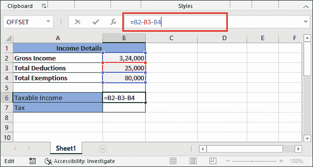
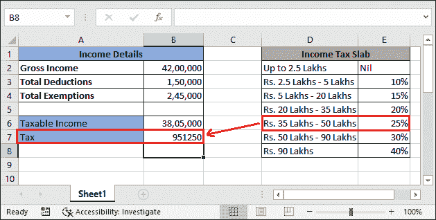

# Excel 中的所得税计算公式

> 原文：<https://www.javatpoint.com/income-tax-calculating-formula-in-excel>

首先，你需要知道——在某些地区，所得税是由你的公司会计从你的收入中扣除的。反之，有些地区需要自己计算所得税。因此，本教程将帮助两个用户在 Excel 中计算所得税。

您可以将收入、支出和支出的所有详细信息保存在 Excel 工作表中。从这里，您可以轻松地根据存储的数据计算所得税。我们将向您展示计算所得税的两种方法。

1.  计算应纳税收入和所得税
2.  使用收入板计算应纳税收入和所得税

Excel 提供了其他使用 Excel 内置函数计算所得税的解决方案，即-

*   使用综合框架或嵌套综合框架计算所得税
*   使用 VLOOKUP 函数计算所得税

我们将逐一描述每种方法。

## 什么是所得税？

**所得税**是中央政府对你在财政年度内取得的收入所征收的税。本财年从每年的**4 月 1 日**开始，至**3 月 31 日**结束。

所得税是对个人或企业征收的直接税。个人收入或企业利润。是[https://incometaxindia.gov.in/](https://incometaxindia.gov.in/Pages/default.aspx)所得税官网。在 Excel 中，计算所得税需要一个冗长的公式。这是一个有点棘手和冗长的计算。

## 总收入和应纳税收入

通常，总收入和应税收入都是不同的。然而，有时也可能是一样的。为此，了解什么是总收入和应税收入。

总收入是来自所有收入来源的收入。例如，工资、房租、外籍家政工人等等。而应税收入是通过排除免税和扣除从总收入中提取的。

#### 注:如果没有免税和扣减，总收入将是应纳税收入。

## 计算所得税前的先决条件

在你开始计算你的收入所得税之前，用户必须知道所有与所得税相关的重要条款。所以，他/她可以正确计算。

1.  要计算所得税，用户必须知道**最新的所得税板。**
2.  此外，用户还应该知道对收入征收的税率。
3.  缴纳所得税的最后日期。
4.  您可以从官方所得税网站自行在线缴纳税款，也可以到所得税办公室缴纳。
5.  总收入来自所有的收入来源。
6.  没有免税和扣除，那么总收入就是应税收入。
7.  人们也应该意识到教育税。

## 计算所得税和应税收入

首先，我们将向您展示如何从总收入中提取应税收入，然后计算应税收入的所得税。请参见获取应税收入和所得税的步骤。不要忘记定义适用于收入的税率。

计算所得税的方法很简单，也很容易理解。

**第一步:**打开包含某人收入明细的 Excel 工作表。我们有这个收入数据集:


**第二步:**由于我们要计算应纳税所得额和税额。因此，创建两行:一行用于应税价值，另一行用于税收。


**第三步:**选择要放置计算结果的单元格，**从总收入中减去费用**(减免)**。**

在公式栏内写公式 **=B2-B3-B4** ，按**回车**键。



**第四步:**现在从总收入中提取应纳税所得额，为 219000。

**“应纳税所得额是我们征税的基础。”**


**“收入在 250，000 以下的按 5%征税。”**由于应税价值在 1.5 至 2.5 十万英镑之间，因此 5%将适用于收入。

**第五步:**现在，计算提取应税价值的税额。在单元格 B7 中应用以下公式: **=B6*5/100**


**第六步:**按**进入**键，得到按应纳税所得额计算的所得税值。请注意，退回的税值为 10，950。


**结论:**现在对上述数据的汇总是——对于这个收入，这个用户需要缴纳 10950 卢比作为所得税。

## 用收入平板计算所得税

现在，我们将展示另一个用不同所得税计算所得税的例子。我们有收入平板应用于收入数据。

这些收入板由政府为不同的收入范围定义。根据这些平板，税率会有所变化和计算。让我们看一个例子和这种类型的税收计算的详细步骤。

**第一步:**我们有这个由政府提供的某人收入和收入板的数据集。


现在，我们将根据这些平板计算所得税。与上述方法类似，我们将计算应税收入和税收。

#### 注:直到 250 万英镑的收入，税收为零。

**第 2 步:**为此，我们将定义两行:一行为**应税价值**，另一行为**税。**


**第三步:**首先，我们需要提取税收将要计算的应税价值。因此，我们将从总额中减去免税和扣除额。

为此，在公式栏内写下公式 **=B2-B3-B4** ，按下**回车**键。


不要忘记选择相应的单元格来放置计算结果。

**第四步:**现在从毛收入中提取应纳税所得额，为 38，050，000。

**“应纳税所得额是我们征税的基础。”**


**“这次定义了不同的税板(见 Excel 表格右侧)来计算税款。”**由于应税价值介于 350 万至 500 万英镑(第五块石板)之间。因此，税款将一直计算到第五块，即 10%、15%、20%，然后是收入的 25%。

**收入板计算**

这绝对会是通过所得税计算所得税最简单的方法。

**第五步:**找出每块板到目标板的总税额。请记住-税收是 NILL，直到 250 万英镑的收入。因此，税收将根据 250 万英镑以上的收入计算。


**第 6 步:**现在，我们将使用公式计算这里定义的每个平板的税收。

=应纳税所得额*税率/100

**第七步:**见第一块板的计算。通过更改公式中的应纳税额和税率，其他三项将得到相同的计算结果。


**第八步:**按回车键，得到 250 万以上 10%税的结果。见下文:


**步骤 9:** 同样，通过更改公式中的应纳税额和税率，计算所有其他已定义行的税额。请看下面的截图:


**第 10 步:**最后一步是——通过不同的板块将提取的税款相加，得到完税价格，需要纳税人缴纳。为了我们的数据-

=B9+B10+B11+B12


**第 8 步:**按**进入**按钮，获得有收入平板的应纳税所得额的最终税额，共计 6，26250 卢比。


**收入板计算解释**

在一些教程中，你会看到他们只直接应用了根据 slab 的公式来计算所得税:**应纳税所得额*25/100** 因为价值在于第五收入 slab。

**例如-**


**第六步:**按**进入**键，得到按应纳税所得额计算的所得税值。请注意，返回的税值是 9，51，125。



此外，这种计算是错误的，因为每个收入都有不同的税率。因此，用户必须单独计算每个平板的税额，直到应税价值所在的平板。

**结论:**最终，给定数据(应税收入和税板)的汇总为——对于该收入，该用户需要缴纳 6，26250 卢比，而不是 9，51250 卢比作为所得税。

## 使用综合框架或嵌套综合框架计算所得税

IF 函数还可以帮助 Excel 用户像上面一样在一次计算中计算税收。所得税的公式变得很长，但提供的结果很快。让我们看一个使用 IF 函数计算所得税的例子。

**中频功能语法**

```

=IF(condition, [value_if_true], [value_if_true])

```

我们有以下一些人的收入数据。我们将使用嵌套的 IF (IF 内部的 IF)计算他们的所得税。


我们准备了这张 Excel 工作表来计算不同收入范围的所得税。所有这些给定的收入都是应税收入。

**计算玛蒂娜工资税:38 万**

**第一步:**要计算玛蒂娜的收入税，选择 C10 单元格保存结果，并在公式栏中写下以下 IF 公式。

=IF(B10 <b2 if="" div="">要查看如何创建该公式的说明，请单击此处。(使用嵌套 IF 解释所得税公式)


**第二步:**现在，点击回车键，查看玛蒂娜工资金额的计算税额的返回值。请注意**税为零。**


现在，我们将计算哈里工资的税收，他的工资金额为 1700 万。您不需要再次创建整个公式。通过修改前面公式中的一个变化，您可以计算其他人的收入税。

#### 注:税板应相同。

**计算哈里的工资税:17 拉克**

**第一步:**要计算玛蒂娜的收入税，选择 C11 单元格保存结果，只需将 B10 单元格编号替换为 B11，即可写出与上面相同的 IF 公式。

=IF(B11 <b2 if="">

**第二步:**点击回车键，得到为哈利工资计算的税款。请注意，170 万卢比的收入相当于哈里王子工资的 180，000 卢比。


现在，雅各布和迈沙的税收计算也将遵循同样的步骤。对公式进行修改，得到计算结果。然而，我们也将提供公式。

**计算雅各布的工资税:950000**

```

=IF(B12
```

**迈莎工资计税:3500 万**

```

=IF(B13
```

计算所有给定员工数据的税后，查看最终工作表。


### 适用教育税

所有收入的税款都已成功计算。现在，下一步是适用教育税(cess)，即 3%。这项税收将计入所得税(从收入中征收)。如果某人的收入所得税为“无”，默认情况下，教育进程也将为 0。但是，您也可以使用公式进行计算。

这一次，它不需要冗长的计算。在中频功能中只需要检查两个条件。请遵循以下步骤:

**第一步:**选择 D10 单元格保存返回的结果，写下下面的公式，先对玛蒂娜的所得税值(C10 单元格)计算教育税。

【T10】= if(C10 = " nil "，0.c10 * 3%)


**第二步:**点击回车键，看到玛蒂娜的所得税教育税为 0。


我们将向您展示一个记录，即哈里的所得税。

**第三步:**选择 D11 单元格保存哈利的教育税结果，写出以下公式计算哈利所得税的教育税(C11 单元格)。

【T10】= if(c11 = " nil "，0.c11 * 3%)


**第四步:**点击**进入**键，获得哈利纳税值的教育进程。看到了吗-已经退回 5400 了。


雅各布所得税的教育税:1，80000 英镑

```

=IF(C12="Nil", 0, C12*3%)

```

Mysha 所得税的教育税:12，70，000

```

=IF(C13="Nil", 0, C13*3%)

```

**第 5 步:**在所有数据上找到教育税后，查看该工作表。


**第六步:**将所得税、教育税相加，结果存入 E 栏。

请注意，玛蒂娜、哈里、雅各布和米沙的总收入为 65，30，000 英镑，总税收为 15，50，150 英镑。


所以，这些是计算某人收入所得税的完整步骤。同样，您可以计算另一个数据集。

### 使用嵌套 IF 解释所得税公式

我们已经创建了一个使用 IF 函数计算所得税的公式。虽然它很长，但是您可以对工作表中给出的所有数据使用相同的数据，只需做一个小的更改。

```

=IF(B11
```

请看解释。这将有助于您理解这个公式是如何创建的。

**B11 <b2: strong="">检查条件 B11 <b2 finds="">为真、</b2>T5</b2:>**税收为零；否则将检查下一个给定的条件。B11

**B11<= B3:**定义如果此条件为**真，**首先从薪资金额中减去板坯金额，然后乘以定义的税率百分比，即 10%。如果条件发现**为假，**我们将进入下一个嵌套的 If 条件检查。

**B11 < =B4:** 是指如果该条件(B11 < =B4)为**真，**第二个板坯金额将从工资金额中减去，然后乘以定义的税率百分比，即 20%。此外，之前应纳税额的 10%也会增加这一金额。

如果条件发现为假，我们将移到 else 部分，因为它是最后一块石板。现在，第三个平板金额将从给定的工资金额中提取，最终税率(30%)税将应用于剩余金额。除此之外，之前应税账户的 10%+20%(即 2，80，000 英镑)也将对此进行补充。

## 使用 VLOOKUP 功能计算所得税

以上计算也可以使用 Excel 的 VLOOKUP 功能进行。所得税可以用 Excel 的 VLOOKUP 函数来计算，但是有点冗长和混乱。

使用 VLOOKUP 的所得税公式不是简单的公式；你需要进行一个冗长的计算。可以在 Excel 中使用 VLOOKUP 对某一项收入计算所得税。

### VLOOKUP 的语法

要理解 VLOOKUP 公式，应该知道 VLOOKUP()函数的语法。

```

=VLOOKUP(lookup_value, array_range, column_index, [range_lookup])

```

### 使用 VLOOKUP 计算所得税的步骤

现在，按照以下步骤操作:

**步骤 1:** 我们使用与嵌套 IF 示例中使用的数据集相同的数据集，并且计算出的所得税也仍然可用。

我们将只计算 **Jacobe** 工资的所得税，以验证并显示 VLOOKUP()函数返回的税值将与 IF()函数相同。


**第二步:**现在，选择一个单元格来保存结果，并在公式栏内写入以下 LOOKUP 公式。

=VLOOKUP(B12，A2:C5，3，TRUE)+(B12-VLOOKUP(B12，A2:C5，1，TRUE))*VLOOKUP(B12，A2:C5，3，TRUE)


**第三步:**点击**输入**键，查看通过 VLOOKUP 公式返回的税额与使用嵌套 IF 函数计算的税额相同，即 55，


因此，VLOOKUP 公式是这样工作的。希望你在 Excel 中得到计算所得税的不同方法。

* * *</b2></b2>