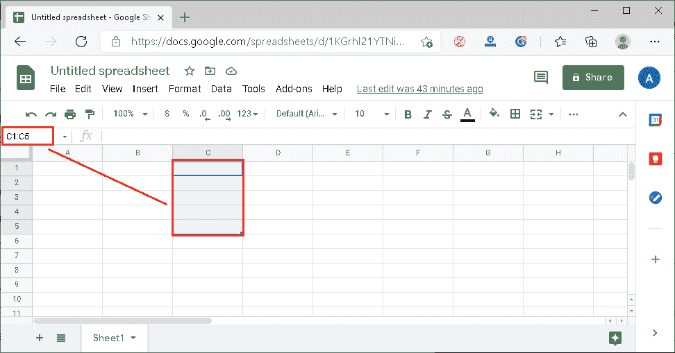
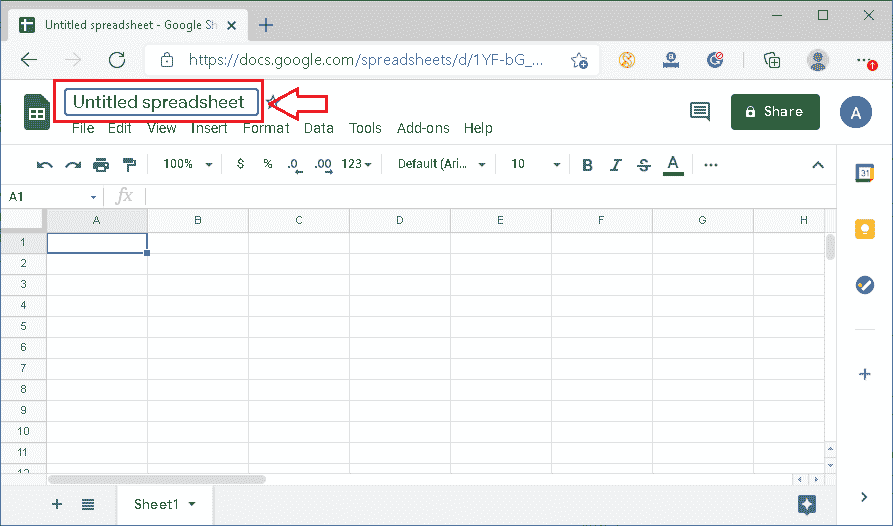

# 谷歌电子表格

> 原文:[https://www.javatpoint.com/google-excel-spreadsheet](https://www.javatpoint.com/google-excel-spreadsheet)

说到组织财务数据，谷歌表单是全球使用的流行工具之一。这是一个由谷歌开发的强大的电子表格软件工具。该工具几乎与微软 Excel 相似，但它并不提供 Excel 中存在的所有高级功能。尽管如此，谷歌表单越来越受欢迎，被大多数人用来管理日常任务。有些人错误地称之为“谷歌电子表格”或“T2 电子表格”需要学习这个强大工具的基本概念，并有信心在上面工作。

在本文中，我们讨论了谷歌工作表(被错误地称为“谷歌 Excel 电子表格”)的概念，这将有助于我们熟悉它，并作为初学者开始工作。

## 什么是谷歌表单？

谷歌表单是一个免费的、基于云的电子表格应用程序。这意味着我们可以像普通网页一样在网络浏览器中打开它，并拥有电子表格应用程序的所有功能，以进行强大的数据分析。它允许我们存储和组织不同类型的信息，很像微软的 Excel。

大多数人认为电子表格只适合某些人处理复杂的数字和数据。然而，我们可以将电子表格软件用于各种日常任务。例如，我们可以使用谷歌表单来管理预算、规划花园或创建发票，或者我们能想到的任何其他东西；电子表格是组织信息的好方法。

下图显示了空白谷歌表单的界面，这通常是我们创建新电子表格时的第一个屏幕:

## 为什么要用谷歌工作表而不是 Excel？

虽然谷歌工作表相对较新，缺乏许多 Excel 的高级功能，但它有一些优秀的功能，让人们有理由在像 Excel 这样的电子表格软件上使用它。以下是谷歌表单的一些基本功能:

**免费使用:**与 excel 不同，我们不需要为 Google sheets 购买任何软件许可证。它完全免费供个人使用。此外，我们不需要聘请信息技术专家来配置、部署和维护该工具。

**轻松协作:**使用 Google Sheets 共享文件很简单。此外，它允许多个用户同时处理同一个共享文件。用户还可以通过工具本身相互聊天。拥有管理员权限的人甚至可以用他们的名字单独检查用户所做的编辑。

**云支持:**由于 Google sheets 是一个基于云的工具，我们可以从任何设备和任何地方编辑、查看或与其他人共享文件。此外，它为每个人提供了一个“单一版本”，以消除协作用户之间的任何版本控制问题。

**无存储问题:**与 excel 不同，我们不需要在系统上安装 Google sheets。它可以直接使用网络浏览器。因此，不需要像安装其他常规软件或程序那样在系统上有足够的空闲存储空间。

**轻松导入数据:**在 Google sheets 中导入数据比其他任何软件或工具都要容易得多。我们可以很容易地从其他谷歌服务、网络，甚至系统的存储中获取信息。

**脚本支持:**在谷歌表单中使用脚本很简单。我们可以毫无困难地利用基于 Java 的谷歌应用程序脚本并连接到应用程序接口。

**Excel 支持:**由于 Excel 仍然被广泛使用，Google sheets 允许我们通过它打开 Excel 文件，并将其转换为 Google sheets，反之亦然。

## 谷歌表单基础:理解谷歌表单用户界面

在我们讨论谷歌表单的一些基本工作步骤之前，我们必须了解一些关键术语，并熟悉谷歌表单界面。然而，它们几乎是我们在其他电子表格软件中找到的类似术语，包括 Excel。

让我们简单了解一下:

**单元格:**该单元格是指任何电子表格中的单个数据点，由矩形框表示。它是一行和一列的交集。每个电子表格包含几个单元格，因此每个单元格都有一个唯一的地址。单元格的地址由代表列的字母和代表行的数字表示。

例如，下图显示了谷歌工作表中的一个单元格。这里，单元格是行 1 和列 a 的交集。因此，它由单元格 A1 表示。

**列:**列是指电子表格中垂直(从上到下)放置的一组单元格。每列由一个唯一的字母表示，从字母 a 开始。

在下图中，在谷歌表单中选择了列 C:

**行:**行是指电子表格中水平(从左到右)放置的一组单元格。每行由一个唯一的数字表示，从数字 1 开始。

在下图中，在谷歌表单中选择了第 2 行:

**范围:**范围是指电子表格中单元格的特定选择。

在下图中，从列 c 中的数字 1 到数字 5 中选择行。该范围由 C1:C5 表示，显示在名称框中。

**电子表格标题:**标题是指特定电子表格的文件名。默认情况下，当我们创建新的电子表格时，会显示名称“未命名的电子表格”。

电子表格标题显示在电子表格的顶部，如下图所示:

**工具栏菜单:**一个工具栏菜单包含的选项卡很少，每个选项卡还包含多个选项。特别是，工具栏菜单为我们提供了以各种方式编辑和修改电子表格的选项。我们可以点击任何菜单标签，从列表中选择所需的命令。

工具栏菜单位于谷歌工作表的顶部，电子表格标题下:

谷歌工作表会自动将每个更改保存到现有文件中。此外，它在工具栏菜单旁边显示一个通知，通知我们上次更改保存在电子表格中的时间。除此之外，工具栏菜单前给出的图标可用于导航回工作表主页。

**快捷工具栏:**快捷工具栏包含一些用于格式化电子表格中数据的快速选项，例如字体样式、字体大小、文本对齐方式、文本颜色等。

工具栏菜单下方有一个快捷工具栏，如下图所示:

**公式栏:**公式栏是允许我们输入/编辑电子表格中特定单元格的数据、函数和公式的字段。当我们选择任何包含公式的单元格时，公式栏也会显示适用于相应单元格的公式。

公式栏位于名称框旁边，由符号“fx”表示，如下图所示:

**工作表工具栏:**工作表工具栏帮助我们管理工作簿中的工作表。我们可以使用这个工具栏插入、重命名、删除工作表。它位于窗口的底部，如下图所示:

**函数:**函数是指计算值、操作数据等的内置电子表格函数。在谷歌表单中，我们可以通过导航到**插入>功能来访问这些功能。**

**公式:**公式是指用于通过计算特定值来获得所需结果的函数、单元格、范围和运算符的组合。

**工作表/工作表:**工作表是指由若干行和列组成的单页。这是电子表格的主要工作区域。

**电子表格/工作簿:**电子表格/工作簿是指包含一个或多个数据工作表的文档/文件。谷歌电子表格通常保存在谷歌驱动器上。但是，我们可以将特定文件下载到我们的设备上以供离线使用。

## 使用谷歌表单

一旦我们熟悉了谷歌表单的基本术语，我们就必须学会如何使用谷歌表单。让我们从基本的事情开始:

### 从谷歌表单开始

有几种方法可以从谷歌表单开始。然而，最简单的方法是使用他们的官方网站。以下是轻松启动谷歌表单的步骤:

*   首先，我们需要启动任何网络浏览器，比如谷歌 Chrome、微软 Edge、火狐等。之后，我们需要导航到以下链接:
    链接:[https://docs.google.com/spreadsheets/](https://docs.google.com/spreadsheets/u/0/)
    T4】
*   接下来，我们必须使用谷歌帐户登录谷歌表单。如果我们已经登录，那么我们将被直接重定向到谷歌表单的主页。主页如下:
    

该页面还显示一些默认模板。

### 创建新工作表

我们可以从谷歌工作表主页创建一个新的电子表格。我们可以点击**加号(+)** 或者带有文字**【空白】**的图块来创建一个空白工作表。大多数人使用它从头开始，并开始处理他们的数据和格式。

此外，我们还可以选择任何包含一些很好的格式和样本数据的默认模板。Google sheets 提供了广泛的模板，我们可以相应地从模板库中进行选择。

### 命名/重命名图纸

创建新图纸后，为其指定新名称是最基本的步骤。为此，我们需要单击窗口顶部显示“无标题电子表格”的框，并将其更改为任何所需的名称。

此外，我们可以通过导航到**文件>重命名该表。**

一旦我们输入所需的工作表名称，它将被自动保存。

### 打开现有工作表

如果我们的设备上有一个 excel 文件，并且想要使用这个现有的文件，我们需要首先在 Google sheets 上导入/打开它。我们需要导航到**文件>打开或文件>导入。**

之后，我们必须点击“上传”按钮，并使用文件资源管理器在设备上找到文件。一旦我们点击一个特定的文件，它就会在谷歌表单上打开。

### 向图纸添加数据

打开空白工作表后，会显示编辑窗口，我们可以在其中插入所需的数据。我们必须选择所需的单元格，并键入要插入的内容。在选定的单元格中键入内容后，我们必须按回车键。这样，我们可以将数据插入到所有需要的单元格中。

单元格内容显示在单元格和公式栏中。

#### 注意:我们也可以从其他程序中复制、剪切、粘贴或拖放数据到谷歌表单中。此外，我们可以从其他支持的电子表格程序中导入数据。

### 删除工作表中的数据

我们可以删除谷歌表单中任何单元格的数据/内容。首先，我们需要选择特定的单元格，然后按键盘上的**【删除】**或**【退格】**按钮。这将删除单元格内容。

除此之外，如果我们想删除最近添加的数据，我们可以使用 Ctrl + Z 快捷方式撤消更改。必须注意的是，它只撤销了我们执行的最后一步。

### 格式化工作表中的数据

一旦我们的工作表中有了内容，我们可能需要调整一些格式。大多数格式可以直接从快捷工具栏控制。

如果我们想广泛地格式化我们的数据，我们可以从**格式**选项卡访问高级格式化选项。

### 在工作表中使用函数

像其他电子表格程序一样，谷歌工作表也允许我们在空单元格中使用等号(=)并获得我们想要使用的函数。

假设我们在单元格 A1 输入 4，在单元格 B1 输入 5。接下来，我们在**细胞 C1 中输入 **=SUM(A1，B2)** 。**通过这样做，单元格 **C1 显示单元格 A1 和 B1 中给出的值的总和。**

这样，我们可以在谷歌表单中插入任何想要的功能。如果我们不记得任何特定的函数，我们可以通过导航到插入>函数来访问支持的函数列表。

### 打印纸张

如果我们想在谷歌表单中打印我们的表单，我们可以直接从网络浏览器中发出打印命令。我们不需要将表下载到本地存储中。

要打印，我们必须导航到**文件>打印。**

我们必须在下一个屏幕上选择打印首选项，如页面设置、页面方向、纸张大小、布局、默认打印机等。完成设置后，我们需要点击“打印”按钮。

这将相应地生成纸张的打印。

### 保存工作表

如上所述，我们在谷歌工作表中所做的所有更改都会自动保存到现有文件中，并且工作表文件/电子表格会保存在谷歌驱动器上。但是，当我们想要将任何特定文件保存到我们的设备时，我们必须遵循下面给出的步骤:

*   首先，我们必须在谷歌表单中打开所需的电子表格。之后，我们需要导航到**文件>下载。**
    
*   在下一个屏幕上，我们需要选择想要保存电子表格的文件格式。
    
*   一旦我们选择了所需的格式，文件将开始下载。根据下载设置，浏览器有时可能会要求我们保存或打开特定文件。我们可以相应地选择想要的选项。
    

#### 注意:默认情况下，我们创建或使用的任何工作表都保存在谷歌驱动器上。因此，我们也可以从那里启动一个特定的表。

## 谷歌工作表快捷键

像 Excel 一样，Google Sheets 也支持快捷方式，允许用户快速执行特定任务。通过使用快捷方式，用户通常会省去相应工作流程的两三个步骤。

下表显示了 Google Sheets 最常用的快捷键，包括相应的操作:

| 快捷键 | 行动 |
| 法乐四联症 | 它用于重复我们执行的最后一个动作。 |
| ALT + I + R | 它用于在选定单元格上方插入一行。 |
| ALT + I + W | 它用于在选定单元格的下方插入一行。 |
| ALT + I + C | 它用于在选定单元格的左侧插入一列。 |
| ALT + I + G | 它用于在选定单元格的右侧插入一列。 |
| ALT + E + D | 它用于删除选定的行。 |
| ALT + E + E | 它用于删除选定的列。 |
| Shift +空格键 | 它用于选择整行。 |
| Ctrl +空格键 | 它用于选择整个列。 |
| Ctrl + Shift + V | 它仅用于粘贴剪贴板中的值。 |
| 控制 + Alt + V | 它仅用于粘贴剪贴板中的格式。 |
| 控制 + F | 它用于从工作表中查找任何特定值。 |
| 控制 + H | 它用于启动“查找和替换”窗口，该窗口允许我们查找任何特定值并将其替换为另一个值。 |
| Shift + F11 | 它用于添加新工作表。 |
| 控制 + K | 它用于插入指向选定单元格的链接。 |

在上表中，可以看到大多数键盘快捷键对于 Excel 来说也是常见的。以上所有快捷方式在使用谷歌表单时，都与 PC 上的 Chrome 兼容。但是，它们也可以在 PC 上的其他网络浏览器上正常工作。

#### 注意:要使用功能键(F1，F2 … F12)，我们必须首先通过按键盘上的“Fn”按钮来激活它们。某些键盘可能不需要这样做。

## 谷歌工作表扩展

由于谷歌工作表目前是微软 Excel 的主要竞争对手之一，它几乎为 Excel 中所有流行的文件格式提供了支持。但是 Excel 的某些功能可能并不总是适用于谷歌表单。

以下是 Google sheets 支持的最常见的文件扩展名:

| 延长 | 文件格式 |
| 战斗支援车 | 逗号分隔值 |
| 文本文件（textfile） | 文本文件 |
| TSV | 制表符分隔的值 |
| 拉环 | 制表符分隔的文本或数据文件 |
| 超文本标记语言 | 超文本标记语言文件 |
| 电子表格文档 | 微软 Excel 的工作簿文件(97-2003) |
| 文件格式 | Excel 工作簿 |
| XLSM(消歧义) | Excel 启用宏的工作簿 |
| 模板 | Excel 模板文件(97-2003) |
| XLTM | Excel 启用宏的模板 |
| XLTX(数据传输协议) | Excel 模板 |
| 过量毒品 | 打开文档电子表格 |

上述任何一种文件类型都可以很容易地导入到谷歌表单中。但是谷歌表单只允许我们下载 **XLSX、ODS、PDF、HTML、CSV** 、 **TSV 格式**的文件。

* * *