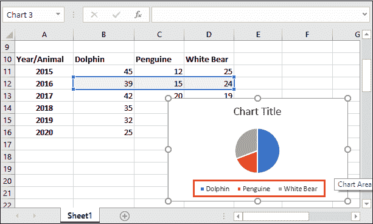
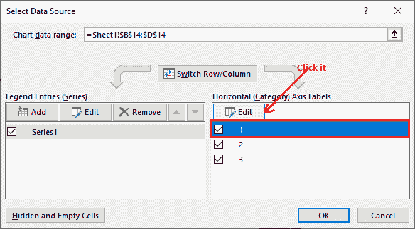

# 如何在 excel 中制作饼图

> 原文：<https://www.javatpoint.com/how-to-make-pie-charts-in-excel>

饼图是 Excel 中表示数据的一种图形化方式。Excel 提供各种饼图。Excel 用户可以使用其中的任何一种来表示他们的数据。因此，数据变得更容易理解和获得。您可以在**插入**选项卡中获得饼图。

通过使用饼图表示，可以很容易地理解数据增长。基本上，饼图显示每个值(每个单元格数据)对总数据(饼图)的贡献。在本章中，我们将描述向 Excel 工作表中添加饼图的方法。

### 饼图的类型

Excel 通常会提供**两种饼图**以及**甜甜圈**饼图。

*   2D 饼图
*   三维饼图

用户可以使用 2D 或三维饼图，无论他/她想要什么。饼图用于显示整体的比例(份额)。

## 饼图包含什么？

饼图通常包含三个部分:**图表标题、图表和图例条目。**每个组件表示饼图的一部分，其中三个组件同样有用。只有看到这三个信息的图表，你才能分析数据。

**图表标题**

图表标题包含饼图的标题，它定义了图表的用途。您可以根据包含信息的图表提供图表标题。

**图形**

图形是一种饼图，包含多张幻灯片，通过图示显示信息。每个切片都用特定的颜色来表示数据。

**传奇词条**

图例条目是指通过饼图选择来表示信息的列。

让我们看看饼图的样子-

这是一个包含 2018 年动物数量报告的 2D 饼图的例子。这里，蓝色表示海豚，橙色表示企鹅，灰色表示白熊。

## 添加 2D 饼图

用 Excel 数据添加饼图，使数据更易识别。通过一些简单的步骤，您可以添加与您的数据相关的饼图。在本例中，我们将为数据向 Excel 工作表添加一个 2D 饼图。

**第一步:**我们有一个每年三种动物(海豚、企鹅和白熊)数量的小记录。我们将向您展示为该数据记录添加饼图的步骤。

**第二步:**首先，用 Shift 和箭头键选择三只动物的年份记录，如 2016 年。

**步骤 3:** 转到菜单栏内的插入选项卡，导航到**插入馅饼和甜甜圈**图表选项(在图表部分)。

**第四步:**点击饼图，你会在这里看到 2D、3D 饼图和甜甜圈图。从三个 2D 图表中选择一个，将其添加到 Excel 工作表中。

我们选择了第一个。

**第五步:**点击**图表标题**，可在此编辑图表标题。然后，根据图表数据给出一个新标题。

#### 注意:将图表添加到 Excel 后，设计选项卡将自动添加到 Excel 菜单栏。

单击图表标题编辑文本，移除标题。

在图表标题中添加一个新标题。

### 更改饼图中图例条目的名称

您会看到名为 1、2、3 的图例条目，分别带有特定的颜色蓝色、橙色和灰色。您可以根据自己的饼图数据进行更改。这些图例项表示其中一个值。

**第 6 步:**选择您添加的饼图，导航至**设计**选项卡，您将看到选择数据选项。

**第 7 步:**点击此**选择数据**选项，将显示选择数据源面板。在此面板的右侧(水平轴标签)，您将看到名为 1、2、3 的条目。

**第八步:**首先，选择想要修改名称的图例项，点击**编辑**按钮。

**第 9 步:**在**轴标签范围**内提供新名称，点击**确定**按钮。

**第 10 步:**标签名称会立即改变，并反映在饼图上，如下图截图所示。

**第 11 步:**现在，再次选择下一个图例项行，点击**编辑**按钮，添加更多图例项名称。

**第 12 步:**您将在花括号内看到前一个条目的双引号。

**步骤 13:** 为饼图的图例条目提供其他列名，然后单击确定按钮。

**={“海豚”、“鹏鸟”、“白熊”}**

**第 14 步:**点击选择数据源面板中的**确定**按钮，保存更改。

**第 14 步:**图例条目名称更改后见饼图。

#### 注意:您可以通过单击“编辑”按钮来添加更多条目，并通过取消标记来删除现有条目。

您也可以更改饼图的颜色。

### 为什么在 Excel 中使用饼图？

*   饼图有助于同时通过图表显示大量信息。图表是在图形视图中显示价值的好方法。
*   它有助于快速分析数据。因此，对数据的即时分析使比较变得容易和快速。
*   除了饼图，有些图表还包含复杂的信息。因此，它不需要对图表和数据进行额外的解释。
*   有不同类型的饼图，如- 2D 或电子表格中的 3D，可以实现不同的视觉效果。

## 添加三维饼图

现在，我们将给出一个将三维饼图添加到 Excel 工作表中的数据示例。添加三维饼图的步骤与 2D 图几乎相同。

**第一步:**我们每年有三种动物(海豚、企鹅和白熊)种群的相同表记录。在这个记录中，我们将添加一个三维饼图。

**第二步:**选择三个动物记录中的任意一年，如 2018 年。请不要在其中包含年份单元格。

**步骤 3:** 转到菜单栏内的**插入**选项卡，导航到**插入馅饼和甜甜圈**图表选项(在图表部分)。

**第 4 步:**在这里，点击三维图表，将其添加到您的 Excel 工作表中。

三维形状的图表已添加到您的 Excel 工作表中。现在，相应地自定义图表标题和图例条目。

**第五步:**更改图表标题并提供一个新标题。

现在，从新添加的**设计**选项卡中编辑图例条目的名称。

**第 6 步:**选择图例项，点击**设计**标签内的**选择数据**。

**第 7 步:**在此选择第一个图例项(1)，点击**编辑**按钮。

**第 8 步:**在**轴标签名称**字段中提供所有三种动物的数据，点击**确定**按钮。

**={“海豚”、“鹏鸟”、“白熊”}**

**第 9 步:**查看三个图例项都已添加。点击**确定**按钮保存更改。

**第 10 步:【2018 年数据的 Excel 表中增加了 3D 自定义饼图。**

### 2D 或三维饼图

看看 2D 和三维饼图在结构上有何不同。

* * *