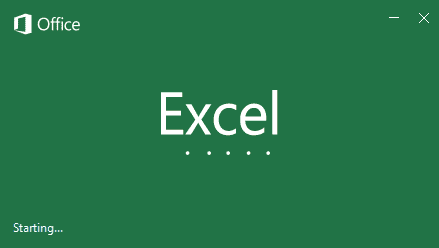
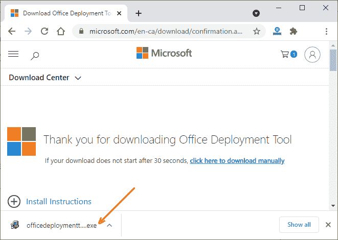

# Excel 下载

> 原文:[https://www.javatpoint.com/excel-download](https://www.javatpoint.com/excel-download)

Excel 是一款 **Microsoft Office 产品**，包含以表格形式存储数据的工作表。是付费产品，需要购买才能使用。微软提供 28 天的免费试用。稍后您必须支付订阅费用。

Excel 软件内置于微软办公套件中，还有其他几个软件，如微软 Word、微软 Powerpoint、微软 Access、Outlook 等。

现在网上有微软 Excel 的破解版。从那里你可以免费下载和使用它。本章将向您展示在计算机上下载 Excel 的两种方法。

**本章涵盖的主题**

本章将涵盖以下主题:

*   [什么是正版 MS Excel？](#genuine)
*   [什么是微软 Excel 的破解版？](#cracked-version)
*   在 Windows 下下载 MS Excel
*   [使用命令提示符](#using-command-prompt)下载安装 MS Office
*   [下载 MS 办公激活器](#Activator)
*   [在线使用 MS Excel】](#Use)
*   [购买 MS Excel 的订阅](#Purchase)

在此之前，先简单介绍一下 Excel 的付费订阅(正版 MS Excel)和破解版 MS Excel。

## 什么是正版 MS Excel？

一个正版的微软 Excel 软件当你付费订阅微软使用的时候叫做**正版的微软 Excel** 。您不能免费使用正版微软产品。你必须付费购买产品密钥才能激活。该产品密钥需要在安装微软办公软件时输入。

不过，微软也提供了 28 天的免费试用。之后，您可以购买产品密钥来激活微软办公套件。

#### 注意:所有带有产品密钥的微软产品在您付款时都是正版的。

该套餐可按月/年购买。以后你还得再购买。这意味着你必须每年付费才能使用原始产品。你可以从微软官方网站下载完整的微软办公套件。

## 什么是微软 Excel 的破解版？

在这个互联网时代，有几个网站允许免费下载微软 Excel。微软办公套件的破解版也可以在网上找到。从那里你可以免费下载和使用它，而无需支付任何费用。这些版本带有产品密钥或 Office 激活软件来激活软件。

微软办公软件有两种激活方式:

*   **通过在网上查找产品密钥**
*   **用 KMSPico 激活剂破解 MS Office**

您可以在互联网上搜索产品密钥并激活 Excel。除此之外，还有一种激活微软产品的方法，要么是 Windows，要么是 MS Office。名为 **KMSPico** 的软件(病毒软件)有助于破解微软产品激活，并允许免费使用。但以这种方式使用任何软件都是非法的。

现在，您将看到将 MS Excel 下载并安装到桌面的步骤。

## 在电脑上下载微软 Excel

下载之前，请从您的计算机上卸载以前版本的微软办公软件。然后，请参见以下步骤在 Windows 上下载并安装微软 Excel:

**步骤 1:** 在桌面上新建一个名为 **ODT** 的文件夹。前往 https://www.microsoft.com/en-ca/download/details.aspx?微软下载中心([id=49117](https://www.microsoft.com/en-ca/download/details.aspx?id=49117) )点击此处**下载**按钮。

**第二步:**等待几秒钟；Office 部署工具将被下载到您的系统中。

**步骤 3:** 转到您的下载文件夹，双击安装的 Office 部署工具(ODT)，运行该工具。

允许应用程序对您的系统进行更改。

**第 4 步:**勾选复选框接受微软许可的条款和条件，点击**继续**按钮。

**第 5 步:**选择您在上一步创建的 **ODT** 文件夹，点击**确定**。

**步骤 6:** 文件已经提取并存储在 **ODT** 文件夹中。现在点击**确定**。

**第七步:**进入包含一些文件的 **ODT** 文件夹(在你的桌面上)以及**setup.exe**文件。

**步骤 8:** 双击此**setup.exe**文件，将 MS Office 安装到您的系统中，并允许应用程序在您的系统中进行更改。

**第九步:** Office 正在做准备安装的事情。

**步骤 10:** 开始安装到您的系统。

当它完成时，您可以使用 Excel 而没有任何中断。以后 MS Office 停用时，使用 MS Office 激活器 **KMSPico** (下面讨论)。

### 使用命令提示符下载并安装微软办公软件

**第一步:**从给定的列表中选择一个要安装的 MS Office 软件。这些有英语版本和不同版本。

**办公标准 2019**

为 32 位计算机配置(https://app.box.com/s/2ffl43tf1g5x3plzyvfgjlo2glmo5n2b)

为 64 位计算机配置(https://app.box.com/s/1Furfhe8BFbkEhXn1xcYPr8jYAACNpfV7p)

**办公专业 Plus 2019**

为 32 位计算机配置(https://app.box.com/s/2ysrkgdbllqyftm4hpx41teujhh1yiip)

为 64 位计算机配置(https://app.box.com/s/joi9l6nebvbvqvkcyw502vmesvvivoiu)

**第二步:**当你点击其中一个链接时，一个配置文件(configuration.xml)会在你的网络浏览器上打开。

**步骤 3:** 点击右上角的**下载**按钮，在您的系统上下载该文件。

**步骤 4:** 您的配置文件将在几秒钟后下载。你在这里看到的弹出窗口，点击十字符号关闭它。

**步骤 5:** 现在，将下载的 configuration.xml 文件移动到我们在前面步骤中创建的 ODT 文件夹中。

**第六步:**点击 ODT 文件夹的地址栏进行编辑。键入 **cmd** 并按下**回车**键。

**步骤 7:** Windows 命令提示符将打开，显示 ODT 文件夹的位置，如下图所示。

**步骤 8:** 现在，复制并粘贴以下命令，在您的系统中安装 Office。

etup /download configuration.xml

此命令可能至少需要 10 分钟才能完成运行。看起来没有什么在进行和下载，但是文件正在后台下载。

#### 注意:您的系统必须连接到互联网。否则，MS Office 将停止下载并给出错误消息。

**等到完成！**

**步骤 9:** Office 已经在 ODT 文件夹内成功下载到您的系统上。它的设置将向您显示存储您的 **configuration.xml** 文件的 ODT 文件夹。

**步骤 10:** 而命令提示符则完成在其上运行的命令的执行。之后，它将如下所示:

**无法安装**

如果它无法在您的系统上安装 Office，并显示消息:**无法安装**以及错误代码，则表示您的 Office 安装程序未安装。

首先，检查以下问题一次:

*   互联网连接
*   您的系统有足够的内存空间。

**错误代码**

*   如果**错误代码为:30183-2056** ，检查**互联网连接**。此代码是由于互联网使用率低或没有互联网而生成的。
*   如果**错误代码为:30029-1007** (O)，检查 ODT 文件夹内配置文件的**文件名。**

**步骤 11:** 如果前面的命令运行成功，那么不会出现错误。运行下面给出的另一个命令:

setup /configure configuration.xml

点击**进入**键。

**步骤 12:** 当此命令执行时，您的 Office 2019 将成功配置并准备运行。

**步骤 13:** 它开始安装到您的系统。完成后，您也可以使用微软 Excel 和其他办公应用程序。

**步骤 14:** 但是，在您的系统上安装 MS Office 时，也可能会出现这种类型的错误。

此错误表明您的系统还包含以下产品的其他/相同版本。因此，在配置 Excel 设置之前，您必须先卸载它们。

## 下载微软办公激活器

**KMSPico** 是**微软激活器**用来**激活微软**的产品:Windows 和 MS Office。这是一种病毒，但你不必担心，因为你的系统不会受到这种病毒的伤害。

**需要记住的事情:**

1.  下载或运行此软件时，必须禁用防病毒软件(如果已安装)。
2.  在 Windows 10 中，必须关闭窗口防护器。
3.  因为 KMSPico 是一种病毒，所以防御者和反病毒程序将删除它的可执行文件(。exe 文件)。KMSPico 无法激活微软办公软件。
4.  KMSPico 是免费的，不违反微软的规则。但可能会被微软列入黑名单。

您可以使用以下步骤激活预装的微软办公软件。

### 下载和运行 KMSPico 的步骤

点击链接 KMSPico ( [KMSPico 激活器下载|官网【2019】](https://official-kmspico.com/))。它将重定向到 KMSPico 网站。您还将获得关于 KMSPico 的详细信息，例如它的优点、缺点、工作原理、功能、支持的内容等。

**第一步:**向下滚动获得如下所示的链接，将其下载到您的系统中。点击此**下载 KMSPico** 按钮。

**步骤 2:** 它可能会将你重定向到一个新的网站。回到上一个标签页，会有另一个名为**的按钮下载 KMSPico**；点击它。

**第三步:**再来一次，它会把你重定向到另一个网站。回到上一个，再次点击**下载 KMSPico** 按钮。

**第四步:**等到完成这个过程，然后你会得到一个接受 cookies 的页面。

**接受 cookie**继续下载过程。

**第五步:**现在，你会看到一个名为 **kmspico.zip** 的 zip 文件和下面的**下载**按钮。点击此**下载**按钮。

**第六步:**点击此下载按钮后，一个 4.7 MB 大小的 kmspico.zip 文件将开始下载。

#### 注意:确保窗口防御和防病毒被禁用。

**第 7 步:提取 kmspico.zip** 文件，该文件将只包含一个文件。

**第八步:运行那个。双击 exe 文件**，接受条款和条件，点击**下一步**按钮，按照说明进行操作。

一切完成后，您的 Excel 将自动激活。关闭 KMSPico 窗口面板。

可以去 Excel，看到 Excel 已经激活，开始工作。

## 在线使用微软 Excel

通过在桌面上下载微软 Excel，您只能从桌面脱机使用它。微软现在允许用户从任何地方在线使用它的软件。它为在线用户提供 MS Office 365 订阅。他们可以在任何有互联网连接的地方在线注册和使用它。如果你只需要 Excel 一个月，可以使用它的免费试用。否则，请遵循以下完整步骤。

**“**它将为你提供 Word、Excel、Powerpoint、Outlook、OneDrive 等 6TB 云存储，将数据保存在云端。”

以下是微软 Office 365 的简单步骤:

**第一步:**点击这里(https://www.Office.com/)进入微软 Office 官方网站。

**第二步:**点击这里给出的链接**注册免费版 Office** 如果你从未在上面注册过。

**第三步:**在这里，输入一个电子邮件账户，点击**下一步**按钮，开始在上面创建账户。您也可以在此使用您的手机号码在 MS Office 上注册。

**第四步:**输入密码，点击**下一步**按钮前进。

**第五步:**你的邮箱 id 会出现一个四位数的安全码。打开电子邮件，复制并在这里输入代码。再次点击**下一步**按钮验证电子邮件地址。

一旦你用你的电子邮件地址上的代码验证了这个账户，一个新的窗口将会打开，里面有一个谜题来确认你不是一个机器人。

**第六步:**点击机器人窗口上的**下一步**按钮，会显示一个图像。

**第七步:**点击箭头符号旋转给定图像，在这里解决这个图片难题。

**第 8 步:**当图像出现在正确的位置/方向时，点击下面给出的**完成**按钮。

**步骤 9:** 稍等片刻，您的 Microsoft Office 帐户将成功创建。点击**入住**；它将自动登录到您的 Microsoft 帐户。

### 登录到微软办公室

登录微软 Office，转到官方**微软登录链接**([https://login.live.com/login.srf?wa=wsignin1.0&rpsnv = 13&CT = 1622618475&服务器= 7 . 0 . 6738 . 0&WP = MBI _ SSL&wre ply = https:% 2F % 2 faccount . Microsoft . com % 2 fauth % 2 fccomplete-登录% 3 fru % 3 https % 253 a % 252 f % 252F](https://login.live.com/login.srf?wa=wsignin1.0&rpsnv=13&ct=1622618475&rver=7.0.6738.0&wp=MBI_SSL&wreply=https:%2F%2Faccount.microsoft.com%2Fauth%2Fcomplete-signin%3Fru%3Dhttps%253A%252F%252Faccount.microsoft.com%252F%253Frefd%253Dlogin.live.com%2526ru%253Dhttps%25253A%25252F%25252Faccount.microsoft.com%25252F%25253Frefd%25253Dlogin.live.com&lc=2057&id=292666&lw=1&fl=easi2)

**第十步:**在此输入注册邮箱或手机号，点击**下一步**。

**第 11 步:**现在，提供您创建的密码，点击**登录**按钮。如果任何不必要的弹出窗口打开，请关闭它。

**第 12 步:**您已经登录成功，这是 MS Office 的在线界面。面板的右侧包含微软办公软件和电子表格提供的应用程序。

现在，您可以在线使用 Excel 以及微软提供的其他应用程序。

**第十三步:**点击 MS Excel，会出现如下所示的界面。在这里，您可以开始在线创建工作表。

这将为您提供一个人 5GB 的云存储。您还可以为更多存储和多个用户购买订阅(购买高级版)。

除了上述所有选项之外，一些人以比微软更低的价格出售微软办公软件和视窗系统的盗版。

## 购买微软 Excel 的订阅

当您的每月免费试用过期时，您可以购买订阅。对于更多存储和多个用户，您可以选择高级版。以下是购买 MS Office 订阅的步骤。

**第一步:**通过登录你的微软账号，你会在首页看到**购买 Office** 的选项。点击它。

**第二步:**这里有两个方案:

1.  **微软 365 Personal -** 1 TB 存储，1 人每月花费 489 卢比。
2.  **微软 365 系列-** 6 TB 存储，6 人每月 619 印度卢比(每人 1TB)。

您可以通过点击相应的**立即购买**按钮来购买它们中的任何一个。

**第三步:**我们选择了微软 365 个人。点击此处**下一步**。

**第四步:**点击此处**信用卡或借记卡**。

**第五步:**添加您的信用卡或借记卡详细信息以设置支付方式，如卡号、持卡人姓名、卡的有效期等。

**第 6 步:**支付方式设置完成后，进行支付并购买所选套餐。现在，你可以再用一个月。

* * *