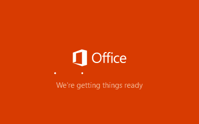
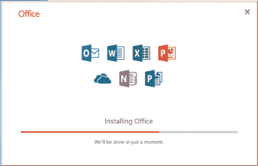

# 使用命令提示符下载 MS Office 2019

> 原文:[https://www . javatpoint . com/download-ms-office-2019-使用-命令提示符](https://www.javatpoint.com/download-ms-office-2019-using-command-prompt)

MS Office 2019 是微软推出的最新版 Office。微软办公是一个完整的套件，附带了几个必要的办公有用的应用程序，如- Word、PowerPoint、Excel、Access、OneDrive 等。可以通过命令提示符下载。

微软办公软件现在也可以在互联网上使用。这意味着你可以从任何地方访问微软办公软件。

#### 注意:微软办公软件适用于 32 位和 64 位操作系统。

本章将向您展示使用命令在 Windows 操作系统上下载微软办公套件的步骤。在本章中，我们还将讨论通过 cmd 下载和配置 MS Office 时可能出现的错误。

## 微软办公 2019 的特点

您可以利用微软办公软件的以下功能:

*   办公应用程序、微软 Word、PowerPoint、Excel、Access 等的集合。
*   简单易用，有几个有趣的功能。
*   Office 应用程序提供了一个功能区界面来轻松访问功能。
*   轻便而强大的工具。
*   允许通过图片、视频、饼状图、图表以图形方式表示数据。
*   带有 Excel 电子表格的内置公式。

### 安装微软办公软件时需要记住的事情

在继续下一步之前，您必须检查计算机系统上的以下内容，以获得无错误的过程。

*   您的系统必须连接到互联网，速度应该不错。
*   您的系统必须有足够的内存空间，至少是 MS 办公室的大小。
*   如果您的系统已经有相同或不同版本的微软办公软件，请在安装新软件之前卸载它。

## 下载和安装微软办公软件的步骤

以下是在 Windows 10 上使用命令提示符下载和安装 MS Office 2019 的步骤:

**第一步:**在桌面或任何你想下载 MS Office 的位置创建一个名为 **ODT** 的文件夹。

Office 2019 我们有两个版本: **Office 标准 2019** 和 **Office 专业版 Plus 2019** 。

**第二步:**从给定的列表中选择一个要安装的 MS Office 软件。这些可用于不同的操作系统。

**办公标准 2019**

[为 32 位计算机配置](https://app.box.com/s/2ffl43tf1g5x3plzyvfgjlo2glmo5n2b)

[为 64 位计算机配置](https://app.box.com/s/1Furfhe8BFbkEhXn1xcYPr8jYAACNpfV7p)

**办公专业 Plus 2019**

[为 32 位计算机配置](https://app.box.com/s/2ysrkgdbllqyftm4hpx41teujhh1yiip)

[为 64 位计算机配置](https://app.box.com/s/joi9l6nebvbvqvkcyw502vmesvvivoiu)

**第三步:**当你点击其中一个链接时，一个配置文件(configuration.xml)会在你的网络浏览器上打开。

**第 4 步:**点击右上角的**下载**按钮，在您的系统上下载该文件。

**第五步:**您的配置文件将在几秒钟后下载。点击“**十字“**”标志关闭弹出窗口。

**步骤 6:** 现在，将下载的 configuration.xml 文件移动到我们在前面步骤中创建的 ODT 文件夹中。

**第七步:**点击 ODT 文件夹的地址栏进行编辑。键入 **cmd** 并按下**回车**键。

**步骤 8:** Windows 命令提示符将打开，显示 ODT 文件夹的位置，如下图所示。

**步骤 9:** 现在，复制并粘贴以下命令，在您的系统中安装 Office。

setup /download configuration.xml

此命令可能至少需要 10 分钟才能完成运行。看起来没有什么在进行和下载，但是文件正在后台下载。

**等到完成！**

#### 注意:您的系统必须连接到互联网。否则，MS Office 将停止下载并给出错误消息。

**步骤 10:** Office 已经在 ODT 文件夹内成功下载到您的系统上。它的设置将向您显示存储您的 **configuration.xml** 文件的 ODT 文件夹。

**步骤 11:** 而命令提示符则完成在其上运行的命令的执行。一旦第一个命令没有任何错误地执行，命令提示符将如下所示。

**错误:无法安装**

如果它无法在您的系统上安装 Office，并显示消息:**无法安装**以及错误代码，则表示您的 Office 安装程序未安装。

出现此错误可能是因为以下原因之一。所以，检查一次:

*   互联网连接
*   系统有足够的内存空间。

**错误代码**

*   如果**错误代码为:30183-2056** ，检查**互联网连接**。该代码是由于互联网速度低或没有互联网而生成的。
*   如果**错误代码为:30029-1007** (O)，检查 ODT 文件夹内配置文件的文件**名称。**

**步骤 12:** 如果前一条命令运行成功，则没有出现错误。运行下面给出的另一个命令:

setup /configure configuration.xml

点击**进入**键。

**步骤 13:** 当此命令执行时，您的 Office 2019 将成功配置并准备运行。

**步骤 14:** 它开始安装到您的系统。完成后，您也可以使用微软 Excel 和其他办公应用程序。

### 配置 configuration.xml 时出错

执行**设置/配置 configuration.xml** 命令时，安装 MS Office 需要几分钟时间。不幸的是，在运行第二个命令后，您可能会再次面临错误(**我们无法安装**)。

如果您的系统已经安装了微软办公软件，那么在您的系统上安装微软办公软件时，可能会出现这种错误。

此错误表明您的系统还包含以下产品的其他/相同版本。因此，在配置 Excel 设置之前，您必须先卸载它们。

## 使用微软办公软件

如果一切顺利，可以在开始菜单中搜索 MS Office 提供的应用程序并运行。微软办公套件附带的应用程序有-

1.  文字处理应用程序
2.  演示程序
3.  电子表格
4.  数据库
5.  记事本
6.  观点

在开始菜单中，您可以找到所有这些应用程序。

* * *