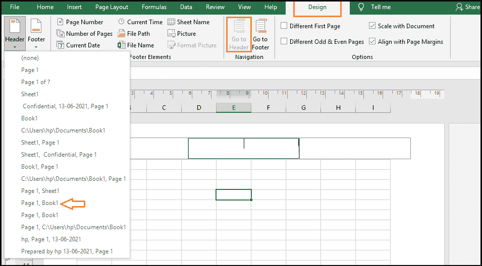

# Excel 页眉和页脚

> 原文：<https://www.javatpoint.com/excel-header-and-footer>

在微软电子表格中，我们可以在打印的工作表的顶部和底部添加页眉和页脚。例如，如果我们想创建一个 excel 文件，我们可以在页脚中包含页码、日期和文件名。

为了使我们打印的 Excel 文档专业且有吸引力，我们可以在工作表的每一页上包含页眉或页脚。页眉和页脚通常包含基本的电子表格信息，如页码、日期、文件路径、工作簿名称等。微软 Excel 有几个页眉和页脚可供选择，允许它创建自己的页眉和页脚。

页眉和页脚主要显示在打印页面、页面布局视图和打印预览上。这些不会显示在标准 excel 工作表视图中。在本文中，我们将讨论如何在 Excel 工作表中添加页眉和页脚。

## 如何在 Excel 中添加表头？

在这里，我们将讨论如何在 Excel 工作表中添加标题。为此，我们可以采取各种步骤，如下所示:

**第一步:**首先，我们需要进入**插入选项**，然后选择**文本组**。之后，选择**表头&表尾**选项。它会将 excel 工作表切换到页面布局视图。

**第二步:**在这里，我们可以输入**文本**，添加**图像**，并在 excel 工作表顶部显示的三个标题框中的任意一个中插入**预设标题**。在三个标题框中，默认情况下选择中心框。我们也可以根据需要选择标题框。

**第三步:**完成此流程后，点击 Excel 工作表中的任意位置，离开表头。如果我们想退出标题框而不做任何更改，请点击 **Esc** 按钮。

当我们打印工作表时，标题会在工作表的每一页上重复出现。

## 如何在 Excel 工作表中添加页脚？

在这里，我们将讨论如何在 Excel 工作表中添加页脚。我们可以使用不同的步骤来实现这一点，如下所示:

**第一步:**首先，我们需要进入**插入选项**，然后选择**文本**组。之后，选择**表头&表尾**选项。它会将 excel 工作表切换到页面布局视图。

**第二步:**现在，我们转到设计选项，点击**转到页脚**选项。之后，将页面滚动到页面底部的页脚框。

**第三步:**现在，我们可以选择想要的地方，点击**左边，中间，**和**右边的页脚框，**并键入一些文本或添加我们想要的元素。

**第 4 步:**完成此过程后，单击 Excel 工作表中的任意位置，留下页脚。如果我们想退出页脚框而不做任何更改，点击 **Esc** 按钮。

## 如何在 Excel 工作表中添加预设的页眉和页脚？

微软 Excel 有几个内置的页眉和页脚，只需点击一下鼠标就可以轻松地放入文档中。在这里，我们将讨论如何在 Excel 工作表中添加页眉和页脚的预设。我们可以使用不同的步骤来实现这一点，如下所示:

**第一步:**首先，我们需要进入插入选项，选择文本组选项。之后，选择页眉&页脚选项。它会将 excel 工作表切换到页面布局视图。

**第二步:**现在我们进入设计选项，选择**页眉&页脚**按钮，选择预设的页眉&页脚。

**第三步:**完成此过程后，单击 Excel 工作表中的任意位置，留下页脚。如果我们想退出页脚框而不做任何更改，点击 **Esc** 按钮。

## 使用“页面设置”对话框添加页眉和页脚

使用“页面设置”对话框可以同时向 excel 图表工作表或多个工作表添加页眉或页脚。我们可以使用不同的步骤来执行此方法，如下所示:

**第一步:**首先，我们需要选择一个或多个要创建页眉&页脚的工作表。之后，按住 **Ctrl** 键，同时单击工作表标签以选择多个工作表。

**第二步:**现在，进入**页面布局**选项，然后进入**页面设置**组。之后，点击**对话框启动器。**

**第三步:**最后会出现**页面设置对话框**框，允许我们选择预设**页眉&页脚**或者自己创建。

例如，如果我们想插入一个预设，请单击页眉和页脚框中的下拉菜单箭头，并从可用选项中进行选择。

## 如何在 Excel 中制作自定义页眉和页脚

我们可以在 Excel 工作表中添加预先制作的页眉和页脚，并使用自定义文本和图形创建自己的页眉和页脚。在这里，我们将讨论如何在 Excel 中制作自定义页眉和页脚。

像往常一样，首先从**插入**标签中选择**页眉&页脚**选项。之后，单击 excel 工作表页眉或页脚处的框，然后在那里输入内容。或者，我们可以从“设计”菜单上的**页眉&页脚**元素类别中选择一个内置元素来输入数据。

让我们举一个例子来理解我们如何用**页码、当前日期、公司标志、**和**文件名**创建自定义页眉和页脚。我们可以使用不同的步骤来执行此方法，如下所示:

**第一步:**首先，我们需要在中心标题框中插入**文件名**。

**第二步:**现在，选择**右框**，点击**页码**选项。

**第三步:**我们也可以通过选择功能区上相应的按钮并在代码之间键入“of”来将“页数”组件添加到同一个框中，以便 Excel 标题显示为**“第 1 页，共 4 页”**。

**第四步:**最后，在左框中添加完整的 logo。为此，请转到**图片**选项卡，选择**图像**文件，然后**单击**插入。

## 如何在 Excel 中编辑页眉和页脚

在这里，我们将讨论如何在 Excel 中编辑页眉和页脚。在 excel 中编辑页眉和页脚有两种方法，分别是**“页面布局视图”**和**“页面设置对话框”**。

### 方法 1:在页面布局视图中更改页眉和页脚

**第一步:**首先进入**视图**选项切换到**页面布局**视图。之后，转到工作簿**视图**组选项，然后点击**页面布局**选项。

**第二步:**现在，点击 Excel 工作表**右下角**状态栏上显示的**页面布局**选项。

在这里，我们可以选择页眉和页脚文本框，并进行所需的更改。

### 方法 2:在页面设置对话框中更改页眉和页脚

页面设置对话框也可用于更改 Excel **页眉&页脚**。请记住，在这种方法中，只能更改图表的页眉和页脚。

## 如何删除 Excel 工作表中的页眉和页脚

在这里，我们将讨论如何删除 Excel 工作表中的页眉和页脚。如果要从 excel 工作表中删除页眉和页脚，请转到“页面布局视图”选项。之后，点击页眉和页脚文本框，并使用删除或退格键。

使用以下步骤一次从不同的工作表中删除页眉和页脚:

**第一步:**首先，选择**工作表**，我们要从中删除页眉和页脚。

**第二步:**现在，我们需要打开**页面设置对话框**框**(页面布局- >页面设置- >对话框)**。

**第三步:**现在，点击**页面设置对话框**框中的下拉菜单，进入预设的**页眉&页脚**并选择无。

**第 4 步:**结束时，点击**确定**按钮，关闭页面设置对话框。

## 如何在 Excel 中关闭页眉和页脚

我们必须退出页眉和页脚视图，并在完成制作或更新 excel 页眉和页脚后返回主视图。为此，请使用以下步骤:

**第一步:**首先进入**视图**选项卡，选择**工作簿**视图组。

**第二步:**之后，点击出现在 excel 工作表状态栏上的**正常**选项。

## 如何为 Excel 工作表的第一页制作不同的页眉或页脚

以下步骤可用于将指定的页眉或页脚添加到 excel 工作表的第一页:

**第一步:**首先，我们需要进入**插入选项**，然后选择**文本组**。之后，选择**表头&表尾**选项。它会将 excel 工作表切换到页面布局视图。

**第二步:**现在我们需要选择**表头&表尾**选项。

**第三步:**进入**设计**页签，勾选**首页**框，选择该选项。

**第四步:**最后为 excel 工作表的第一页设置具体的页眉和页脚。

## 其他页眉和页脚选项

当我们在页面布局视图中选择页眉或页脚时，**页眉&页脚- >设计- >选择**组提供按钮来定义其他选项。

**1。不同的首页**

如果我们想在打印的第一页上使用不同的页眉或页脚，我们可以选中此框。

**2。不同的奇数页&偶数页**

如果我们希望在第一个打印页面上使用不同的页眉或页脚，请选中此框。

**3。带文档的秤**

如果我们选择了这个选项，它将允许我们修改页眉和页脚的字体大小。因此，当我们打印文档时，它将被缩放。

**4。与页边距对齐**

如果我们选择了这个选项，它将允许我们将左页眉和页脚与左边距对齐，将右页眉和页脚与右边距对齐。

* * *