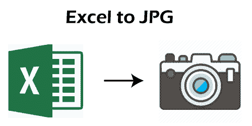

# 超越 JPG

> 原文:[https://www.javatpoint.com/excel-to-jpg](https://www.javatpoint.com/excel-to-jpg)

微软 Excel 或微软 Excel 是全球最常用的电子表格程序之一。它是微软办公套件的一部分。微软电子表格的主要特点之一是，它允许用户将他们的电子表格文档保存为各种不同的格式。尽管它在“另存为”对话框中包含了几种文件格式，但它缺少 JPG 文件格式。这意味着 Excel 不提供将电子表格保存到 JPG 的直接支持。

将 Excel 文档转换为 JPG 或任何其他图像格式对某些用户来说可能是最有用的。几乎所有设备都可以轻松访问 JPG 格式，无需安装任何第三方软件。因此，我们必须知道将 Excel 转换/保存到 JPG 的几种不同方法。在本文中，我们讨论了将 Excel 文件转换或保存为 JPG 格式的不同方法。虽然有无数种替代方法来执行这项任务，但以下是最基本和最简单的方法:

*   [使用打印屏幕 Excel 到 JPG](#PrintScreen)
*   [使用图像剪切工具](#SnippingTool)Excel 到 JPG
*   [使用复制/粘贴](#CopyPasting)Excel 到 JPG
*   使用相机工具超越 JPG
*   [Excel 转 JPG 在线工具](#OnlineTools)

让我们详细讨论上面列出的每一种方法:

## 使用打印屏幕超越 JPG

使用键盘上的“打印屏幕”按钮是捕获 Excel 工作表的屏幕部分，然后将其保存为 JPG 或任何其他图像格式的快速且最简单的解决方案。但是，这种方法对大量数据没有帮助，因为单独捕获所有 Excel 工作表的屏幕需要很长时间。因此，如果我们想在处理文件时脱机处理 Excel 工作表的一小部分，我们可以使用这个方法。

该方法包括以下步骤:

*   首先，我们需要放大/缩小工作表的特定区域，并使感兴趣的基本数据在整个屏幕上可见。
    
*   接下来，我们必须按住键盘上的**【PrtSc】**或**【打印屏幕】**按钮，同时按住**【Alt】**按钮。
    
*   然后，我们需要打开任何图形编辑器应用程序并粘贴复制的屏幕。在我们的例子中，我们使用 MS Paint 应用程序，并使用 **Ctrl + V** 快捷方式粘贴内容。
    T3】
*   一旦屏幕粘贴到图形编辑器上，我们就可以进行必要的编辑或永久保存。在 MS Paint 中，我们必须导航到**文件>另存为。**
    
*   在“另存为”窗口中，我们需要选择 **JPEG(。jpg)** 格式从**【文件类型】**文本旁边的下拉菜单中给出。选择格式后，我们必须选择想要保存文件的位置，然后点击**‘保存’**按钮。
    

由于快捷方式“Alt + PrtSc”捕获整个当前窗口，因此它包括功能区、顶部菜单、滚动条和其他可见窗口内容。因此，我们可以在保存图像之前，使用图形编辑器应用程序中的裁剪功能来删除图像中不必要的区域。

## 使用图像剪切工具 Excel 到 JPG

将 Excel 转换为 JPG 的另一种方法包括使用剪切工具。这种方法也可以脱机工作，并且不需要在 Windows 计算机上安装任何第三方软件。狙击工具是一个小程序，在 Windows 7 之后的所有现代版本的 Windows 中都包含了这个系统实用程序。

与捕获屏幕全部可见内容的打印屏幕功能不同，剪切工具允许用户使用不同的捕获选项，例如:

*   **自由形态:**它允许用户使用定点设备在屏幕上绘制任意随机形状来捕捉特定部分。这样，我们可以选择 Excel 数据的一个重要部分将其转换为 JPG。
*   **矩形:**该默认捕捉选项允许用户捕捉选定高度和宽度的矩形片段。
*   **窗口:**它允许用户捕捉任何特定软件的对话框/窗口或调整大小的窗口，如 MS Excel。
*   **全屏:**它的工作原理类似于打印屏幕功能，允许用户捕捉整个屏幕。

因此，使用剪切工具比使用打印屏幕功能更强大。然而，这也无助于将大量数据转换为 JPG 数据。

该方法包括以下步骤:

*   首先，我们需要打开 Excel 工作表，放大/缩小包含必要数据的工作表区域。
    
*   接下来，我们需要启动狙击工具程序。要找到狙击工具，我们必须按下键盘上的 Windows 键，然后在 Windows 搜索框中键入**“狙击工具”**。之后，我们需要双击结果列表中的狙击工具。
    T3】
*   狙击工具打开后，我们必须根据需要选择捕捉模式。点击顶部菜单栏上**【模式】**按钮旁边的下拉箭头，可以选择所需的模式。
    T3】
*   一旦选择了模式，我们必须点击**‘新建’**按钮，选择我们想要捕获并保存为 JPG 的 Excel 表格区域。
    
    选中的区域会在狙击工具窗口上瞬间复制。此外，我们可以使用内置的编辑工具进行一些编辑，如钢笔、荧光笔、橡皮擦等。
    
*   最后，我们需要点击**【保存】**按钮或按键盘上的快捷键“Ctrl + S”来保存 Excel 表格的捕获区域。
    T3】
*   在下一屏，我们必须选择保存路径，输入文件名，选择**文件类型 JPEG(。jpg)** 并点击窗口右下角的**【保存】**按钮。
    
    通过这样做，所需数据被保存到选定位置的 JPG 文件中。

## 使用复制/粘贴将 Excel 复制到 JPG

如果我们使用复制/粘贴功能来捕获部分 Excel 工作表，我们可以消除某些限制。这意味着我们可以从工作表中选择更多的数据，而不像上面两种方法那样使其在屏幕上可见。这样，我们甚至可以捕获大量数据。例如，一个有几十万行的表。

该方法包括以下步骤:

*   首先，我们需要打开一个特定的 excel 文件，从工作表中选择必要的数据，包括图表、形状或任何其他 excel 数据。要选择工作表的全部数据，我们可以选择第一个单元格，然后按快捷键**‘Ctrl+Shift+Enter’**。
    T3】
*   选择要保存为 JPG 的数据后，必须导航至**主页>复制>复制为图片。**
    
    它会要求我们选择是要将选中的数据保存为屏幕显示还是打印时显示。我们可以据此选择。
    

*   一旦数据被复制，我们必须**将复制的数据粘贴** (Ctrl + V)到任何图形编辑软件，如 **MS Paint。**
    
*   在 MS Paint 中粘贴完数据后，我们需要点击**【保存】**按钮或者按快捷键**【Ctrl+S】**。在下一个屏幕上，我们必须选择文件类型 **'JPEG(。jpg)'，**并点击‘保存’按钮。相应的数据将保存到 JPG 图像文件中。
    

## Excel 到 JPG 在线工具

虽然我们可以使用上述方法脱机工作并完成工作或将 Excel 转换为 JPG，但在某些情况下可能会有点复杂。例如，假设我们需要将大量的 Excel 文件转换成 JPG。这样，我们将不得不分别处理每个文件，这可能会很耗时。幸运的是，我们有许多在线工具可以帮助我们在几乎没有时间的情况下将 Excel 文件转换/保存为 JPG。网上转换器/工具最大的好处是大部分都可以在网上免费使用。

以下是 JPG 必不可少且最受欢迎的 Excel 在线工具:

### 扎姆扎尔

Zamzar 是将 Excel 文件转换成 JPG 和其他几种格式的最流行的在线工具之一。该工具提供了一个简单的用户界面，并帮助用户将他们的 Excel 文件快速转换成 JPG。

用户只需要使用 Zamzar 工具选择想要的 Excel 文件，相应的文件就会上传到自己的服务器上。接下来，用户必须选择他们想要转换上传文件的格式，然后点击“立即转换”按钮。文件会自动转换为所需的格式，屏幕上会显示“下载”按钮。该按钮允许用户将他们的 JPG 文件轻松保存到他们的设备。

使用 Zamzar，在免费账户中上传大小超过 50MB 的 Excel 文件是不可能的。用户必须购买 Zamzar 付费订阅账户，才能解除某些限制并充分利用该工具的潜力。

扎姆扎尔工具链接:[https://www.zamzar.com/convert/xls-to-jpg/](https://www.zamzar.com/converters/document/xls-to-jpg/)

### Online2PDF

Online2PDF 是另一个流行的在线转换器，允许用户轻松地将 Excel 文件转换成 JPG。与 Zamzar 不同，Online2PDF 工具允许用户转换大小超过 50MB 的文件。用户可以选择每个大小高达 100 兆字节的 Excel 文件。此外，该工具允许用户一次选择多达 20 个文件；但是，总的组合大小不应超过 150 MB。

使用 Online2PDF 工具转换文件时，过程几乎与其他在线工具相似。用户只需上传所需的文件，选择文件格式(如我们的 JPG)，然后点击转换按钮。最后，可以使用“下载”按钮将转换后的文件保存在本地。

链接到在线 2 df 工具:[https://online2pdf.com/convert-excel-to-jpg](https://online2pdf.com/convert-excel-to-jpg)

### CloudConvert

CloudConvert 是另一个方便的工具，允许用户转换大多数文档格式，包括 Excel。该工具提供了一些高级的修改选项。这意味着用户可以修改输出的一些参数，例如页数、像素密度、宽度、高度、质量等等。除此之外，CloudConvert 承诺用户提供的输出格式质量与通过 Office 套件保存的文件完全相似。

尽管 CloudConvert 免费提供所有高级功能，但用户一天最多只能转换 25 个文件。此外，用户可以获得 CloudConvert 的高级订阅，根据自己的需要增加每日限额。

如上图所示，我们必须首先像其他类似工具一样选择 Excel 文件。接下来，我们需要调整参数，得到 JPG 格式的 Excel 文件输出。

链接到云转换工具:[https://cloudconvert.com/xls-to-jpg](https://cloudconvert.com/xls-to-jpg)

### 小 pdf

尽管它的名字叫“小 pdf”，但这个特殊的工具也有助于用户免费在线将他们的 Excel 文件转换成 JPG。该工具使用有损压缩技术将 Excel 文件的数据最大限度地压缩到较小的大小。但是，Smallpdf 工具分两步工作；该文件首先转换为 pdf，然后转换为 JPG。此外，用户必须等待两个不同的转换，这是一个手动过程。这意味着用户需要逐个手动执行这两种转换。这就是大多数人不觉得这个工具有多大帮助的原因。

特别是，我们必须首先选择特定的 excel 文件，然后等待将文件转换为 pdf 格式。转换完成后，我们必须从右侧菜单中选择“PDF 到 JPG”选项，然后等待转换。

转换后我们可以下载 JPG 格式的转换后的 Excel 文件。

链接到小 pdf 工具:[https://smallpdf.com/excel-to-pdf](https://smallpdf.com/excel-to-pdf)

**免责声明:**我们对上传到任何列出的在线工具的 Excel 文件的数据安全不承担任何责任。强烈建议阅读他们的条款&条件或隐私政策，以了解他们如何使用从 Excel 文件上传到他们的数据。

* * *