# JPG 超越自我

> 原文:[https://www.javatpoint.com/jpg-to-excel](https://www.javatpoint.com/jpg-to-excel)

JPG 是最常用的用户友好型和网络友好型格式，因为它体积小，易于共享。有时，我们可能需要从 jpg 中提取文本数据，然后将其添加到 Excel 文件中。将 JPG 转换为 Excel 是最具挑战性的任务之一，因为 Excel 中没有内置选项来完成这项任务。然而，几种交替的在线和离线软件/工具允许我们从 JPG 文件中提取数据并将其保存到 Excel 文件中。

本文讨论了几种适用于不同平台的必备软件，它们可以帮助我们从 JPG 文件中提取数据，并将其转换/保存到 Excel 文档中。然而，由于大多数工具使用光学字符识别(OCR)技术提取数据，我们只能提取 jpg 中的字符形式的数据。这意味着我们无法使用大多数转换器将图形转换为 excel。相反，如果需要，我们可以使用内置的 excel 工具将图形直接插入到 excel 文档中。

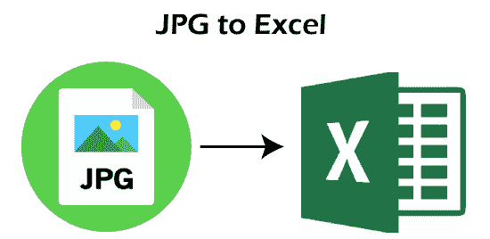

尽管有许多方法可以将 JPG 数据提取到 Excel 中，但我们将一些最常见和最简单的数据分为以下两类:

*   JPG 超越在线工具/软件
*   JPG 超越离线工具/软件

#### 注意:建议保持原始图像文件(JPG)完整，并与转换文件(Excel 文件)中的数据匹配，以确保数据的准确性。

让我们详细讨论这两种方法:

## JPG 超越在线工具/软件

网上有许多免费和付费的软件或工具可以用来将 JPG 转换成 Excel。使用在线软件的主要优势是，我们可以在不同的平台和设备上独立使用它们，因为它们通过网络浏览器工作。

以下是一些最流行和广泛使用的在线软件:

### Online2pdf

说到准确性，Online2pdf 被认为是将 JPG 转换为 Excel 的最佳在线工具。这个特殊的工具是免费使用的，不要求用户创建帐户或登录。此外，Online2pdf 是一个强大的在线文件转换器工具，允许用户将不同的文件格式从一种转换为另一种。尽管该工具主要用于执行大多数与 pdf 相关的任务，但随着时间的推移，它也接受了许多其他基本的文件格式，例如 JPG。

Online2pdf 支持批处理，允许用户同时转换多达 20 个文件。但是，最大文件大小不得超过 100 MB。消极的一面是，该工具使用光学字符识别技术只能识别六种语言。

以下是使用 Online2pdf 工具将 JPG 转换为 Excel 的步骤:

*   首先，我们需要导航到以下链接:
    **链接:**[【https://online2pdf.com/convert-jpg-to-excel】](https://online2pdf.com/convert-jpg-to-excel)
    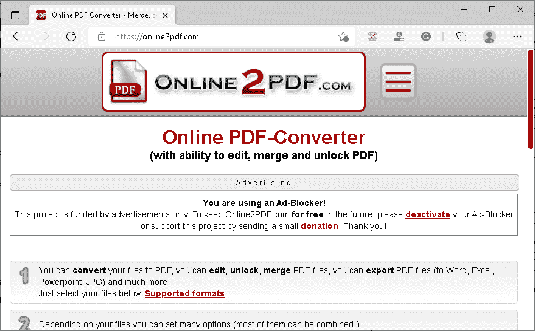
*   网页显示后，我们需要点击**“选择文件”**按钮，选择需要上传到工具中的文件。
    T3】
*   接下来，我们必须选择输出为**‘Excel’**并选择文件语言以增加 OCR 过程。
    T3】
*   一旦定制了所有的偏好，我们必须从底部点击**‘转换’**按钮，等待转换完成。
    T3】
*   转换完成后，可以将转换后的 Excel 文件下载或保存到设备中。
    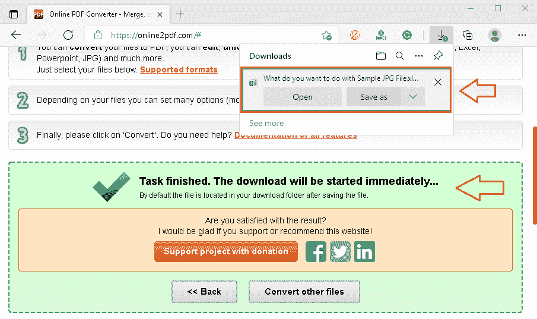

### 在线 OCR

OnlineOCR 是网络上另一个用户友好的工具，允许用户将扫描的数据转换成可编辑的输出格式，包括 Excel。这意味着用户可以很容易地在线使用这个免费工具，扫描他们的 JPG 文件并从中提取文本。然后，该工具要求用户将数据保存到 Excel 或其他文档中。

虽然 OnlineOCR 工具很容易使用，但它也有一些局限性。例如，该工具不允许批量转换为来宾用户。但是，用户可以在几分钟内注册或注册，并消除几个限制。这样，用户可以转换多个文件、大文件、选择识别文件语言以获得更快的性能等等。尽管如此，OnlineOCR 工具支持 46 种识别语言。

以下是使用在线光学字符识别工具将 JPG 转换为 Excel 的步骤:

*   首先，我们需要导航到以下链接:
    **链接:**[【https://www.onlineocr.net/】](https://www.onlineocr.net/)
    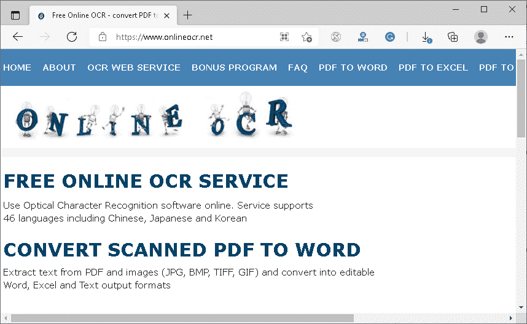
*   网页显示后，我们需要点击**‘选择文件’**按钮，选择想要上传到工具中的文件。
    T3】
*   我们必须在下一步从下拉列表中选择文件语言和输出格式(微软 Excel)。
    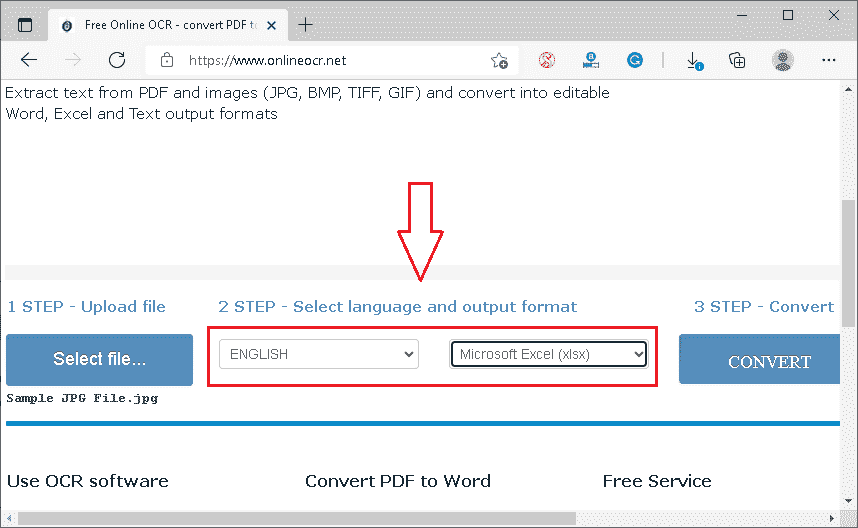
*   最后，我们必须从右侧点击**‘转换’**按钮，等待转换完成。
    T3】
*   转换完成后，我们可以使用文本**“下载输出文件”**附带的链接下载输出文件。
    T3】

### ImageToExcel

ImageToExcel 是网络上最强大、最准确的工具之一，可以帮助用户从任何 JPG 文件中提取表格文本，并在浏览器中查看数据。此外，该工具还允许用户将数据下载到可编辑文档中。但是，该工具对免费使用有严格的限制。

用户每天只能对八个文件使用此工具，每个文件的大小不应超过 3 MB。这是演示这个特殊工具的一部分。对于批量使用，用户必须购买 ImageToExcel 的高级订阅。

以下是使用 ImageToExcel 工具将 JPG 转换为 Excel 的步骤:

*   首先，我们需要导航到以下链接:
    **链接:**[https://imagetoexcel.com/](https://imagetoexcel.com/)
*   之后，我们需要将所需的文件拖放到浏览器窗口上，或者点击带有文本**‘放下一个有表格的图像’**的框来选择所需的文件。
    T3】
*   一旦选择了所需的文件，该工具就会开始扫描文件，并在浏览器中显示表格数据。
    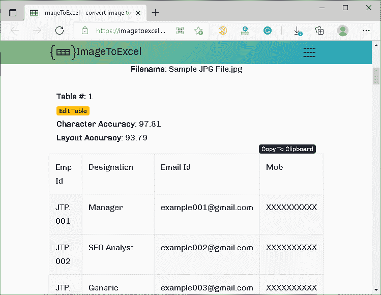
    我们必须向下滚动到数据的底部，然后下载表格输出为‘Excel’。为此，我们需要选择文本“Excel”之前给出的单选按钮，然后单击文本“Excel”旁边给出的下载按钮。
    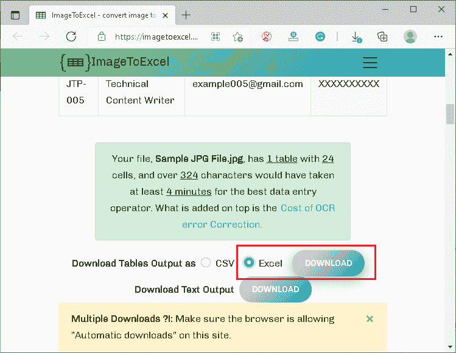

### 扎姆扎尔

Zamzar 是最流行的在线工具之一，它允许用户相应地将不同的文件格式转换成其他格式。但是，即使该工具支持最流行的文件格式，它也不会直接将 JPG 文件转换为 Excel。为此，用户必须首先将 JPG 文件转换为 PDF，然后下载转换后的文件。之后，下载的 PDF 文件必须再次上传到工具上，并选择 Excel 作为输出。

Zamzar 允许用户批量转换文件。但是，对于来宾用户有一些限制。用户必须创建一个帐户，以消除某些限制或购买高级计划来充分发挥该工具的功能。

以下是使用扎姆扎尔工具将 JPG 转换为 Excel 的步骤:

*   首先，我们需要导航到以下链接:
    **链接:**[【https://www.zamzar.com/】](https://www.zamzar.com/)
    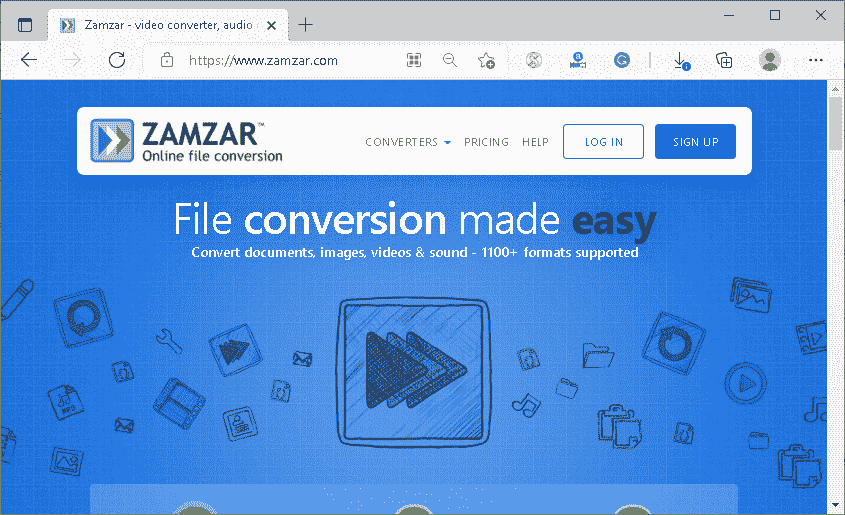
*   接下来，我们需要点击**“添加文件”**按钮，选择想要上传到工具中的 JPG 文件。
    T3】
*   在下一步中，我们必须从“转换为”按钮旁边给出的下拉列表中选择文件输出格式 **(PDF)** 。
    T3】
*   最后，我们必须从右侧点击**“立即转换”**按钮，等待转换完成。
    T3】
*   转换完成后，我们可以使用**“下载”**按钮下载输出文件。
    T3】
*   下载 PDF 文件后，我们需要点击**“转换更多文件”**按钮开始新的转换。
    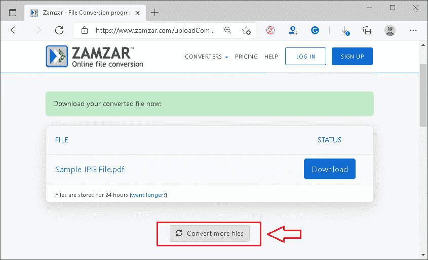
*   现在，我们必须使用添加文件按钮选择 PDF 文件，并将其转换为**‘XLSX**(微软 Excel)’。
    T3】
*   最后，我们可以用从 JPG 提取的数据下载 Excel 文件。
    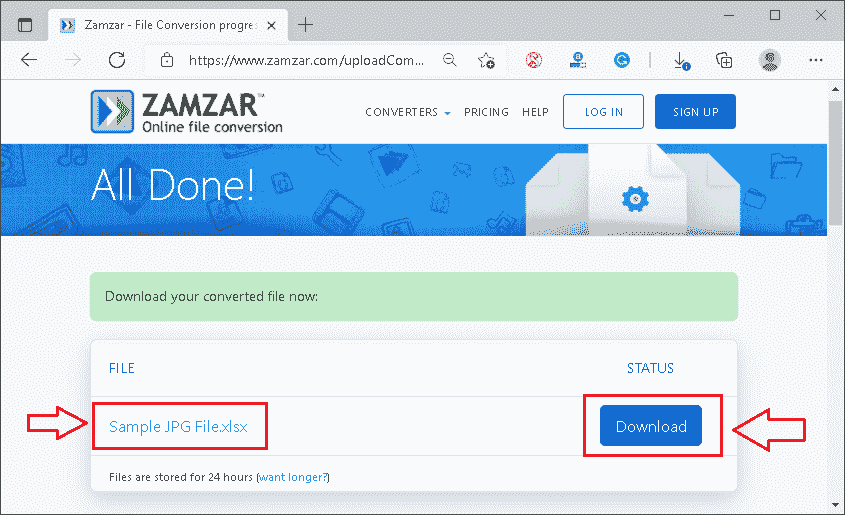

### 小 pdf

Smallpdf 是另一种流行的在线工具，可以从 JPG 文件中提取文本数据，然后将其保存到 Excel 文件中。Smallpdf 的概念几乎与 Zamzar 相同。这意味着用户必须首先将 JPG 文件转换为 PDF，然后重新上传并转换为 Excel。虽然这种特殊的工具可以完成这项工作，但它不如上面提到的工具精确。然而，要从 JPG 文件中识别一些简单的文本数据，Smallpdf 值得一试。

Smallpdf 不要求用户注册帐户。此外，开发人员声称整个转换不到几秒钟就能完成工作。

以下是使用小 pdf 工具将 JPG 转换为 Excel 的步骤:

*   首先，我们需要导航到以下链接:
    **链接:**[https://smallpdf.com/pdf-converter](https://smallpdf.com/pdf-converter)
*   接下来，我们需要点击**“选择文件”**按钮，选择需要上传到工具中的 JPG 文件。
    T3】
*   选择文件后，工具会识别文本并显示数据预览。此外，用户可以下载包含从 JPG 提取的数据的 PDF 文件。在这里，我们下载转换后的 PDF 文件。
    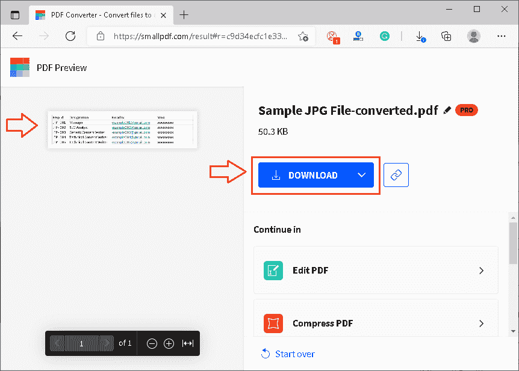
*   下载 PDF 文件后，我们需要从底部点击**‘重新开始’**按钮开始新的转换。
    T3】
*   现在，我们必须使用“选择文件”按钮选择下载的 PDF 文件，并将其转换为**“Excel”**。
    T3】
*   在下一个屏幕上，我们需要相应地选择所需的扫描技术。
    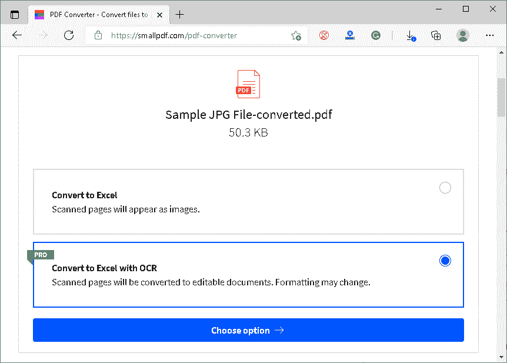
    最后，我们可以下载 Excel 文件，里面有从 JPG 提取的数据。

## JPG 超越离线工具/软件

尽管无数在线工具可以帮助我们将 JPG 导出为 Excel，但大多数用户并不依赖它们。这是因为在线工具总是会对信息泄露和数据篡改的潜在风险产生疑虑。这就是为什么离线软件是高度安全数据的唯一解决方案。使用离线软件的另一个原因是，我们通常使用离线软件获得高质量和专业的转换结果。

### 对于 Windows

对于视窗平台，ABBYY FineReader 是一个广泛使用的离线软件，允许用户使用光学字符识别技术扫描文档。它提供高精度的结果，并支持 100 多种语言。虽然这个强大的程序有许多有用的功能，但这个特定软件的价格有点体面。然而，用户可以免费试用所有不同的功能七天。

以下是下载、安装和使用此软件将 JPG 转换为 Excel 的步骤:

*   首先，我们需要导航到以下链接:
    链接:[https://pdf.abbyy.com/download/](https://pdf.abbyy.com/download/)
    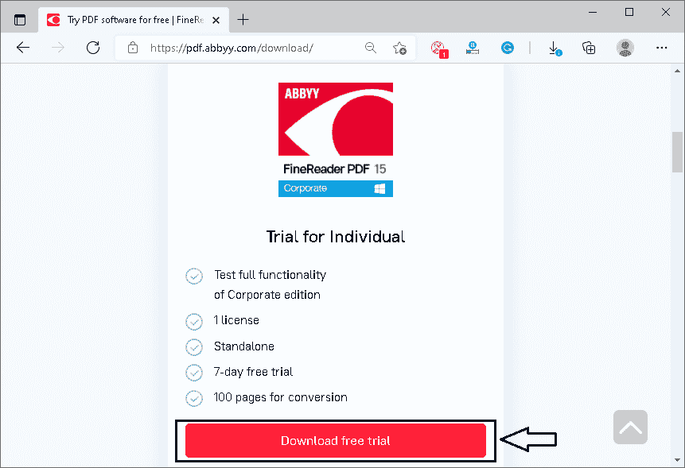
    在这里，我们需要点击‘下载免费步道’按钮。然后，我们必须在下一个屏幕上填写详细信息，并提交表单以获取邮件上的下载链接。
    

*   这个链接是通过邮件发送的，我们需要用它来下载程序设置。
    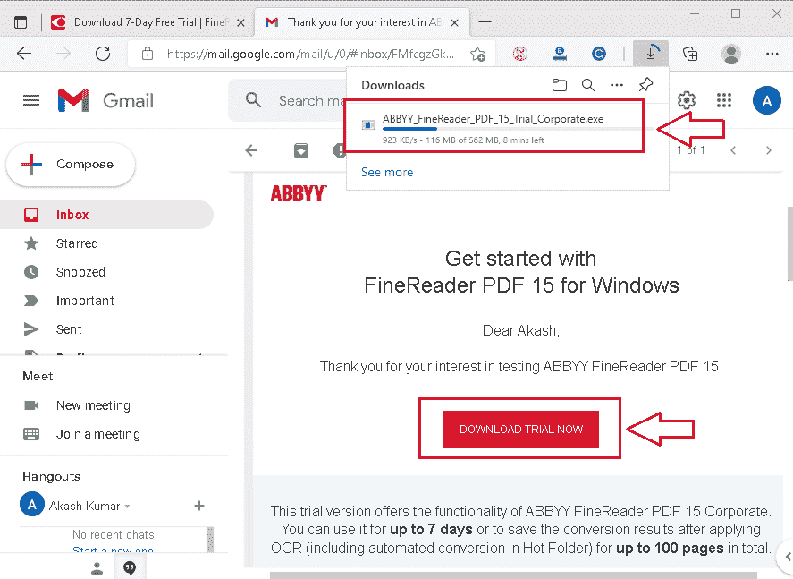
    下载安装程序后，我们必须像 Windows 上的其他普通软件一样安装这个软件。一旦安装完成，我们必须启动软件。
    在程序启动页面，我们需要点击**【打开】**按钮，选择**【转换为微软 Excel】。**
    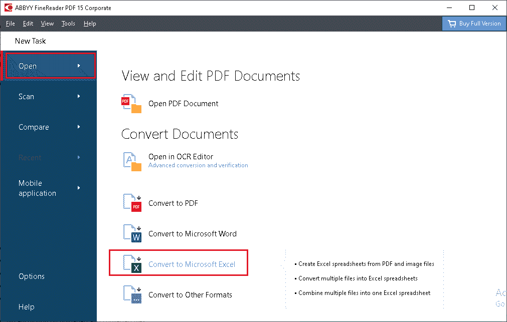
*   然后，我们必须选择所需的 JPG 文件，并在**“保持格式”**菜单中选择选项**“可编辑副本”**。没有高级版本的用户也可以从列表中选择**“格式化文本”**选项。接下来我们需要点击**【转换为 Excel】**。
    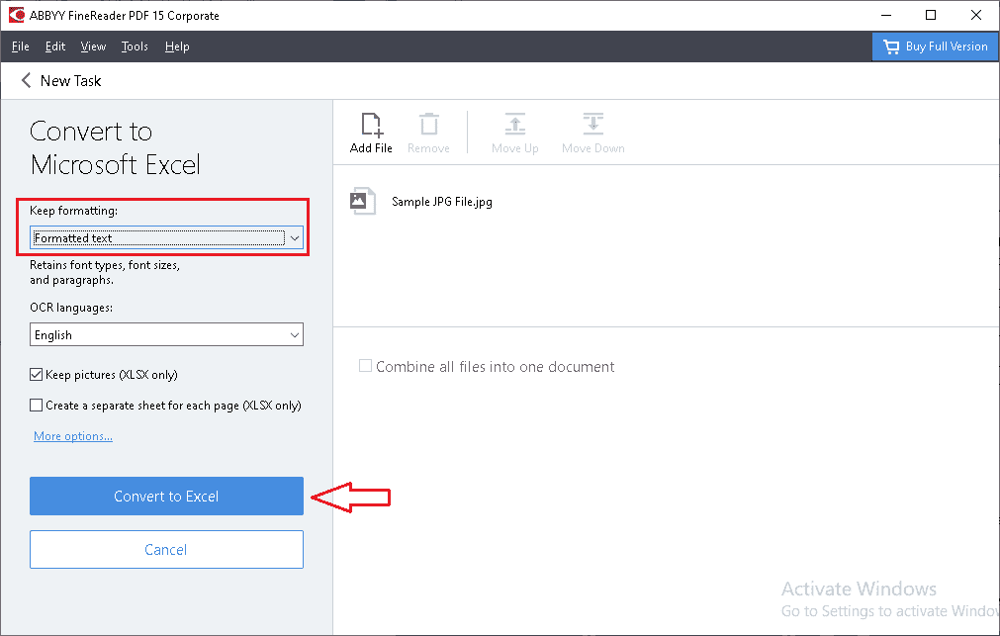
*   完成最后一步后，将使用默认阅读器(微软 Excel)打开 Excel 文件，我们需要使用**【保存】**按钮或**【Ctrl+S】**快捷方式保存该 Excel 文件。

### 给麦克的

和 Windows 一样，Mac 用户也需要安装第三方软件才能离线工作。烯醇软 PDF 转换器是一个强大的软件，旨在工作在苹果操作系统。该软件允许用户扫描文件(图像和 pdf)中的数据，并将提取的数据导出到可编辑的文档中。是一款专业的 OCR 转换器工具，支持 Excel、Word、PowerPoint 等多种输出文件格式。

以下是在 Mac 上下载、安装和使用此软件的步骤:

*   首先，我们需要导航到以下链接来下载 MacOS 的程序设置文件。
    链接:[https://download . eno soft . com/eno soft-pdf-converter-wit-ocr . dmg](https://download.enolsoft.com/enolsoft-pdf-converter-with-ocr.dmg)
    T4】
*   一旦下载，我们通常需要安装它，并在安装后启动程序。
    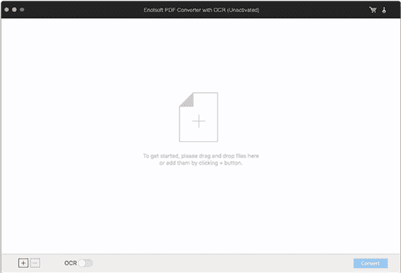
*   接下来，我们必须使用烯醇式软件程序屏幕上的文件浏览器拖放文件或选择所需的 JPG 文件。
    之后必须选择文件语言，输出文件格式为 Excel。然后，我们需要点击“转换”按钮。然后，相应的文件会转换成 Excel，我们可以相应地保存。
    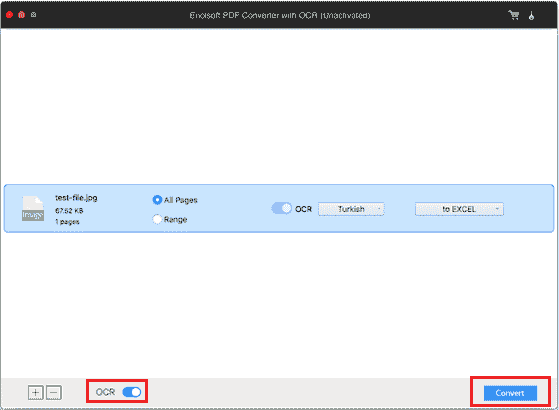

这就是我们如何在苹果电脑上将 JPG 转换成 Excel 的方法。

* * *