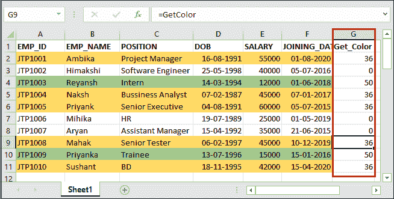
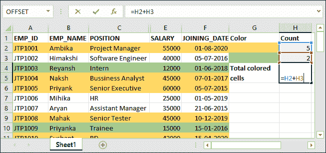

# Excel 中彩色单元格如何计数？

> 原文：<https://www.javatpoint.com/how-to-count-colored-cells-in-excel>

当你知道 Excel 中有几种方法可以帮助用户计算彩色单元格时，你可能会很高兴。是的，Excel 提供了内置的函数，你可以用它来计算彩色单元格。

一张 [Excel](https://www.javatpoint.com/excel-tutorial) 工作表可能包含用于分析目的的格式。它由一些彩色的简单行组成。Excel 支持多种方法来计算 Excel 电子表格中包含的彩色单元格。你可以很容易地学会所有这些，并使用你认为更合适的一个。

本章将详细介绍计算 Excel 工作表中彩色单元格或行的每个步骤。

## 计数有色细胞的方法

在本章中，我们将讨论在 Excel 中计数彩色单元格的三种不同方法。

1.  [使用 GET。细胞功能](#GET-CELL-function)
2.  [使用过滤和小计方法](#Filter-and-Subtotal)
3.  [使用 VBA(通过创建自定义公式)](#VBA)

在其他网站上，你可能会得到更多的方法。在这里，我们选择了最简单的一个。

## 方法 1:使用 GET。细胞功能

**GET。CELL** 是 Excel 的一种特殊类型的函数，可以用来统计彩色单元格。它基本上是一个 Macro4 函数。它不像其他 Excel 中的常规函数那样工作。

GET。CELL 函数对用于创建颜色范围以获取颜色代码的名称范围起作用。稍后，颜色代码有助于找到彩色单元格的数量。

### 使用 GET 计数彩色细胞的步骤。细胞功能

按照说明对 Excel 工作表中的彩色单元格进行计数。通常需要三个最重要的步骤才能得到结果。

1.  首先，**使用 **GET 创建一个命名范围**。CELL 函数。**
2.  现在，使用该命名范围**获取颜色代码。**
3.  借助色号(代码)，**统计有色细胞总数。**

让我们通过一个例子来了解这些步骤将如何执行。

### 例 1

**步骤 1:** 我们有一个工作表，其中包含一些简单的和一些彩色的单元格。


现在，我们将详细应用这三个步骤。

### 创建颜色范围

**第二步:**进入**公式**选项卡，点击功能区中的**定义名称**选项。


**第三步:**将打开一个对话框，在其中输入以下详细信息，然后单击**确定:**

**名称：** 获取颜色

**范围:**选择范围为**工作簿。**

**指:** =GET。CELL(38，Sheet1！$A2)


在**指**字段中，我们使用了 GET。CELL()公式，其中第一个参数值是 38，这是一个参数代码。这里，38 表示信息类型。它意味着你想从 GET 那里得到哪种类型的信息。CELL 方法。这里，38 指的是我想得到的背景颜色信息。

第二个参数值是 **Sheet1！$A2，**您要从中提取信息。您可以定义包含彩色单元格的列的引用。

### 获取每个单元格的颜色代码

现在，我们将分别获取每行的颜色代码，并将它们存储在新的列中。

**第四步:**在每行相邻单元格中使用如下公式 **=GetColor** ，按**回车**键。


如果单元格包含背景色，它将返回一个特定的数字。否则，它将返回 0。

**第五步:**看下面的截图，包含黄色的单元格返回了一个**的数字代码- 36** 。


让我们看看这个公式，前三个单元格有黄色，绿色，没有颜色。在所有相应的行中应用相同的 **=GetColor** 公式。

**第 6 步:**对于下一个行号，GetColor 返回了 0，因为它不包含任何背景颜色。


**第 7 步:**对于用绿色背景色着色的行，GetColor 已经返回 50 作为其色码号。


同样，逐个查找所有行的颜色代码，然后进入最后一步。

**第 8 步:**找到包含部分数据的所有行的颜色代码后，查看工作表。



### 使用颜色代码计数彩色单元格

最后一步是计算具有任何背景颜色的单元格总数。所以，向前看。

**步骤 9:** 在数据集下面再创建两个单元格，并用工作表中已经包含的相同颜色给它们着色。见下图。


**步骤 10:** 现在，在新创建的单元格的相邻行中，使用以下 COUNTIF()公式。

=COUNTIF(G2:G11，GetColor)


**第 11 步:**点击**进入**键，查看其返回的结果。请注意，黄色单元格返回了 5。


在此 Excel 工作表中，有五行用黄色着色。

**步骤 12:** 现在，在绿色单元格的相邻行中应用相同的公式。

=COUNTIF(G2:G11，GetColor)


**第 13 步:**查看下面输出中绿色行返回的结果，即 2。意味着两行用绿色着色。


在此 Excel 工作表中，两行用绿色着色

**结论:**黄色 5 行，绿色 2 行。因此，该工作表总共包含 7 个彩色行。

现在，让我们看看下一个方法！

## 方法 2:使用过滤和小计功能

计算 Excel 工作表中彩色单元格的第二种方法是-筛选和小计，这是 Excel 的内置函数。我们将向您展示使用它们的步骤。此方法只需要三个步骤就可以使用筛选和小计函数对 Excel 工作表中的彩色单元格进行计数。

**计数有色细胞的步骤**

1.  首先，使用 subtotal()函数对一个范围内所有可见的单元格进行计数。
2.  然后，在标题上应用过滤器，并对不同颜色的行进行排序。
3.  过滤单元格后，当前可见的彩色单元格的小计值将自动更改为新值。找到每种颜色的小计，并将其相加，得到彩色单元格的总数。

**例 2**

我们将把这些步骤应用到下面包含一些彩色和正常细胞的数据集。


在此工作表中，使用了两种颜色:黄色和绿色。

**第一步:**选择数据集下方的任意单元格，并在其中写入以下公式。

**=SUBTOTAL(102，F2:F11)**

这里 102 指的是 COUNT()函数， **F2:F11** 是单元格的范围。


**第 2 步:**查看该数据集 SUBTOTAL()函数计算的结果。


**第三步:**现在，选择工作表的标题(自定义标题，即 A 列)并导航至**数据**选项卡。


**第 4 步:**在排序&过滤器部分，单击 Excel 功能区中的**过滤器**选项，该选项将对所有标题应用过滤器。


下拉类型按钮将添加到标题的每个单元格中，如下所示:


**第 5 步:**点击任一过滤器下拉按钮，如工资下拉按钮。将打开一个列表，单击列表中的**按颜色排序**。


因为有两种颜色用于突出显示数据集中的单元格。这两个在这里显示的是分类数据。

**第 6 步:**选择一种颜色选择数据，查看排序后数据的 SUBTOTAL()结果(之前计算)的更新值。

首先，我们将选择**绿色**并查看总绿色单元格，即 2。


然后，我们将选择**黄色**并看到总的绿色单元格，即 5。


得到两个结果的和(5+2=7)。这意味着该 Excel 工作表中总共有七个单元格是彩色的。因此，使用这种方法，您可以计算 Excel 工作表中彩色行的数量。

## 方法 3:使用 VBA 代码

以上两种方法都是利用 Excel 的内置方法对 Excel 数据进行的。现在，我们将通过在 VBA 上写代码来计数有色细胞。对于那些习惯于编写代码并且很好地使用 VBA 的人来说，这个方法是最简单的。

在以上两种方法中，我们使用了内置函数。使用 VBA，我们现在可以创建一个自定义函数来直接计数彩色细胞。它的工作方式类似于 COUNTIF 方法。看看它将如何完成:

### VBA 法典

```

Function countColoredCells(CountColor as Range, CountRange as Range)
Dim CountColorValue as Integer
Dim TotalCount as Integer
CountColorValue = CountColor.Interior.ColorIndex
Set rCell = CountRange
For Each rCell in CountRange
   If rCell.Interior.ColorIndex = CountColorValue Then
       TotalCount = TotalCount+1
   End If
Next rCell
countColoredCells = TotalCount
End Function

```

这里，代码的第一行是**countcoredcells，**是函数名。该代码是用户定义的函数(UDF)，不是要运行的子程序。您也可以从这里复制代码，并将其写入您自己的代码，然后运行它来计数彩色单元格。

### 此函数的参数

这个用户定义的函数将接受两个参数。

**颜色-** 我们需要计数的颜色。这意味着提供包含该颜色的单元格的引用，例如 F2。

**范围-** 细胞范围，在此范围内我们要计算用指定颜色着色的细胞，例如 D2:D15。

### 句法

下面是这个创建的函数的语法

```

countColoredCells(color, range)

```

### 它返回什么？

此自定义函数将返回背景中具有任何特定颜色的单元格总数。

### Excel 中的 VBA 编辑器步骤

以下是一些步骤，可以进入 Excel VBA 编辑器并在其中编写代码。

**第一步:**在你的活动 Excel 工作簿上，按 **Alt+F11** 快捷键打开 VBA 代码编辑器，如下图。


**步骤 2:** 在这里，导航到菜单栏中的**插入- >模块**，该模块将插入一个新模块来编写代码。


名为 Module1(默认)的模块将添加到 VBA 代码编辑器的当前活动工作簿中。


**第三步:**复制上面的自定义代码，粘贴到这个新的模块窗口中。


现在，**countcoredcells()**函数已经添加到该工作表中。

#### 注意:您不需要立即保存 VBA 代码。目前，您只需最小化 VBA 代码编辑器面板并执行进一步的步骤。

**第 4 步:**因为你的工作表包含两种颜色。因此，在一个新列中创建两个单元格，并用这些颜色给它们着色，如下所示。


**第五步:**现在，首先在 H2 单元格中使用创建的函数**counttcolored cells**来计算被黄色着色的单元格总数。

**= countcoredcells(G2，F$2:F$11)**


**第六步:**按**进入**键，得到计算结果。它将返回用您选择的颜色着色的单元格的数量。


看到它返回值 5，这意味着这五行在所选范围内用黄色着色。

**第 7 步:**现在，我们将使用下面的 countColoredCells 公式计算用**绿色**着色的单元格数量。这次选择 G3 单元格为绿色，并将此公式写入 H3 单元格。

**= countcoredcells(G3，F$2:F$11)**


**第八步:**点击**进入**键得到计算结果，看到它返回的结果，即 2。这意味着在所选范围内有 2 个单元格用绿色着色。


**第 9 步:**将两个结果相加，得到总数。在 H4 单元格中写出以下加法公式:

**=H2+H3** 并按下**回车**键。



**第 10 步:**此工作表中彩色单元格总数为 7。


现在，关闭 VB 编辑器。VBA 代码是宏的一个特性。因此，此功能不能保存在普通的 Excel 文件(无宏工作簿)中。当您正常保存时，会显示一个弹出窗口。


要保存该文件，点击**否**，在文件类型列表中选择文件类型为**宏启用的**，再次保存。

* * *