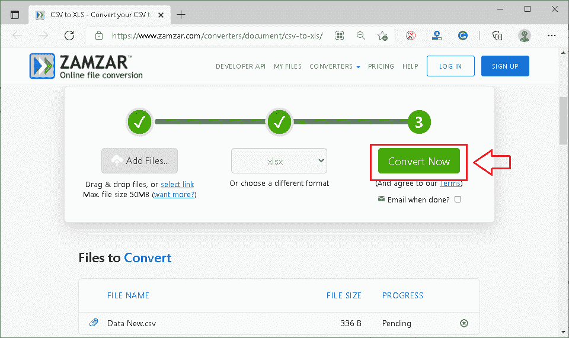

# CSV 到 Excel

> 原文：<https://www.javatpoint.com/csv-to-excel>

微软 Excel 或微软 Excel 长期以来一直是最强大和使用最广泛的电子表格程序之一。该程序是微软办公套件的附加办公产品。MS Excel 的一个主要特点就是支持几乎所有流行的文档格式。CSV 和 XLS/ XLSX (Excel 默认文件格式)是两种常用的用于存储数据的文件扩展名，这两种文件扩展名在 MS Excel 中都支持。然而，这两个扩展都有不同的数据存储方式。此外。xls 是 MS Excel 2003 及更低版本的默认文件扩展名，而。xlsx 是 Excel 2007 及更高版本中的默认文件扩展名。

由于 CSV 和 XLS 是常用的文件扩展名，有时我们可能需要将 CSV 文件转换为 Excel 默认格式，以便进行一些高级编辑。在本文中，我们将讨论一些将 CSV 快速转换为 Excel 的基本方法。但是，在讨论方法之前，让我们先简单介绍一下 CSV 和 XLS 文件:

**逗号分隔值(CSV):**CSV 文件通常存储纯文本，可以在任何文本编辑器和电子表格程序上轻松打开。它是通用的，因为它在不同的操作系统中很容易访问。尽管如此，存储在 CSV 文件中的数据还是用逗号分隔。

**Excel 电子表格(XLS 或 XLSX):** Excel 电子表格只能使用电子表格程序打开，如 MS Excel、Google Sheets、LibreOffice 等。它们不能通过普通的文本编辑器访问。除此之外，excel 电子表格还可以存储高级格式、函数、公式和其他 Excel 对象，如图像、形状、图表等。Excel 电子表格中的数据以行和列的形式存储，形成各种单元格和表格。

将 CSV 文档转换为 Excel 电子表格的方法有很多。然而，下面列出了最常见和最直接的方法:

*   [CSV 转 Excel 使用 MS Excel](#MS-Excel)
*   [使用文件浏览器将 CSV 转换为 Excel】](#File-Explorer)
*   [使用导入/插入](#Import-Insert)将 CSV 转换为 Excel
*   [使用在线工具将 CSV 转换为 Excel】](#Online-Tools)

#### 注意:强烈建议在转换过程中不要删除原始 CSV 文件。这是必不可少的一步，因为我们必须始终将转换后的 Excel 文件的数据与原始 CSV 文件进行匹配，以确保数据的准确性。

让我们详细讨论上面列出的每一种方法:

## 用微软 Excel 把 CSV 转换成 Excel

由于 MS Excel 支持 CSV 格式，我们可以通过它打开 CSV 文件。但是，在 Excel 中打开 CSV 文件不会将其转换为 Excel。因此，除非我们多做几个步骤，否则它不会有任何变化。

我们可以通过以下步骤直接使用 MS Excel 程序将 CSV 文件转换为 Excel:

*   首先，我们需要通过 windows 程序启动 MS Excel 程序。但是，微软 Excel 不是系统程序的一部分。因此，我们的设备上必须有微软办公套件才能使用微软 Excel。
    
*   接下来，我们需要导航到**【文件】**选项卡，然后从列表中单击**【打开】**选项。然后，我们需要去**【电脑】>浏览】**从设备存储器中找到想要的文件。
    
*   之后，我们必须使用“打开”对话框找到所需的 CSV 文件。要过滤 CSV 文件，我们可以选择选项**‘文本文件(*)。prn，*。txt，*。csv)'** 从右下角的下拉列表中选择。
    T3】
*   一旦我们选择了所需的 CSV 文件，MS Excel 将使用默认的数据格式设置打开它，并在新工作簿中显示相应的数据。
    
*   现在，我们可以导航到**文件>另存为**或者按快捷键**【F12】**打开“另存为”对话框。
    
    我们必须输入文件名，选择位置，选择文件类型为 **'Excel 工作簿(。xlsx)'** 并点击【保存】按钮将当前 CSV 保存为 Excel 格式。
    

## 使用文件资源管理器将 CSV 转换为 Excel

通过文件资源管理器直接打开 CSV 文件是使用设备上安装的所需软件的最快方法。如果选择默认程序打开 CSV 文件，我们需要双击 CSV 文件，用相应的软件打开。但是，我们必须为 CSV 文件设置一次默认程序。

以下是将微软 Excel 设置为 CSV 文件的默认程序，然后将 CSV 文件转换为 Excel 的步骤:

*   首先，我们需要在 Windows 资源管理器中选择所需的 CSV 文件，然后右键单击它。接下来，我们必须选择选项**‘用“**打开’来选择所需的程序以打开相应的文件。
    T3】
*   “打开方式”对话框一旦启动，我们必须从程序列表中选择**‘Excel(桌面)’**。此外，我们需要标记位于文本**前面的矩形框，请始终使用此应用程序打开。csv 文件'**。然后，调整设置后，我们需要点击**‘确定’**按钮来应用更改。
    
*   现在，我们需要双击任何要转换为 Excel 的 CSV 文件。最后在 MS Excel 中打开选中的文件。
    
*   一旦数据可见，我们必须导航到**【文件】>另存为“**或按快捷键**【F12】**启动“另存为”对话框。最后，我们必须选择文件类型**【Excel 工作簿】**并点击**【保存】**按钮。
    
    这样，对应 CSV 文件的副本会保存为 Excel 工作簿。
    

## 使用导入/插入将 CSV 转换为 Excel

我们通常使用这种方法将特定 CSV 文件中的数据导入到 Excel 新工作表或现有工作表中。但是，与上述两种方法不同的是，导入 CSV 数据并不只是在 Excel 中打开 CSV。相反，该方法将选定的 CSV 文件转换为。xls 或。xlsx，具体取决于 Excel 版本。

当 CSV 文件中的数据包含不同的分隔符、日期格式、前导零时，或者当我们想要查看数据的预览时，MS Excel 中的导入功能更加强大和准确。

以下步骤可用于使用导入功能将 CSV 转换为 Excel:

*   首先，我们需要打开一个新的 excel 电子表格或一个现有的电子表格，这取决于我们希望将 CSV 文件中的数据保存在哪里。然后，我们需要选择一个特定的单元格，并导航到**“来自文本的数据>”。**
    
*   接下来，我们需要找到所需的 CSV 文件并双击它。另外，我们可以选择相应的 CSV 文件，然后点击**‘导入’**按钮。要轻松定位 CSV 文件，我们需要选择**文本文件(*)选项。prn，*。txt，*。csv)从右下角的下拉列表中选择“**”。
    
*   选择 CSV 后，显示**“文本导入向导”**。接下来，我们必须选择所选文件中的原始数据类型和要开始导入数据的行号。我们选择“分隔”和“第 1 行”选项，如下所示:
    
*   我们必须在下一个窗口中选择分隔符和文本限定符。**分隔符**表示分隔 CSV 文件中值的字符。**文本限定符**表示文本中包含值的字符。不同的文件可能包含不同的分隔符和文本限定符。因此，我们需要相应地选择它们。我们可以在“文本导入向导”的底部看到数据的预览，以确保数据的正确性。
    
*   调整设置后，如果预览中的数据排列合适，我们必须点击**‘完成’**按钮。
    T3】
*   之后，我们需要选择保存导入数据的目标，例如新工作表或现有工作表。最后，我们必须点击**“确定”**按钮，然后点击**“保存”**按钮或**“Ctrl+S”**快捷键。导入的 CSV 数据将相应地保存到 Excel 中。
    

## 使用在线工具将 CSV 转换为 Excel

网络上有许多免费和付费的工具/软件，用户几乎只需点击一下就可以将 CSV 文件转换成 Excel。具体来说，用户只需要将需要的 CSV 文件上传到在线工具，等待转换即可。转换完成后，用户可以将转换后的文件下载到他们的设备上。

由于大多数在线工具也支持批量转换，因此在线工具可以帮助快速转换多个文件。使用在线工具将 CSV 文件转换为 Excel 的另一个好处是，可以通过网络浏览器在各种设备和平台上轻松访问这些文件。这样，在线工具更快、更通用、更易于使用。

以下是一些最流行的 CSV 到 Excel 在线工具:

### 扎姆扎尔

Zamzar 是最受欢迎的在线工具之一，可以帮助用户相应地将不同的文件格式转换成其他格式。该工具提供了一个简单的用户界面，并允许用户轻松地将其 CSV 文件转换为 Excel。用户可以从他们的设备中选择所需的 CSV 文件，或者输入/键入要从网站打开的链接。

Zamzar 允许用户批量转换文件。但是，在免费帐户中无法上传大小超过 50MB 的所需文件。此外，来宾用户还有一些其他限制。用户必须创建一个帐户来消除某些限制，或者购买高级计划来解除所有限制并充分利用工具的潜力。

以下是使用 Zamzar 工具将 CSV 转换为 Excel 的步骤:

*   首先，我们需要使用以下链接打开一个网页:
    链接到 Zamzar:[https://www.zamzar.com/converters/document/csv-to-xls/](https://www.zamzar.com/converters/document/csv-to-xls/)T3
*   接下来，我们需要使用**‘添加文件’**按钮选择所需的 CSV 文件，并将相应的文件上传到服务器上。
    T3】
*   之后，我们必须选择输出文件格式为 **XLS/ XLSX** 将上传的 CSV 文件转换为 Excel。
    T3】
*   一旦选择了所需的输出文件格式，我们必须点击**“立即转换”**按钮。
    
    文件自动转换为所需格式，屏幕上显示**【下载】**按钮。
    
    该按钮可让用户轻松将转换后的 Excel 文件保存到设备中。

### CloudConvert

CloudConvert 是另一个超级好用的在线工具。该工具支持各种文件格式，包括 PDF、XLSX、XLS、CSV 和 ODS。在将 CSV 转换为 Excel 时，CloudConvert 还允许用户调整一些参数，以获得更好的定制输出，例如页数、宽度、高度、质量等。

CloudConvert 使用户能够免费尝试大多数高级功能；但是，用户一天不能转换超过 25 个文件。要消除这一限制，用户必须根据自己的要求购买高级订阅。

以下是使用转换工具将 CSV 转换为 Excel 的步骤:

*   首先，我们需要使用以下链接打开一个网页:
    链接到 cloud convert:[https://cloudconvert.com/csv-to-xls](https://cloudconvert.com/csv-to-xls)T3
*   接下来，我们需要使用**‘选择文件’**按钮选择所需的 CSV 文件，如下图所示:
    
*   之后，我们必须从**“转换为”**文本旁边给出的下拉菜单中选择输出文件格式为**‘XLSX’**。
    
*   一旦选择了输出文件格式，我们必须点击**‘转换’**按钮将 CSV 文件转换为 Excel。
    T3】
*   转换完成后，我们可以使用**‘下载’**按钮下载转换后的文件。
    T3】

### 兑换

Convertio 是一个在线工具，可以帮助在线免费将文件从一种格式转换为另一种格式。虽然这种在线转换工具不如 Zamzar 或 ConvertCloud 那么受欢迎，但它可以完美地完成这项工作。Convertio 支持大约 2000 种不同的转换，包括几乎所有流行的文件格式。此外，该工具允许用户从设备、网络或云中选择所需的文件，如谷歌驱动和 Dropbox。

转换完成后，用户还可以下载转换后的文件或将它们上传回他们连接的云帐户。Convertio 的唯一缺点是，它允许用户在来宾帐户中转换最大 100 MB 的文件。然而，购买 Convertio 的溢价认购消除了所有限制。

以下是使用转换工具将 CSV 转换为 Excel 的步骤:

*   首先，我们需要使用以下链接打开一个网页:
    链接到 Convertio:[https://convertio.co/csv-xlsx/](https://convertio.co/csv-xlsx/)
    T4】
*   接下来，我们需要使用**‘选择文件’**按钮选择所需的 CSV 文件，如下图所示:
    
*   之后，我们必须保证输出文件格式选择正确，即**‘XLSX’**。如果没有，那么我们需要从下拉菜单中选择 XLSX 格式。
    T3】
*   接下来，我们需要点击**‘转换’**按钮，转换将自动开始。
    T3】
*   转换完成后，我们可以使用**‘下载’**按钮下载转换后的 excel 文件。
    T3】

**免责声明:使用上述任何在线工具时，我们不对数据安全负责，因为它们是第三方工具。建议阅读随附链接中的隐私政策或条款和条件，以了解特定工具如何使用上传到其上的文件数据。**

* * *