# Word 转 Excel

> 原文：<https://www.javatpoint.com/word-to-excel>

微软 Excel 或微软 Excel 是最强大和使用最广泛的电子表格软件之一，它帮助我们组织数据和执行大量操作。Excel 是微软办公套件的一部分。和 Excel 一样，MS Word 也是 MS Office 套件的一部分，它帮助我们创建文档。

由于 Word 和 Excel 都是广泛使用的文档类型，有时我们可能需要从 Word 文档中提取数据，并在 Excel 电子表格中使用。另一方面，我们可能需要将 Word 文档转换为 Excel 电子表格。因此，本文讨论了一些有助于轻松执行此任务的基本方法。但是，在讨论方法之前，让我们先简单介绍一下 Word 和 Excel 文档:

**微软 Word 文档(DOC/ DOCX):** 微软 Word 文档通常与 MS 字处理软件相关联。这种类型的文档可以包含不同形式的数据，例如文本、表格、图表、图像、视频、图表和许多其他对象。几乎所有操作系统都支持这种特定的文件类型。那个。doc 是 MS Word 2003 及更低版本的默认文件扩展名，而。docx 是 Excel 2007 及以上版本的默认文件扩展名。

**微软 Excel 电子表格(XLS/ XLSX):** Excel 电子表格文档只能使用电子表格软件访问，如 MS Excel、Google Sheets、Libre Office 等。这种类型的文档可以包含带有附加格式、函数、公式和其他 excel 对象的不同形式的数据。数据通常存储在联合形成表的行和列中。那个。xls 是 MS Excel 2003 及更低版本的默认文件扩展名，而。xlsx 是 Excel 2007 及更高版本中的默认文件扩展名。

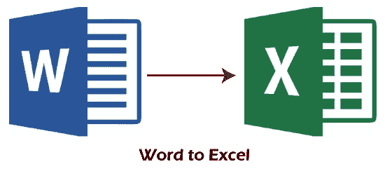

虽然有多种方法可以从 Word 文档中提取数据并将其导出到 Excel，但我们将最常见和最简单的方法分为以下几类:

*   [使用离线工具/软件将 Word 转换为 Excel】](#OfflineTools)
*   [使用在线工具/软件将 Word 转换为 Excel】](#OnlineTools)

#### 注意:建议从改动处保持原 Word 文档文件不变，这样转换后的 Excel 文件中的数据可以并排匹配，保证数据的准确性。

让我们详细讨论这两种方法，以了解将 Word 文档转换为 Excel 的过程:

## 使用离线工具/软件将 Word 转换为 Excel

如果我们在 MS Word 文件中有信息，并且我们需要在 MS Excel 电子表格中使用这些信息，复制和粘贴数据可能需要时间，尤其是当我们有大量数据时。相反，我们可以使用 Excel 本身离线执行这项工作，而不需要任何第三方软件。

为了消除数据泄露或其他安全问题，最好使用脱机方式将 Word 转换为 Excel。要离线将 Word 数据转换为 Excel，需要在 MS Word 中使用“另存为”功能，在 Excel 中使用“从文本导入”功能，一个一个的进行。整个过程包括以下步骤:

*   首先，我们需要打开一个要转换为 Excel 的特定 Word 文档，然后导航**【文件】>【另存为】**。然后，在“另存为”对话框中，我们必须从“另存为类型”旁边的下拉列表中选择选项**“纯文本”**。然后，我们需要点击**【保存】**按钮。
    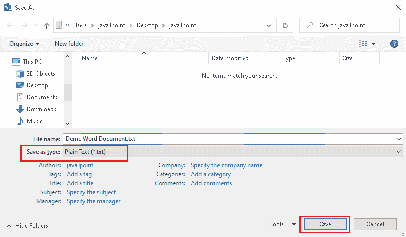
*   点击“保存”按钮后，我们需要在文件转换窗口中选择**“窗口(默认)”**选项，然后点击**“确定”**按钮。这将以纯文本形式保存 Word 文件。
    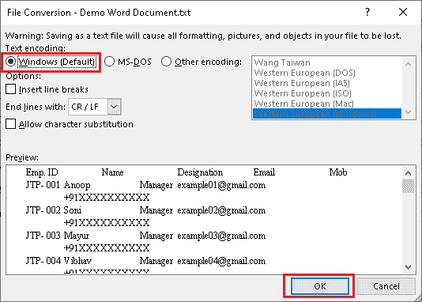
*   现在，我们需要启动 MS Excel 程序，导入 Word 文档数据。为此，我们需要导航到**“数据”>“来自文本”**，然后选择我们之前使用 MS Word 创建的文本文件。
    T3】
*   选择文本文件后，显示**“文本导入向导”**。接下来，我们必须选择文件类型和行号，以开始从所需的行导入数据。接下来，我们分别选择选项**【分隔】**和**【第 1 行】**。
    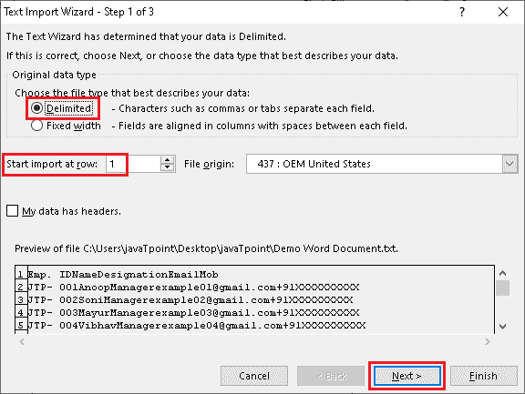
*   在下一个窗口中，我们必须选择分隔符和文本限定符。**分隔符**表示分隔 CSV 文件中值的字符。**文本限定符**表示文本中包含值的字符。不同的文件可能包含不同的分隔符和文本限定符。因此，我们需要相应地选择它们。我们可以在“文本导入向导”的底部看到数据的**预览，以确保数据的正确性。
    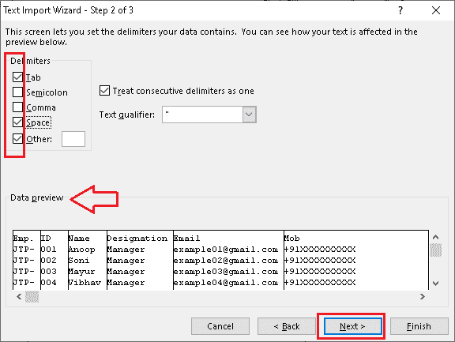**
*   接下来，我们必须指定列数据格式。我们可以选择**‘常规’**保留默认格式。进行必要的修改后，如果预览中的数据排列得当，我们需要点击**‘完成’**按钮。
    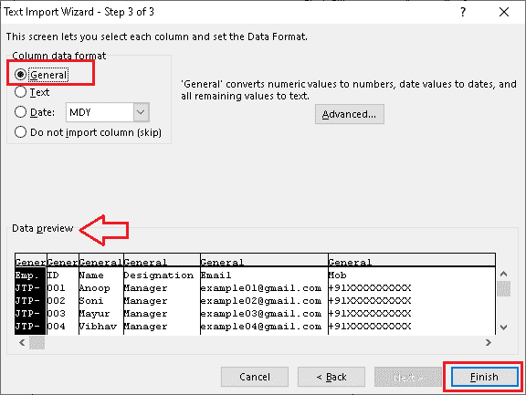
*   之后，我们必须选择保存导入数据的文件目标，例如新工作表或现有工作表。最后，我们需要点击**“确定”**按钮，然后点击**“保存”**按钮或**“Ctrl+S”**快捷键。导入的 Word 文件数据将相应地保存到 Excel 中。
    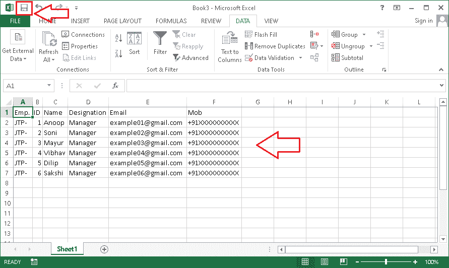

## 使用在线工具/软件将 Word 转换为 Excel

尽管在线方法可能会促使我们考虑数据安全问题，但它们速度快且易于使用。此外，将 Word 文档转换为 Excel 是点击次数最少的过程。网上有很多免费和付费的软件或工具可以把 JPG 转换成 Excel。使用在线软件的主要优点是，当它们通过网络浏览器工作时，我们可以在不同的平台和设备上自由使用它们。

以下是将 Word 转换为 Excel 的一些基本在线工具:

### Online2pdf

使用 Online2pdf 工具将 Word 文档转换为 Excel 是一个简单的过程。Oneline2pdf 是最准确、最值得信赖的在线工具之一，可以帮助用户将许多不同的文件格式转换为另一种格式。最好的一点是，这个工具是免费使用的，不会要求访客用户注册或注册。Online2pdf 工具主要是为了帮助用户执行各种 pdf 相关任务而开发的；然而，它已经获得了其他几个功能的更新，允许用户转换其他流行的文件格式。

Onlien2pdf 具有批处理支持，使得一次将多个文件转换为所需的文件类型变得更加容易。但是，来宾用户最多只能同时转换 20 个文件。另一方面，这个特殊的工具不允许用户上传或转换大小超过 100 兆字节(单个文件)/ 150 兆字节(所有文件加在一起)的文件。

**使用 Online2pdf 将 Word 转换为 Excel 的步骤**

*   首先，我们需要导航到以下链接来访问该工具:
    链接-[https://online2pdf.com/convert-word-to-excel](https://online2pdf.com/convert-word-to-excel)
    T4】
*   我们需要点击“选择文件”按钮，在下一个屏幕上选择所需的 Word 文件。这看起来像下图:
    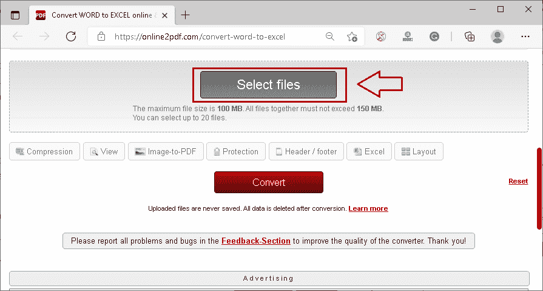
*   一旦选择了文件，我们必须从**旁边给出的下拉列表中选择输出文件格式为**‘Excel’**转换为:**文本。此外，如果需要，我们可以自定义其他首选项。
    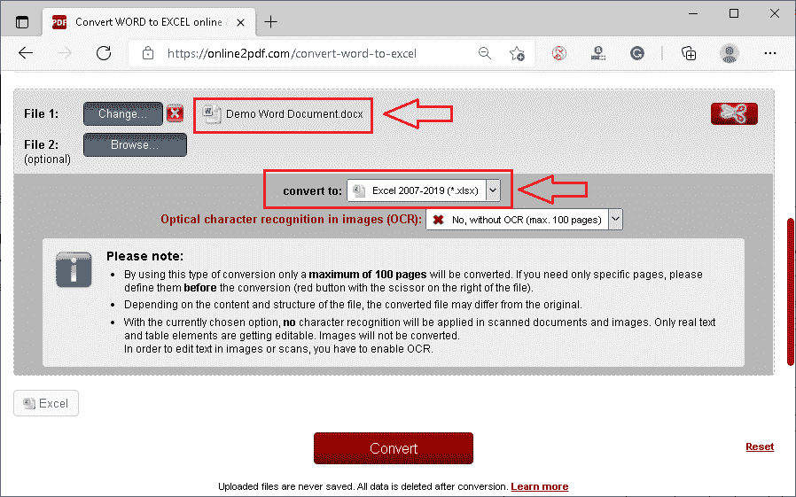
*   调整自定义后，我们需要点击**‘转换’**按钮，将 Word 文档转换为 Excel 电子表格。
    T3】
*   Word 文件将自动转换为 Excel，下载将立即开始。最后，我们必须允许浏览器将所需位置的文件下载到设备中。
    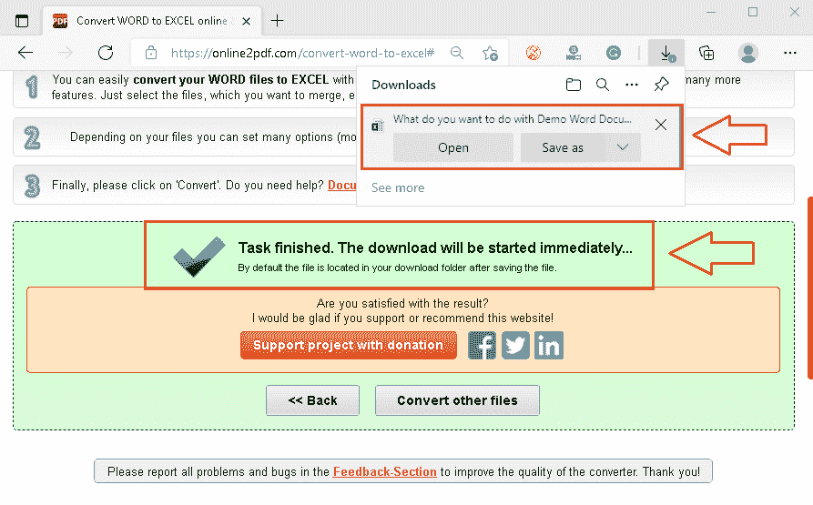

### 兑换

Convertio 是网络上另一个流行的工具，可以帮助用户将各种文件转换成其他格式。使用该工具的主要优势之一是，它允许用户从他们的设备、网络链接或像谷歌驱动和 Dropbox 这样的云上选择所需的 Word 文件。转换完成后，用户可以轻松地将转换后的文件下载到他们的设备或云帐户中。此外，该工具声称支持 2000 多种不同类型的文件转换。

Convertio 是免费提供的，但对客人用户有一定的限制。例如，它使来宾用户能够转换最大 100 MB 的文件。但是，用户可以购买 Convertio 的高级订阅，以消除某些限制。

**用 Convertio 将 Word 转换为 Excel 的步骤**

*   首先，我们需要导航到以下链接来访问该工具:
    链接-[https://convertio.co/doc-xls/](https://convertio.co/doc-xls/)
    T4】
*   接下来，我们需要点击**“选择文件”**按钮，选择所需的 Word 文件。
    T3】
*   选择 Word 文件后，我们必须选择**‘XLSX’**格式作为输出文件格式。我们可以很容易地从下拉菜单中选择这个，如下图所示:
    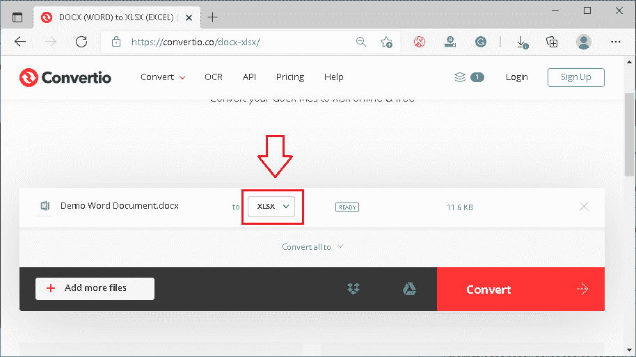
*   之后，我们必须点击**‘转换’**按钮，等待转换完成。
    T3】
*   转换完成后，我们需要点击**‘下载’**按钮将转换后的文件保存到我们的设备中。
    T3】

### 小 pdf

Smallpdf 是一个方便的在线工具，可以轻松执行不同的文件转换。该工具帮助用户从选定的文件中提取数据，并将其保存到另一个文件中。这样，用户还可以选择 Word 文件并提取数据，将其保存到 Excel 中。尽管 Smallpdf 做得很好，但它比上面提到的工具花费的时间多一点。这是因为该工具首先将 Word 文件转换为 PDF，然后再转换为 Excel。尽管如此，我们还是需要一个接一个地手动选择两种输出文件格式(即 PDF 和 Excel)。

Smallpdf 允许访客用户免费使用所有基本功能。此外，用户可以创建免费帐户来使用其他功能。

**用 Smallpdf 将 Word 转换为 Excel 的步骤**

*   首先，我们需要导航到以下链接来访问该工具:
    链接-[https://smallpdf.com/pdf-converter](https://smallpdf.com/pdf-converter)
    T4】
*   接下来，我们需要点击**“选择文件”**按钮来选择想要转换成 Excel 的 Word 文件。
    T3】
*   选择文件后，工具会在左侧窗口的预览面板中显示文件的提取数据。接下来，我们必须使用右侧窗口中的**‘下载’**按钮下载该提取数据的 PDF 文件。
    T3】
*   下载完成后，我们必须从底部点击**‘重新开始’**按钮开始新的转换。
    T3】
*   之后，我们必须用下载的 PDF 文件重复整个过程。我们一选择下载的 PDF 文件，工具就显示**‘Excel’**按钮，将 PDF 转换成 Excel。
    T3】
*   在下一个屏幕上，我们需要相应地选择所需的扫描技术。
    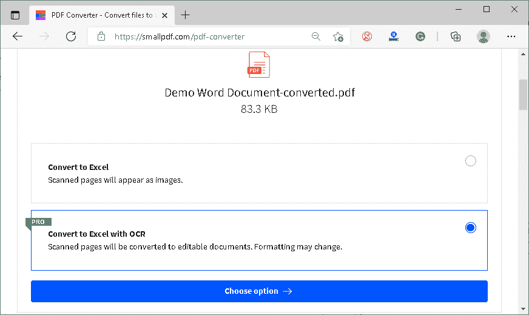
    之后，我们就可以从选中的 Word 文档中下载带有提取数据的 Excel 文件了。

**免责声明:使用上述任何在线工具时，我们不对任何与数据安全相关的问题负责。所有工具都完全由第三方开发和操作。因此，我们强烈建议用户查看条款&条件或每个工具的隐私政策，以了解特定工具如何使用上传到它的文件中的数据。**

* * *