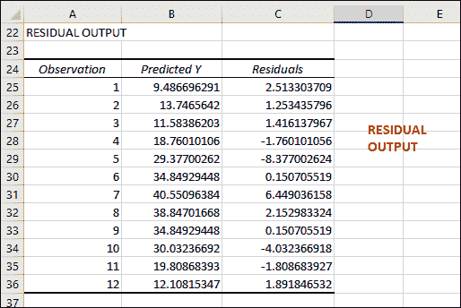
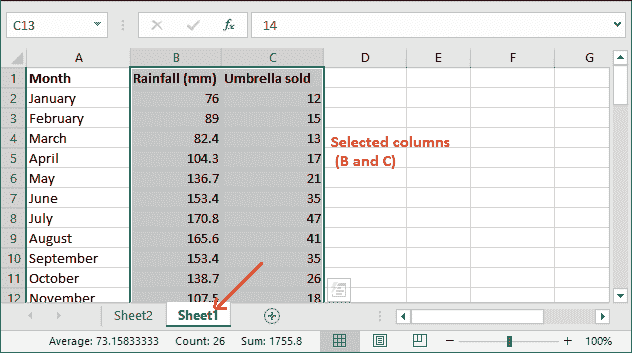

# Excel 中的回归分析

> 原文:[https://www.javatpoint.com/regression-analysis-in-excel](https://www.javatpoint.com/regression-analysis-in-excel)

回归分析是统计建模的一部分，用于估计两个或多个变量之间的关系。在 MS Excel 中，可以进行多种统计分析，包括回归分析。这是一个很好的选择，因为几乎每个计算机用户都可以访问 Excel。

Excel 提供了计算回归的内置方法。在 [MS Excel](https://www.javatpoint.com/excel-tutorial) 中，**数据**页签内的末尾有回归功能。您必须通过外接程序将此数据分析工具箱专门添加到您的 Excel 中。

#### 注意:Excel 用户不需要从网上安装数据分析工具箱。它在加载项中可用。

在深入之前，你必须知道——什么是回归分析？变量的类型以及更多基本的东西。我们将在本章中解释所有这些术语。所以，从头到尾读完这一章。

## 什么是回归分析？

回归分析是显示**因变量**和**自变量**之间的关系并产生方程的分析。这个方程由一个代表因变量和自变量关系的系数组成。

### 简单线性回归

在简单的线性回归中，一个变量的值用来描述另一个变量的值。被描述的变量称为因变量，而用于描述或预测因变量值的变量称为自变量。

#### 注:自变量和因变量是回归分析中最基本的两个术语。

## 回归中的变量类型

回归分析有两个变量:

1.  因变量(预测变量)
2.  自变量(解释变量)

**因变量**是我们试图理解和预测的因素。因变量的值因自变量而异。相比之下，**自变量**是那些影响因变量并有助于预测因变量值的因素。

### 真实场景

让我们用一个场景来理解回归分析的变量-

**例如，**我们有存储在 Excel 工作表中的 12 个月的销售数据。这个数据是 1 月到 12 月雨伞的销售数据。每个月的销售量因降雨量而异。雨伞在 7 月份销售最多，1 月份销售较少。

该 Excel 工作表包含三列:**月**(1 月至 12 月)**降雨百分比****售伞数量**(每月售伞总数)。


在这里，

**因变量:**保护伞

**自变量:**降雨量百分比

所以，雨伞是因变量，它的销量取决于每个月的降雨量百分比，这是一个自变量。当降雨量高或低时，雨伞的销售量会增加或减少。希望你已经理解了回归分析中的因变量和自变量。

### 验证是否安装了数据分析工具箱

现在，在继续下一步之前，确认**数据分析工具箱**已启用，并且在数据选项卡中可用。转到数据选项卡，最后检查功能区内的**数据分析工具箱**。请参见下面的截图:


如果未启用，请将其添加到您的 Excel 中以执行回归分析。


如果数据分析选项不可用，如上面的截图所示，请按照下面详细解释的步骤将其添加到您的 Excel 中。

## 启用数据分析工具箱

按照步骤在“数据”选项卡中启用数据分析工具箱。

**第一步:**在当前激活的 Excel 工作表中，转到 Excel 菜单栏中的**文件**。


**第二步:**越内？在左侧栏中，您将看到一个**选项**选项。点击它将打开一个包含各种设置的面板。


**第三步:**在 Excel 选项面板中，点击左侧边栏中的**插件**。


**第 4 步:**在这里，确认在**管理**下拉列表中选择了“Excel 加载项”。如果是，点击下拉按钮旁边的**转到**。


**第五步:**在 Excel 加载项对话框中，标记**分析工具箱**并点击**确定。**


**第 6 步:**关闭所有打开的额外选项卡，查看**数据分析**工具箱已经添加到**数据**选项卡中。


现在，您的 Excel 已经准备好对数据进行回归分析了。因此，我们现在将对上面定义的场景执行回归分析。

## 应用回归分析

现在，您将看到如何逐步对 Excel 数据执行回归分析。我们这里有这个数据。


**第一步:**在数据页签里面，点击前面步骤中添加了 Excel 的数据分析选项。


**第二步:**向下滚动，从列表中选择**回归**，点击该面板中的**确定**。


**步骤 3:** 现在，在回归对话框中配置以下设置。


*   在**输入 Y 范围**中，提供因变量的单元格引用。在我们的数据集中，保护伞是因变量，位于列 c。因此，单元格引用将是 **C2:C13。**
*   在**输入 X 范围**中，提供自变量的单元格引用。例如，在我们的数据集中，降雨量是列 b 中的自变量。因此，单元格引用将是 **B2:B13。**
*   如果在 X、Y 范围内包含标题单元格引用，请选中“标签”复选框。
*   从这里仔细选择一个输出选项。我们选择了**新工作簿层。**
*   最后，选中残差复选框，它将为您提供实际值和预测值之间的差异。

**第四步:**仔细输入所有这些需要的细节，点击**确定。**


它将在 Sheet2 中生成一个摘要，用于设置以下内容后的分析。

**第五步:**查看 Excel 回归分析创建的输出，观察。


最重要的是，这个汇总输出将包含回归统计、方差分析和残差输出。所有这些细节都在同一页。

## 解读回归分析结果

我们已经执行了回归分析，您已经注意到回归的执行非常容易。你不必做任何困难的事情，因为所有的计算都是自动进行的。完整的输出会随着语句一起自动生成。

计算很容易，但解释就没那么容易理解了。所以，这次是解读它的结果。您已经看到输出包含四个主要部分:回归统计、方差分析和残差输出。我们来分析一下:

**回归统计**

回归统计告诉你线性回归方程如何适合我们的数据。


让我们理解回归统计表中使用的术语。

*   **多重 R** 是**相关系数**，有助于衡量两个变量之间线性关系的强度。多重 R 值越高，意味着变量之间的关系越强。
    **1:** 强正关系
    **-1:** 强负关系
    **0:** 完全没有关系。
*   **R 平方**为**决定系数，**目前取值 0.9047。它代表着契合度。将第一个数字四舍五入到 90%，这足以符合我们的回归模型。这意味着 90%的因变量是用自变量来解释的。
    一般来说，R Square 值高比较好。
*   **调整后的 R 平方**是 R 平方的超前，针对自变量个数进行调整。它用于多重分析。
*   **标准误差**也是一个拟合优度的度量。对于较小的数字，回归方程将更加确定。
*   **观察**是你的模型中观察的总数。

**方差分析**

回归分析的下一部分是方差分析。然后用方差分析进行系数分段。


*   **Df** 指自由度。它与方差的来源相关联。
*   **SS** 指平方和。
*   **MS** 为均方。
*   **F** 是检验模型整体显著性的 F 统计量。
*   最后一个是**显著性 F** 即 F 的 P 值

方差分析表之后最重要的组成部分是系数。这允许用户在 Excel 中创建线性回归方程，即，

```

y = bx +a 

```

对于我们的数据集月份、降雨量和售出的雨伞，公式为:

```

y = Rainfall coefficient * x + Intercept

```

将表中的值放入以下公式:

```

y = 0.327*x-15.417

```

输入任意月份的 x =降雨量(毫米)。就像我们把一月份的降雨量，也就是 76。所以，

y= 0.327*76-15.417

y = 9.435

这是一月份雨伞销量的预测数字。同样，你可以通过降雨百分比来预测一个月内会卖出多少把伞。

**剩余输出**

最后一部分是残差，它显示了实际值和估计值之间的差异。如果你比较两个数值的结果，每个月售出的雨伞总数，你会发现两个数字之间会有细微的差异。



如果你将 1 月份实际销售的雨伞和它的预测价值进行比较。你会发现它们有细微的差别。

**1 月实际卖伞:** 12

**1 月卖伞预测值:** 9.486

实际值和预测值之间的差异可以在各自列的残差中看到。

12 - 9.486 = 2.514

您可以在残差输出表下匹配它。

### 制作线性回归图

您也可以制作一个图表，并在上面绘制值，以查看两个变量之间的关系。这样，画一个线性回归图。

**第一步:**在同一个 Excel 工作簿中打开 Sheet1，选择自变量和因变量的列以及标题。



**第 2 步:**导航到**插入**选项卡，在此您可以看到图表组。点击，然后选择**分散**(列表中的第一个)。为了便于操作，请遵循插入>图表组>分散。


**第三步:**一个散点图将被插入到你当前活动的工作簿中，看起来像这样-


**第四步:**现在，在这个绘制的图表中画一条最小二乘回归线。为此，右键单击该图表中的任意点，然后选择**添加趋势线？**从上下文菜单中选择。


**步骤 5:** 从面板格式趋势线右侧选择**线性**趋势线形状。


**第六步:**向下滚动格式趋势线面板，在图表上选择标记**显示方程，得到回归公式。然而，这个是可选的。**


现在，您可以看到回归方程已经创建。

**第七步:**现在，转到**填充&线**选项，自定义你喜欢的线。您可以从这里更改线条的颜色和类型。**例如，**用实线代替虚线。

*   首先，选择实线单选按钮，然后向下滚动。
*   将线条颜色更改为红色或任何您想要的颜色。
*   从**虚线类型**列表中选择实线。


请参见自定义线性回归图。


您可以对图表进行更多的改进，比如为图表提供轴标题(水平和垂直)。

* * *