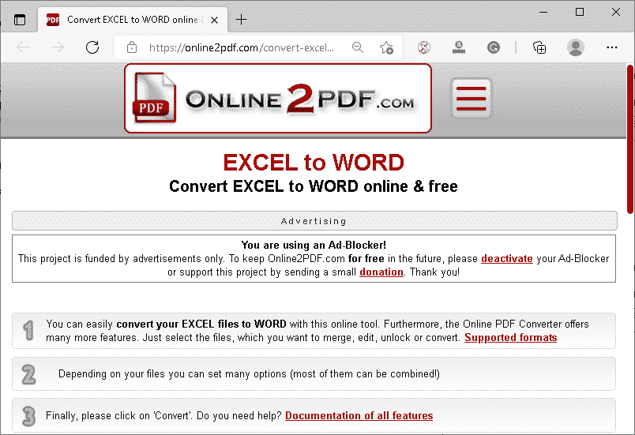

# Excel 转 Word

> 原文：<https://www.javatpoint.com/excel-to-word>

微软 Excel 和微软 Word 是微软办公套件附带的两个强大的程序。这两个程序分别广泛用于创建电子表格文档和 word 文档。虽然，正如我们所说，微软 Excel 和微软 Word 都是最常用的程序类型，但有时我们可能需要将 Excel 电子表格转换为 Word 文档。换句话说，我们可能需要从 [Excel](https://www.javatpoint.com/excel-tutorial) 文件中提取数据，然后保存到 Word 文档中。不幸的是，这两个程序都不提供相互之间的直接转换。

因此，本文讨论了几种有助于轻松执行 Excel 电子表格到 Word 文档的转换的替代方法。不过，在讨论一些方法之前，我们先简单介绍一下这两个程序，即 [Excel 电子表格](https://www.javatpoint.com/google-excel-spreadsheet)和 [Word](https://www.javatpoint.com/ms-word-tutorial) 文档:

**微软 Excel 电子表格(XLS/ XLSX):** Excel 电子表格将数据存储在由行和列组成的单元格中。每个单元格都有其唯一的地址，由字母(行参考)和阿拉伯数字(列参考)标识。电子表格软件可以访问这些文档，如微软 Excel、谷歌工作表、LibreOffice、OfficeCalc 等。默认情况下，MS Excel 2003 和更低版本使用 XLS 扩展存储数据，而 Excel 2007 和更高版本使用 XLSX 扩展存储数据。

**微软 Word 文档(DOC/ DOCX):** Word 文档使用各种文字处理软件创建，如 MS Word、LibreOffice 等。如果设备上安装了微软办公套件，此文件类型主要与微软 Word 应用程序相关联。微软 Word 文档可以存储图表、表格、图像、视频、声音和图表。所有操作系统都支持这些类型的文件。默认情况下，MS Word 2003 及更低版本使用 DOC 扩展名存储数据，而 Word 2007 及更高版本使用 DOCX 扩展名存储数据。

虽然有许多方法可以从 Excel 文件中提取数据并将其保存在 Word 文档中，但以下方法是最简单、最快速且准确度高的方法:

*   通过复制/粘贴将 Excel 转换为 Word
*   使用插入对象将 Excel 转换为 Word
*   Excel 转 Word 在线工具

#### 注意:强烈建议在数据与转换后的 Word 文件中的数据匹配之前，不要对原始 Excel 文件进行更改或删除文件，以确保数据的准确性。因此，最好保留原始文件的副本。

让我们详细讨论每种方法，以了解将 Excel 文档转换为 Word 文档的完整过程:

## 通过复制/粘贴将 Excel 转换为 Word

从 Excel 电子表格中复制数据并将其粘贴到 Word 文档中是提取数据特定部分的最简单、最直接的方法。

该方法包括以下基本步骤:

*   首先，我们需要使用任何电子表格程序打开相应的 Excel 电子表格，例如 MS Excel。然后，我们必须选择要在 Word 文档中使用的内容范围。例如，如果我们想使用 Excel 电子表格的所有内容，我们需要按下键盘快捷键**‘Ctrl+A’**来选择所有数据。一旦数据被选中，我们必须使用“复制”按钮或按下键盘快捷键**“Ctrl+C”来复制选中的数据。**
    
*   复制所需数据后，我们必须打开一个新的或现有的 Word 文档，并将光标放在我们想要放置复制数据的位置。接下来，我们必须右键单击并选择**“粘贴类型选项”**，以从剪贴板粘贴不同格式的数据。
    
    我们可以按下键盘快捷键**【Ctrl+V】**来粘贴默认格式的内容。
    
*   我们还可以使用复制/粘贴方法将 Excel 电子表格中的数据粘贴到 Word 文档中创建的表格中。为此，我们首先需要创建一个 Word 表格，然后从 Excel 中选择并复制数据，直接粘贴到表格中。
    
    一旦我们粘贴了数据，我们需要相应地保存(Ctrl+S)Word 文档。

## 使用插入对象将 Excel 转换为 Word

如果我们需要从整个 Excel 工作表中转换大量数据，复制和粘贴可能会更慢。此外，当我们将大量数据复制到剪贴板时，设备会变得缓慢，有时甚至会变得不稳定。因此，我们可以使用另一个替代选项，使用 Word 中的“插入”>“对象”功能轻松地将整个 Excel 工作表转换为 Word 文档。使用这种方法，我们甚至不需要打开 Excel 工作表。相反，我们在 Word 中将整个 Excel 工作表作为一个对象插入。

该方法包括以下步骤:

*   首先，我们需要打开一个 Word 文档，导航到**插入>对象，**如下图所示:
    
*   在下一个屏幕上，将显示“对象”对话框。在这里，我们需要点击**“从文件创建”**选项卡，然后使用**“浏览”**按钮找到所需的 Excel 文件。
    
*   找到所需的 Excel 文件后，我们需要选择文件并点击“插入”按钮。最后，我们必须点击**‘确定’**按钮。
    
    上图中，Excel 数据被提取/导入 Word 文档。然后，我们可以使用**‘保存’**按钮或按下**‘Ctrl+S’**快捷键来保存当前文件。

## Excel 转 Word 在线工具

使用在线工具将 Word 文件转换为 Excel 有助于我们自动化转换过程，节省时间。此外，许多转换工具支持批处理，允许我们同时将多个文件转换成所需的格式。

下面讨论一些将 Excel 转换为 Word 文档的基本在线工具:

### Online2pdf

Online2pdf 是最流行的在线转换器工具之一，允许用户将各种文件格式转换为其他格式。这个特殊的工具是完全免费的，不会强迫用户创建/注册账户。此外，Online2pdf 还支持批量转换，允许用户一次最多转换 20 个文件。但是，该工具不接受每个单独文件的大小超过 100 兆字节的文件，也不接受所有组合文件的大小超过 150 兆字节的文件。

**用 Online2pdf 将 Excel 转换为 Word 的步骤**

*   首先，我们需要转到以下链接来启动 Onlie2pdf 工具:
    **链接-**[【https://online2pdf.com/convert-excel-to-word】](https://online2pdf.com/convert-excel-to-word)
    
*   接下来，我们必须向下滚动到网页并点击**“选择文件”**按钮。接下来，我们必须选择要转换为 Word 文档的特定 Excel 文件。
    T3】
*   选择文件后，我们需要从位于**旁边的下拉列表中选择输出文件格式为**‘Word’**的文档，转换为:**文本。同样，我们可以根据需要调整其他首选项。
    
*   进行必要的更改后，我们必须点击**‘转换’**按钮开始转换。
    T3】
*   在下一个屏幕上，Excel 文件将转换为 Word 文档，下载将立即开始。我们可以相应地保存转换后的 Word 文档。
    

### 兑换

顾名思义，Convertio 是另一个在线转换器工具，可以帮助将文件从一种格式转换为另一种格式。然而，这个工具有一些高级选项，允许用户从不同的来源选择他们想要的文件，如本地设备、网络链接、谷歌驱动和 Dropbox。同样，用户也可以在将文件转换到本地设备或云(如谷歌驱动或 Dropbox)后下载这些文件。

Convertio 是一个免费的在线转换器；但是，它有一定的局限性。该工具只允许用户转换大小不超过 100 兆字节的文件。要取消此限制或扩展此工具的功能，用户必须购买兑换的高级会员资格。Convertio 声称支持 2000 多种不同类型的文件转换，值得一试。

**用转换将 Excel 转换为 Word 的步骤**

*   首先，我们需要转到以下链接来启动 Convertio 工具:
    **链接-**[https://convertio.co/xls-doc/](https://convertio.co/xls-doc/)
    
*   网页显示后，我们需要点击**“选择文件”**按钮选择要转换的特定 Excel 文件。
    T3】
*   选择好想要的 Excel 文件后，我们必须从下拉列表中选择输出文件类型为**‘DOCX’**文档，如下图:
    
*   一旦文件被选中，我们需要点击**‘转换’**按钮开始转换。
    T3】
*   一旦转换完成，下载按钮就会显示在网页上。我们可以使用**“下载”**按钮下载转换后的 Word 文档。
    T3】

### PDFConvertOnline

PDFConvertOnline 是一个方便的在线工具，有助于轻松执行不同的文件转换。该工具会自动从选定的文件中提取数据，并将其保存到所需的输出文件中。这样，我们可以选择特定的 Excel 电子表格，并将其转换为 Word 文档。

PDFConvertOnline 支持批量转换；但是，单个文件的大小不得超过 40 MB。这个在线转换器会尝试缩小每个选定的 Excel 电子表格，使其适合一个 Word 页面，这样 Excel 电子表格的所有布局都会正确地放置在 Word 文档中。

**用 PDFConvertOnline 将 Excel 转换为 Word 的步骤**

*   首先，我们需要转到以下链接来启动 PDFConvertOnline 工具:
    **链接-**[https://www.pdfconvertonline.com/excel-to-word/](https://www.pdfconvertonline.com/excel-to-word/)
*   我们需要将所需的 Excel 文件拖放到网页上显示的框中。此外，我们可以点击这个框，使用窗口资源管理器手动选择文件。
    
*   选择文件后，我们必须确保输出文件格式设置为“DOCX”。如果没有，我们需要点击选项**‘DOCX’前给出的单选按钮。**
    
*   接下来，我们必须点击**“转换结果”**框下的转换文件名，才能下载转换后的 Word 文档。
    T3】

### DocSoSo

DocSoSo 是一个免费的在线转换器，支持大多数流行的文件格式。我们不需要安装任何软件或插件来使用这个在线工具。该工具提供了几种有用的转换，如图像转换、Word 转换、Excel 转换、PPT 转换等。所有这些应用程序都是完全免费的，可以通过网络浏览器轻松访问。此外，该工具具有最少的选项和简单的界面，使其成为初学者的好选择。

**用 DocSoSo 将 Excel 转换为 Word 的步骤**

*   首先，我们需要转到以下链接来启动 DocSoSo 工具::
    **链接-**[http://www.docsoso.com/excel/excel-to-word.aspx](http://www.docsoso.com/excel/excel-to-word.aspx)
*   接下来，我们需要使用**“选择文件”**按钮选择需要转换的 Excel 文件。
    T3】
*   之后，我们必须点击**‘转换’**按钮，等待转换完成。
    T3】
*   转换完成后，我们需要点击**“下载文件”**按钮，将相应的文件保存到我们的设备上。
    
    此外，如果需要，我们可以在转换后从工具中删除文件。

### 小 pdf

Smallpdf 是网络上另一个方便的工具，允许用户转换一些流行的文件类型。该工具有一个简单的用户界面，用户无需支付任何费用。但是，用户可以在 Smallpdf 上注册一个帐户，以获得扩展支持和功能。

尽管 Smallpdf 主要是为了执行大多数与 pdf 相关的任务而设计的，但该工具也支持一些其他转换。但是，这个特殊的工具分两步将 Excel 文件转换为 Word。首先，它将选定的 Excel 文件转换为 PDF，然后转换为其他格式，如 Word 文档。因此，与网络上的其他类似工具相比，它需要稍微多花一些时间。

**用 Smallpdf 将 Excel 转换为 Word 的步骤**

*   首先，我们需要转到以下链接来启动 Smallpdf 工具:
    **链接-**[https://smallpdf.com/pdf-converter](https://smallpdf.com/pdf-converter)
*   然后，我们必须使用**“选择文件”**按钮选择所需的 Excel 文件，并等待工具处理文件并显示数据预览。
    T3】
*   工具左侧显示数据预览，右侧提供**‘下载’**按钮。默认情况下，该工具会自动将选定的文件转换为 PDF。因此，我们首先需要使用这个“下载”按钮下载这个 PDF 文件。
    T3】
*   下载相应的 PDF 后，我们必须在工具上再次上传该文件。为此，我们需要点击**‘重新开始’**按钮，如下图所示:
    
*   接下来，我们需要选择下载的 PDF 文件。选择 PDF 文件后，工具显示文本为**‘转 Word’的按钮。**我们必须按下这个按钮。
    T3】
*   之后，我们需要选择所需的扫描技术，并将转换后的 Word 文件下载到本地设备。
    

**免责声明:我们强烈建议用户浏览每个工具的条款&隐私页面，了解他们关于每个工具如何使用用户上传到它的文件中的数据的政策。由于所有工具都是由第三方开发人员开发和管理的，因此我们不对任何数据丢失负责。**

* * *