# 如何在 Excel 中取消隐藏行？

> 原文：<https://www.javatpoint.com/how-to-unhide-rows-in-excel>

本章基于在 Excel 中取消隐藏行。Excel 允许用户隐藏和取消隐藏 Excel 电子表格的行。当一行被隐藏时，它的数据不会显示给用户。因此，每当您不想显示特定行或列的数据时，您需要取消隐藏它们。

Excel 支持多种取消隐藏行的方法。例如，您可以一次取消隐藏单个行、多个行或所有隐藏行。我们将在本章中描述所有可能的方法。

## 如何知道行是隐藏的？

要取消隐藏任何特定行，您应该知道隐藏了哪一行。您可以查找行号，并检查跳过了哪个编号。

**例如**，如果数字 5 6 没有显示在 4 和内部行号之间，则表示行 5 被隐藏。您还会看到隐藏行的双线。

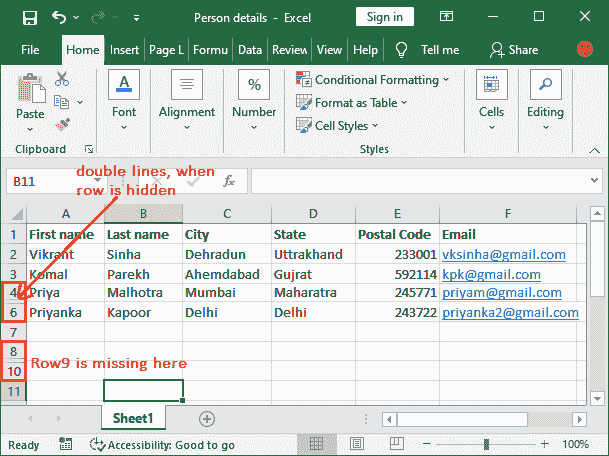

在整个工作表中查找每个隐藏行可能是一个忙乱而漫长的过程。因为，可能会有多行隐藏在不同的位置。因此，逐个查找所有隐藏的行将是一个耗时的过程。

在这种情况下，可以直接使用“**取消隐藏所有行**”的方法，而不是查找隐藏行。Excel 使该方法能够在不知道隐藏行的情况下同时启用所有隐藏行。因此，您不需要逐个查找和取消隐藏每个隐藏行。

## 取消隐藏行的方法

Excel 提供了几种以不同方式取消隐藏行的方法。您可以根据需要取消隐藏该行，可以是单个行，一次取消隐藏所有行，也可以只取消隐藏第一行。我们将讨论以下内容-

1.  [取消隐藏单个行](#individual)
2.  [取消隐藏所有隐藏行](#all-hidden)
3.  [取消隐藏第一行](#first)
4.  [取消隐藏一系列行](#range)
5.  [通过增加行高](#increasing)取消隐藏行

这些方法中的每一种都以不同的方式工作，以达到相同的结果。

## 取消隐藏单个行

有时 Excel 工作表只包含一两行隐藏行。因此，这是一种专门取消隐藏单个行的好方法。为此，首先找到隐藏的行，然后取消隐藏它。

### 查找和取消隐藏隐藏行的步骤

**步骤 1:** 在行标题内部(面板左侧)，查找两行之间跳过的行号。

#### 提示:每当隐藏一行时，您还会在行标题内的两行之间看到一条双线。

**第二步:**将光标放在行标题中的隐藏部分，并将其拖动到下方。

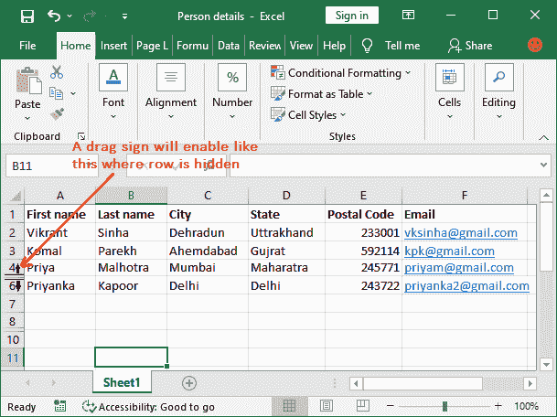

**第三步:**除此之外，还可以右键点击行首之间的空格，然后从列表中选择**取消隐藏**选项。

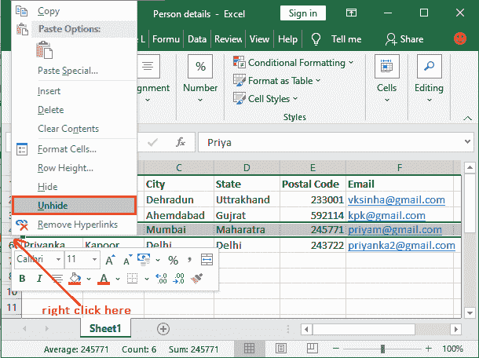

**第四步:**你会看到之前隐藏的行现在取消隐藏了，它的数据也是可见的。两种方法将提供相同的结果。

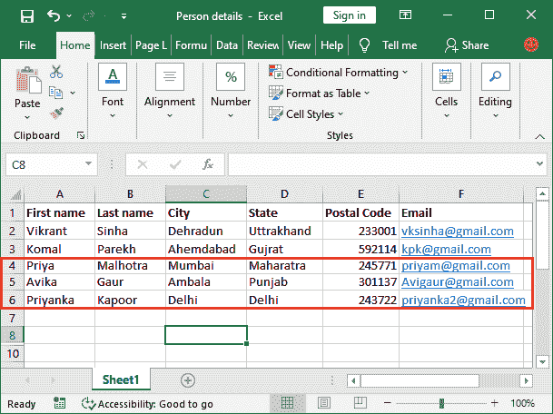

保存新的修改后的 Excel 工作表，以使更改永久保留。但是，这需要单独取消隐藏每行。

#### 注意:在 Excel 工作表中，连续行的范围也可以隐藏，例如第 5 行到第 11 行。

## 取消隐藏所有行

使用这种方法，我们可以一次取消隐藏 Excel 电子表格的所有隐藏行。找到整个工作表中隐藏的行，然后逐个取消隐藏，这样既省时又省力。

请按照以下步骤操作-

**第一步:**打开目标 Excel 表，点击**全选**按钮(行和列标题之间有一个三角形)。

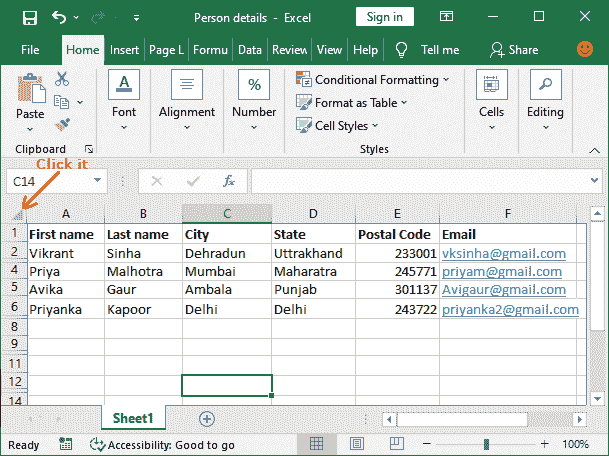

将选择整个工作表。但是，您可以单击任意单元格，然后按 **Ctrl+A** 选择整个工作表。

**步骤 2:** 在**主页**选项卡中，单击**格式**下拉按钮(位于单元格部分)。

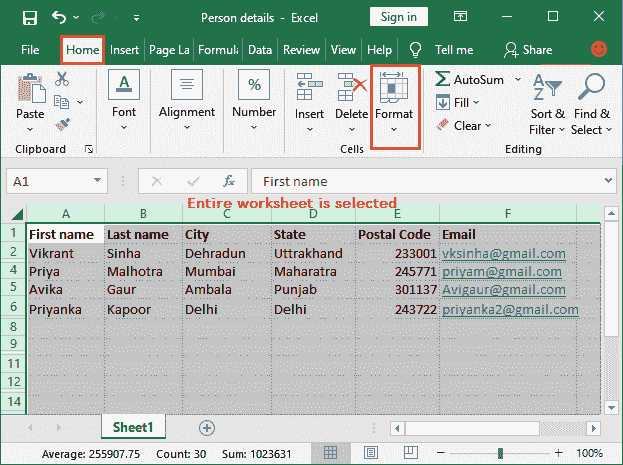

**第三步:**将鼠标放在下拉列表中的**隐藏&取消隐藏**选项上，然后从另一个子下拉菜单中单击**取消隐藏行**。

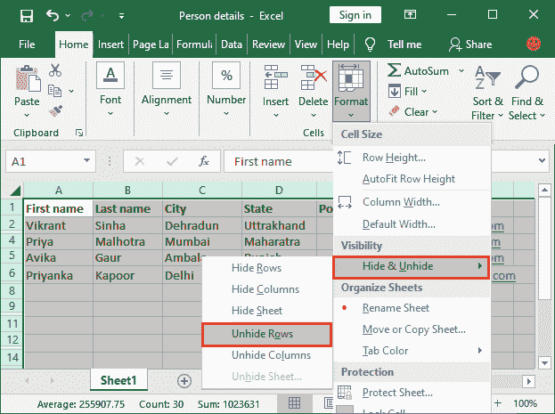

**第四步:**点击这里的“取消隐藏行”后，所有隐藏的行将被取消隐藏。

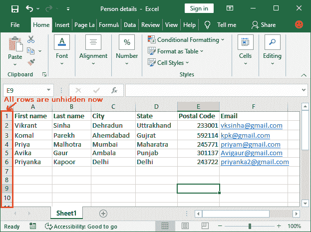

现在，按 **Ctrl+S** 快捷键保存修改后的文件。使用相同的步骤，您也可以通过选择**取消隐藏列**来取消隐藏列，而不是最后取消隐藏行。

#### 注意:如果某处的行以连续的方式隐藏(第 5 行到第 13 行)，此方法不会取消隐藏它们。对于这种类型的隐藏行，您必须使用另一种方法。

## 取消隐藏第一行

有时，您会看到只有 Excel 工作表的第一行是隐藏的。取消隐藏第一行或第一列有点棘手，因为无法选择该行或列。但是，您可以使用**取消隐藏所有行的方法**取消隐藏第一行，但它会与第一行一起取消隐藏所有隐藏的行。所以，如果你只想要第一行取消隐藏，这个方法不是一个好的选择。

以上两种方法在这里都行不通。因此，我们必须寻找另一种方法。有点复杂，但也没那么复杂。我们会让你轻松的。

我们有**两种方法**:**名称框和前往**。这两种方法都简单易行。

### 使用名称框

我们可以从名称框中取消隐藏第一行或第一列。以防第一行或第一列被隐藏。

1.  在我们的工作表中，看到第一行是隐藏的。
    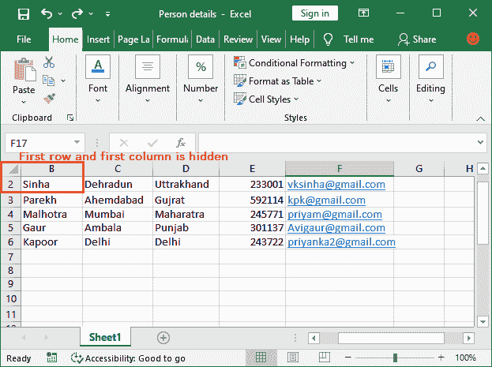
2.  在你的目标 Excel 表中，进入名称框，输入 **A1** 。
    T3】
3.  现在，只需按下**进入**键，你的第一个隐藏行/列将自动取消隐藏。
    T3】

### 使用转到

使用转到方法，按照步骤取消隐藏 Excel 工作表的第一行。

1.  按下 **Ctrl+G** 这样打开转到面板。
    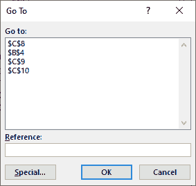
    你也可以从这里找到这个选项**首页>找到&选择>转到**。
2.  在**参考框**中，输入 **A1** ，点击**确定**。
    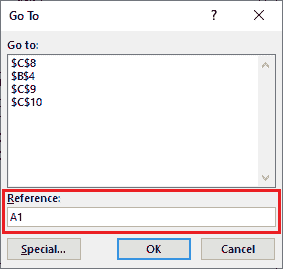
3.  您将看到您隐藏的行/列现在是可见的。此方法适用于第一行和第一列。
    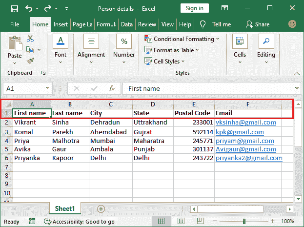

## 取消隐藏一系列行

到目前为止，我们讨论的方法无助于取消隐藏行，这些行是连续隐藏的。**例如**，第 6 行到第 10 行之间的 4 行连续隐藏。

为此，Excel 启用了一种不同的方法。使用它可以取消隐藏这些类型的隐藏行。

1.  在下面的截图中看到这里隐藏了几行。(行 4 至行 8)
    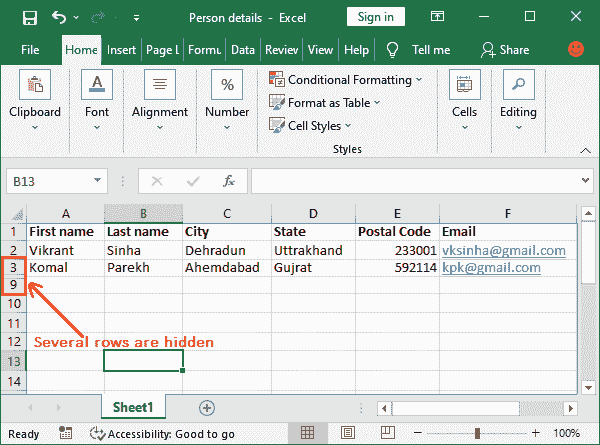
2.  按住 **Shift** 键，从行标题中选择两行:一行在隐藏行上方，另一行在隐藏行下方。**例如**，第三排和第九排。
    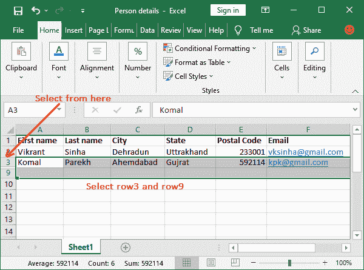
3.  右键单击所选行中的一行，然后单击此处的**取消隐藏**选项。
    T3】
4.  请注意，现在所有行都已取消隐藏，数据也可见。
    

#### 提示:如果您试图通过选择和拖动来取消隐藏连续的隐藏行，但一次只能取消隐藏一行。

## 使用行高属性取消隐藏隐藏行

这是取消隐藏行的最佳方法之一。此方法适用于所有类型的隐藏行，例如单个隐藏行、几个连续的隐藏行、不同位置的多个隐藏行。我们将通过增加行的高度来取消隐藏行。

#### 注意:此方法将隐藏除第一行之外的所有类型的行。

行的默认高度是 15.0 (20 像素)。因此，将所有行的高度设置为 15.0。请参见下面的步骤。

**第一步:**点击 Excel 工作表中的**全选**按钮，行和列标题之间有一个三角形。

**步骤 2:** 已选择整张纸。现在，右击它，在这里选择**行高**选项。

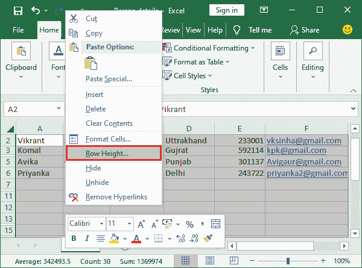

**第三步:**一个小向导会这样打开，输入行高 15.0，点击确定。

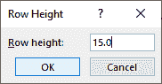

现在，除了第一行，所有隐藏的行都被取消隐藏了。第一行未取消隐藏。

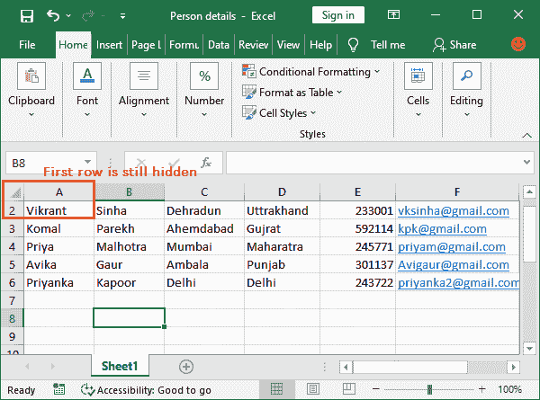

* * *