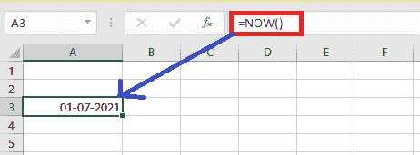

# Excel 中的当前日期

> 原文：<https://www.javatpoint.com/current-date-in-excel>

在许多情况下，我们必须在单元格中输入当前日期。但是，我们也可以手动键入。如果我们需要经常输入日期，有时会变得很无聊。幸运的是，有一些关键词快捷方式和功能可以让事情变得更快。让我们详细讨论一下。

## 当前日期关键字快捷方式

如果我们输入***Ctrl+；*** 然后它会给我们当前日期进入活动单元格。在编辑模式下，这个快捷方式也可以用来将硬编码数据包含到我们的公式中。


## 当前时间键盘快捷键

如果我们进入***Ctrl+Shift+；*** 它会给我们当前进入活跃细胞的时间。这个快捷方式也可以在编辑模式下使用，它可以用来将硬编码的日期合并到我们的公式中。


## 功能

Excel 中有两个函数会给我们提供日期和时间。

这些函数是不稳定的，这意味着对 Excel 工作簿的任何修改都会提示它们重新计算。通过使用 F9，我们还可以让他们重新计算。这表示日期和时间将始终根据当前日期和时间更新。

### 今日函数

TODAY 函数是一个非常容易的函数，在 **TODAY** 函数中，没有参数。根据用户的电脑设置，该功能将返回当前日期。

当我们要求在工作表上显示当前日期时，不管工作簿何时打开，TODAY 函数都很有用。它还能计算间隔。假设我们知道有人出生于 1989 年。我们可以用下面的公式来计算他们今年生日的年龄。

```

= YEAR( TODAY())1989

```

上面的公式使用 TODAY 函数作为 YEAR 函数的参数或自变量来获取当前年份，然后减去 1989，返回该人的年龄。

**语法**

```

=TODAY()

```


这表明，如果该函数包含在工作表中并发送给不同时区的其他人，结果可能会有所不同。

#### 注意:关于 excel 中的 TODAY 函数，我们必须知道一些重要的事情:

1.  TODAY()是一个可变函数，这意味着每当打开或编辑工作表时，它都会不断更新。
2.  如果我们需要插入当前的日期和时间，我们必须使用另一个名为 **NOW()** 的函数来代替 **TODAY()。**
3.  如果 TODAY 公式没有自动更新，我们的工作簿可能会关闭自动重新计算。为了再次打开，我们必须进入**公式选项卡>计算选项**并从下拉菜单中选择**自动**。

### 现在功能

**NOW** 功能也是一个没有参数的轻松功能。根据用户的电脑日期和时间设置，该功能将返回当前日期和时间。同样，结果会因时区而异。通过对**现在**返回的结果应用数字格式，我们可以将其转换为日期或带有时间的日期。在 excel 中，表示当前日期和时间的数字。

**语法**

```

=NOW()

```



## Excel 提示-插入静态日期或动态日期

### 插入静态日期

在 Excel 工作表中，静态值是在重新计算或访问公式或工作表时不会修改的值。

1.  在工作表上，我们必须首先；选择应该输入当前日期的单元格。
2.  为了插入当前日期，我们必须输入**Ctrl+；**

如果我们想插入当前时间并保持不变。那么在这种情况下，我们就要进入**Ctrl+Shift+；**

### 插入动态日期

在某些情况下，我们可能需要插入一个日期或时间，其值会自动更新。为了返回一个动态的日期或时间，我们可以使用两个函数“TODAY”和“NOW”。

1.  在工作表上，首先我们必须选择需要插入当前日期的单元格。
2.  接下来，要将当前日期作为动态日期插入，我们必须在空白单元格中输入以下函数，然后按回车键:

**=TODAY()**

要将当前时间作为动态字段插入，我们必须在空白单元格中输入以下函数，然后按回车键:

**=NOW()**

## 如何更改日期和时间的格式

如果电子表格中的日期或时间格式需要更改，我们可以这样做。为了做到这一点，我们必须输入 **F1、**或者我们可以右击单元格并点击名为**的选项格式化单元格**。当“设置单元格格式”框显示在屏幕上时，我们可以单击数字，然后选择日期或时间，并选择我们希望应用于电子表格的格式。

## 如何将日期转换为不同格式的文本字符串

Excel 的 TEXT 函数将日期转换为文本值没有问题，因为它们本质上是序列号。为文本日期指定正确的显示格式可能是最困难的部分。

下列数据代码被微软 Excel 识别。

### 月份:

*   **m: -** 不以零开始的月数。
*   **mm: -** 以零开始的月数。
*   **mmm: -** 月份名称的简称，如 Feb
*   **mmmm:-** 月份名称的完整形式，如二月。
*   **mmmmmm:-**月为第一个字母，如 J 代表六月和七月。

### 天数:

*   **d: -** 不以零开始的天数。
*   **dd: -** 日数以零开始。
*   **ddd: -** 星期几的缩写，例如，Mon。
*   **dddd: -** 一周中某一天的完整名称，例如，星期一。

### 年

*   **yy: -** 两位数年份
*   **yyy-** 四位数年份

为了以我们需要的方式精确地显示转换后的文本日期，我们可以使用各种分隔符来划分日期代码，如逗号(，)、冒号(:)、斜杠(/)、破折号(-)，等等。以下是一些例子:

*   **“mm/DD/yyyy”-**美国使用的日期格式显示为 06/04/2021。
*   **“DD/mm/yyyy”-**世界其他地区使用的日期格式显示为 04/06/2021。
*   **“DD-mmm-YY”-**显示为 06-4-21。
*   **“dddd，mmmm d，yyyy”-**完整日期，包括星期几，显示为 2021 年 4 月 06 日星期二

例如，如果我们在 Excel 中有一列美国日期，并希望将其导出为. csv 文件供我们的英国合作伙伴使用，出于礼貌，我们可以将日期转换为英国格式:

**=TEXT (A1，“mm/DD/yyyy”)**

***下面是一些更多的公式示例及其结果:***

| 日期 | 公式 | 文本字符串 |
| 2021 年 7 月 2 日 | =TEXT(A2，“毫米/日/年”) | 02/06/2021 |
|  | =TEXT(A2，“日/月/年”) | 06/02/2021 |
|  | =TEXT(A2，“日-月-年”) | 2021 年 7 月 2 日 |
|  | =TEXT(A2，“dddd，mmmm d，yyyy”) | 2021 年 7 月 2 日星期五 |

* * *