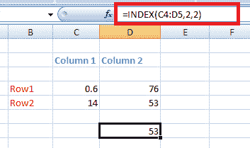
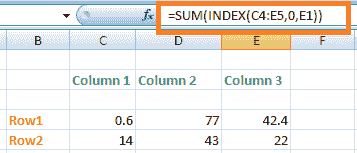
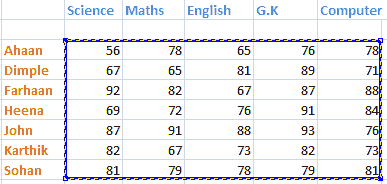

# Excel 中的索引函数

> 原文：<https://www.javatpoint.com/index-function-in-excel>

## 什么是 INDEX 函数？

表中的 INDEX 函数用于返回给定范围或数组中的值或引用值。这意味着 INDEX 函数有两种格式。其给出如下:

*   数组格式
*   基准格式

### 数组格式

当我们想要返回指定数组的值时，使用数组格式。

数组格式的公式如下:

INDEX(数组，row_num，[col_num])

哪里，

**数组**:是指定的单元格数组。

**row_num** :表示单元格数组中的行数。

**col_num** :表示单元格数组中的列数。

INDEX 函数的列号是可选的。如果函数中没有列的要求，它可以设置为零或返回。

### 基准格式

当我们想要返回一个带有单元格引用的值时，使用数组格式。

参考格式的公式如下:

INDEX(引用，row_num，[col_num]，[area_num])

哪里，

**引用**:是函数中一个或多个单元格的引用。我们可以直接在函数中插入单个或多个区域。但是，各个区域应该用括号括起来，并用逗号隔开。

**row_num** :表示单元格数组中的行数。

**col_num** :表示单元格数组中的列数。

**area_num** :区域编号表示在 INDEX 函数中指定的多个范围中要使用的特定范围。

INDEX 函数与 excel 中的 vlookup 函数不同。但是，我们可以说，它可以用作替代 vlookup 命令的替代方法。这

## 使用 INDEX 函数的目的

我们已经讨论了索引函数及其两种格式。但是，它是用于什么目的呢？索引函数用于在表列表中查找特定的值。在函数内部，我们可以指定需要定位的值的位置，因为在具有大量数据的表中很难定位特定的值。

### INDEX()返回什么值？

INDEX 函数返回指定位置的值。这意味着我们在函数中声明的任何位置(如行号、列号)都将返回指定位置的值。

### INDEX 函数是如何工作的？

让我们借助一个例子来讨论一下。考虑下表。

让我们从给定的表中找出值 53。步骤如下:

1.  单击给定表格之外的任何单元格。
2.  现在，我们必须键入 INDEX 函数，它被计算为 INDEX(reference，row_num，col_num)。
    *   作为参考，从表格的第一个元素开始到最后一个元素，用鼠标将给定表格的数据括起来，如下图:
        
        这里，根据所选表格的参考将是 C4:D5。
3.  键入要查找的元素所在的行号和列号。
4.  行号和列号是相对于所选表测量的，以供参考。这意味着二进制数和列数不依赖于 excel 工作表左栏上的数字。
5.  在公式栏上拖动鼠标，计算索引函数内的值，如步骤 2 中所述。它将在公式栏上显示为:“=INDEX(C4:D5，2，2)。”
    
6.  按**进入**。该值将出现在指定的单元格中，这是指定的行和列相交的结果。因此，53 是第 2 行和第 2 列相交的值。

同样，该表的其他值可以表示为:

*   =INDEX(C4:D5，1，1)'

值= 0.6

行 1 和列 1 的交集

*   =INDEX(C4:D5，1，2)

值= 76

行 1 和列 2 的交集

*   =INDEX(C4:D5，2，1)

值= 14

行 2 和列 1 的交集

如果两行和列之间有单元格空间，将被视为空行或空列。因此，我们还需要计算那一行和那一列。

例如，

上表有两列**和三行**。这是因为两列和两行之间有一个单元格空间，这是默认情况下考虑的。因此，我们应该避免中间的空间。

INDEX 函数可用于恢复单个值或整个行或列。我们将在本主题的后面讨论这些例子。

### INDEX 与 SUM 函数的关系

如上所述，INDEX 函数用于在给定的数组或表中查找一个值。SUM 函数用于计算指定值的总和。但是，这两者有什么关系呢？

在 SUM 函数中声明的 INDEX 函数可以计算在声明的行或列中指定的值的总和。它由下式给出:

**SUM( INDEX(引用，row_num，[col_num])**

我们来讨论一个例子。考虑下表。

这里，我们将计算表中所有数字的总和。请考虑以下步骤:

1.  单击给定表格之外的任何单元格。
2.  现在，我们必须键入 INDEX 函数，该函数的计算方式是 SUM( INDEX (reference，row_num，[col_num])。
    在上面的例子中，我们已经讨论了如何计算引用、行号和列号的值。选择的参考表如下:
    
    我们直接在公式栏上计算数值。
3.  在公式栏上拖动鼠标，计算 INDEX 函数中的值。它将在公式栏上显示为:“=SUM(INDEX(C4:E5，0，E1))。
    会出现如下图:
    
4.  按**进入**。表中所有数字的总和将出现在指定的单元格上，如下所示:
    

### AVERAGE 和 INDEX 函数之间的关系

平均是我们研究了很多年的常用词。平均值定义为所有值的总和除以值的数量。它由下式给出:

平均值=所有值的总和/值的数量

在 excel 中，我们将直接用 INDEX 函数声明 AVERAGE 函数来计算指定值的平均值。

现在，让我们考虑与 SUM 相同的表。如下所示:

在这里，我们将找到表中给出的所有值的平均值。请考虑以下步骤:

1.  单击给定表格之外的任何单元格。
2.  现在，我们必须计算 INDEX 函数来找到结果值，给出的值为，AVERAGE( INDEX (reference，row_num，[col_num])。选择的参考表如下所示:
    
3.  在公式栏上拖动鼠标，计算 INDEX 函数中的值。它将在公式栏上显示为:“=AVERAGE(INDEX(C4:E5，0，E1))。
    
4.  按**进入**。表中所有数字的**平均值**将出现在指定的单元格中，如下所示:
    

### 要点

继续使用 INDEX 公式和示例之前需要记住的要点

*   row_number 表示数组中的行。
*   column_number 表示数组中的列。
*   如果在 INDEX 函数中同时指定了 row_num 和 column_num，它将返回指定行和列的交集的值。
*   如果 row_num 和 col_num 没有指向数组的单元格，则 INDEX 函数返回#REF！错误。
*   行名和列名应该指向指定的数组。
*   如果行或列函数中的指定值为 0，Excel 将返回整个行或列。

## 例子

让我们讨论一些例子，以便更好地理解索引函数。

### 例 1:求灯的最终价格。

考虑 excel 中的下表。

我们首先需要重新考虑灯在给定表格中的位置。最终价格栏的位置是第二排，灯的位置是第三排。位置根据所选的参考数据。因此，结果值将从第三行和第二列的交叉点产生。让我们借助 excel 中的 INDEX 函数来实现。

步骤如下:

1.  点击示例中给出的单元格。
2.  在公式栏上拖动鼠标，计算 INDEX 函数中引用、行号和列号的值。通过从第一个元素开始到最后一个元素作为引用来选择表中的给定数据。如下图:
    
3.  公式将在公式中显示为:“=INDEX(C5:E11，3，2)。”
4.  按**进入**。灯的最终价格将出现在指定的单元格上，如下所示:
    

### 示例 2:分别查找第三行和第二列的值的总和。

考虑下表。

**方法 1:** 求第三行出现的值之和。

表中的第三行如下所示:

请考虑以下步骤:

1.  单击给定表格之外的任何单元格。
2.  现在，我们将计算公式' =SUM(INDEX(reference，row_num，col_num)中的值。引用将是从第一个元素到最后一个元素所选择的表，如下所示:
    
3.  因为我们想求第三行的和，所以我们将列的值计算为 0。0 表示默认情况下考虑所有列。Excel 将计算第三行的所有元素，而不考虑列数。
4.  在公式栏上拖动鼠标以键入公式。其给出如下:
    1.  =SUM(INDEX(C4:G10，3，0))。它将在公式栏上显示为:
        
5.  按**进入**。第三行的元素之和会出现在指定的单元格上，如下图:
    

我们可以使用工具栏上的求和符号来验证总和。

**方法 2:** 求第二列存在的值的和。

请考虑以下步骤:

表中的第二列如下所示:

请考虑以下步骤:

1.  单击给定表格之外的任何单元格。
2.  现在，我们将计算公式' =SUM(INDEX(reference，row_num，col_num)中的值。
3.  我们将行号和列号计算为(0，2)。这意味着 excel 将考虑第二列的元素，而不考虑行数。
4.  在公式栏上拖动鼠标以键入公式。由下式给出:
    '=SUM(INDEX(C4:G10，0，2))。它将在公式栏上显示为:
    
5.  按**进入**。**第二列**的元素之和将出现在指定的单元格上，如下所示:
    

* * *