# 如何在 Excel 中删除公式？

> 原文：<https://www.javatpoint.com/how-to-remove-formula-in-excel>

Excel 工作表可以包含应用于其数据的多个公式。这些公式有助于执行各种计算和操作数据。Excel 用户可以对数据应用多个公式。

根据用户需要，他们要求删除 Excel 工作表上应用的所有公式。Excel 允许这样做。通常，当您删除公式时，Excel 数据也会反映出来，结果值也会随之删除。因此，Excel 提供了一个特殊功能，允许在不删除结果值的情况下删除公式。

## Excel 表格带公式的缺点

带有大量公式的 Excel 工作表可能有许多主要缺点。

1.  当 Excel 工作表包含大量应用于它的公式时，文件的大小也会增加。
2.  Excel 文件变得太大，无法加载和处理。它需要打开并发送给其他人。
3.  在小文件中，您可能不会遇到这个问题。但是大文件也包含许多应用于数据的公式；由于文件很大，通过电子邮件发送文件时，您可能会遇到这个问题。
4.  它可以降低访问 Excel 文件的速度。

## 删除公式保留数据

通常，当公式从 Excel 工作表中删除时，其关联的结果值也会自动删除。但有时，Excel 用户只想删除公式，但保留数据。Excel 具有删除公式并保留数据的功能。可以使用**特殊粘贴**选项来完成。

### 当我们将数据从一个单元格复制并简单粘贴到另一个单元格时，公式也随之而来。

一个名为 **Kutools Plus** 的工具也允许这样做，并且附带了其他几个特性。您可以下载并添加到您的 Excel 以使用这些功能。其中一个功能是从 Excel 工作表中删除公式，而不删除其结果数据。

### 删除公式(保留数据)的步骤

假设我们有一个 Excel 数据集，其中公式应用于 D 列(总价)。完成这个过程不需要任何复杂的步骤。请参见以下步骤:

**步骤 1:** 选择包含公式(=价格*数量)的 D 列单元格。

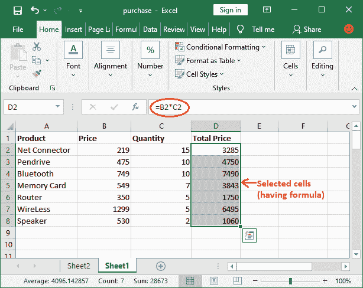

**步骤 2:** 右键单击这些选定的单元格，通过单击列表中的**复制**选项或使用 **Ctrl+C** 快捷命令复制数据。

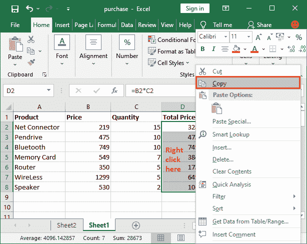

#### 注意:当您复制数据并通过选择“值”选项将其粘贴到特殊模式时，所选数据的所有公式都将被删除，值保持不变。

**第三步:**再次右键单击任意选中的单元格，然后选择**粘贴特殊**选项。

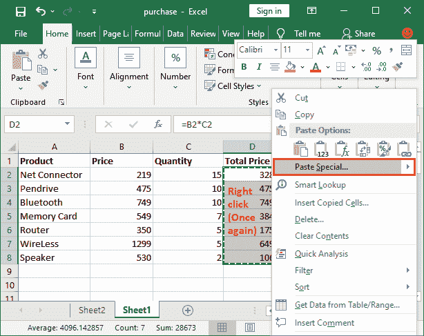

将会打开“粘贴特殊”对话框。

**第 4 步:**在该对话框中，标记**值**单选按钮，点击**确定**。选择此选项是为了即使在删除公式后也保持该值。

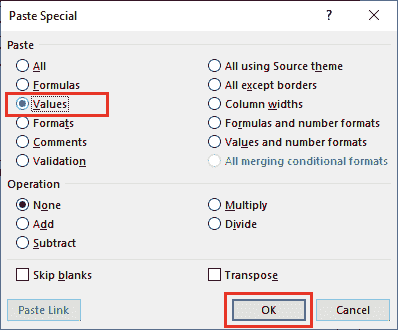

**第 5 步:**现在可以看到公式已经从 D 列单元格中移除，值保持不变。

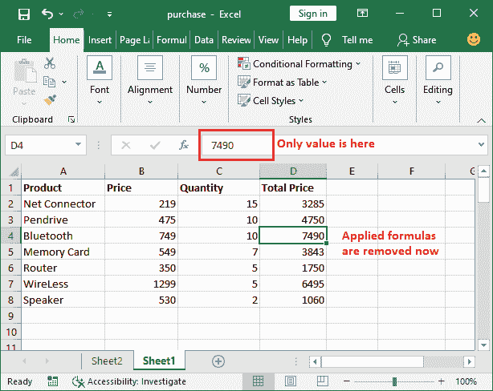

现在，这里没有公式。您可以通过单击 d 列中的任何单元格来进行检查

#### 注意:一旦公式被移除并且数据被保留，当公式被移除时，不可能在其中进一步自动更新。

## 使用“粘贴为值”方法删除公式

除此之外，您还可以通过另一种方式从 Excel 工作表中删除公式并保留数据。在此之前，我们将使用 Excel 功能来查找带有公式的单元格。为此，您必须遵循以下步骤:

**第一步:**按 **Ctrl+G** 打开转到面板，点击**特殊**按钮。

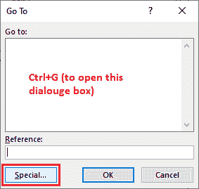

**第二步:**标记**公式**选项，点击**确定**自动选择包含某个公式的单元格。

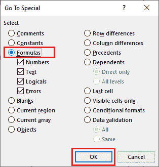

**第三步:**现在，使用 **Ctrl+C** 复制选中的单元格，如下图截图所示。

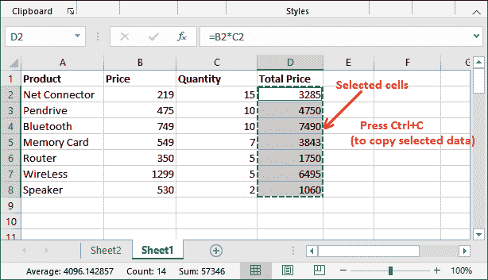

**第 4 步:**在**主页**选项卡中，点击功能区第一个位置的**粘贴**下拉按钮，选择**值(V)** 选项。

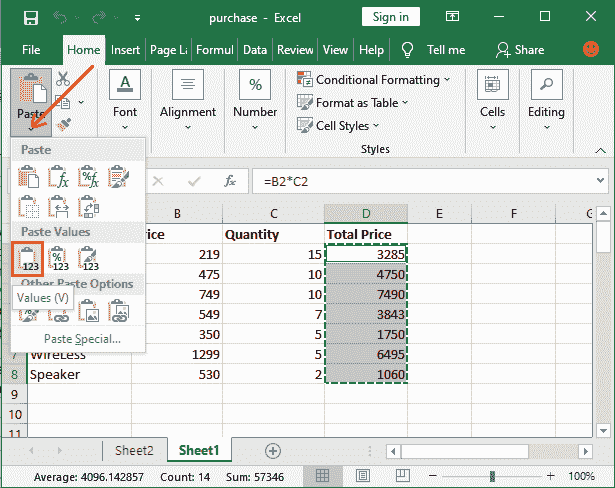

**步骤 5:** 应用于所选单元格的所有公式都已移除，并且值保持不变。你可以看到没有公式，只有数值。

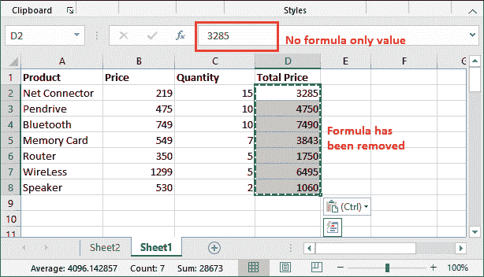

数据不会丢失，而是保持原样。

粘贴数据时，您可能会遇到这种类型的错误。

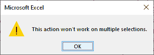

这可能是因为两个原因:

*   您的选择位于同一 Excel 工作表的多个位置。
*   当您的选择不在同一行或同一列时。例如- A2:C8 无效，而 D2:D16 有效，因为 D2:D16 选择在同一列。

### 移除公式后会发生什么

1.  你的 Excel 文件在处理过程中速度和速度都得到了提升。
2.  Excel 文件的大小将会减小。
3.  使用下列方法的公式不会移除结果值。所以，数据是安全的。
4.  这是从 Excel 数据中移除公式的一个最大缺点，即无法分析如何获得该值。
5.  公式中使用的值的任何更改或更新现在都不会反映结果值。

* * *