# 如何将 Excel 转换为 JSON？

> 原文：<https://www.javatpoint.com/how-to-convert-excel-to-json>

用户有不同的要求，例如，将 excel 数据转换为 JSON 格式。它需要做 Excel 工作表列到对象键的映射。Excel 到 JSON 的转换器有助于转换。xls 文件数据。JSON 文件格式。

这些 Excel 文件可以包含文本、图表、图形、格式、函数和更多数据。

Excel 中没有预定义的方法将 Excel 数据转换为 JSON。您可以使用在线 Excel 到 JSON 转换软件，也可以从微软商店下载一个外接程序来完成这项任务。

## 为什么 Excel 要转 JSON？

Excel 文件是重度文件，可能包含文本、图表、图形、格式、函数和更多数据。

而 JSON 文件是轻量级的基于文本的文档。它以简单的数据结构存储数据。因此，JSON 文件可以在任何文本软件上打开，如记事本或写字板。

有几种工具可以将 Excel 数据转换为 JSON。

1.  **阿尔托瓦地图部队**
2.  **白镇 XLS 至 JSON 转换器**
3.  **氧气 JSON 编辑器**
4.  **WTSolution Excel 转 JSON 转换器**

在这里，我们将简要介绍这些工具及其下载链接。

#### 提示:WTSolution Excel 到 JSON 转换器也称为 Excel 到 JSON 外接程序。微软提供了这个工具。

对于最后一个工具- **Excel 转 JSON，**我们也会给大家展示下载使用这个软件的步骤。

## 阿尔托瓦地图部队

Altova MapForce 也是一个数据映射和转换工具。它是转换各种数据集的有用软件。使用该工具，您可以将 Excel 数据转换为 JSON，将 XML 转换为 JSON，反之亦然。

**图像**

此外，该工具还允许用户将 JSON 转换为 CSV、EDI、谷歌协议缓冲区等。这个工具很容易使用，因为它提供了一个拖放界面。它还支持高级数据处理。

Altova MapForce 不是免费软件，但提供 30 天的免费试用。从以下[链接](https://www.altova.com/download-xml-editor-b?gclid=Cj0KCQjwoInnBRDDARIsANBVyAQoVNAXOBPQChLsaWykeN0rGy3BvfgCn61zI8LjCPbGJzR6A0dVWSgaAgblEALw_wcB)下载 Altova MapForce 工具。

## 白色城镇 xls 至 JSON 转换器

这个软件是一个 xls 到 JSON 的转换器。顾名思义，它允许用户将 Excel 数据转换为 JSON 格式。但是，它只允许将 Excel 数据更改为 JSON 格式。该软件支持两种格式(。xls 和。xlsx 格式)。

**图像**

使用这个软件最大的优点之一，就是免费。虽然你也可以买它的个人或营业执照。它非常容易使用，这就是为什么它非常受欢迎，主要是针对那些在网上传输数据的人。

你可以从下面的[链接](https://www.whitetown.com/xls2json/)下载白镇 xls 到 JSON 转换器工具。

## 氧气 JSON 编辑器

Oxygen JSON Editor 是通过将 Excel 列映射到 JSON 对象键，将 Excel 文件数据转换为 JSON 格式的软件。这个软件比我们上面描述的其他软件更复杂。

由于氧气 JSON 编辑器是一个复杂的软件，它也有复杂的功能。复杂功能，如结构验证、缩进、格式和内容完成。此外，该软件还允许我们将 XML 文档转换为 JSON 格式。

**图像**

氧气 JSON 编辑器的工作方式不同于其他 Excel 到 JSON 转换器。它使用 XSLT 样式表模板进行转换。大多数专业人士更喜欢这个软件来转换他们的数据。这是一款付费软件，其个人、商业和学术版本可在其官方网站上获得。

查看其官方网站下载[氧气 JSON 编辑器](https://www.oxygenxml.com/xml_editor/json_editor.html)。

## Excel 到 JSON 转换器

这是本章最后一个 Excel 到 JSON 的转换器，利用它可以对自己的数据进行 Excel 到 JSON 的转换。执行这个任务是一个简单的应用程序。这个软件支持 Excel 数据的两种转换:行转换和嵌套转换。

你也听过它的名字，叫做 Excel 到 JSON 插件。微软提供了这个名为 **Excel 到 JSON** 的插件，帮助用户将 Excel 数据转换成 JSON 格式。现在，让我们了解一下 Excel 到 JSON 外接程序，并看看它的下载步骤。

## Excel 到 JSON 外接程序

**Excel 转 JSON** 是微软提供的将 Excel 表单数据转换为 JSON 格式的插件。当数据转换为 JSON 格式时，Excel 工作表列将更改为 JSON 中的对象键。用户下载和使用它不需要付费。

您可以从 Office 商店下载此外接程序。

### 要求

Excel to JSON 外接程序将仅在 Excel 2013 或更高版本上工作。因此，您的 Excel 版本必须是 2013 或更高版本。

### 限制

此外接程序有一个限制。

它可以将选中的 Excel 数据转换为 JSON 格式。

目前，此外接程序支持两种类型的转换。

1.  排
2.  嵌套的

### 行转换

在行类型转换中，第一行被视为标题，其余行被解释为数据。

### 嵌套转换

在嵌套类型转换中，可以定义一个 JSON 模式。这个外接程序将根据您提供的模式进行相应的转换。

## 下载加载项

**Excel 转 JSON** 插件在 Office 商店有；你可以从那里下载。如需逐步学习，请遵循以下章节-

**第一步:**从以下[链接](https://appsource.microsoft.com/en-us/product/office/WA104380263?src=office&corrid=0c439df5-b21e-45b7-b123-c7808fa14b7d&omexanonuid=06a09a47-9c52-4c1a-ab8f-c03854215518&referralurl=)下载 Excel 到 JSON 插件。

**第二步:**将打开 Office 商店的网页，点击**立即获取**按钮。

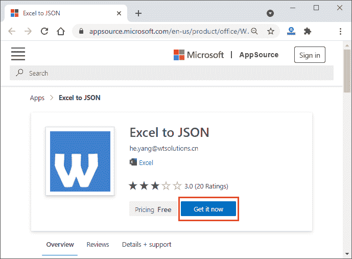

**第三步:**开始下载前，它会要求你用有效凭据登录你的微软账号。

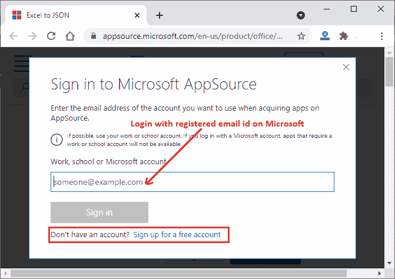

如果您没有微软帐户，请免费注册创建新帐户。

**第四步:**当你登录到你的微软账号时。它会在下载前询问这个应用需要的一些基本信息。在这里，提供这些详细信息并点击**继续**按钮。

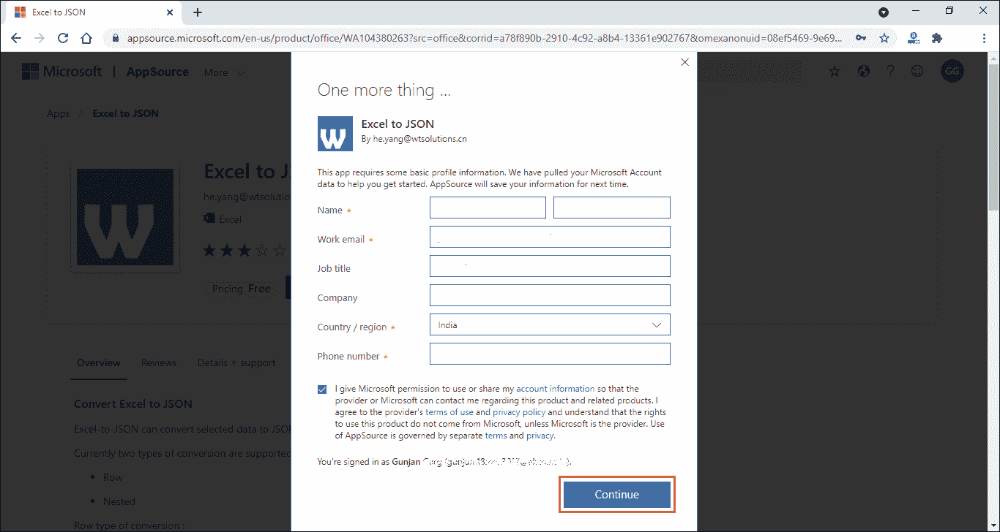

#### 提示:标有*号的字段是必填字段，其他字段是可选字段。

**第五步:**现在，点击这里的**在 Excel 中打开**按钮。

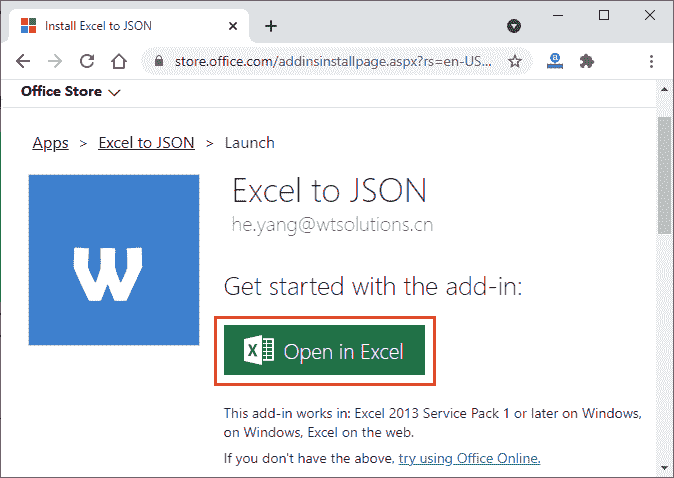

如果你的系统中没有下载任何 MS Excel 2013 或以上版本，你可以去网上办公。点击这个链接。

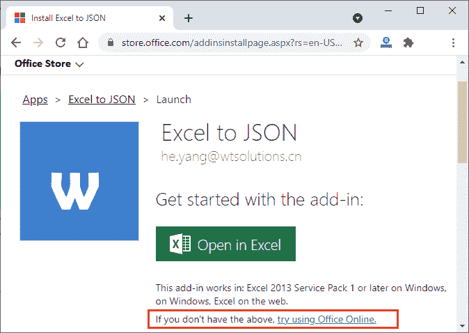

我们已经点击了在 Excel 中打开。

**第 6 步:**在此弹出窗口中，不要勾选复选框，点击**打开 Excel** 。

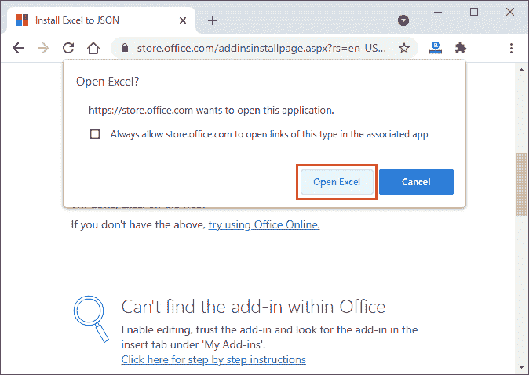

**第七步:**你的 Excel 会在你的系统上打开，但是需要互联网连接。如果它不可用，您可能会得到这种类型的警告错误。

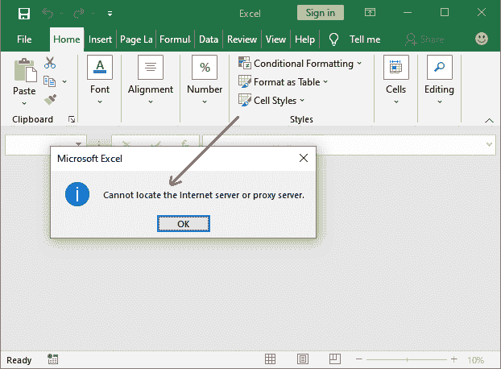

**第 8 步:**当您点击确定时，它将向您显示另一个面板，向您显示出现此错误的一些原因。此错误可能是由于以下原因造成的。

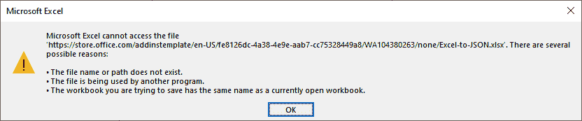

因此，请将您的系统与互联网连接，并关闭当前打开的 Excel 工作簿。

**第 9 步:**再次执行第 5 步和第 6 步，点击**打开 Excel** 按钮。

这一次，您的系统已连接到互联网。因此，它在安装外接程序时不会显示任何错误和中断。

**第十步:**Excel 文件上的一个界面会这样打开，里面有 **Excel 转 JSON 插件。**现在，点击右侧面板上的**信任此插件**按钮，将此插件添加到您的 Excel 选项卡中。

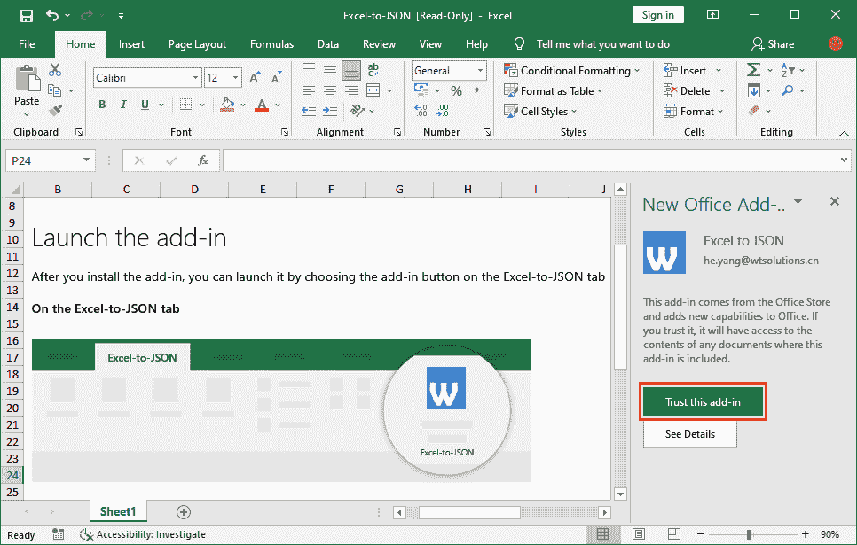

**第 11 步:** Excel 转 JSON 插件最终作为标签页成功添加到 Excel 功能区。看这里-

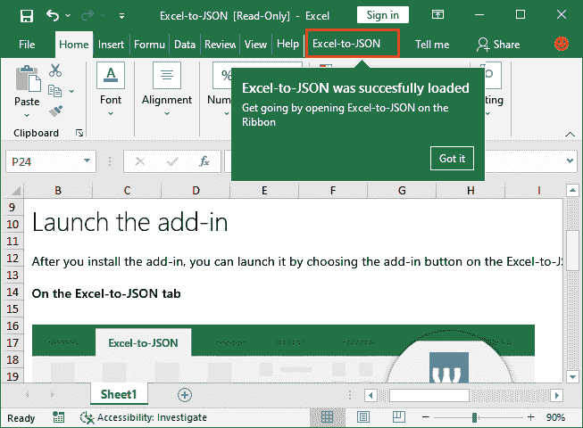

**第 12 步:**你的 Excel 转 JSON 加载项准备启动。在 **Excel-to-JSON** 标签中可以找到名称为启动 **Excel-to-JSON** 按钮。

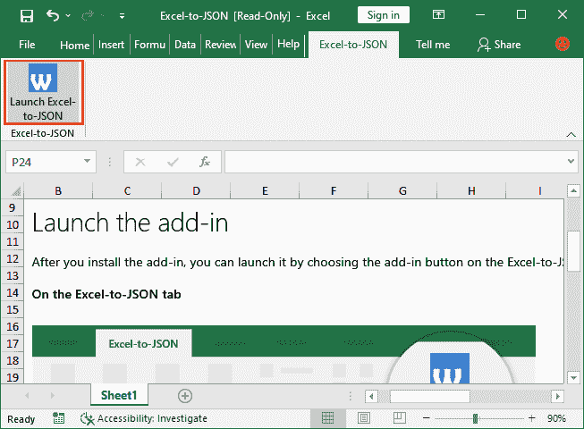

#### 注意:当前打开的 Excel 文件是只读的，其中包含一些关于此工具的说明。因此，首先打开目标文件，您想要将 Excel 转换为 JSON。

**第 13 步:**准备一个新的 Excel 表格，或者打开要更改数据格式的表格。我们已经打开了一个现有的人员详细信息文件，点击**启动 Excel 转 JSON** 按钮。

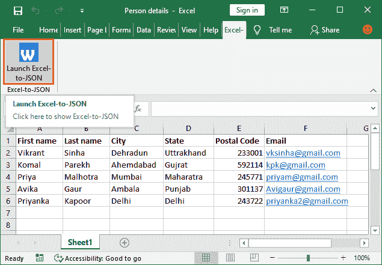

**第 14 步:**一旦点击，可能会出现这个错误。忽略它，点击**确定**前进。

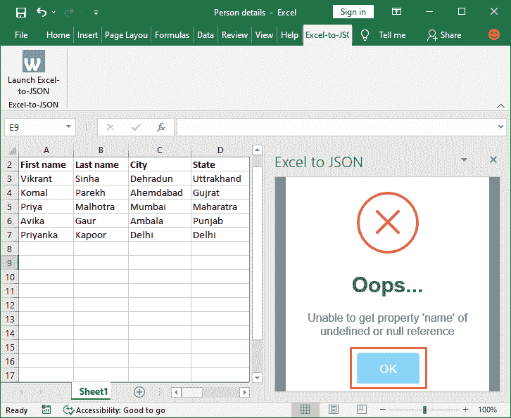

#### 提示:使用此外接程序转换数据时，您的系统必须连接到互联网。否则，你可能会面临问题。

**第 15 步:**现在，选择至少前两行的数据或所有数据，其中第一行被视为标题，另一行被视为数据。然后点击右侧面板中的 **GO** 。

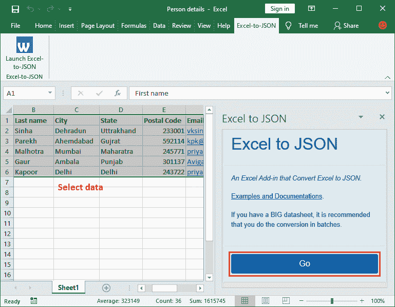

**第 16 步:**你会看到选中的数据被转换成 JSON 格式，并且在 Go 按钮下方可用。

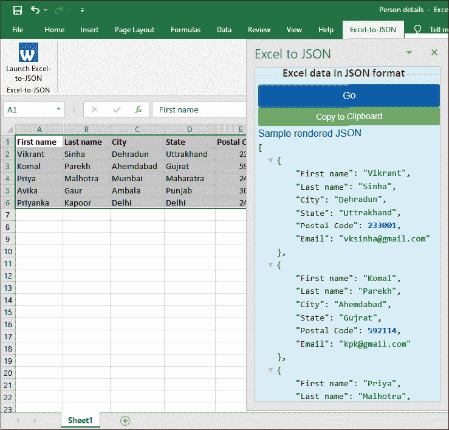

**第 17 步:**从这里复制这个数据，把这个 JSON 数据粘贴到一个文件中保存。因此，点击这里的**复制到剪贴板**按钮。

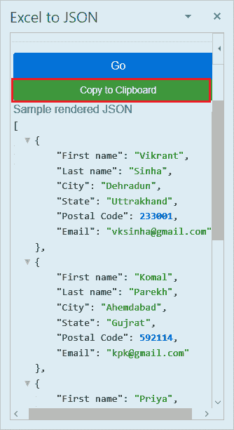

**步骤 18:** JSON 数据成功复制到剪贴板。

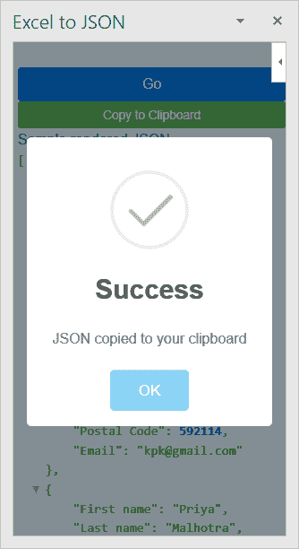

**步骤 19:** 现在，将复制的剪贴板数据粘贴到 Word 文件中并保存。复制的数据如下所示-

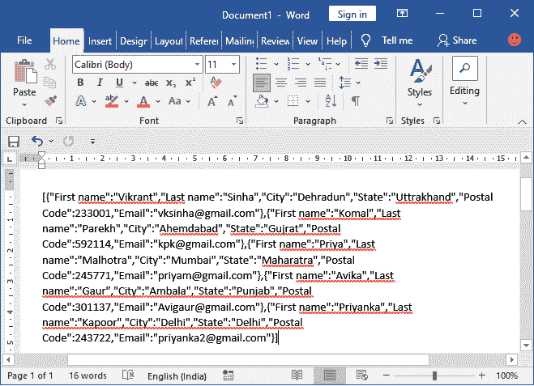

## 使用 VBA 代码编辑器将 Excel 转换为 JSON

除了使用所有这些工具之外，还可以使用 Excel 的内置功能( **VBA 代码编辑器**)将 Excel 数据转换为 JSON 格式。为它编写代码并执行代码；它将完成 Excel 列到 JSON 对象键的映射，并将数据转换为 JSON。

如果你对编码感到满意，那么这是一个很好的方法。因此，您不需要显式下载上面讨论的工具来将您的 Excel 数据转换为 JSON 格式。虽然你可以做到这一点，而无需下载任何软件在您的系统上使用 Excel VBA 代码编辑器。

#### 提示:您的 Excel 数据必须有列名，因为第一行总是被视为标题。

### VBA 法典

以下是将 Excel 文件数据转换为 JSON 格式的完整代码。复制以下代码，并将其粘贴到您各自的 VBA 代码编辑器中。

```

Public Function ExcelToJSON(rng As Range) As String
    ' Check there must be at least two columns in the Excel file
    If rng.Columns.Count < 2 Then
        ExcelToJSON = CVErr(xlErrNA)
        Exit Function
    End If
    Dim dataLoop, headerLoop As Long
    ' Get the first row of the Excel file as a header 
    Dim headerRange As Range: Set headerRange = Range(rng.Rows(1).Address)    
    ' Count the number of columns of targeted Excel file
    Dim colCount As Long: colCount = headerRange.Columns.Count   
    Dim JSON As String: JSON = "["    
    For dataLoop = 1 To rng.Rows.Count
        ' Skip the first row of the Excel file because it is used as header
        If dataLoop > 1 Then
            ' Start data row
            Dim jsonData As String: jsonData = "{"            
            ' Loop through each column and combine with the header
            For headerLoop = 1 To colCount
                jsonData = jsonData & """" & headerRange.Value2(1, headerLoop) & """" & ":"
                jsonData = jsonData & """" & rng.Value2(dataLoop, headerLoop) & """"
                jsonData = jsonData & ","
            Next headerLoop        
            ' Strip out the comma in last value of each row
            jsonData = Left(jsonData, Len(jsonData) - 1)            
            ' End data row
            JSON = JSON & jsonData & "},"
        End If
    Next    
    ' Strip out the last comma in last row of the Excel data
    JSON = Left(JSON, Len(JSON) - 1)    
    JSON = JSON & "]"   
    ExcelToJSON = JSON
End Function

```

在这段 VBA 代码中，我们定义了一个名为 **ExcelToJSON** 的函数，该函数稍后将在 Excel 文件中用于将 Excel 数据转换为 JSON 格式。让我们看看它将如何执行。

**语法**

```

=ExcelToJSON(range)

```

现在，返回到 Excel 文件，在要放置转换后的 JSON 结果的 Excel 单元格中编写下面的 ROUND()公式。例如，

= exceptioj son(a1:F3)

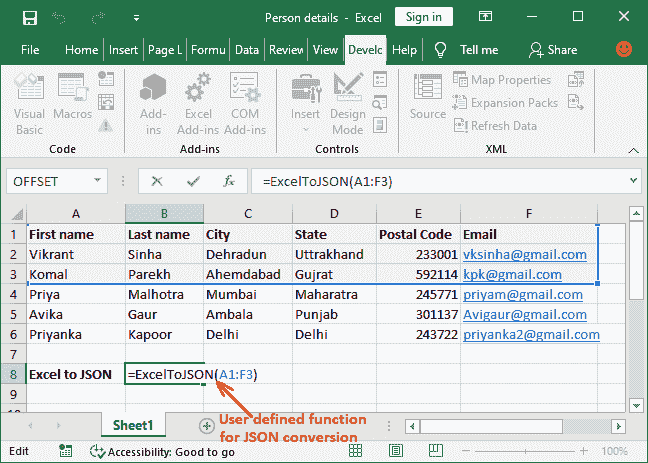

目前，我们只将前两行 Excel 数据转换为 JSON 格式。

按**进入**键，得到结果，看到数据成功转换成 JSON 形式。同样，您可以使用此函数进行更多转换。

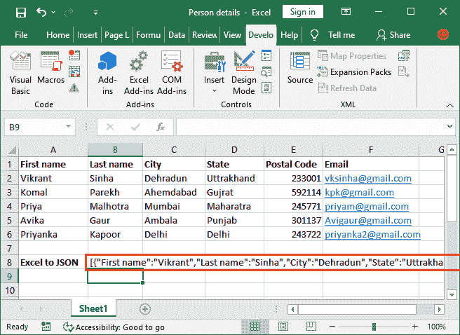

有关这段代码的详细描述，请参见我们的下一个教程，我们已经解释了这段代码以及在其中创建和使用的变量。

* * *