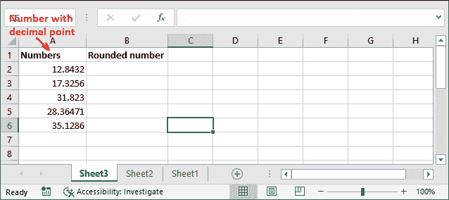
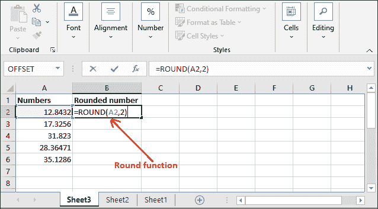
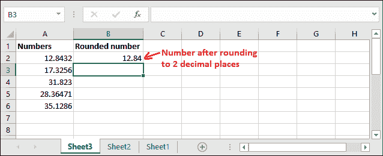
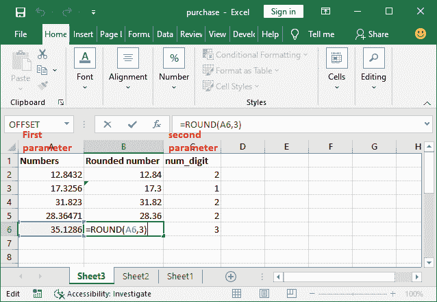
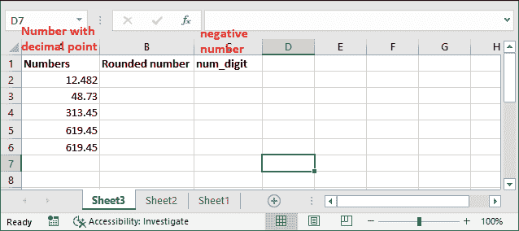
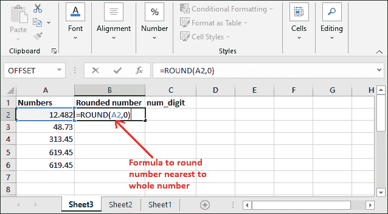
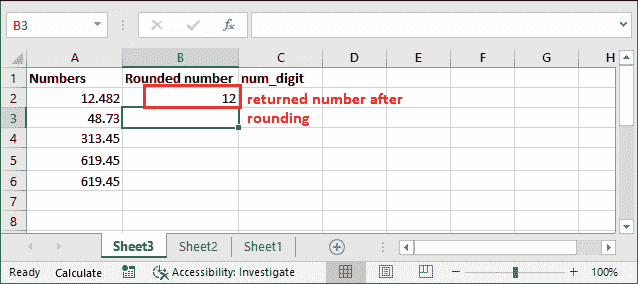
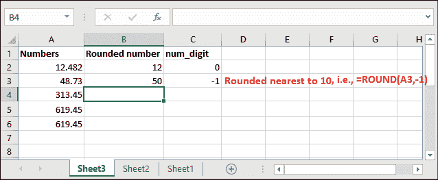
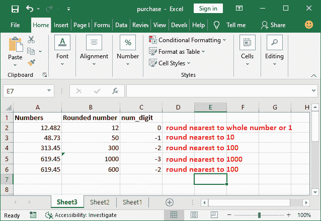

# Excel 中的舍入公式

> 原文：<https://www.javatpoint.com/round-formula-in-excel>

Excel 提供了一个内建函数来舍入该值。这些值是数值。您可以将数字四舍五入到一个小数位、两个小数位以及更多您想要的数字。名为 ROUND()的函数是 Excel 的内置函数，它使用户能够在 Excel 中对数字进行舍入。

有时，用户需要一个舍入值来执行特定的操作。在这种情况下，他们可以使用这个 ROUND()函数。本章将详细介绍介绍、语法和示例。

## ROUND()函数

Excel 提供了 ROUND()函数，将数字舍入到您想要的特定位数。**例如，**单元格 A2 包含一个数字 53.1243，您希望将该值四舍五入到小数点后三位。这个函数的用法如下-

```

=ROUND(A2, 3)

```

它将从最后一位开始提取三位数字，并保留小数点后的剩余数字。返回值将是 53.1。

此外，Excel 还提供了更多的函数(ROUNDUP、ROUNDDOWN)来以不同的方式对数字进行舍入。他们在需要的时候使用。

**语法**

ROUND()函数将采用两个参数，并且两个参数都是必需的。

```

ROUND(number, num_digits)

```

*   **号**参数将取你想要舍入的目标值。
*   第二个参数是**位数**，它将取一个整数来表示您想要舍入的位数。

#### 注意:除了简单的取整数值，还可以从左到右取整数值。

### 返回值

它返回一个四舍五入的数字。或者说-这个函数将在取整数字后返回剩余的值。

## 例子

我们将通过使用不同的例子和详细的 Excel 步骤来解释这个函数及其用法。

### 例 1

我们将向您展示对存储在 Excel 工作表中的数字进行舍入的步骤。这是从小数点右边取整数字的一个例子。他们来了-

**步骤 1:** 我们在 Excel 表中有一些带小数点的值。



**步骤 2:** 选择一个相邻的单元格来保存返回的结果值，并在此处或公式栏中写入以下公式。

=ROUND(A2，2)



这里，我们把数字四舍五入到小数点后两位。

**第三步:**按**回车**键，四舍五入后看到数字。查看截图它返回了什么值。



**第 4 步:**同样，我们对这里呈现的更多值进行了舍入，现在看到了它们的结果。



同样，你可以四舍五入更多的数字。

### 将数字四舍五入到小数点左右两位

您也可以使用 round()函数将数字从左向右舍入到小数点后一位，而不是简单地舍入数字。这是该功能的附加功能。

通常，我们通过在**数字**参数中提供一个正数来从右边舍入该值。但是你可以做得更多。对于不同类型的舍入，我们有以下条件。

### 向右舍入

如果**数字**参数为正数(> 0)，该数字将四舍五入到小数点右边指定的小数位。

**例如**我们有带小数点的数字数据。下面是几个从右数开始舍入的公式。

| 公式 | 描述 | 结果 |
| =ROUND(12.4892，3) | 四舍五入到小数点后三位 | Twelve point four eight nine |
| =ROUND(48.7341，1) | 四舍五入到小数点后一位 | Forty-eight point seven |
| =ROUND(13.482，2) | 四舍五入到两位小数 | Thirteen point four eight |
| =ROUND(19.437，1) | 四舍五入到小数点后一位 | Nineteen point four |

### 向左舍入

如果**数字**参数为负数(< 0)，该数字将四舍五入到小数点左边指定的小数位。基本上，最接近 10，100，1000，甚至更多。**比如** 27.3 会四舍五入，最接近的 10 会是 30。

假设我们在 A2 单元格中有数据。这里我们有几个公式来计算小数点左边的数字。

| 公式 | 描述 | 结果 |
| =ROUND(12.4892，0) | 四舍五入到最接近的整数或最接近的 1 | Twelve |
| =ROUND(48.7341，-1) | 四舍五入到最接近的 10 | Fifty |
| =ROUND(313.482，-2) | 四舍五入到最接近的 100 | Three hundred |
| =ROUND(619.45，-3) | 四舍五入到最接近的 1000 | One thousand |
| =ROUND(619.45，-2) | 四舍五入到最接近的 100 | Six hundred |

为了从右开始舍入数字，您已经在 Excel 工作表中看到了包含详细步骤的示例 1，并验证了该函数的工作原理。现在，让我们看看左边的数字。

### 例 2

我们将向您展示对存储在 Excel 工作表中的数字进行舍入的步骤。这是从小数点左边取整数字的一个例子。为此，我们必须在**数字**参数中提供一个负数。他们来了-

**步骤 1:** 我们在 Excel 表中有一些带小数点的值。



**第 2 步:**选择一个相邻的单元格来保存返回的结果值，并编写以下公式来舍入最接近整数或 1 的数字。

=ROUND(A2，0)



这里，我们将最接近整数的数字四舍五入。

**第三步:**按**回车**键，四舍五入后看到数字。看到它四舍五入后返回了 12。



**第 4 步:**同样，我们将对这里给出的更多值进行舍入，以明确负数的概念。其中-1 表示最接近的 10，-2 表示最接近的 100，-3 表示最接近的 1000，以此类推。



**第 5 步:**现在，查看此处所有值的结果。



同样，您可以根据需要舍入更多的数字。

#### 注意:ROUND()函数在“公式”选项卡的“数学和触发器”部分下可用。

## 其他舍入函数

除了这个简单的 round()函数，Excel 还为不同的目的提供了其他几个 ROUND 函数。他们用不同的方法把数字四舍五入。这些功能是-

**ROUND() -** 用于简单的 ROUND

**MROUND() -** 用于将数字四舍五入到最接近的倍数。

**四舍五入()-** 将数字四舍五入到最近的指定位置。

**FLOOR() -** 将数字四舍五入到最接近的倍数。

**ROUNDUP() -** 将数字四舍五入到最近的指定位置。

**天花板()-** 将数字四舍五入到最接近的倍数。

**INT() -** 向下舍入数字，只返回一个整数。

**TRUNC() -** 截断小数位。

所有这些方法，我们都在单独的章节中讨论过。你可以从那里学到它们。

## 要记住的事情

关于 ROUND()函数需要记住的几点-

1.  ROUND()函数是**数学&触发器**函数的一部分。
2.  如果您不喜欢直接使用公式，可以在**数学&三角**下拉列表下的**公式**选项卡中找到。
3.  ROUND()函数返回一个舍入到特定位数的数字。
4.  它向下舍入数字 1-4，向上舍入数字 5-9。

* * *