# Excel 公式

> 原文：<https://www.javatpoint.com/excel-formula>

Excel 公式是指用于各种计算的公式。我们先来讨论一下公式的概念。

### 公式是什么？

公式是指定规则的一组数学元素。它用等号连接一个或多个元素。如果已知一个或多个元素，则可以使用该公式来查找元素的值。

例如，

**总和= a + b**

如果知道 a 和 sum 的值，就可以求出 b 的值(b = Sum - a)。同样，如果知道 a 和 b 的值，就可以求出和(和= a + b)。

或者

**平均值=所有观测值之和/观测值数量**

上述公式由三个要素组成。如果我们知道任何两个元素的值，我们就可以很容易地找到第三个元素的值。

### excel 中的公式是什么？

excel 中的公式是根据函数括号内的单元格计算的。这意味着这些公式有**两个参数，**函数名和函数中声明的单元格。例如，B + C + D 求从 B 到 D 的值的范围之和。excel 中定义为公式的函数的格式由下式给出:

**功能(细胞范围 1:细胞范围 2)**

哪里，

**功能:**定义 excel 中预定义的公式，如 SUM、AVERAGE。这个函数的名字很熟悉。

例如，

总和(B1: B4)

这里，B1 和 B4 是单元格范围。SUM()函数将对从 B1 到 B4 的所有值求和。同样，excel 中的其他公式也是基于相同的概念定义的。

### 自动搜索公式

Excel 还为我们提供了一个以列表形式查找可用函数公式的选项。所以，如果有人不知道可用的公式，最好在 excel 中快速找到可用的公式。它由下式给出:

**“插入功能”**

我们可以在工具栏上的公式选项下找到这个函数。要操作，请考虑以下步骤。

1.  在 excel 主页，点击工具栏上方的**公式**选项- >点击**插入功能**选项，如下图:
    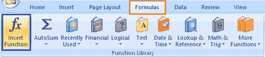
2.  将出现一个对话框。
3.  我们可以从列表中选择函数，如上所示。
    我们也可以通过为相应的函数指定语句来搜索函数。例如
    我们需要找到最小值，但是函数列表中没有函数。因此，我们可以指定语句**‘找到最小值’**并按下**‘执行’**选项。根据指定语句的函数将出现在函数表中，如下所示:
    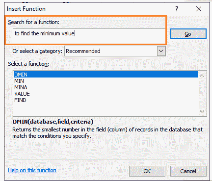
    我们可以使用适当的函数从表中找到最小值。
    同样，通过指定相关语句，可以很容易地找到其他函数。

#### 注意:Excel 对给定的公式进行了详细的解释。可以在功能对话框的底部看到。当我们在公式栏上用开头提到的等号(=)键入一个函数时，与公式相关的语句也会出现。

## Excel 中的公式

让我们讨论 excel 中最常见的公式。我们还将讨论基于每个公式的示例。

### 1.SUM()

求和函数用作加法函数。它用于将两个或两个以上的数字相加。与计算器相比，使用 excel 进行加法更快。我们可以使用 sum 函数轻松地添加数百、数千或更多的数字。

**快捷方式**

工具栏上的自动求和符号可直接用于一次点击添加选定的数字。它出现在工具栏上的公式选项卡下。

**例 1:求各种产品的价格之和。**

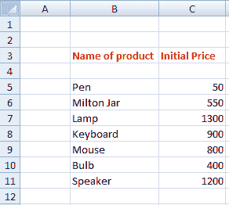

请考虑以下步骤来计算总和。

1.  单击给定表格之外的任何单元格。
2.  在公式栏上拖动鼠标，输入 **'=SUM(C5:C11)。'**这里，C5 和 C11 是价格列的第一个和最后一个元素的名称。Excel 会将 C5 到 C11 的数字相加。
3.  按**回车。**总和会出现在指定的单元格上，如下图:
    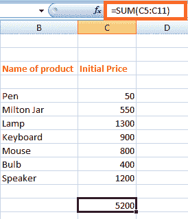

运筹学

1.  在 excel 主页上，用光标选择要添加的数字。
2.  点击公式选项卡下的自动求和选项，如下图:
    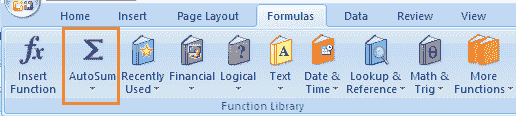
3.  总和将出现在最后一个元素的单元格下方。

**例 2:求列的具体元素之和。**

请考虑以下步骤:

1.  单击给定表格之外的任何单元格。
2.  在公式栏上拖动鼠标，输入 **'=SUM(C5:C7，C9，C11)。'**这里，将计算单元格 C5、C6、C7、C9 和 C11 的总和。选择添加的单元格如下:
    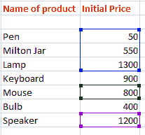
3.  按回车键。总和会出现在指定的单元格上，如下所示:
    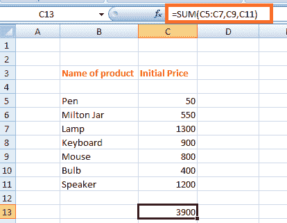

#### 注意:我们可以在公式栏或指定的单元格中键入公式。公式将出现在两个位置(公式栏和指定的单元格)。

### 2.减法

它类似于添加过程。我们只需要在要减去的数字后面插入一个负号。

该公式由下式给出:

SUM(单元格 1，-单元格 2)

例如，

SUM(A1，-A3)

上述公式将用于从 A1 中减去单元格 A3 的值。将被视为 A1 - A3。

让我们考虑一个例子。

**例:找出商品价格变化的差异。**

请考虑以下步骤:

1.  点击差异栏的第一个单元格，如下图:
    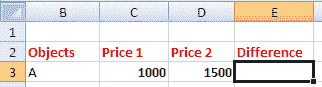
2.  在公式栏上拖动鼠标，然后键入“=SUM(D3，-C3)。”单元格 C3 的值将从单元格 D3 中给出的值中减去。
3.  按**回车。**将出现两个指定单元格之间的差异。如下图:
    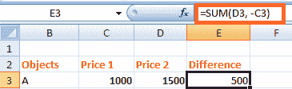
    同样，我们可以找到执行减法的多个单元格。

### 3.乘法和除法

特定的名称不会指定这些公式。我们可以直接用两个数之间的乘除符号来计算乘除。

它由下式给出:

A1 * A2

A1 / A2

设，A1 = 4，A2 = 2。

乘法= A1*A2 = 4*2 = 8

除法= A1/A2 = 4/2 = 2

我们用一个例子来理解。

**例:求 A 列和 b 列两个值的乘积**

请考虑以下步骤:

1.  点击乘法栏的第一个单元格。
2.  在公式栏上拖动鼠标，然后键入“=C3*D3”
3.  单击该块的右下角，并拖动到乘法列的最后一个单元格。
4.  按**回车。**结果将出现在该列的所有指定单元格上。如下图:
    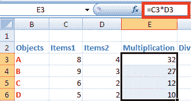

现在，我们将为部门考虑相同的步骤。我们只需要插入公式= 'C3/D3 '如下所示:

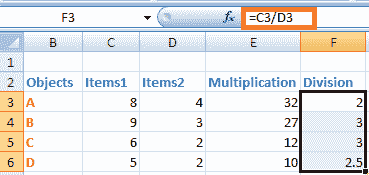

### 4.左、中、右

这三个公式用于将单元格分解成不同的段。让我们详细讨论一下。

**左**

LEFT 公式用于从指定的单元格中提取起始元素。它由下式给出:

左(文本，字符数)

哪里，

**文本**是指我们要从中提取元素的指定单元格。

**Number_of_characters** 是指我们要从最左边的字符开始提取的字符。

**MID**

MID 公式用于从指定单元格中提取中间位置的元素数量。它由下式给出:

中间(文本、开始位置、字符数)

哪里，

**文本**是指我们要从中提取元素的指定单元格。

**开始位置**是指我们要开始提取的位置。

**Number_of_characters** 是指我们要提取的字符。

**右侧**

RIGHT 公式用于从最后或右端提取元素的数量。它由下式给出:

右(文本，字符数)

哪里，

**文本**是指我们要从中提取元素的指定单元格。

**Number_of_characters** 是指我们要从右端字符开始提取的字符。

让我们考虑一个更好理解的例子。

**示例:**

考虑 excel 中的下表。

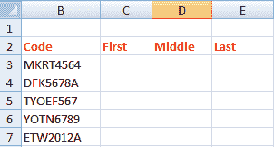

提取字符的步骤如下:

1.  点击**第一列**的第一个单元格，如下图:
    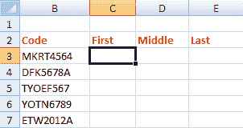
2.  在公式栏上拖动鼠标，然后键入=' =LEFT(B3，4)。'
3.  按**回车。**将出现从指定单元格提取的字符。
4.  将第一个单元格的右下角拖到最后一个元素。现在显示为:
    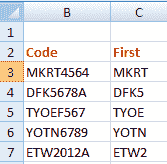
5.  现在，点击**中间**列的第一个单元格，输入公式=' =MID(B3，5，3)'并按**回车。**
6.  同样，点击**最后一列**的第一个单元格，输入公式= '=RIGHT(B3，1)'，然后按**回车。**
7.  将第一个单元格的右下角拖到“中间”和“最后”列的最后一个元素。提取的字符将显示为:
    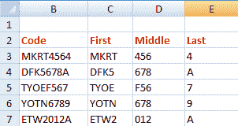

### 5.平均的

平均函数与数学的平均函数相同。它用于查找所选数字或单元格的平均值。我们可以很容易地计算出多个数字的平均值。

它由下式给出:

平均值(数字 1，数字 2，....)

对于单元格区域，我们可以将其指定为:

平均值(单元格 1:单元格 2)

AVERAGE()类似于 SUM()/给定列中的元素数

例如，

AVERAGE(5，10，15，20) = SUM(5，10，15，20)/ 4

**快捷方式**

要访问平均值符号，用光标选择数字->点击公式选项卡下**自动求和**符号前的下拉箭头，然后点击**平均值**选项。所需的平均值将出现在选定的数字单元格下方，如下所示:

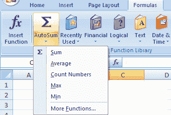

我们也可以通过点击底部的**‘更多功能’**选项来访问更多功能。

**例 1:求给定数据表价格的平均值。**

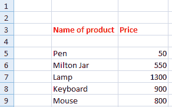

请考虑以下步骤:

1.  单击给定表格之外的任何单元格。
2.  在公式栏上拖动鼠标，输入 **'=AVERAGE(C5:C9)。'**这里的平均值是从 C5 到 C9 或者(C5，C6，C7，C8，C9)的范围计算出来的。
3.  按**回车。**指定数据的平均值将出现在所选单元格上。如下图:
    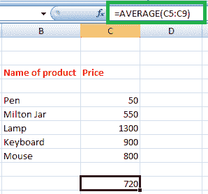

上面的例子找到了特定列中元素的平均值。让我们找出特定行元素的平均值。

**例 2:求某个班级某个学生的平均分。**

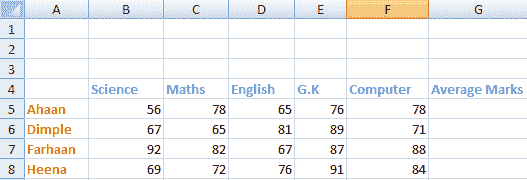

在这里，我们会找到第二个学生小酒窝的平均分数。

请考虑以下步骤:

1.  点击**平均值标记**栏下的第二个单元格，找到一个学生酒窝的平均值。
2.  在公式栏上拖动鼠标，输入**' =平均值(B6:F6)。'**这里，平均值将从 B6 到 F6 或(B6、C6、D6、E6、F6)的范围计算。指定范围如下所示:
    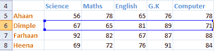
3.  按**回车。**指定数据的平均值将出现在所选单元格上。如下图:
    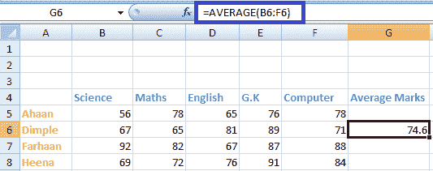
    我们可以通过拖动单元格右下角的下行来计算剩余学生的百分比。

### 6.数数

Count 函数用于计算指定列或行中数据单元格的数量。

计数(数字 1，数字 2，....)

对于单元格区域，我们可以将其指定为:

计数(单元格 1:单元格 2)

**快捷方式**

要访问计数符号，选择要计数的数字->点击**公式**选项卡下**自动求和**符号前的下拉箭头- >点击**计数**选项。所需的计数将出现在选定的数字单元格下方。如下所示:

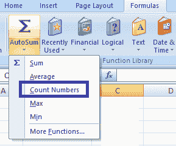

**例 1:求给定数据中学生人数的计数。**

请考虑以下步骤:

1.  选择给定数据表附近的任何单元格。
2.  在公式栏上拖动鼠标，然后键入“=COUNT(C3:C14)。”Excel 将计算从 C3 到 C14 的单元格。
3.  按**回车。**计数将出现在选定的单元格上。如下所示:

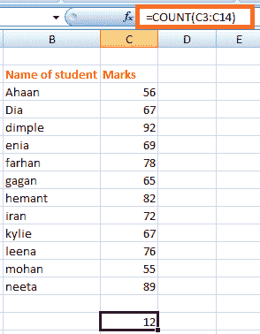

同样，我们可以计算一行或一列中的元素数量。

#### 注意:SUM()、AVERAGE()和 COUNT()只能应用于数字列表。它不能应用于字母形式的数据。如果应用，它将不会考虑该数据或将返回 0。

但是，如果我们想用字母来计数细胞，比如学生的名字，物体的名字等等，该怎么办呢？为了解决这个问题，我们有一个名为 **COUNTA()的函数。**可以数数字、字母等。这意味着它可以计算细胞数量，而不考虑其中的数据。它还会忽略中间的空白。

### 统计出勤异常人数

COUNTA()函数类似于 COUNT()。与 COUNT()不同，它可以对包含数字以外的数据的单元格进行计数。让我们考虑一个例子。

**例 2:根据学生姓名统计学生人数。**

在上面的例子中，我们已经根据学生的分数进行了计算。但是，在这里我们将根据名字来计数。

请考虑以下步骤:

1.  选择给定数据表附近的任何单元格。
2.  在公式栏上拖动鼠标，然后键入“=COUNTA(B3:B15)。”Excel 将计算从 B3 到 B15 的单元格。B15 单元格为空。因此，excel 将忽略多余的空间，并计算其余的单元格。
3.  按**回车。**计数将出现在选定的单元格上。如下图:
    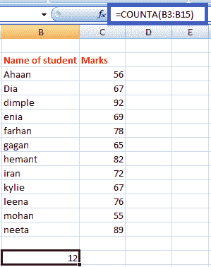

### 7.最大和最小

MAX()函数查找最大值，MIN()函数从数组或表的指定数据中查找最小值。

最大值(1 号，2 号，....)

对于单元格区域，我们可以将其指定为:

最大值(单元格 1:单元格 2)

在求最小值的情况下，公式由下式给出:

最小值(数字 1，数字 2，....)

对于单元格区域，我们可以将其指定为:

最小(单元格 1:单元格 2)

**快捷方式**

要访问最大()/最小()符号，请选择数字->单击**公式**选项卡下的**自动求和**符号前面的下拉箭头- >单击**最大()/最小()**选项。将显示所选号码中所需的最大或最小号码。如下所示:

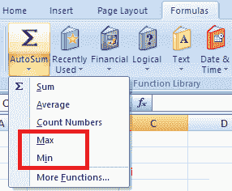

**例 1:寻找类的顶层。**

班上的第一名在所有学生中得分最高。因此，我们需要从可用学生列表中找到平均分数。

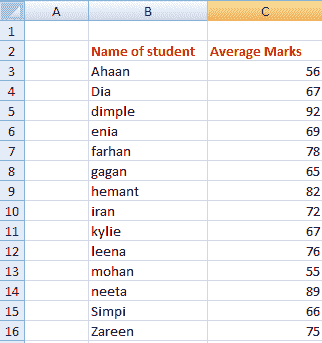

请考虑以下步骤:

1.  选择给定数据表附近的任何单元格。
2.  在公式栏上拖动鼠标，然后键入“=MAX(C3:C16)。”Excel 将从 C3 到 C16 的值范围中找到最大值。
3.  按**回车。**最大值将出现在所选单元格上。如下所示:

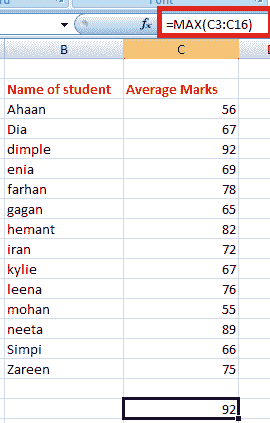

因此，名叫小酒窝的学生是班上最高分 92 分的学生。

**例 2:找分数最少的学生。**

在这里，我们需要从学生列表中找到学生的最小平均人数。数据与实施例 1 相同。

请考虑以下步骤:

1.  选择给定数据表附近的任何单元格。
2.  在公式栏上拖动鼠标，然后键入“=MIN(C3:C16)。”Excel 将从 C3 到 C16 的值范围中找到最小值。
3.  按**回车。**最小值将出现在选定的单元格上。如下所示:

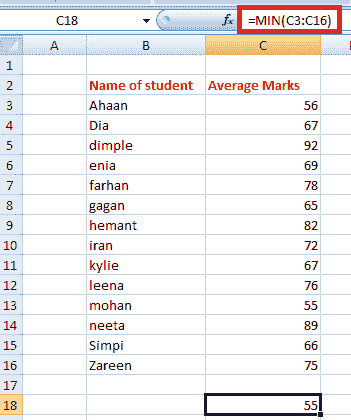

因此，名叫莫汉的学生在班上得分最低(55 分)。

### 8.整齐

函数的作用是:删除给定数组中数据之间的空格。当我们想要在没有任何额外空间的情况下按顺序排列大数据时，这非常有用。但是，TRIM()公式一次只能应用于一个**单个单元格**。我们可以通过拖动该单元格的右下角来进一步计算。

该公式由下式给出:

=TRIM(单元格)

例如，TRIM (A2)

让我们考虑一个例子。

**示例:从给定数据中移除额外空间。**

在这里，我们将使用 TRIM()公式删除多余的空格。

请考虑以下步骤:

1.  单击第二列的第一个单元格。
2.  在公式栏上拖动鼠标，然后键入“=TRIM(B3)。”这里的 TRIM()公式将删除指定单元格中单词之间的所有多余空格。
3.  按**回车。**删除多余空格后的指定语句会出现在指定单元格上，如下图:
    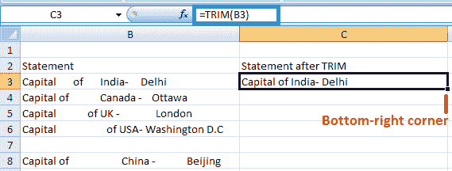
4.  将该单元格的右下角拖动到 c 列的最后一个单元格。TRIM()公式将自动应用到其下的其他单元格，如下所示:
    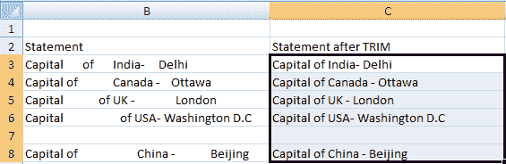

### 9.如果

IF()函数用于根据逻辑对给定的数据进行排序。这意味着 excel 将检查 IF()函数中指定的逻辑。

该公式由下式给出:

IF(逻辑，[value_if_true]，[value_if_false])

上述公式规定，如果指定的逻辑正确，excel 将返回[value_if_true]中指定的值。如果指定的逻辑不正确，它将返回

[value_if_false]。

例如，

设 A = 5，B = 7，公式= IF(A >B，真，假)

**输出** =假

**说明:**函数中指定的逻辑不正确，因为 A 小于 b，因此 excel 将返回值 False。

如果公式是 IF(A >B，1，0)，它将返回 0，因为在假逻辑的情况下指定的值是 0。

但是，使用 IF()公式需要避免一些错误，如下所示:

*   代替真和假的声明值，应该是数字或字母。我们可以把它写成 IF(C2>D3，1，假)，但不能把 is 写成 IF(C2>D3，1，假 0)。
*   指定的两个或多个数字之间不应有空格来代替“真”和“假”。我们可以把它写成 IF(C2>D3，1 2，假)，但不能把 is 写成 IF(C2>D3，12，假)。
*   我们不能用别的词来代替真假。我们只能使用没有间距的数字。

同样，我们可以在上面的公式中设置想要返回的值。

**例:借助 if()公式，求 price1 是否大于 price 2。**

请考虑以下步骤:

1.  点击第一行末尾的单元格，如下图:
    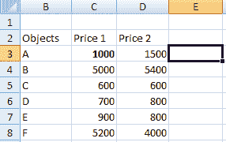
2.  在指定的单元格中键入公式“=IF(D3>C3，1，0)”。
3.  按**回车。**如果该语句为真，则 1 将出现，否则为 0。
4.  将单元格的右下角拖动到表格的最后一个元素，如下所示:
    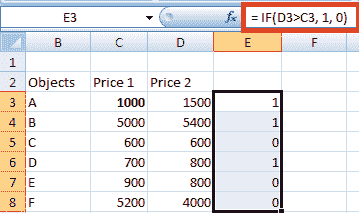
    相应的结果也会出现在其他单元格上。

它描述了带有 0 的语句描述了一个假语句，1 描述了一个真语句。

同样，我们可以使用上面讨论的**“自动搜索公式”**方法来实现多个公式。

#### 注意:记得在每个公式前插入等号(=)。

### 10.适当的

PROJECt 公式用于以标准方式组织名称或单词。这意味着单元格中的第一个单词必须以大写字母开头。以防第一个字母很小；当 excel 中存在大量文本时，可以使用 PROJECt 公式来组织这些单词。

让我们借助一个例子来理解。

请考虑以下步骤:

1.  点击**正确的**列的第一个单元格，如下图:
    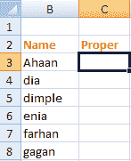
2.  在指定的单元格中键入公式为“= PROJECt(B3)。”
3.  按**回车。**给定名称的正确形式将出现。它将是同一个单词，但第一个字母为大写。如果第一个字母已经大写，则不会发生任何更改。将光标拖动到列的最后一个元素，如下图:
    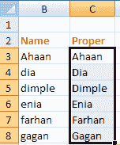

### 11.函数

randBENTH 公式在指定的数字之间生成一个随机数。它由下式给出:

随机之间(底部，顶部)

例如，

随机区间(1，10)

它将显示一个介于 1 和 10 之间的随机数。它可以是任何数字。一般用于在各种学生中查找 excel 中的抽奖号码或 excel 中的姓名。我们只需要以“=RANDBETWEEN(底部，顶部)”的形式键入公式我们可以根据需要设定任何范围。

### 12.连锁的

CONCATENATE 公式可以连接两个或多个单元格，并将其组合成一个单元格。要组合的数据可以是字母或数字的形式。它由下式给出:

CONCATENATE(单元格 1，单元格 2)

让我们考虑一个例子。

步骤如下:

1.  点击列的第一个单元格连接，如下图:
    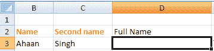
2.  在单元格中键入公式“=CONCATENATE(B3，C3)”，然后按**回车。**这里，B3 和 C3 是指定的小区号。
3.  公式中指定的单元格会组合在一起，如下图:
    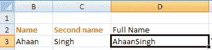
    同样，我们可以连接多个单元格。

### 13.偶数和奇数

偶数函数将十进制值舍入到接近偶数，奇数函数将十进制值舍入到接近奇数。当我们处理负数时，同样的条件也适用。如果是整数，也会转换成最近的偶数或奇数。

它由下式给出:

偶数(单元号)和奇数(单元号)

这里，单元格编号是指我们要转换为偶数或奇数的值。

让我们考虑一个例子。

请考虑以下步骤:

1.  点击**甚至**列的第一个单元格。
2.  键入公式“=偶数(B3)”，然后按**回车。**将出现四舍五入值，如下图:
    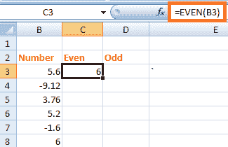
3.  将光标向下拖动到表格的最后一个元素。表中所有指定值将四舍五入到最接近的偶数，如下所示:
    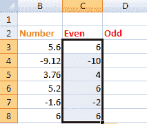
4.  同样，在奇数列的第一个单元格中键入公式“=ODD(B3)”，然后按**回车。**向下拖动光标到最后一个元素。舍入后的值现在将显示为:
    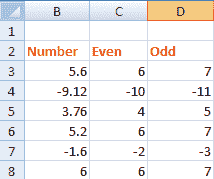

### 14.今天

TODAY 公式取代了每当我们打开 excel 工作表时手动键入当前日期的需要。公式会自动更新指定单元格中的当前日期。

它由下式给出:

今日()

我们需要在指定的单元格上指定上述公式为' =TODAY()'，只需按**回车即可。**

我们不需要在括号内指定任何内容。每次打开 excel 表格，日期都会自动更新。

### 15.将数字转换为货币

用美元指定相同金额的方法只需简单点击一下即可实现。快捷方式由下式给出:

**Ctrl +Shift + $**

转换后的值将以逗号、美元符号和小数点的形式完成。

让我们借助一个例子来理解。

请考虑以下步骤:

1.  选择 Price1$列下的给定数据，如下所示:
    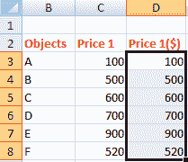
2.  按 **Ctrl +Shift + $。**
3.  数字形式的选择值将转换为美元形式，如下所示:
    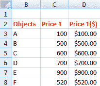

同样，我们可以使用 **Ctrl +Shift + %** 来转换**百分比中的相应值。**在这种情况下，数值将自动乘以 100，并带有百分比符号。

## 复杂公式

复数公式是指**加减乘除**和**除法**公式的混合使用。我们只需在公式栏上计算公式，excel 将在几秒钟内产生所需的结果。我们可以根据上面的公式创建多个复杂的公式。

让我们考虑一个例子。

**例:**计算方程，求出数值。

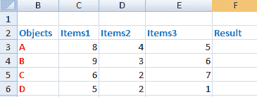

请考虑以下步骤:

1.  单击结果列的第一个单元格。
2.  在公式栏上拖动鼠标，然后键入“=(C3*E3) + D3 - C3/D3 * E3”
3.  按**回车。**结果会出现在指定的单元格上，如下所示:
    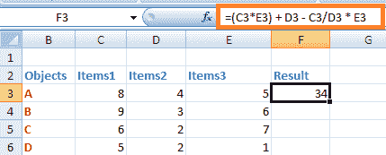
4.  将第一个单元格的光标拖动到结果列的最后一个单元格。结果值将出现在所有指定的单元格上，如下所示:
    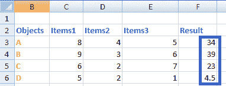

#### 注:计算将根据数学中的 BODMASS 规则进行。

* * *