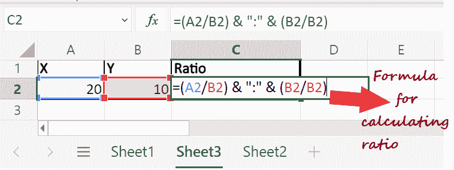
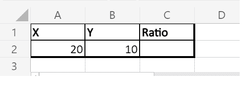
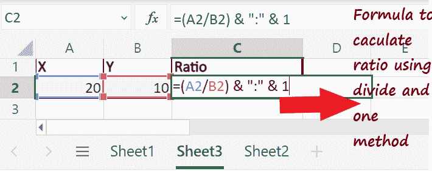
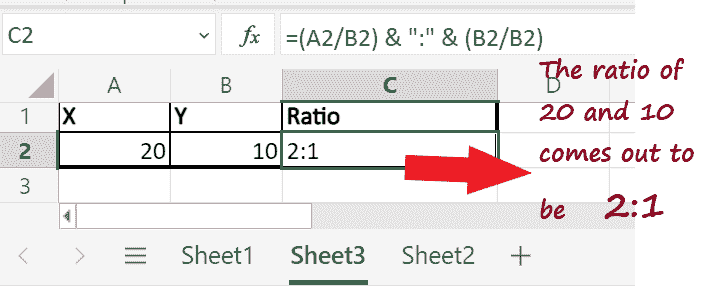
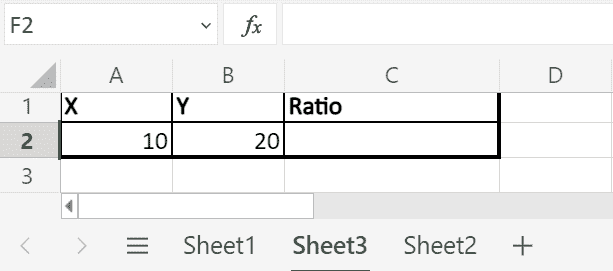
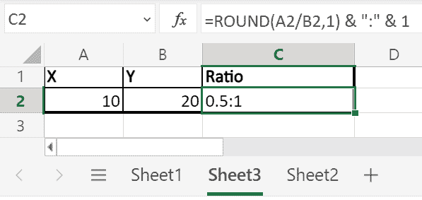

# Excel 中的比率

> 原文：<https://www.javatpoint.com/ratio-in-excel>

**比率**被定义为一种比较两个数据集的方法，使用户能够得出给定数据是更多还是更少的结论。它还提供了 2 个因子或数字之间的比例。因此，人们想要任意两个数据集时，大多使用**比率**。

## 如何在 Excel 中计算比率？

用 Excel 计算两个数的比值非常简单容易。然而，Excel 没有提供任何预定义的函数来帮助我们计算比率。但是，您仍然可以通过创建**自定义公式**来轻松计算它。

在本教程中，我们将发现在 excel 中计算比率的各种方法，并查看一些示例。

## 要点

在继续之前，让我们看看在 Excel 中计算比率之前应该知道的一些要点。

1.  下面提到的方法只有在两个指定的值都是数字的情况下才会起作用并给你想要的输出。
2.  指定的值应该是正数，第二个值不应该是零；否则，结果不会被定义。
3.  请确保使用串联运算符来正确避免错误。
4.  除了 CONTAING 运算符，您还可以使用 CONTAING 公式。

## 方法#1 使用除法计算比率

接下来，让我们了解一下计算两个数比值背后的分步逻辑。

1.  假设您有**两个参数，X 和 Y** ，其中 X 被赋予一个值 **20** ，Y 被赋予一个值 **10** 。
    
2.  以 **"= "符号(等号)**开始公式，进入该单元格的编辑模式。为了计算比率，我们将有两种不同的语法。在语法的前半部分，**将单元格 A2 与 B2(A2/B2)**分开，在第二阶段，**将单元格 B2 与 B2 本身**分开，并用冒号(:)将两个语法分开。最后，我们将使用 concatenate 运算符(&)组合这两种语法的结果。
    公式***=(A2/B2)&:&(B2/B2)***
    
3.  将鼠标光标移至单元格 **C2，输入上述公式，点击键盘上的回车**按钮。
    T3】
4.  如上图所示，它会有你的输出。20 和 10 的**比**出来是 **2:1** 。但是，您可以格式化该值，使输出看起来更有吸引力和可读性。

## 方法#2 使用“一除一”方法计算比率

这个方法只是上述方法的**进阶版。如果你仔细观察上面例子中的公式，你会注意到它被分成两个语法，在第二个语法中，我们用 B2 本身来划分细胞 B2。**

通过将同一个参数与其本身相除，它将总是给出 1 的输出。因此，在第二个语法中，我们可以用 1 代替 B2/B2，而不是提到**，因为它是默认值。因此，它将简化公式，并更容易使用。让我们借助一个例子来看看这个公式的逐步推导和实现。**

1.  我们将再次取**两个参数，X 和 Y** ，其中 X 被赋值为 **20** ，Y 被赋值为 **10** 。
    
2.  要计算比率，请转到单元格 **C2** 并开始**输入比率公式**。
3.  用 **"= "符号**初始化公式。这个方法同样会有两个语法，前半句**分 A2/B2** ，后半句只提 **1** 。使用**冒号(":)**和**分隔语法，使用**串联运算符(&)连接**语法的输出。**所以得出的公式如下:
    公式***=(A2/B2)&:&1***
    
4.  一旦你输入了公式，**点击输入按钮**获取输出。20 和 10 的**比**是 **2:1** 。
    

#### 注意:无论您使用什么方法，您都会注意到比率输出对所有人都是相同的。

## 方法#3 使用 GCD 函数计算比率

Excel 的优点是可以用各种方法解决一个问题。因此求两个数之比的方法之一是通过 **GCD(最大公约数)函数**。虽然很多用户的 GCD 同时有点复杂，但是很多用户使用这个函数是因为它的语法很短。

最大公约数是最大的数，它将该数完全除，并输出**比较比**。在 excel 中，我们有一个预定义的公式来计算两个数字的 GDP。因此 **GCP 会自动找到最大的数来除以**分子**中的值。**

**GCD 公式的语法**

= GCD (num1, num2)
Where num1 and num2 represent two numbers.

让我们看看 GCD 的分步实现，并计算两个数的比值。

1.  我们将采用与方法 1 和方法 2 相同的参数。
    
2.  进入 C2 单元格，通过输入“=”符号启动公式。同样，我们将公式分成两个语法，在每个语法中，我们将依次用 GCD 将**和**两个数字分开。如上所述，为了计算 GCD，我们必须选择两个单元格 **A2 和 B2，用逗号**隔开，即 **GCD (A2，B2)** 。****
3.  语法前半部分用 GCD (A2/ GCD (A2，B2)) 划分**单元格 A2，后半部分用 GCD **(B2/ GCD (A2，B2))** 划分【B2】单元格。使用冒号(:)分隔两个语法，并在串联运算符(&)的帮助下组合输出。
    公式= **A2 / GCD (A2，B2)&:&B2/GCD(A2，B2)**
    T8】**
4.  输入公式后，点击输入按钮。Excel 会立即显示**两个数字**的**比值**。
    

在 excel 中使用 GCD Ratio 计算方法的好处是，它提供了输出，在数字、字符和空格方面看起来也很好。

#### 注意:如果要计算 3 个或更多值的比率，GCD 方法可以是最适合的。

## 方法#4 使用舍入函数计算比率

在 Excel 中计算比率的另一种方法是使用 **ROUND 函数**。这是一个内置的 Excel 公式，用于将任意数字四舍五入到**指定的数字**。

**回合语法:**

=ROUND (num, num_digits)
Where number represent the number to be rounded and num_digits represents the number of digits you want the number to be rounded.

使用该功能的好处是，用户可以计算两个数字的比率，定义的**输出包含精确的小数值，并进行精确的比较**。虽然圆函数也有一个缺点，那就是它不能适用于所有情况。

下面给出了使用舍入函数计算比率的步骤。

1.  假设您有**两个参数，X 和 Y** ，其中 X 被赋予一个值 **10** ，Y 被赋予一个值 **20** 。可以看到，X 比较小；因此，这一次较高的数不能被较小的数整除。
    
2.  在 C2 单元格中，通过键入“=”符号启动公式，并调用内置的**圆形公式**。它将要求两个参数。在第一个参数中，我们将划分两个单元格引用**(用 Y 或 A2/B2 划分 X)**，在第二个参数**中，我们将传递 1** (因为我们只需将其四舍五入为数字 1)。
3.  对于第二阶段的比率，我们最终将使用 1。为了分离 Round 和 1 的结果，我们将使用冒号(:)，然后使用连接运算符(&)连接这两个结果。所以得出的公式如下:
    公式 **=ROUND(A2/B2，1)&:&1**
    T4】
4.  输入公式后，点击输入按钮。Excel 会立即以适当的格式显示这两个数字的比例。10 和 20 的比例是 **5:1。**
    

* * *