# Excel 删除行快捷方式

> 原文:[https://www.javatpoint.com/excel-delete-row-shortcut](https://www.javatpoint.com/excel-delete-row-shortcut)

微软 Excel 是微软办公套件中最受欢迎的强大电子表格程序。这是一个用户友好的程序，用于记录个人和企业的日常数据。Excel 允许我们在电子表格中记录大量数据。我们通常在电子表格的表格中的几行和几列中维护数据。

有时，我们可能会在前面的行中添加数据，稍后可能会删除这些数据。无论是单行还是多行，我们都可以在 Excel 中轻松完成这项任务。在 Excel 中删除所需行的传统方法包括使用功能区中列出的命令，方法是导航至**主页>删除>删除工作表行。**但是，一些 Excel 的删除行快捷方式可以帮助我们在几乎没有时间的情况下快速删除所需的行数。

本文讨论了在 Excel 工作表中删除/移除现有行的一些基本 Excel 快捷方式。此外，本文还介绍了在 Excel 中使用快捷方式删除多行的方法。

## 在 Excel 中删除行的快捷方式

在 Excel 工作表中删除任何特定行可能有不同的原因。虽然我们可以使用不同的方法在 Excel 中删除一行，但最简单快捷的方法涉及快捷方式。下面列出了一些在 Excel 中快速删除行的基本快捷方式:

*   使用键盘快捷键删除 Excel 中的行
*   使用右键快捷方式删除 Excel 中的行

现在，让我们通过示例详细了解上述两种快捷方式:

### 使用键盘快捷键删除 Excel 中的行

微软 Excel 有许多键盘快捷键，有助于立即执行相关操作。当删除一行时，我们可以按下 Ctrl 键，然后按键盘上的减号[-]按钮。

*   Ctrl +(减号)

加号表示我们必须同时按下两个键，一个接一个。具体来说，我们需要按住 **Ctrl** 键，然后按下**减号**按钮。

让我们以下面的数据集为例，我们需要删除第三行。

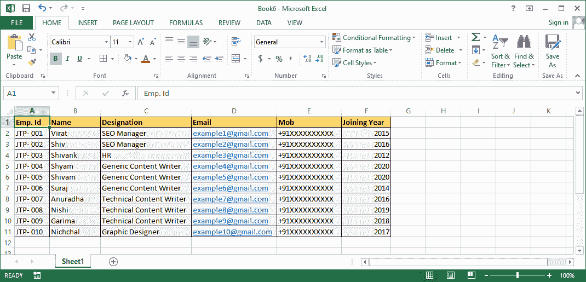

要使用键盘快捷键删除 Excel 行，我们需要执行以下步骤:

*   首先，我们需要**从 Excel 表中选择我们要删除的整行**。在我们的例子中，我们通过点击行标题来选择第三行。Excel 突出显示选中行供参考，如下图:
    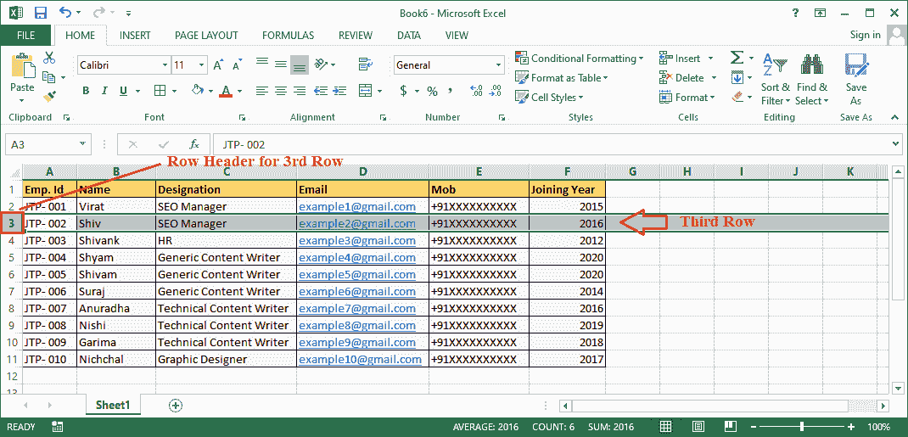
*   选中或高亮显示所需行后，我们必须按下快捷键组合，即 **Ctrl +(减号键)。**
    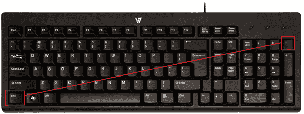
*   我们一按快捷键，Excel 就会立即删除选中的行。使用 Excel 删除行快捷键后我们会得到如下结果:
    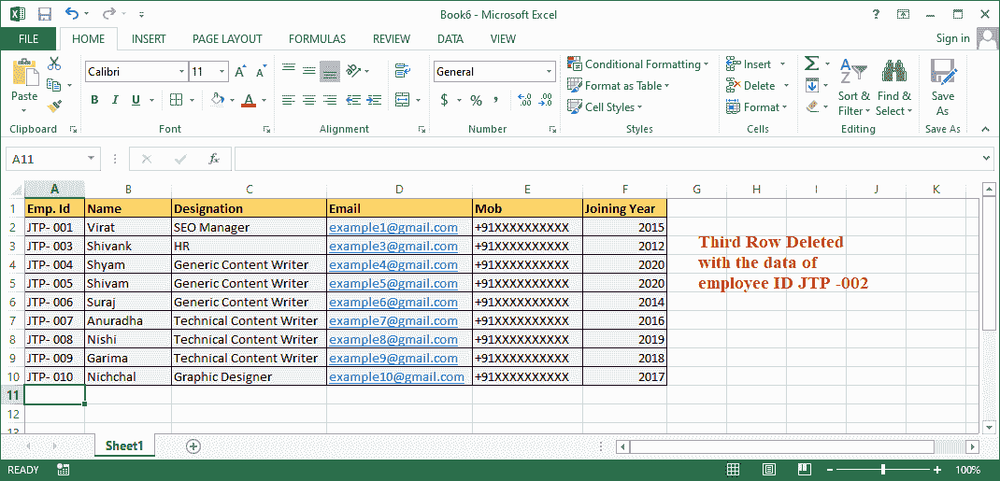
    在上图中，我们可以看到现有的第 3 行已经被完全删除，第 4 行在第 3 行的地方移位。
    如果选择该行的任意单元格而不是整行，按快捷键后会出现**【删除单元格对话框】**。看起来像下图:
    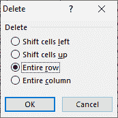
    在这里，我们必须点击选项**【整行】**前给出的单选按钮，然后点击**【确定】**按钮。或者，我们可以按下**‘R’**按钮，然后按下键盘上的**‘回车’**按钮。

### 使用右键快捷方式删除 Excel 中的行

微软 Excel 在右键菜单列表中包含几个最常用的选项，包括插入和删除命令。点击鼠标右键可以进入列表。

让我们考虑具有以下数据集的 Excel 表，其中我们想要删除第 5 行。

要使用右键菜单快捷方式删除 Excel 行，我们需要执行以下步骤:

*   首先，我们需要**选择要删除的具体行**。在我们的例子中，我们需要选择第五行。要选择整行，我们必须单击相应的行标题。
    T3】
*   一旦选择了行，我们必须用鼠标右键单击来访问菜单选项列表。之后，我们需要从列表中点击**‘删除’**选项。
    T3】
*   完成上一步后，我们会得到**“删除单元格对话框”**，有四个不同的选项。
    
    我们需要选择**【整排】**选项，然后点击**【确定】**按钮。
*   只要我们点击“确定”按钮，所选行就会立即被删除。使用右键菜单中的“Excel 删除快捷方式”后，结果如下图所示:
    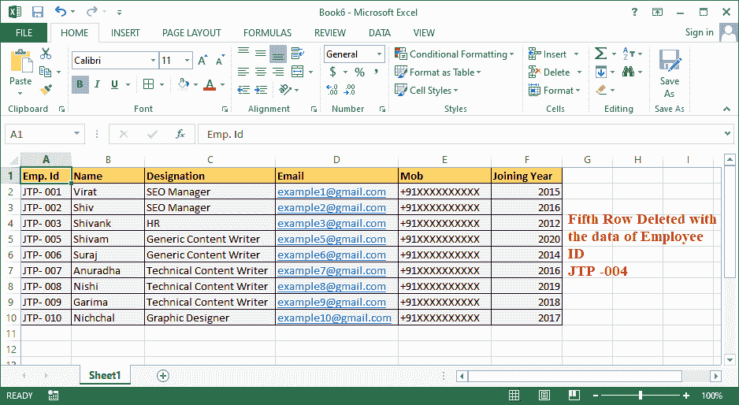

## 如何使用快捷方式删除多行？

当删除多行时，我们可以重复使用上面讨论的任何快捷键(键盘快捷键和右键快捷键)来逐个删除单个行。但是，当删除大量行时，这可能会令人沮丧。相反，我们可以先选择所有要删除的行，然后只使用一次快捷方式。

在 Excel 工作表中删除多行时，可以有两种不同的情况。我们可能需要删除相邻行或非相邻行:

### 对于相邻行

让我们考虑以下示例，其中我们需要删除具有已完成任务的相邻行(即，第 5、第 6 和第 7 行)，我们已经用粉色突出显示了这些行以供参考:

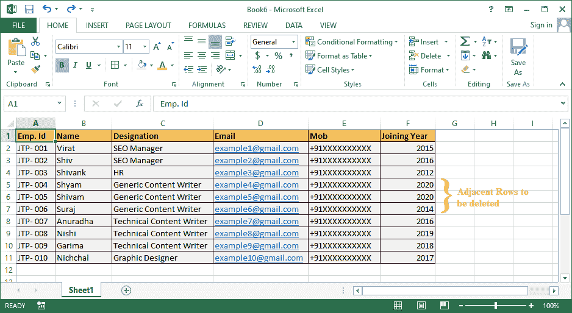

首先，我们需要选择所有突出显示的相邻行。为此，我们需要按住键盘上的**‘Shift’**键，然后点击相邻的第一行和最后一行。这将选择我们单击的行之间的所有行。

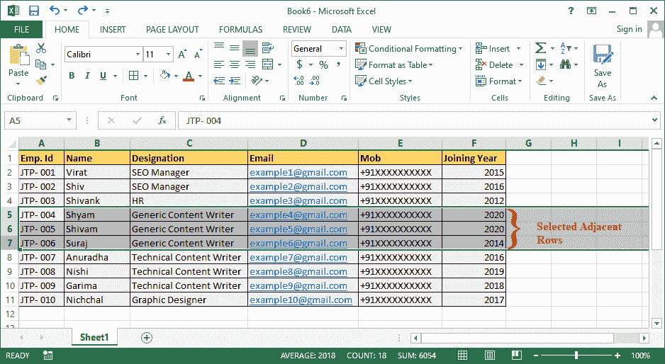

一旦选择了行，我们需要使用键盘快捷键或右击快捷键来删除所选的相邻行。假设使用 Excel 删除行快捷键 **Ctrl +(减号键)**会得到如下结果:

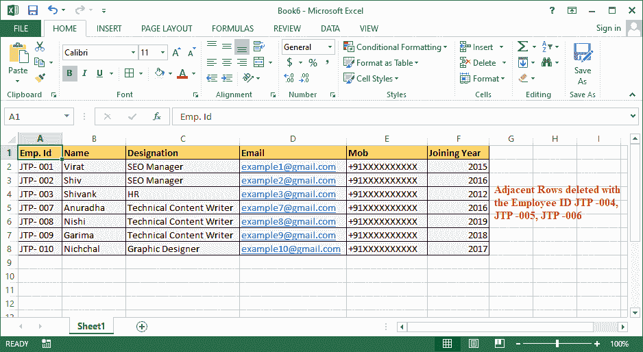

在上面的图像中，选定的相邻行被删除，其他行也相应地移动。这样，我们可以使用“删除快捷方式”删除 Excel 中所需的相邻行。

### 对于不相邻的行

不相邻的行并不总是相连的。它们可以按顺序连接，也可以不按顺序连接，这取决于用户的选择。

让我们考虑以下示例，其中我们需要删除具有已完成任务的非相邻行(即，第 4、第 6 和第 9 行)，我们已经用粉色突出显示了这些行以供参考:

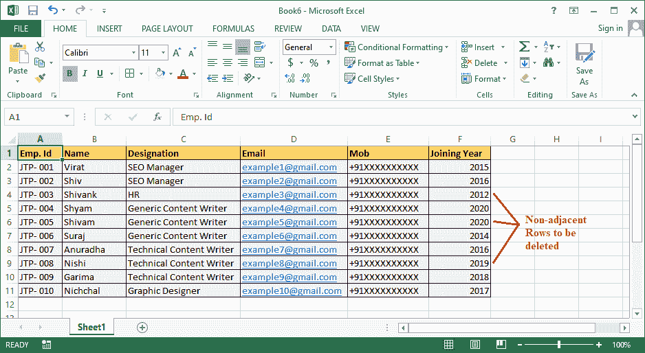

首先，我们需要选择所有突出显示的非相邻行。要选择想要的非相邻行，我们需要按住键盘上的**【Ctrl】**键，然后逐个点击每个非相邻行。这将选择工作表中所有不相邻的行。

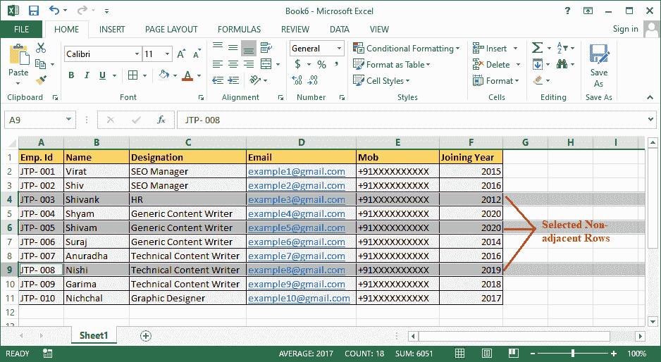

选择行后，我们需要使用键盘快捷方式或右键快捷方式来删除选定的非相邻行。这里，我们使用 Excel 删除行快捷键 **Ctrl +(减号键)。**通过这样做，我们可以轻松地立即删除所需的行。

删除后，我们将得到以下结果:

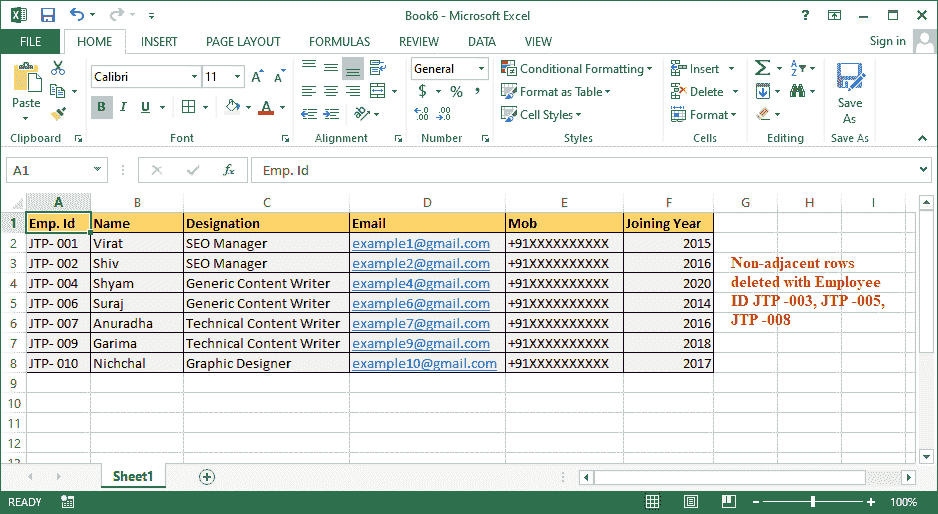

在上面的图像中，选定的非相邻行被删除，其他行也相应地移动。这样，我们可以使用“删除快捷方式”删除 Excel 中所需的非相邻行。

## 使用 Excel 删除行快捷方式时需要记住的重要事项

使用 Excel 删除行快捷方式时，我们必须牢记以下几点:

*   我们必须非常仔细地选择行；否则，我们可能会丢失一些重要数据。
*   如果我们选择单元格而不是行，并使用 excel 删除快捷方式，我们将获得**“Excel 删除单元格对话框”。**
*   默认情况下，Excel 在“Excel 删除单元格对话框”中选择**“上移单元格”**选项。如果我们忘记选择适当的选项，我们将在工作表中面临错误的数据移动问题。因此，我们必须在单击“确定”按钮之前选择“整行”选项。
*   如果我们误选了**‘上移单元格’**选项，Excel 只会删除选中的单元格，而不会删除整行。此外，其余数据将向上移动。
*   如果选择**“左移单元格”、**选项，Excel 只会删除选中的单元格，其余数据会自动左移。
*   如果选择**“整列”选项，** Excel 将删除整列选择。
*   如果我们错误地删除了任何单元格/行/列，我们可以单击撤消按钮或按 **Ctrl + Z** 来恢复应用的更改。

* * *