# Excel 不等于运算符

> 原文：<https://www.javatpoint.com/excel-not-equal-to-operator>

您已经对 Excel 数据执行了几个基本和高级操作，如加减来操作和分析 Excel 数据。比较是可以对 Excel 数据执行的又一个操作。您可以将存储在 Excel 工作表中的两个或多个值相互比较。

比较数据是 Excel 重要且有用的操作，为此 Excel 提供了六种逻辑运算符。**不等于**运算符就是其中之一。它以 **< >** 符号为代表。在本章中，我们将简要介绍 Not Equal to operator ( < >)以了解如何以及在哪里使用它。

我们还将在本章末尾提供这六个逻辑运算符的简要总结。

## 不等于运算符

**不相等(< > )** 是逻辑运算符。Excel 用户可以使用此运算符来比较两个或多个值，并确定它们是相同还是不同。

如果比较的值不相同，则返回真。如果比较的值相同，它将返回 FALSE。结果值将是一次一个:真或假取决于比较结果。

在两个条件(值)之间使用此运算符，方法是在开始处放置等号以启动 Excel 公式。例如=“你好”<>“世界”

#### 注意:在 Excel 中写公式，必须放=(等号)才能开始公式。

当与其他函数(如 IF 和 or)结合使用以获得特定结果时，该运算符变得更加有趣。

### 不等公式

**不相等**运算符用于两个条件(值)或包含数据的单元格引用之间。你可以把它当作-

**语法**

```

=condition1 <> condition2

```

我们将通过比较不同的值，借助几个例子来解释这个运算符。因此，它将帮助你更好地学习它。

### 返回值

如果比较的值不相同，该运算符返回真。如果发现值相同，它将返回 FALSE。

#### 注意:它只返回与等号(=)运算符相反的结果。

### 使用此运算符时。

当您想要确保两个特定值不相等时，可以使用这些值。

此外，您还可以在其他函数中使用它，以使结果更加具体。不等于运算符与等于运算符正好相反。

## 例子

我们将展示不同的例子来描述**不等于(< > )** 运算符的用法和工作原理。我们将举不同的例子来比较数字、文本和字符串数据。

请看我们下面的第一个例子:

### 示例 1:比较数字

我们将举一个比较数值的例子来讨论 Excel 工作表中的**不等于**运算符。

**当数字不同时-返回真**

1.  我们有两个数值(两个不同的数字)存储在 Excel 单元格中，我们将对它们进行“不等于”比较。
    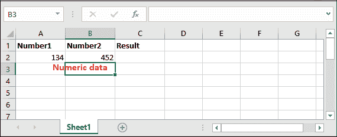
2.  在一个单元格(放置结果的位置)中用<>运算符编写以下比较公式，并比较存储在 A2 和 B2 单元格中的值。
    **= A2<>B2**T4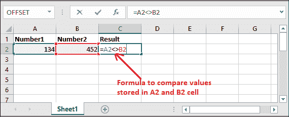
3.  点击键盘上的**输入**键，得到两个值是否相同的结果。
    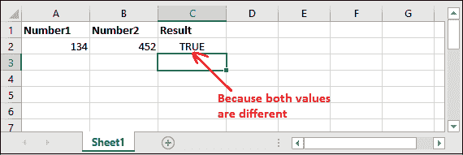
    它已经返回**真**，因为两个值不一样。
    **当数字相同时-返回假**
4.  我们还有一个数字数据(两个相同的数字)存储在 Excel 工作表中，以便使用“不等于”运算符进行比较。
    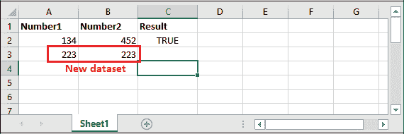
    **这一次两者数值相同。**
5.  在一个单元格(放置结果的位置)中用<>运算符编写以下比较公式，并比较存储在 A2 和 B2 单元格中的值。
    **= A2<>【B2**
    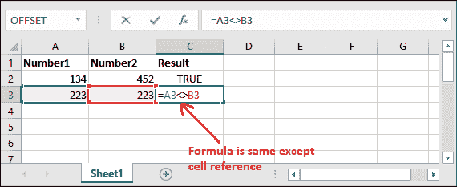
    “除了单元格引用(包含数据的单元格的引用)之外，用于比较的公式总是相同的。”
6.  点击键盘上的**输入**键，得到数值是否相同的结果。
    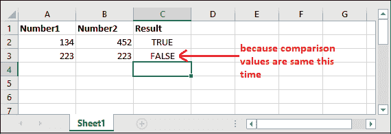
    你已经看到了——这次，Excel 返回了 **FALSE** ，因为两个值相等。

### 示例 2:比较字符串

现在，我们有另一个例子来比较存储在 Excel 工作表中的数据的字符串类型。我们将举一个字符串比较的例子来比较文本数据，以探索**不等于**运算符在 Excel 工作表中的工作方式。

**当字符串不同时-返回真**

1.  我们有字符串类型的数据(两个不同的字符串)存储在 Excel 单元格中，我们将对其进行“不等于”比较。
    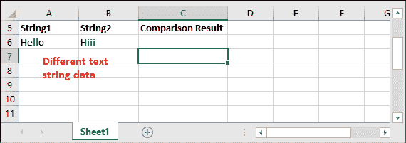
2.  编写公式来比较存储在 Excel 工作表的 A6 和 B6 单元格中的字符串值。
    = A6<>B6
    T2】

#### 注意:您也可以在这个公式中直接在双引号内提供字符串数据，如(=“Hello”<>“Hiii”)。它会一样工作。

3.  由于两个字符串值不同，它将返回**真**。点击**进入**键查看结果。
    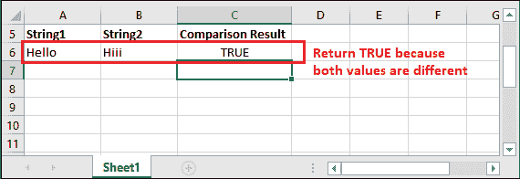
    **当字符串相同时-返回 FALSE**
    我们将两个相同的字符串存储在 A7 和 B7 单元格中，使用“不等于”运算符进行相互比较。
4.  现在，编写以下公式，将字符串与存储数据的新单元格引用进行比较。
    = A7<T4
    B7
    T2】
5.  由于两个字符串不同，点击**进入**键即可得到比较结果，即 FALSE。
    T3】

#### 注意:不等于(<>)运算符在与文本数据一起使用时不区分大小写。因此，如果使用不等于运算符比较不同案例中的两个相同文本字符串，它将返回 FALSE。

**例如，** Hello 和 Hello 两个字符串的拼写相同，但 CASE 不同。Excel 不等于(< >)运算符忽略大小写并同等对待，返回 FALSE 作为结果。


**更多字符串数据**

让我们看看更多关于字符串数据的操作。

| **公式**T2 | **结果** | **总结** |
| ="你好" <> "这个" | 真实的 | 两个文本字符串都不同。所以，它返回真。 |
| =“你好”<>“你好” | 错误的 | 两个文本字符串是相同的。因此，它返回 FALSE。 |
| =“BYE”<>“BYE” | 错误的 | 它忽略了这种情况，对两个字符串都一视同仁。所以，它返回真。 |
| =“你好”<>“你好” | 错误的 | 它还返回 FALSE，因为两个字符串完全相同。 |

你也可以通过在比较公式中输入不同的值来更好地自学。您不需要在双引号中提供数值来将它们作为字符串进行比较。可以直接放，比如 23 <> 15。

## 在函数内部使用<>操作

现在，您将看到我们将在另一个函数中使用<>，而不是直接使用它们来比较 Excel 数据。例如，在中频功能内部。

**例**

我们有一些数字数据(五个科目的分数)存储在一个列中。我们将使用 AVERAGIEF()函数及其内部的<>运算符，通过排除特定数字来比较值的平均值。

1.  用<>运算符写出 AVERAGEIF()的以下公式。
    =AVERAGEIF(B2:B6，“<>42”)
    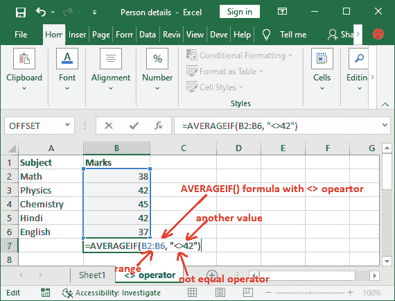
2.  现在，看看用比较运算符计算的平均值结果，它是如何与普通的 average()函数一起工作的。
    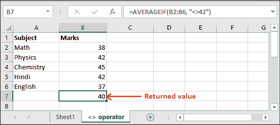
    已经计算出不等于 42 的数值的平均值。因此，根据这个，上面的计算结果是数学(38)、化学(45)和印地语(37)的平均值。
    这个公式是这样的:(38+45+37)/3 = 40
3.  如果你简单地计算相同分数的平均值，你会看到结果会不同，这与上面的结果不同。
    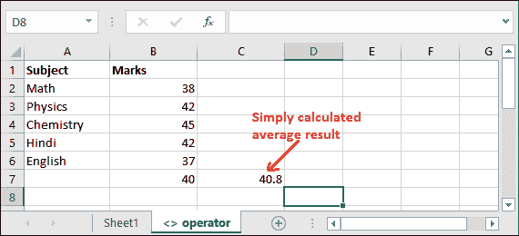

## 逻辑运算符

正如我们告诉您的，Excel 提供了六个逻辑运算符来比较存储在 Excel 工作表中的数据。这些逻辑运算符是**等于、不等于、大于、小于、大于等于、小于等于。**

| 操作员名 | 操作员 | 描述 | 公式(对于真值) |
| 等于 | = | 如果为真，比较两个相等的值 | =A2=B2 (=51=51) |
| 不等于 | <> | 确定两个值不相等 | =A2 <> B2 (=48 <> 51) |
| 大于 | > | 将一个值与另一个值进行比较。 | =A2>B2 (=13>17) |
| 不到 | < | 比较一个值小于另一个值。 | =A2 |
| 大于等于 | >= | 比较一个值是否大于或等于另一个值。 | =A2>=B2 (=7>=4) |
| 小于等于 | <= | 比较一个值是否小于或等于另一个值。 | =A2<=B2 (=16<=16) |

如果条件满足给定值，所有运算符都返回真。否则，它们返回 FALSE。

您可以在我们的 **Excel 逻辑运算符**一章中详细了解这些运算符。从这里学习，它将包含每个操作员的两个或更多示例。

* * *