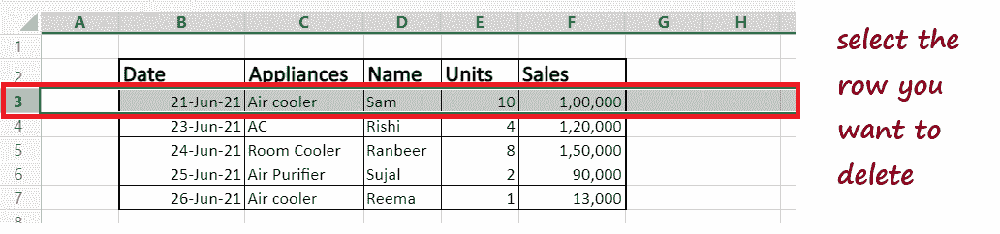
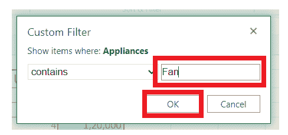

# 删除 Excel 中的数据

> 原文：<https://www.javatpoint.com/delete-data-in-excel>

Excel 数据通常从另一个来源带入工作表。因此，它包含许多用户经常要求**删除的**不需要的数据**。**除此之外，我们经常会遇到 Excel 行、列无用的情况，因此应该从 Excel 电子表格中删除。

Excel 提供两种类型的单元格删除，即删除单元格数据和删除整个单元格。**删除操作**可能涉及**删除一个单元格、任何选定的行或行组、一个随机列，并删除单元格选择中的格式。**

本教程将简要了解应用删除操作的各种方法及其逐步实现。

## 如何删除任意单元格的数据

1.  **选择要**删除数据的单元格**(将光标放在第一个单元格上，并拖动至要删除的最后一个单元格)。**在下面的示例中，我们选择了一系列单元格。
    
2.  将光标放在任何选定的单元格上，然后右键单击它。将显示以下菜单窗口。**选择清除内容**选项，将删除所选单元格中的所有数据。
    T3】
3.  不用右击，可以直接**按键盘上的删除按钮**，它也会**删除所选单元格的所有数据**。
4.  如下图，**所有数据将被删除。**
    

#### 注意:请记住，在上面的选项中，我们没有删除任何单元格。我们只是删除该单元格的数据或内容。

## 清除单元格内容

到目前为止，我们已经学习了如何在不从 Excel 工作表中移除单元格的情况下快速删除或清空单元格内容。但是如果你注意到它只删除了内容，单元格后面的表格仍然在它的输出中。

如果您想清除或删除**内容及其格式或单元格注释，该怎么办。**为了摆脱这种情况，Excel 提供了清除工具(位于主页选项卡上)。使用清除下拉菜单，您可以执行以下任何操作:

1.  **全部清除:**它**删除所选单元格中的所有数据、格式和注释**。
2.  **清除格式:**它只是帮助去掉**选定单元格的格式**，而保持其他一切不变。
3.  **清除内容:****仅删除选定单元格的数据或内容**。它的工作方式与按下删除键相同。
4.  **清除注释:**它**删除单元格选择中的注释**，而不影响其他任何内容。
5.  **清除超链接:**该清除选项**消除选定单元格选择中的活动超链接**，但保持其单元格条目不变。

所有下拉选项对于**快速清除内容、格式、注释和超链接非常有用。**让我们来看看在 Excel 工作表中实现清晰单元格内容的步骤。

1.  将光标放在要清除内容的单元格上。
    
2.  转到主页选项卡->编辑组->清除(它将带有橡皮擦图标)。
    
3.  当我们要删除数据时，将出现以下选项，单击清除内容。
    
4.  您将获得以下输出。
    
5.  您只能看到内容被删除；注释和格式仍然存在。如果要删除内容和格式、注释和超链接，可以选择“全部清除”选项。

## 如何删除行

1.  **点击所需的**行号**，选择**。
    
2.  右键单击，将光标放在任何选定单元格的行号上。将出现以下对话框窗口。点击**删除**选项。
    T3】
3.  **整行**连同所有数据将立即被**删除**，其下一行将上移。
    

#### 注意:您也可以删除多行，方法是先选择一行，然后拖动鼠标光标选择多行。您可以通过按键盘上的 Ctrl 键来选择不连续的行。

## 如何删除列

1.  **点击**所需的列字母**选择。
    **
2.  右键单击，将光标放在任何选定单元格的列字母表上。将出现以下对话框窗口。点击**删除**选项。
    T3】
3.  **整列**连同所有数据将立即被**删除**，向右的列将被移动。
    

#### 注意:您也可以删除多列，方法是先选择一列，然后水平向左或向右拖动鼠标光标以选择更多列。您也可以通过按键盘上的 Ctrl 键来选择不连续的行。

## 根据特定的值/条件过滤和删除行

很多时候我们需要根据一些特定的值删除行或列。当我们想要分析一些特定的数据时，通常需要用到它。在这种情况下，您需要根据某些特定条件过滤掉数据，然后从 Excel 工作表中删除过滤掉的数据。

Excel 支持内置的**过滤功能，用户可以根据许多标准轻松过滤掉数据集，不像文本、数字、日期、颜色等。，**

我们将简单地使用不同的方法过滤掉数据，然后删除它们。

## 删除包含特定文本的行

假设你有一个 Excel 工作表，你想**删除所有字段值为【范】的行**。

在这种情况下，我们将**过滤掉**所有电器值为**、范、**的字段，过滤后，我们将删除所有过滤后的行，而不触及其他行。

遵循下面给出的步骤:

1.  **选择数据集中存在的任何**细胞**。
    **
2.  转到**数据选项卡。**将显示以下选项。
    T3】
3.  在**排序&过滤**组下，点击**过滤选项**(带有过滤图标)。这将导致将**过滤器**放入所有**标题单元格中。**
    
4.  现在，当我们想要在设备中应用过滤器时，**单击设备标题单元格中的过滤器下拉箭头**(类似于向下的三角形)。您将看到以下对话框。选择**“文本过滤器”**选项。
    
5.  将出现以下下拉列表。选择**包含**选项。
    T3】
6.  将出现**“自定义过滤器”**对话框。在包含文本框**中，键入“范”**并单击确定。
    
7.  如下图所示，它将立即**过滤所有的行值**，并且将只显示电器值为“Fan”的记录。
    T3】
8.  现在，我们已经过滤了这些值，下一步是删除它们。**选择过滤值**并将光标放在任何选定的单元格上。
    T3】
9.  右键单击单元格。将出现一个对话框。点击**删除- >工作表行。**
    
10.  删除行后，您将看不到工作表中的数据。要找回数据，我们需要**去掉滤镜。**点击**数据选项卡**并点击**过滤器图标。**
    
11.  将删除所有包含风扇作为其装置值的行，您将得到以下**输出。**
    

### 使用数字条件筛选和删除行

另一个广泛用于**过滤掉**数字数据的选项是使用**数字条件**(或日期条件)。

例如，假设我们已经从外部来源提取了数据，现在我们想要**删除所有在考试中得分低于 300** 的行。

遵循下面给出的步骤:

1.  **选择任意单元格**在数据中应用过滤器。
    T3】
2.  转到数据选项卡。将显示以下选项。
    
3.  在**排序&过滤器**组下，点击**过滤器选项**(带有过滤器图标)。这将导致在所有标题的单元格中放置**过滤器。**
    
4.  现在，当我们想要在标记中应用过滤器时，点击标记标题单元格中的**过滤器下拉箭头**(它类似于一个向下的三角形)。将出现以下对话框。选择**数字过滤器选项。**
    
5.  它将进一步显示所有的数字过滤器选项。单击“小于”选项。
    
6.  单击它后，将显示另一个对话框(如下所示)。在给定字段中，**输入值“300”。**点击确定
    
7.  如下图所示，它将**过滤掉记录**，并显示标记**值小于 300 的数据集。**
    
8.  **选择过滤后的行**并将光标放在任何选定的单元格上。
    T3】
9.  右击它。将出现以下对话框。点击**删除行选项。**
    
10.  删除行后，您将看不到工作表中的数据。要找回数据，我们需要**去掉滤镜。**点击**数据选项卡**并点击**过滤器图标。**
    
11.  如你所见，下面所有值**小于 300 的记录都被删除了，**你有你的**过滤输出。**
    

* * *