# Excel 切片器

> 原文：<https://www.javatpoint.com/excel-slicer>

## 什么是 Excel 切片器？

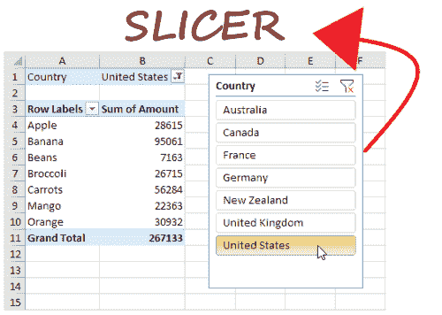

Excel 切片器对于**应用 Excel 表格、数据透视表和数据透视表图表的过滤器非常强大。**它们被广泛用于创建有吸引力的仪表板和摘要报告，因为创建起来毫不费力，视觉上令人愉悦，用户可以随时随地使用它们来更快、更轻松地过滤数据。

切片器的功能在早期版本的 Excel 中不可用。它们最初是在 Excel 2010 中引入的，并在 Excel 2013 和所有更高版本中可用。

## Excel 切片器和数据透视表筛选器的区别

切片器和透视表过滤器执行相同的操作，即**显示一些数据，隐藏其他数据。【Excel 切片器和透视表过滤器的区别如下:**

| 没有 | Excel 切片器 | 透视表筛选器 |
| 1. | Excel 切片器使过滤过程变得非常容易。在透视表中，应用切片器过滤器就像点击一个按钮一样容易。 | 与切片器相比，透视表过滤器有点复杂。当用户选择两个或更多元素时，筛选字段没有指定任何简单的方法来告诉用户正在筛选什么。 |
| 2. | 切片器可以绑定到同一 Excel 工作表中的多个数据透视表。 | 筛选器只能连接到一个透视表。 |
| 3. | 切片器也称为浮动对象，因为它们可以在 Excel 工作表中的任何位置移动，例如您可以将切片器放在数据透视表、数据透视表图表旁边或图表区域内。 | 透视筛选器的访问权限有限，只能应用于列和行。 |
| 4. | 切片器是用户友好的，并提供了一个界面，可以在各种触摸屏环境中完美地执行。虽然安卓和 iOS 等 Excel 手机不完全支持。 | 透视表过滤器在触摸屏上无法正常工作。 |
| 5. | 切片器占用更多的 Excel 空间。 | 透视表报表筛选器非常紧凑 |
| 6. | 自动化切片器非常困难，需要技术技能和努力。 | 自动化透视表筛选很简单，可以通过 VBA 轻松完成 |

## 在 Excel 中插入切片器

切片器可以很容易地插入到 Excel 表格、数据透视表和数据透视表图表中。按照下面的逐步实现将切片器添加到您的 Excel 工作表中。

### 将切片器添加到数据透视表中

要在 Excel 中实现切片器，首先需要创建一个透视表，并按照下面给出的步骤操作:

1.  单击您的 Excel 数据透视表。
    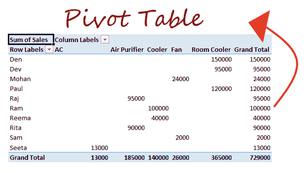
2.  转到**分析选项卡- > *过滤器组，*** 并单击**插入切片器**选项。
    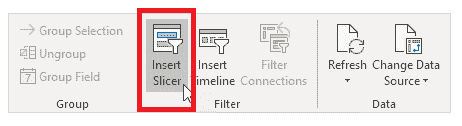
3.  将立即显示 ***【插入切片器】*** 窗口。它将显示各种复选框，每个复选框代表数据透视表的一个字段。您可以选择一个或多个要应用切片器的字段。
    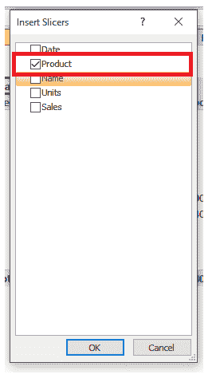
4.  单击确定。

**结果:**

例如，我们只添加了一个切片器来过滤数据透视表，即按产品:

我们可以过滤产品字段，并可以可视化任何特定的数据。例如，在下面的截图中，我们已经使用 Slicer 获取了空气净化器产品的数据。

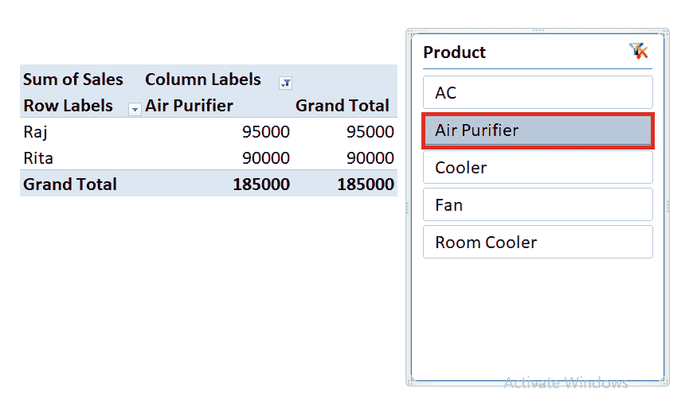

### 将切片器添加到 Excel 表格中

在前面的部分中，我们发现了如何为透视表创建切片器，但是您知道最新版本的 Excel 也允许用户为 Excel 表插入切片器吗？请遵循以下步骤:

1.  创建一个 Excel 表格并点击它。
    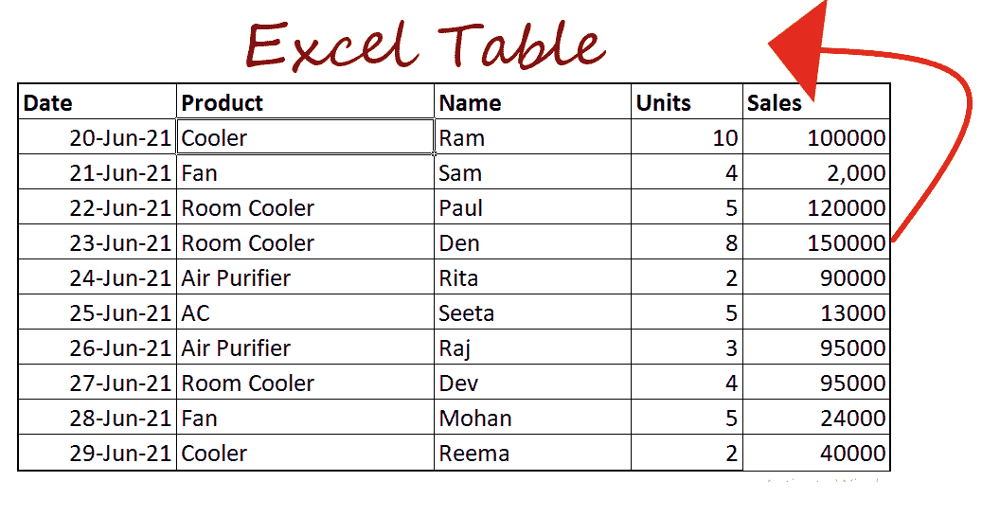
2.  在插入选项卡的过滤器组中，单击**插入切片器。**
    
3.  将显示 ***【插入切片器】*** 窗口框，勾选您想要过滤的列。单击确定。
    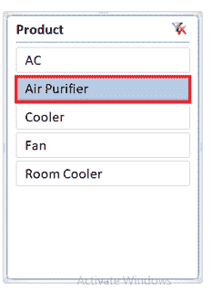

### 为透视图表添加切片器

除了数据透视表和 Excel 表之外，还可以在数据透视表中插入长条图，并对其应用过滤器。尽管您也可以按照上面的指导原则为数据透视表创建切片器，并进一步使用它来筛选数据透视表和数据透视表图表。

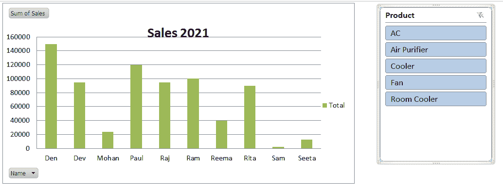

要使用透视图表插入切片器，请执行以下步骤:

1.  创建一个数据透视表图表，并点击它的任何地方。
2.  单击分析选项卡。在*过滤器*组下，选择**插入切片器选项。**
    
3.  将立即显示 ***【插入切片器】*** 窗口。它将显示各种复选框，每个复选框代表数据透视表的一个字段。您可以选择一个或多个要应用切片器的字段。
    
4.  点击确定

**结果:**

这将在您的工作表中集成切片器窗口:

请注意，您可以在透视图表中自定义切片器框的外观。例如:您可以在透视图表区域中定位切片器窗口，如下所示。

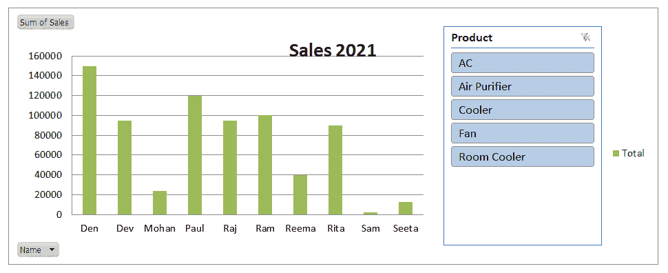

要将切片器框合并到图表区域中，我们需要增加整个图表区域，并需要通过拖动边框来减少绘图区域，最后将切片器窗口拖放到空白区域:

## 如何将切片器移入

您可以轻松地移动和定位切片器，以将其放入同一工作表中的 Excel 中。将光标放在切片器的顶部，除非光标变为四向箭头。

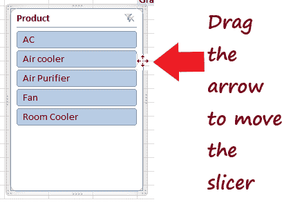

使用箭头将切片器拖到您喜欢的位置。

## 调整切片器的大小

与 Excel 表格、数据透视表和数据透视表不同，您也可以调整切片器的大小。最常见的改变切片器大小的方法是**拖动切片器的边缘。**

第二种方法是更改**位置和布局设置**，并将其设置为切片器所需的高度和宽度。右键单击切片器顶部。窗口将会出现。选择“大小和属性”选项。

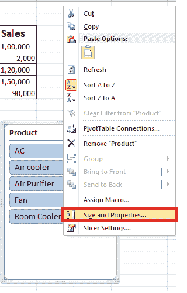

再次显示**尺寸和属性窗口**。从侧窗格中，选择**“位置和布局”**选项。根据您的要求设置各个字段。

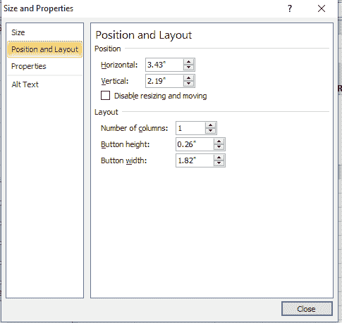

就这样！切片器将被设置到 Excel 工作表中的指定位置。

## 在 Excel 中锁定切片器位置

有时我们需要在 Excel 工作表中固定切片器的位置。要修复切片器，您需要将其锁定在 Excel 中。请遵循以下步骤:

1.  创建您的 Excel 切片器，并右键单击它的顶部。将出现以下窗口。选择**尺寸和属性**选项。
    T3】
2.  将显示“大小和属性”窗格。在侧窗格上，选择属性选项。
    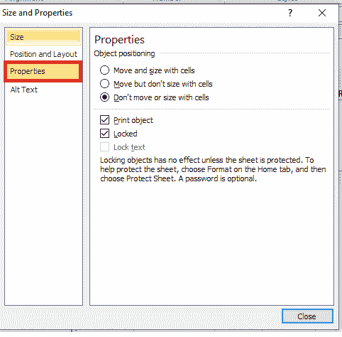
3.  它将显示对象定位选项；选择第三个单选选项**“不要用单元格框移动或调整大小”。**关闭车窗玻璃。
    T3】

完成此操作后，切片器的位置将被锁定。即使您添加或删除新的行或列，或者向数据透视表添加更多字段，切片器的位置也将保持不变。

## 如何从工作表中删除切片器

有两种方法可以从 Excel 工作表中永久删除切片器。

**方法 1**

1.  单击切片器顶部将其选中，然后从键盘上按下删除键。
    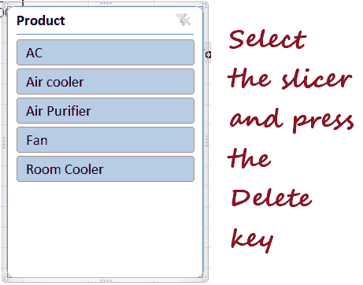
2.  您的切片器将从您的 Excel 工作表中成功删除。

**方法二**

1.  右键单击切片器顶部。将出现以下对话框。选择**删除“切片器名称”**选项。
    T3】
2.  您的切片器将从您的 Excel 工作表中成功删除。

* * *