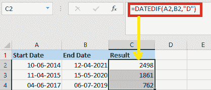
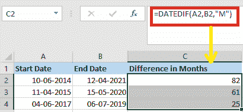
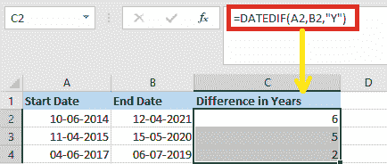
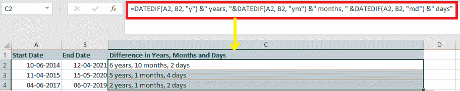
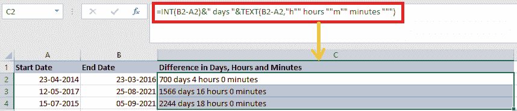
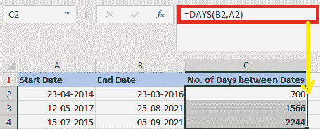
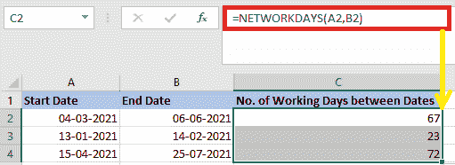
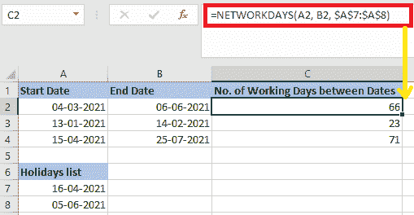

# Excel 两个日期之间的差异

> 原文:[https://www . javatpoint . com/excel-两天差](https://www.javatpoint.com/excel-difference-between-two-dates)

如果我们在许多项目上工作，我们可能需要知道这两个日期之间已经过去了多少个月。同样，如果我们处于项目的计划阶段，我们可能需要知道开始和结束日期。两个日期之间的月数可以用各种方法计算(都使用不同的公式)。

在本教程中，我们将研究计算两个日期之间差异的不同公式。

## 使用函数“日期-DIF”计算两个日期之间的差异

确定两个日期之间差异的最合适的函数是**‘DATE-DIF’。**在 Excel 中，如果我们想用年、月或日来计算两个日期之间的差异，那么 DATEDIF 函数会对其进行管理。

这是一个独特的功能，因为它不包括在 Excel 的日期和时间功能。所以，如果我们去公式，我们会发现超过 450 个 Excel 函数，如果我们去日期和时间，我们不会看到 **DATEDIF。**

### 1.计算两个给定日期之间的天差

如果我们想知道两个日期之间有多少天，我们可以使用以下公式:

1.首先，我们必须在需要得到结果的空白单元格中输入下面的日期函数。

```

=DATEDIF(A2, B2, "D")

```

#### 注意:在上面的公式中，A2 表示开始日期单元格，而 B2 表示结束日期单元格。

2.接下来，要填充这个公式，我们必须将填充手柄向下拖动到单元格，日期之间的天数如下图所示:



### 2.计算两个给定日期之间的月差

如果我们想知道两个日期之间有多少个月，我们可以在空白单元格中使用下面的公式:

```

=DATEDIF(A2,B2,"M")

```

#### 注意:开始日期单元格是 A2，而结束日期单元格是 B2。

然后，我们必须将填充手柄向下拖动到单元格中，这样我们就可以应用上面的公式，并且已经确定了月份中两个日期之间的差异，如下图所示:



### 3.计算两个给定日期之间的年差

我们还可以使用 DATEDIF 函数来计算两个日期之间的年数:

为了确定年份中两个给定日期之间的差异，我们必须在空白单元格中键入以下公式:

```

=DATEDIF(A2,B2, "Y")

```

#### 注意:开始日期单元格是 A2，而结束日期单元格是 B2。

然后，要使用此公式，请将填充手柄向下拖动到单元格，并返回特定两个日期之间的年数，如下图所示:



### 4.计算两个给定日期之间的天数、月数和年数差异

如果我们想一起计算**年、月**和**日**两个日期的差值，那么我们必须使用以下公式:

```

=DATEDIF(A2, B2, "y") &" years, "&DATEDIF(A2, B2, "ym") &" months, " &DATEDIF(A2, B2, "md") &" days"

```

#### 注意:A2 是开始日期单元格，B2 是结束日期单元格。

之后，我们必须将填充手柄向下拖动到我们想要应用上述公式的单元格中；然后我们将看到以下输出:



注意，我们也可以在 **DATEIF** 函数中使用双引号来手动指定日期。只需再次检查 Excel 中双引号中的日期是否为有效的日期格式。

### 5.计算以天、小时和分钟为单位的两个给定日期时间之间的差异

如果我们有两个日期和时间列表，下面的公式可以帮助我们计算**天、小时**和**分钟**中两个日期时间之间的差异。

我们需要在空白单元格中键入以下公式:

```

=INT(B2-A2)&" days "&TEXT(B2-A2,"h"" hours ""m"" minutes """)

```

#### 注:A2 是开始日期时间单元，B2 是结束日期时间单元:

之后，将填充手柄向下拖动到我们想要应用公式的单元格中，我们将获得所需的结果:



## 用 Excel 天数函数计算日期之间的天数

MS Excel 2013 引入 **DAYS 功能**。它的目的是计算两次约会之间有多少天。在 Excel 中，DAYS 函数是一个**日期/时间函数**，通过它我们可以计算两个日期之间的天数。

请注意，与 **DATEDIF 不同，**必须以相反的顺序输入**天数**公式的参数。

```

DAYS(end_date, start_date)

```

因此，我们的公式采用以下形式:

=天数(B2，A2)

根据结束日期是小于还是大于开始日期，它将差值作为正数或负数返回，类似于减法:



## 如何在 Excel 中计算两个日期之间的工作日

如果我们想知道两个日期之间有多少个工作日，那么我们可以使用**网络日**功能:

```

NETWORKDAYS(start_date, end_date, [holidays])

```

前两个参数是众所周知的，而第三个参数是可选的，它允许我们从日计数中省略一个自定义的假日列表。

使用以下公式计算 A 列和 b 列中两个日期之间的工作日数

**=网络日(B2 A2)**



我们也可以在几个单元格中输入我们的假日列表，并告诉公式忽略那些日子:

**=网络日(B2 A2，9 澳元:10 澳元)**

因此，两个日期之间只计算工作日:



#### 注意:如果我们必须管理自定义周末，如仅周六或周日，我们必须使用网络日。INTL 函数，它允许我们定义一周中哪些天必须被认为是周末。

* * *