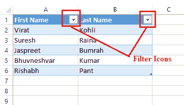

# Excel 筛选器快捷方式

> 原文:[https://www.javatpoint.com/excel-filter-shortcut](https://www.javatpoint.com/excel-filter-shortcut)

微软电子表格是一个功能强大的电子表格软件，有许多独特的功能。一个这样的基本功能是 Excel 中的过滤器。特别是，过滤器的主要功能是只突出显示数据集的关键条目。过滤器功能主要在处理大量数据时有所帮助，因为它通过从显示区域中暂时删除不必要的条目来帮助显示所需的数据。

在 Excel 中应用过滤器时，我们根据自己的需要，根据特定的规则选择要显示和隐藏的条目。此外，这通常是一个多步骤的过程。因此，我们必须知道不同的快捷方式来快速过滤数据，并在一定程度上节省我们的时间。在本文中，我们将讨论一些 **Excel 过滤器快捷方式**，它们将有助于根据我们的需要快速找到所需的数据，并提高整体工作效率。

## 在 Excel 中筛选快捷方式

以下是在 Excel 数据集中应用筛选器的一些基本快捷方式:

*   通过使用键盘快捷键
*   使用数据下的过滤器快捷方式
*   使用“排序和筛选”下的筛选快捷方式

现在让我们详细讨论每种方法:

### 通过使用键盘快捷键

[Excel](https://www.javatpoint.com/excel-tutorial) 支持广泛的键盘快捷键，帮助我们缩短工作时间，提高速度。键盘快捷键是在 Excel 中使用过滤器操作数据的最佳和最有效的方式。

以下是一些常用的带有键盘快捷键的过滤选项:

**创建过滤器**

创建过滤器是过滤数据的第一步。我们需要在数据范围内选择一个单元格，然后使用快捷键 **Ctrl + T** 或 **Ctrl + L.** 按下快捷键后，Excel 会显示一个对话框，询问我们的数据是否包含表头。一旦我们选择了选项，我们需要点击确定按钮。通过这样做，Excel 将把数据转换成表格并启用过滤器。

例如，让我们取下面的数据集，其中我们有标题(名字，姓氏):

当我们选择一个单元格 A2，并按下快捷键 Ctrl + T 时，我们会得到对话框:

因为我们有标题，我们选择勾号。单击“确定”按钮后，我们会看到标题文本(名称)旁边的过滤器图标。看起来是这样的:

**打开/关闭过滤器**

在 Excel 中创建过滤器的另一个快捷方式是使用快捷方式 **Ctrl + Shift + L.** 与前面的快捷方式不同，这个特定的快捷方式需要列中的标题，因为它不允许我们选择是否有标题。相反，它会自动认为我们的数据中有标题。除此之外，这个快捷键(Ctrl + Shift + L)不格式化数据。使用此快捷方式创建过滤器的唯一优点是，我们也可以使用相同的快捷方式关闭过滤器。

由于我们的示例数据集由标题组成，因此我们可以使用快捷键 Ctrl + Shift + L。

当我们再次按下快捷键时，过滤器图标将从标题中移除。但是，我们的过滤选项和过滤数据也将被使用。这样，我们可以在 Excel 中打开和关闭过滤器。

**访问过滤器下拉菜单**

启用过滤器图标(也称为过滤器下拉菜单)后，我们需要单击它来访问过滤器下拉菜单。要点击它，我们可以使用鼠标按钮或键盘快捷键。当使用键盘快捷键时，我们必须首先使用箭头键将光标移动到列标题，然后按下**左 Alt +下箭头(？)**键。这将显示过滤器菜单及其选项。

**用箭头键选择菜单项**

打开过滤器菜单后，我们可以使用键盘上的箭头键来导航菜单中的选项。我们可以使用箭头键 **← → ↑ ↓、**分别选择左、右、上、下命令。另外，我们还可以使用 **Tab** 键向前移动， **Shift + Tab** 向后移动。

**下拉菜单快捷方式**

虽然我们可以使用 Tab 键或箭头键导航菜单项，但我们有更好的选项。Excel 使菜单项使用键盘快捷键变得更加容易。我们可以在使用左 Alt +向下箭头键打开过滤器菜单后按下一些特定的字符。

以下按键可用于执行相应的操作:

*   **S:** 我们可以按‘S’键按升序排序数据，即 A 到 z。
*   **O:** 我们可以按‘O’键对数据进行降序排序，即 Z 到 a。
*   **T:** 我们可以按‘T’键对数据进行颜色排序。
*   **C:** 我们可以按‘C’键清除滤镜。
*   **I:** 我们可以按‘I’键对数据进行颜色过滤。
*   **F:** 我们可以按‘F’键应用文本过滤器或显示文本、数字或日期过滤器子菜单。
*   **E:** 我们可以按‘E’键进入搜索/文本框。

**勾选/取消勾选过滤项目**

唯一过滤的实体显示在位于过滤器菜单底部的搜索框下。我们需要根据需要选择/取消选择实体来过滤数据。为此，我们必须选中/取消选中相应的复选框。要选中或取消选中所需的框，我们需要将光标移动到该特定项目，然后按键盘上的空格键。**空格键**键可用于在过滤器项目中选中和取消选中所需项目。

完成复选框后，我们需要按键盘上的**回车**键来确认并应用过滤选项。

**进入过滤菜单中的搜索框**

搜索框功能是在 Excel 2010 中添加的，并且在最新版本中仍然存在。这个特性帮助我们从列表中找到想要的项目，而不用滚动整个项目列表。按下键盘上的键就可以轻松访问。但是，我们必须已经使用左 Alt +下箭头键从相应的标题打开了过滤器菜单。

如果打开过滤菜单，我们必须按下键盘上的字母**‘E’**。这将直接移动光标到搜索框，我们将能够键入我们需要从列表中选择的任何内容。这样，我们可以根据需要快速过滤数据。

**清除列**中的所有过滤器

如果应用了过滤器并且我们想要删除它，我们可以使用列表中的清除过滤器选项。首先，我们需要为相应的列标题打开过滤器菜单。一旦显示过滤菜单，我们必须按下键盘上的字母**‘C’**。这将立即清除列中的所有过滤器。这样，我们也可以从其他列中移除过滤器。

**一次清除所有过滤器**

虽然上述方法可以用于逐个清除每个特定列中的过滤器，但我们也可以使用另一种快捷方式一次清除所有列中的过滤器。这意味着，如果我们想从所有列而不是一列中删除过滤器，我们可以使用这个方法。按照这个方法，我们需要依次按下 **Alt** 键、字母 **A、**然后依次按下字母 **C** ，即**Alt>T9】A>T11】C**

这里的快捷方式通常通过功能区中的**数据>清除过滤器**。这将清除当前工作表中的所有筛选器。

### 使用数据选项卡下的过滤器快捷方式

在 Excel 中使用过滤器的另一种方法包括使用过滤器快捷方式平铺。通过功能区内的数据选项卡可以访问它。看起来是这样的:

例如，假设我们有以下 excel 表:

让我们使用以下快捷方式应用过滤器:

*   首先，我们需要**选择任何特定的单元格或数据范围**来应用过滤器。之后一定要去**数据>过滤。**
    
*   单击“过滤器”选项后，我们将看到过滤器应用于选定的单元格或数据区域。Excel 启用对应列的**过滤图标**，如下图:
    
*   我们需要**点击过滤器图标**或过滤器下拉菜单图标来访问菜单项。
    
    假设我们只想显示勤务兵的名字。为此，我们需要**选择复选框**“击球手”，然后点击**确定**按钮。
    
    我们只会得到所有那些是击球手的球员的名字，比如:
    
    要禁用过滤器并取回所有数据，我们可以从功能区再次点击过滤器平铺。

#### 注意:必须注意，Excel 中的筛选选项不会删除条目。相反，它只是根据用户应用的规则使条目可见和隐藏。

### 使用“排序和筛选”下的筛选快捷方式

微软电子表格提供了一个快捷方式来应用我们的电子表格过滤器。快捷方式可以从功能区右侧的“主页”选项卡的“编辑”部分轻松访问。它被命名为“排序和筛选”。但是，我们必须在单击“排序和筛选”快捷方式后选择“筛选”。看起来是这样的:

现在让我们尝试这种方法，并在下面的 Excel 表中应用过滤器:

*   首先，我们需要选择要应用筛选器的列或整个数据区域。接下来，我们必须导航到**主页>排序&过滤器>过滤器。**
    
*   单击列表中的“过滤器”选项后，我们将看到所选区域在列中写入的文本旁边有新的过滤器图标。看起来像下图:
    
*   之后，我们需要点击所需的过滤器图标来展开过滤器菜单。
    
*   显示过滤器菜单后，我们可以选择实体，使其可见或隐藏。假设我们只想突出显示 excel 表格中的保龄球手姓名。为此，我们需要选择与文本“保龄球手”相关联的复选框，并取消选择所有其他复选框。最后，我们必须点击确定按钮。
    
    这样做，我们只会从我们的数据集中得到投球手的名字，比如:
    

这就是我们如何使用 Excel 过滤器快捷方式在 Excel 中过滤数据。

* * *