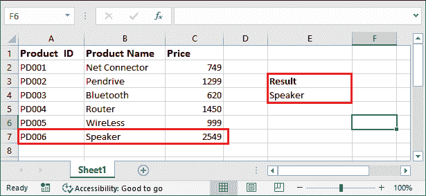

# Excel LOOKUP()函数

> 原文：<https://www.javatpoint.com/excel-lookup-function>

Excel 提供了一个名为 LOOKUP()函数的函数来查找数据的近似匹配。它在单行或单列范围内执行粗略的匹配查找。但是，LOOKUP()函数会在列/行范围内搜索值本身或其近似匹配项。

**例如，**LOOKUP()函数在您没有要查找的确切值时非常有用。因此，我们使用它的附近值来找到我们想要的确切结果。LOOKUP()函数将帮助我们在一个范围内搜索它的精确匹配或附近匹配。

在 [MS Excel](https://www.javatpoint.com/excel-tutorial) 中，该功能归类在公式栏内的**查找和引用功能**下。您可以从“公式”选项卡中访问它，并在其用户界面中为它们各自的字段提供值。您也可以通过其语法在公式栏中直接使用它。除此之外，你还可以把它用于许多其他用途。

## 需要 LOOKUP()函数

让我们通过一个场景来理解 Excel 中 LOOKUP()函数的需求。**例如，**我们有一个工作表，其中包含产品 id、产品名称和价格的列表。这些列包含大量数据。

用户需要找到产品名称，价格为 829 或 829 左右。LOOKUP()函数将帮助我们实现这个结果。我们将使用 LOOKUP()函数来查找该值的产品名称。

## 句法

这个函数有非常不同的参数值，其中前两个是必不可少的，第三个是可选的。

```

=LOOKUP(lookup_value, lookup_range, [result_vactor])

```

在一些 Excel 教程网站上，您可能会得到 LOOKUP()函数的更多语法。上面给出了第一个语法，另一个语法是-

```

=LOOKUP(lookup_value, array)

```

您可以认为该语法与不带[result_vertor]参数的语法 1 相同。

## 因素

Lookup()函数由三个参数组成，这三个参数对于查找值和返回结果都很重要。

**Lookup_value -** 这个函数的第一个参数是 Lookup_value，保存用户在 lookup_range 中搜索的值。

**Lookup_range 或数组-**Lookup _ range 参数保存我们在其中查找 lookup_value 的单元格的范围。这些单元格区域可以是单行的，也可以是一列的。

**【result _ vector】(可选参数)-**result _ vector 是这个函数最重要但可选的参数。它还包含一个对应于 lookup_range 的单元格区域。

当在查找范围内找到附近的匹配(近似匹配)时，lookup()函数从 result_vector 中挑选相邻的值，并将其返回给用户。

## 返回值

LOOKUP()函数返回任何类型的数据，这取决于 LOOKUP()函数中传递的参数。它可以是数字或字符串。

**附加结果:**

如果 LOOKUP()函数无法找到我们正在搜索的值(lookup_value)的精确匹配，它将返回 lookup_range 中小于或等于该值的最大值。

## result_vector 有什么用？

我们知道[result_vector]是一个可选参数，你可以选择是否使用它。

*   如果在 LOOKUP()函数中提供 result_vertor 参数，则从该范围中选择结果值，并在找到精确或近似匹配时返回给用户。
*   如果未向 LOOKUP()函数提供[result_vertor]参数，它将返回在 **lookup_range** 参数中找到的近似匹配值本身。

要理解 LOOKUP()函数，重要的是通过实例学习，了解实际工作。我们将在本章下面的例子中理解这个参数的用法。

## 如何使用 LOOKUP()函数？

我们有几个例子可以通过提供不同的参数值来学习 LOOKUP()函数。这些例子将帮助你更好地学习它。我们将使用这两种语法来查看它们在应用于 Excel 数据时将返回什么值。

### 示例 1:使用[结果向量]参数

我们有一个包含产品 id、产品名称和价格列表的工作表。一个用户想找到产品名称，价格是 2589 或者附近。我们将使用 LOOKUP()函数来查找该值的产品名称。


让我们看看如何使用 LOOKUP()函数实现这个结果，以及它将如何帮助我们实现这个结果。

**使用 LOOKUP()功能的步骤**

1.  在要获取结果的单元格中编写以下 LOOKUP()公式。
    =LOOKUP(2589，C2:C7，B2:B7)
    
2.  现在，通过按下键盘上的**回车**键，现在只需点击一下即可获得结果。查看生成的产品名称。
    
    LOOKUP()函数发现 2589 接近 2549，这是**音箱的价格。**因此，它返回 Speaker 作为结果值。

### 示例 2:不使用[结果向量]参数

如果我们不在 LOOKUP()函数中使用第三个参数，那么一个很大的问题是，在找到近似值时，它会返回给用户什么。

我们将使用上述示例中使用的相同值，以便您可以比较两个结果。

1.  不使用[result_vector]值编写 LOOKUP()公式，如下所示-
    =LOOKUP(1289，C2:C7)
    
2.  现在，点击**进入**键，得到这个公式的结果。看到已经返回值 2549，对应**音箱。**
    
    所以，希望大家理解 LOOKUP()函数里面【result_vector】的工作和用法，以及 result_vector 是如何影响结果的。

### LOOKUP()函数有问题

在 Excel 数据上使用 LOOKUP()函数时，可能会遇到问题。有时，它不会返回最接近 lookup_value 的近似值。让我们用一个例子来看看您在使用 LOOK()函数时可能会遇到哪种类型的问题。

1.  我们正在寻找一种价格为 999 英镑的产品。按照以下方式使用 LOOKUP()公式:
    =LOOKUP(999，C2:C7，B2:B7)
    
2.  现在，点击**进入**键，得到这个公式的结果。看到已经退了名为**蓝牙、**的产品，价格 620。
    
    你会注意到工作有一个价格 999 的产品，我们的 lookup_value 也是 999，但是它还是返回了蓝牙。
    现在一个很大的问题是——如果我们要找的是价格接近 989 的产品。但它返回的是**扬声器**作为合成值，价格为 620。然而，无线是正确的结果，其价格是 999，最接近 989 的近似值。

### 原因及解决办法

返回不正确的值可能有两个原因:

1.  有时，如果 lookup_range 参数的值没有按升序排序，LOOKUP()函数会返回一个不正确的值。LOOKUP()将对列进行排序，并选择错误的值作为结果。因此，我们将寻找解决办法。
2.  另一个原因是-当您将公式从一个单元格复制到另一个单元格时，可能会出现这种类型的错误。单元格引用发生变化，因此可能会给出错误的值。也可能有其他原因。所以，避免复制公式。

Excel 提供了一个名为 VLOOKUP()的函数。您可以将其用作 LOOKUP()函数的替代函数。它不要求 lookup_range 值按升序排序。

## 使用 LOOKUP()函数时要记住的事情

在 Excel 数据上应用 LOOKUP()公式时，您应该记住以下几点。

1.  **#N/A 错误-** 当 LOOKUP()函数未能找到与您正在查找的值最接近的匹配时，您可能会得到此错误。这可能是因为-
    *   lookup_range 参数中的最小值大于 lookup_value。
    *   lookup_range 值不是按升序排列的。
2.  **#REF Error -** 当公式查找不存在的单元格引用时，会出现此错误。这可能是因为-
    *   您之前已经创建了公式，在输入 LOOKUP()后，单元格将被删除。
    *   当您将函数从一个单元格复制到另一个单元格时，公式会变得无效并产生此错误。

因此，在处理 Excel 数据和使用 LOOKUP()公式时，应该避免使用它们。

### 验证不同的结果值

基于这个 Excel 电子表格，我们将分析 lookup()函数中不同 lookup_value 的结果。


| 公式 | 结果 | 描述 |
| =LOOKUP(449，C2:C7，B2:B7) | # 不适用 | 查找值小于 C2 的所有值:C7(查找范围)。 |
| =LOOKUP(620，C2:C7，B2，B7) | 蓝牙 | 它找到完全匹配的，并从列 b 返回值。 |
| =LOOKUP(620，C2:C7) | Six hundred and twenty | 它找到 lookup_value 的精确匹配，并从 c 列返回。 |

* * *