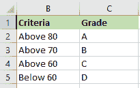
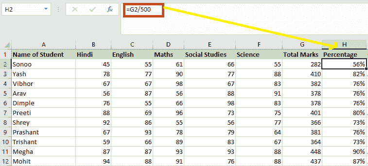
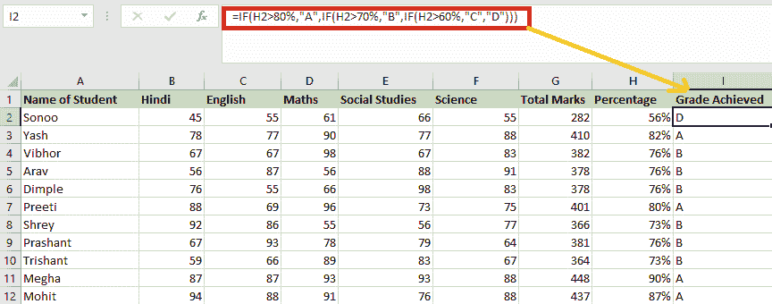
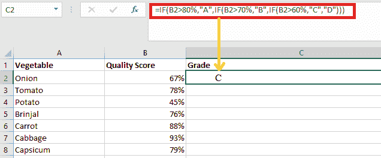
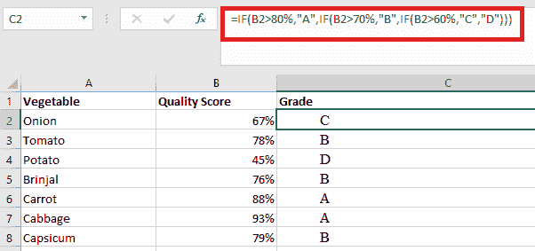
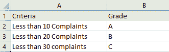
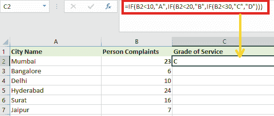
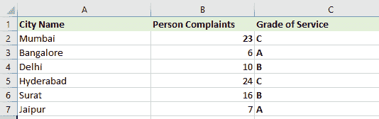

# 微软 Excel 等级公式

> 原文:[https://www.javatpoint.com/ms-excel-grade-formula](https://www.javatpoint.com/ms-excel-grade-formula)

在 Excel 中，等级公式主要是嵌套的 IF，用于检查各种条件，如果满足条件，则返回特定的等级。

我们用于坡度计算的公式是以这样一种方式创建的，即检查坡度板的所有条件都得到验证，然后返回属于该条件的坡度。

*   我们用于等级计算的 Excel 公式是根据数据属性的性质对数据进行分类的绝佳方法。如果我们有一个班级学生的分数数据，想知道哪个学生好，成绩比其他学生多，我们可以计算分数的等级。
*   由于 Excel 中没有内置公式计算成绩，我们就用“IF”函数。在以下情况下，我们需要利用 Excel 中的嵌套 IF 公式来计算等级，因为我们将有几个等级。

## 如何使用 Excel 公式进行成绩计算？

下面是一些 [Excel](https://www.javatpoint.com/excel-tutorial) 计算成绩公式的例子:

### 示例 1:使用 Excel 公式计算学生成绩

在这个例子中，我们有与学生在期末考试中获得的分数相关的数据，我们必须为获得的分数计算分数。在本例中，有必要定义等级标准，以便我们可以计算等级。最高分考虑“A”级，最低分考虑“D”级。

我们需要以下步骤使用 Excel 公式计算学生的成绩:

1.首先，我们需要定义标准，用于为学生的分数返回一个等级。

2.之后，我们要明确标准；我们需要弄清楚如何确定学生的总分和百分比。

3.当我们需要使用嵌套的 IF 公式时:

**=IF(H2 > 80%，“A”，IF(H2 > 70%，“B”，IF(H2 > 60%，“C”，“D”))**

我们在公式中使用的逻辑是:

*   如果学生的百分比大于 80，他或她

**=IF(H2 > 80%，“A”，IF(H2 > 70%，“B”，IF(H2 > 60%，“C”，“D”))**

*   如果百分比超过 70，那么这个学生将达到 b 级

**=IF(H2 > 80%，“A”，IF(H2 > 70%，“B”，IF(H2 > 60%，“C”，“D”))**

*   如果百分比超过 60，则学生达到 c 级

**=IF(H2 > 80%，“A”，IF(H2 > 70%，“B”，IF(H2 > 60%，“C”，“D”))**

*   最后，如果百分比低于 60%，学生将获得“D”级。

**=IF(H2 > 80%，“A”，IF(H2 > 70%，“B”，IF(H2 > 60%，“C”，“D”))**

4.最后，我们必须将公式向下拖动到其他单元格，以计算剩余学生或单元格的分数。

### 2.使用 Excel 等级公式计算产品质量等级。

在这个等级公式示例中，我们必须根据收到的特定蔬菜的质量分数来计算蔬菜的质量等级。品质最好的蔬菜考虑“A”级，品质差的蔬菜考虑“D”级。

以下是确定产品质量等级必须遵循的步骤:

1.首先，为了计算分数，我们必须设定标准。

2.接下来，我们将使用嵌套的 IF else 公式，就像我们在上面的例子中使用的那样，来计算产品质量的等级。

我们需要在这个例子中使用以下公式

**=IF(B2 > 80%，“A”，IF(B2 > 70%，“B”，IF(BS > 60%，“C”，“D”))**

在这种情况下，我们将逻辑定义如下:

*   如果百分比大于 80，则等级为“A”。

**=IF(B2 > 80%，“A”，IF(B2 > 70%，“B”，IF(BS > 60%，“C”，“D”))**

*   如果百分比大于 70，则等级为“B”。

**=IF(B2 > 80%，“A”，IF(B2 > 70%，“B”，IF(BS > 60%，“C”，“D”))**

*   如果百分比大于 60，则等级为“C”。

**=IF(B2 > 80%，“A”，IF(B2 > 70%，“B”，IF(BS > 60%，“C”，“D”))**

*   最后，如果百分比小于 60，则等级为“D”。

**=IF(B2 > 80%，“A”，IF(B2 > 70%，“B”，IF(BS > 60%，“C”，“D”))**

3.最后，我们必须将公式向下拖动到其他单元格，以确定剩余产品的等级。

### 3.计算服务中心提供的质量等级

现在，与 Excel Grade Formula 的前两个示例不同，我们在这种情况下将使用的公式将有所不同，因为标准将是针对客户服务中心注册的投诉数量。这表明投诉越少，服务质量越高。

以下是我们定义服务等级标准时必须遵循的步骤。

1.首先，我们必须确定服务等级标准。

2.那么我们必须使用以下公式来计算等级；在这个例子中，我们使用“”的逻辑(大于)。

我们在这个例子中必须使用的嵌套 IF 公式是:

**=IF(B2 < 10、“A”、IF(B2 < 20、“B”、IF(B2 < 30、“C”))**

我们在这个例子中使用的逻辑如下:

*   投诉数量少于 10 件，得分为“A 级”。

**=IF(B2 < 10、“A”、IF(B2 < 20、“B”、IF(B2 < 30、“C”))**

*   如果投诉少于 20 件，等级将为“B”。

**=IF(B2 < 10、“A”、IF(B2 < 20、“B”、IF(B2 < 30、“C”))**

*   如果投诉少于 30 件，等级将为“C”。

**=IF(B2 < 10、“A”、IF(B2 < 20、“B”、IF(B2 < 30、“C”))**

*   如果投诉不符合任何标准，等级将为“D”。

**=IF(B2 < 10、“A”、IF(B2 < 20、“B”、IF(B2 < 30、“C”))**

3.最后，我们必须将公式向下拖动到剩余的单元格中。

## 用 Excel 公式计算成绩时需要牢记的几个要点

使用 Excel 公式计算成绩时，我们必须记住以下几点:

1.  如果我们在较低的数字等于较高的分数的情况下计算分数，那么我们将需要使用运算符“”
2.  我们必须记住使用与公式中使用的“IF”语句数量相同的括号来结束公式。这意味着所有嵌套的 if 公式必须以“)”结束。
3.  如果我们使用的是百分比而不是整数，我们还需要在逻辑函数中声明百分比。
4.  在将公式向下拖动到其他单元格之前，我们必须确保所引用的范围已锁定。

* * *