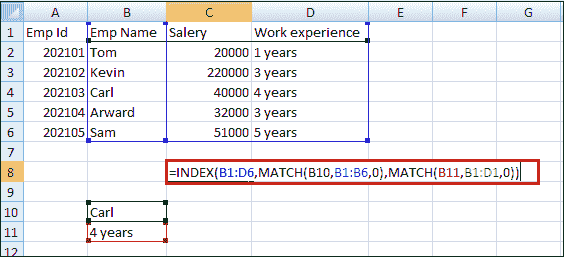
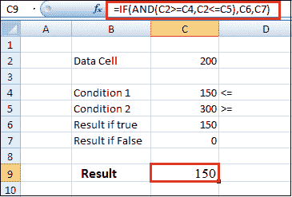
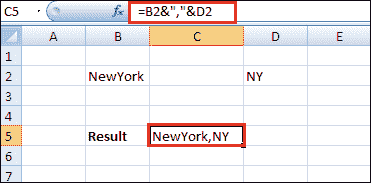

# Excel 中的高级公式

> 原文：<https://www.javatpoint.com/advanced-formulas-in-excel>

微软 Office Excel 是最受欢迎和最著名的工具。它以其执行函数和高级 excel 公式的能力，帮助小型、中型和大型企业维护、存储数据并将其分析为有用的信息。

95%的 Excel 用户应用基本表单。有用于复杂计算的函数和高级 excel 公式。这些函数旨在方便地查找和格式化大量数据，而高级 excel 公式则用于从给定的特定数据集获取新信息。

所有高级 excel 公式都可以将冗长的手动任务转化为几秒钟的工作。下面是一些高级公式，如 VLOOKUP、INDEX、MATCH、IF、SUMPRODUCT、AVERAGE、SUBTOTAL、OFFSET、LOOKUP、ROUND、COUNT、SUMIFS、ARRAY、FIND、TEXT 等等。

**1。索引匹配**

这是 VLOOKUP 或 HLOOKUP 公式的高级替代方案，它们有几个缺点和局限性。INDEX MATCH 是 Excel 公式的强大组合，将您的财务分析和财务建模提升到一个新的水平。

*   INDEX 根据列号和行号返回表中单元格的值。
*   MATCH 返回单元格在行或列中的位置。

```

Formula: =INDEX(B1:D6,MATCH(B10,B1:B6,0),MATCH(B11,B1:D1,0))

```

下面是 INDEX 和 MATCH 公式组合的一个例子。在本例中，我们根据员工的姓名查找并返回他们多年的工作经验。因为名字和年份都是公式中的变量，所以我们可以同时改变它们。



**2。如果与“与/或”结合使用**

谁花了大部分时间做各种类型的金融模型面对嵌套的 IF 公式可能非常困难。将 IF 与 AND 或 or 函数相结合是一个很好的方法，可以使公式更容易审核，也更容易让其他用户理解

```

Formula: =IF(AND(C2>=C4,C2<=C5),C6,C7)

```

在下面的示例中，您将看到如何组合使用各个函数来创建更高级的公式。



**3。偏移量结合总和或平均值**

OFFSET 函数本身并不是特别高级，但是当我们将其与 SUM 或 AVERAGE 等其他函数结合时，我们可以创建一个相当复杂的公式。

假设您想要创建一个动态函数，该函数可以对可变数量的单元格求和。使用常规 SUM 公式，您只能进行静态计算，但是可以通过添加 OFFSET 来移动单元格引用。

**4。选择**

这个高级 excel 公式删除了更长的 IF 函数语句，并提取了您想要的特定数据集。当一个特定的条件有两个以上的结果时使用。

CHOOSE 函数非常适合金融建模中的场景分析。它允许您在特定数量的选项之间进行选择，并返回您选择的“选项”。

**5。XNPV 和 XIRR**

假设你是一名分析师，从事投资银行、股票研究、财务规划与分析(FP&A)或任何其他需要现金流贴现的公司金融领域。在这种情况下，这些公式是更好的选择。

```

Formula: =XNPV(discount rate, cash flows, dates)

```

简单地说，XNPV 和 XIRR 允许你对每个被贴现的现金流应用特定的日期。Excel 净现值和内部收益率公式的基本问题是，它们假设现金流之间的周期相等。作为一名分析师，通常你会遇到现金流时间不均匀的情况，这个公式就是你解决这个问题的方法。

**6。SUMIF 和 COUNTIF**

这两个高级公式是条件函数的重要用途。SUMIF 会添加符合特定条件的所有单元格，COUNTIF 会计算符合特定条件的所有单元格。

**7。PMT 和 IPMT**

如果你在商业银行、房地产、FP&A 或任何处理债务时间表的金融分析师职位工作，这两个公式对你会很有帮助。

PMT 公式给出了在贷款期限内等额付款的价值。你可以和 IPMT 一起使用，它告诉你同一类型贷款的利息支付，然后分开本金和利息支付。

**8。透镜和装饰**

LEN 和 TRIM 公式对于需要组织和操作大量数据的金融分析师非常有用。不幸的是，我们得到的数据并不总是组织得很好，有时，会出现像单元格的开头或结尾有多余的空格这样的问题。

```

Formulas: =LEN(text) and =TRIM(text)

```

LEN 公式返回给定的文本字符串作为字符数，当您想要计算某些文本中有多少字符时，这很有用。

TRIM 公式用于修剪或删除从另一个源复制一组数据时出现的额外空间。

**9。连接**

Concatenate 本身不是一个函数。这只是将不同单元格中的信息连接起来并使工作表更加动态的一种创新方式。

该函数结合了 Excel 中的左函数和右函数，通过设置变量从左和右拖动数据的特定部分来准备新的数据列。对于执行财务建模的财务分析师来说，这是一个非常强大的工具。

```

Formula: =A1&" more text"

```

在下面的例子中，您可以看到文本“New York”plus，是如何与“NY”联合起来创建“New York，NY”的。这允许您在工作表中创建动态标题和标签。现在，您可以独立更新单元格 B2 和 D2，而不是直接更新单元格 B8。有了大量的数据，这是一项宝贵的技能。



**10。单元、左、中、右功能**

这些高级的 Excel 函数可以组合起来创建一些非常高级和复杂的公式来使用。CELL 函数可以返回关于单元格内容的各种信息，如名称、位置、行、列等。

*   LEFT 函数可以从单元格的开头(从左到右)返回文本。
*   MID 从单元格的任意起点(从左到右)返回文本。
*   而 RIGHT 从单元格的末尾(从右到左)返回文本。

**11 时。rand better()**

这个高级 excel 公式用于在您设置的值之间生成一个随机数。当您想要在电子表格中模拟一些结果或行为时，它会有所帮助。

**12 时。正常功能**

这个适当的函数用于将单元格中的句子字母大写。可以用定制的方式来完成。你可以有选择地改变字母的格式。

**13。圆形功能**

该函数用于对小数点后多位数的数据进行四舍五入，以方便计算。您不需要格式化单元格。

**14。VLOOKUP**

该函数用于在一大段数据中查找一条信息，并将该数据拉至新形成的表中。您必须访问功能选项。插入功能选项卡将允许您输入“VLOOKUP”，或者您可以在列表中找到它。选择该选项后，将打开一个向导框，其中包含一组不同的框选项。您可以将变量输入:

*   **Lookup_value:** 这是一个选项，您键入的变量将在其中查找更大表格的单元格中的值以获取信息。
*   **表格数组:**设置从哪个位置开始绘制信息的大表格的范围。它设置您想要选取的数据的范围。
*   **Col_index_num:** 此命令框指定必须从中提取数据的列。
*   **Range_lookup:** 这里，输入真或假。当任何东西与变量不匹配时，true 选项将给出最接近您想要查找的信息集。当您输入 false 时，它会给出您正在寻找的确切值，或者在找不到数据时显示#N/A。

**15。通过 CONVERT()进行单位转换**

CONVERT()高级 excel 公式有助于确定不同单位数据的转换值。多功能功能也可以用来兑换货币和许多其他东西。

* * *