# Excel 合并单元格快捷方式

> 原文:[https://www.javatpoint.com/excel-merge-cells-shortcut](https://www.javatpoint.com/excel-merge-cells-shortcut)

Excel 中的合并功能不是经常使用的功能。但是，在某些情况下，我们可能需要在 Excel 工作表中合并单元格。此功能主要用于数据格式化，以使工作表的布局或外观看起来更好且组织合理。Excel 中的合并功能通常可以帮助我们将几个选定单元格的内容合并到一个新的更大的单元格中。具体来说，我们使用这个出色的功能来创建一个跨越多个标准的标签。

Excel 通常允许我们使用两种传统方式合并单元格:

*   通过使用功能区“常用”选项卡下“对齐”组中的“合并和居中”工具
*   使用“单元格格式”对话框的“对齐”选项卡中的文本控件

当我们需要大量使用这一特殊功能时，这些传统方式似乎有点长。此外，Excel 没有任何默认或明确的快捷方式来合并单元格，比如 Ctrl + C 来复制。但是，可以使用一些替代方法或快捷方式来快速合并 Excel 中的单元格。


本文讨论了一些 Excel 合并单元格快捷方式，这些快捷方式将帮助我们轻松地合并工作表中所需的单元格。此外，这些在 Excel 中合并单元格的快捷方式也将帮助我们提高工作速度和整体工作效率。在讨论快捷方式之前，让我们首先了解与合并命令相关联的不同选项。

## 了解合并的路线选项

当我们浏览功能区中的“合并和居中”选项时，我们会看到四个具有不同功能的不同选项。它们是:

*   **合并&中心:**该选项帮助用户将所需单元格合并为一个，并将选定单元格中的文本对齐为中心。
*   **合并跨越:**此选项帮助用户将所需单元格合并为一个单元格，并将所选单元格中的文本向右对齐。
*   **合并单元格:**该选项帮助用户将所需的单元格合并为一个默认对齐的单元格。
*   **取消合并单元格:**这是合并命令的反转。这意味着它可以帮助用户移除所有合并的单元格并将值分配给一次。

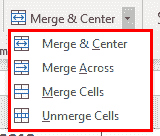

## 在 Excel 中合并单元格快捷方式

以下是在 Excel 中合并单元格的一些基本快捷方式:

*   通过使用默认键盘快捷键
*   通过使用自定义键盘快捷键
*   使用快速访问工具栏快捷方式

现在让我们详细讨论上面列出的每一种方法:

### 使用默认键盘快捷键合并单元格

使用键盘快捷键是在 Excel 中执行任何任务的最快和最有效的方法，因为 Excel 支持多种快捷键。Excel 中虽然没有合并单元格的直接快捷键，但是我们可以使用 Alt 键的方法。在 Excel 中使用 Alt 键可以启用某些关键字符，并将它们与功能区中的命令相关联。这样，我们可以直接从功能区按下一系列键并执行相关命令。

在 Excel 中合并单元格时，我们需要依次按 Alt 键后跟 H、M、C，即 **Alt > H > M > C 或 Alt+H+M+C**我们需要按照以下步骤使用键盘快捷键在 Excel 中合并单元格:

*   首先，我们需要选择所有要合并的单元格，然后按键盘上的 **Alt** 键。只要我们按下 Alt 键，Excel 就会为功能区上的每个选项卡显示一些字符或字母。看起来是这样的:
    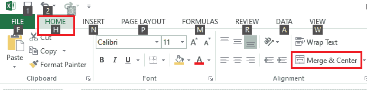
    由于**【合并并居中】**选项位于**【首页】**标签下，我们需要按键盘上的**【H】**键进入【首页】标签。
*   按下“H”键后，我们会看到 Excel 进一步显示了更多与“主页”选项卡下的选项链接的字母，如:
    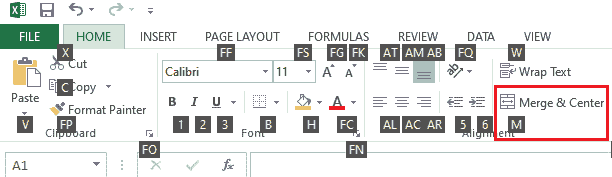
    在上图中，我们看到字母**【M】**与一个“合并&中心”选项相关联。因此，我们必须按下键盘上的“M”键。
*   按下“M”键后，Excel 会在“合并和居中”下显示更多可用选项，每个选项都有一些特定的键。
    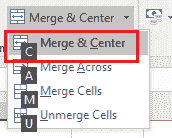
    由于我们需要选择选项‘合并并居中’，所以我们必须按键**‘C’**，因为字母 C 与想要的选项相关联，如上图所示。

这样，我们使用快捷键**Alt+H+M+c。**这就是我们如何使用键盘快捷键在 Excel 中合并和居中所需的单元格。同样，我们可以使用快捷方式 **Alt + H + M + A** 将所需的单元格合并为一个，并将单元格的文本向右对齐。此外，我们可以使用 **Alt + H + M + M** 将所需的单元格合并为一个默认的对齐方式。此外，我们可以使用快捷方式**Alt+H+M+u**取消合并单元格

### 使用自定义键盘快捷键(宏)合并单元格

虽然我们可以使用前面的快捷方式合并单元格，但由于有多个键按顺序排列，所以它有点长。因此，我们可以创建一个更容易记住的自定义快捷键。为此，我们使用微软 Excel 的宏功能。我们需要按照以下步骤配置一个自定义快捷方式，每当我们想要使用 Excel 中的快捷方式合并单元格时，都可以使用该快捷方式:

*   首先我们需要使用快捷键 **Alt + F11 打开**微软 Visual Basic for Applications** 。**显示 VBA 窗口后，我们需要进入**插入**选项卡，然后选择**模块。**
    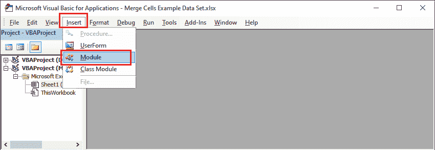
*   在编辑窗口(编辑模块窗口)上，我们需要插入以下代码:

```

Sub MergecenterCells()
With Selection
        .Merge
End With
End Sub

```

*   代码插入后，我们必须**将其保存到文件中，然后**关闭**窗口。接下来，我们需要使用快捷键 **Alt + F8 启动宏对话框。**看起来是这样的:
    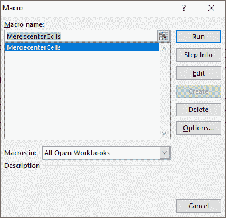**
*   在宏对话框中，我们必须点击**选项**按钮，然后输入所需的快捷键。需要注意的是，如果我们分配了 Excel 中已经存在的任何快捷方式，那么创建的快捷方式将会用新的快捷方式替换现有的快捷方式。
    因此，我们使用快捷键 **Ctrl + Shift + J** ，如:
    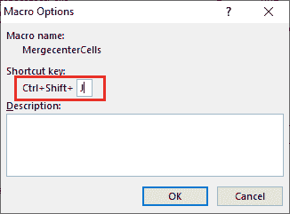
    一旦我们分配了快捷键，我们需要点击**确定**按钮和**关闭宏**对话框。

这样，我们创建了一个自定义快捷方式 Ctrl + Shift + J 来合并 Excel 中的单元格。现在，每当我们想要合并单元格时，我们只需要选择相应的单元格并使用我们创建的快捷方式。

如果我们想合并单元格并将值放在中间，我们需要在代码中添加以下行:

```

.HorizontalAlignment = xlCenter

```

如果我们想合并单元格并使文本垂直位于单元格的中心，我们需要在代码中包含以下行:

```

.VerticalAlignment = xlCenter

```

最后，我们的代码如下所示:

```

Sub MergecenterCells()
With Selection
        .Merge ' to merge cells
        .HorizontalAlignment = xlCenter ' to align text horizontally in center
        .VerticalAlignment = xlCenter ' to align text vertically in center
End With
End Sub

```

下图显示了我们的代码在编辑模块窗口/ VBA 编辑器中的外观:

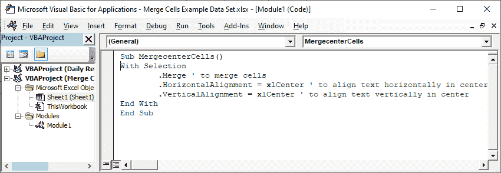

#### 注意:由于宏功能用于为合并 Excel 中的单元格创建自定义快捷方式，因此它需要 Excel 的现代版本和启用宏的工作簿。如果工作簿是从不受信任的来源获得的，这可能是一个问题，因为启用宏的工作簿也可能包含可疑代码或宏病毒。

### 使用快速访问工具栏快捷方式合并单元格

使用快捷方式在 Excel 中合并单元格的另一种方法是使用快速访问工具栏。Excel 允许我们在工具栏中添加所需命令的快捷方式。我们只需要添加一次想要的快捷方式，每次打开 Excel 都会有。这样，我们还可以在快速访问工具栏中添加“合并和居中”功能的快捷方式。我们需要按照以下步骤配置快捷方式，并直接从快速访问工具栏访问它:

*   首先，我们需要导航到功能区并转到**主页>合并&中心。**
    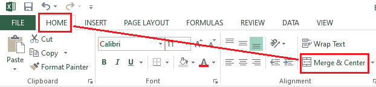
*   一旦我们在功能区找到‘合并&中心’快捷方式，我们需要在上面**右键单击**来访问菜单选项。
    T3】
*   接下来，我们需要从显示的右键菜单选项列表中点击选项**“添加到快速访问工具栏”**。
    T3】
*   点击上述选项后，**快速访问工具栏将新增一个**快捷方式**。**看起来是这样的:
    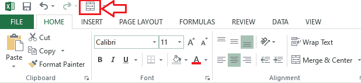
    一旦添加了快捷方式，我们就可以使用这个快捷方式快速合并单元格，并在需要的时候将它们对齐到中心。

同样，我们可以为合并的其他选项添加快捷方式。为此，我们需要转到主页选项卡，然后单击合并和中心。它将列出合并选项的相关功能，如合并和居中、跨单元格合并、合并单元格和取消合并单元格。现在，我们可以右键单击任何显示的选项，并相应地在快速访问工具栏上添加相应的快捷方式。

## 使用合并单元格快捷方式合并和居中的示例

让我们以下面的 Excel 工作簿为例，我们需要将单元格从 A1 合并到 G1、从 A2 合并到 A3、从 B2 合并到 C2、从 D2 合并到 E2 以及从 F2 合并到 G2。

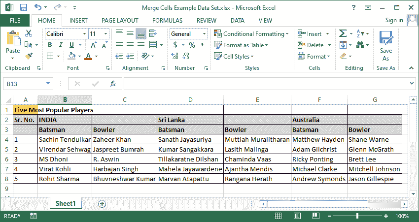

在这个例子中，我们将使用快捷键 **Alt + H + M + C** 。因此，excel 会显示一条警告，说所有单元格中的数据都将丢失。Excel 只保留左上角的单元格。我们需要遵循以下步骤:

*   首先我们需要**从 A1 到 G1 选择单元格**，然后依次按下键盘快捷键(即 **Alt + H + M + C)** 。我们将看到一个警告对话。我们需要点击**确定**按钮。
    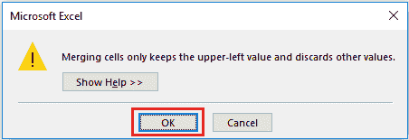
    点击确定按钮后，我们会得到如下结果:
    
*   接下来，我们需要从 A2 到 A3 选择单元格。选择单元格后，我们需要使用快捷键。或者，我们可以按下 F4 键来执行最后执行的动作。但是，根据系统设置，在使用 F4 键之前，我们可能需要先按 Fn 键。之后，我们根据需要合并单元格:
    
*   之后，我们需要选择从 B2 到 C2 的单元格，并按快捷键。这给出了以下结果:
    
    同样，我们可以将单元格 D2 合并到 E2，将单元格 F2 合并到 G2。
    合并所有需要的单元格后，我们的 Excel 工作表如下:
    

这样，我们就可以使用合并单元格快捷方式在微软 Excel 中使用合并功能来组织数据。

## 需要记住的要点

在我们使用上面讨论的任何快捷方式在 Excel 中合并单元格之前，我们必须知道一些要记住的要点。它们如下:

*   Excel 合并快捷方式只能帮助我们将单元格合并到一个单元格中，而不能将存储在这些单元格中的文本合并。
*   如果我们在多个单元格上使用“合并”和“居中”快捷方式，则仅获取最左上角单元格的文本，而删除其余单元格及其数据。但是，当合并单元格包含值时，Excel 会在合并前请求权限。
*   多次合并相同长度的单元格时，使用格式刷比重复合并单元格的步骤更容易。这样可以省去不必要的步骤，节省一些时间。
*   当工作簿包含合并单元格时，很难使用行/列标题(或 Ctrl + Space)选择相应的行或列。大多数情况下，对应区域的所有合并单元格都会被选中。

* * *