# Excel 粘贴特殊快捷方式

> 原文:[https://www.javatpoint.com/excel-paste-special-shortcut](https://www.javatpoint.com/excel-paste-special-shortcut)

微软电子表格是广泛使用的电子表格程序之一，有助于组织和处理大量数据。复制和粘贴是微软 Excel 中最常用的任务之一，因为它有助于即时使用不同工作表或网页中的数据。虽然在 Excel 中复制粘贴很容易，但它也有许多附加的粘贴选项。它不仅仅局限于使用简单的快捷键 Ctrl + C 和 Ctrl + V 进行复制粘贴。

Excel 特殊粘贴是 Excel 中帮助我们使粘贴操作更加有用的功能。它允许我们选择要保留的格式(源或目标)样式，或者我们只需要值或公式，而不需要任何格式。粘贴特殊功能通常扩展了在 Excel 中粘贴任何内容时的操作。

本文结合实例讨论了 Excel 粘贴特殊功能及相应的 Excel 粘贴特殊快捷方式。

## 什么是 Excel 中的特殊粘贴？

Excel 中的“粘贴特殊”功能提供了广泛的选项来帮助用户以不同的方式粘贴数据。我们可以只粘贴复制内容中需要的元素，也可以对复制的内容进行特定的数学运算。例如，我们可以复制包含公式的内容，并且只粘贴任何特定单元格中的值，而不粘贴其中的公式。这只是一种选择。但是，Excel 粘贴特殊功能允许我们在工作表中粘贴数据时有更多类似的选项。

此外，使用“特殊粘贴”功能的一个主要优点是，如果需要，我们可以在单个工作表或不同的工作表和工作簿中使用所有“特殊粘贴”选项。

## 如何在 Excel 中使用“特殊粘贴”？

Excel 提供了多种方法来访问任何功能，对于 Excel 粘贴特殊功能也是如此。这意味着我们可以通过使用不同的快捷方式来访问 Excel 粘贴特殊功能。然而，我们一定复制了一些东西来粘贴。一旦我们将复制的数据保存在剪贴板中，我们就可以使用以下快捷方式并在 Excel 中使用“粘贴特殊”功能:

**使用键盘快捷键**

访问“粘贴特殊”功能的最佳和最快方法是使用键盘快捷键。Excel 有多种键盘快捷键。要访问粘贴特殊功能并从剪贴板粘贴内容的特定方面，我们可以使用以下两种快捷方式中的任何一种:

*   **Ctrl + Alt + V** (适用于 Excel 2007 及更高版本)
    
*   **Alt + E，然后 S** (适用于所有 Excel 版本)
    

**使用功能区快捷方式**

使用“粘贴特殊”功能的另一个简单方法是使用功能区上的快捷方式。具体来说，我们需要导航到**主页**选项卡，点击**粘贴**工具下的下拉图标，然后从列表中选择**粘贴特殊**选项。

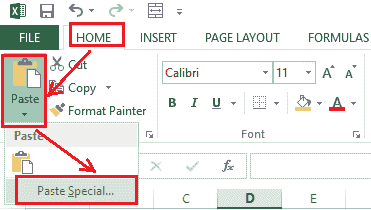

**使用右键菜单快捷方式**

或者，我们可以直接从**右键**菜单列表中使用“粘贴特殊”快捷方式。我们首先需要选择要粘贴内容的特定单元格，然后右键单击它。接下来，我们必须从列表中选择**特殊粘贴**来访问所有相关的粘贴选项。

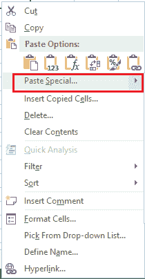

在上图中，我们可以看到一些常用选项(如粘贴所有内容、粘贴值、粘贴公式、转置、粘贴格式和粘贴链接)直接出现在“粘贴特殊”选项上方的右键菜单中。

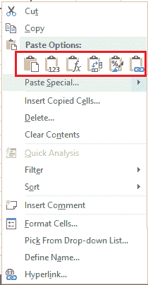

要访问更多内容，我们需要将鼠标悬停在列表中的“选择性粘贴”选项上。这将立即打开一个小弹出窗口，几乎有 14 个粘贴特殊选项。最棒的是，我们可以将鼠标悬停在弹出窗口上的任何选项上，查看内容的实时预览，比如它们将如何粘贴到带有相应选项的选定单元格上。

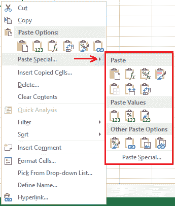

这三个快捷键通常都会启动**粘贴特殊对话框。**粘贴特殊对话框包含许多选项，我们可以使用鼠标按钮或通过相关的键盘快捷键进行选择。以下是“选择性粘贴”对话框的图像:

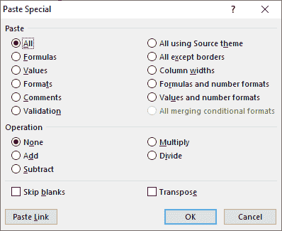

#### 注意:我们也可以使用快捷键 Shift + F10 来访问右键菜单选项。

## 了解 Excel 粘贴特殊选项和快捷键

如上所述，我们可以通过键盘快捷键 **Ctrl + Alt + V.** 直接从粘贴特殊对话框中访问所有粘贴特殊选项，对话框显示后，我们可以通过特定的键盘按钮而不是使用鼠标从框中选择所需的选项。

下表显示了从“选择性粘贴”对话框中选择所需选项的快捷键:

| 快捷键 | [计]选项 | 行动 |
| A | 全部 | 粘贴带有格式的单元格内容。 |
| F | 公式 | 仅粘贴公式。 |
| V | 价值观念 | 仅粘贴没有公式的值。 |
| T | 格式 | 复制或粘贴不带值的单元格格式。 |
| C | 评论 | 仅粘贴与单元格关联的注释。 |
| 普通 | 数据有效性 | 仅粘贴数据验证配置。 |
| H | 全部使用源主题 | 按照源单元格粘贴相同主题格式的所有内容。 |
| X | 除边框外的所有内容 | 粘贴所有不带边框的单元格内容。 |
| W | 列宽 | 仅粘贴复制源的列宽。 |
| 稀有 | 公式和数字格式 | 粘贴公式和数字格式，如货币、日期格式、符号等。 |
| U | 值和数字格式 | 粘贴不带公式和数字格式的值。 |
| D | 增加 | 将复制的内容添加到目标单元格中的数据。 |
| S | 减去 | 从目标单元格中的数据中减去复制的内容。 |
| M | 乘；成倍增加；（使）繁殖 | 将复制的内容乘以目标单元格中的数据。 |
| 我 | 划分 | 将复制的内容除以目标单元格中的数据。 |
| B | 跳过空格 | 防止复制目标区域中的值，复制区域中有空白单元格。 |
| E | 移项 | 将复制内容的列转换为行，将行转换为列。 |
| L | 环 | 使用公式将粘贴内容链接到复制的内容。 |

在我们使用表格中的任何快捷方式之前，应该注意的是，我们必须先复制数据，并且“粘贴特殊”对话框已经打开。

## 在 Excel 中使用特殊粘贴的示例

我们借助相关的例子来讨论一些最流行的粘贴特殊功能。在这些示例中，我们使用了 Excel 粘贴特殊快捷方式:

### 使用粘贴特殊快捷方式复制注释

假设我们想在没有单元格值和格式的情况下将注释从一个单元格复制到另一个单元格。我们需要遵循以下步骤:

*   首先，我们需要选择要从中复制注释的一个或多个单元格，然后按快捷键 Ctrl + C 将其内容复制到剪贴板中。
*   接下来，我们需要选择目标单元格或特定区域的左上角单元格来粘贴注释。一旦选择了想要的单元格，我们必须使用快捷键 **Ctrl + Alt + V** 来启动粘贴特殊对话框。
*   对话框显示后，我们需要按下键盘上的**【C】**按钮，从粘贴特殊对话框中选择**【备注】**选项。最后，我们必须按下**进入**键。
    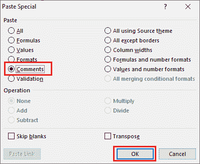

通过使用这些步骤，我们可以将注释复制到所需的单元格，而不需要值或格式。在下图中，注释从单元格 A2 复制到 C2，而目标单元格(C2)中的现有值被保留。

### 使用粘贴特殊快捷方式复制值

假设我们希望将值从一个单元格复制到另一个单元格，而忽略其他复制的内容，如公式和格式。我们需要遵循以下步骤:

*   首先，我们需要选择包含公式的一个或多个单元格，然后按快捷键 Ctrl + C 将单元格内容复制到剪贴板中。
*   接下来，我们需要选择目标单元格或特定区域来粘贴值。需要注意的是，我们还可以选择复制的同一单元格来删除公式，只保留结果值。一旦选择了想要的单元格，我们必须使用快捷键 **Ctrl + Alt + V** 来启动粘贴特殊对话框。
*   显示“粘贴特殊”对话框后，我们需要按下键盘上的**“V”**按钮，从“粘贴特殊”对话框中选择**“数值”**选项。如果我们想保持数值和原来的数字格式，我们可以按“U”键而不是“V”。最后，我们必须按下**进入**键或点击确定按钮。
    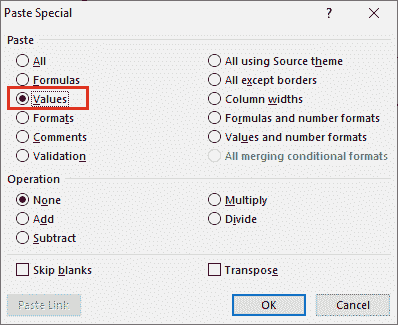

通过使用这些步骤，我们可以只将值复制到所需的单元格，而无需公式或格式。这些值是从单元格 A3 复制到 C3 的，没有下图中单元格 A3 中的公式。

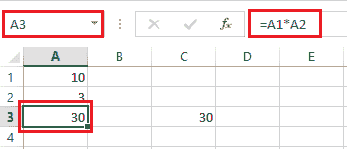

当我们选择单元格 C3 时，我们会在公式栏中看到值，因为公式没有被复制。

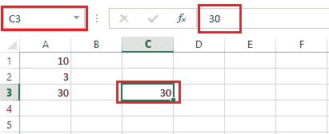

### 使用粘贴特殊快捷方式调换内容

转置功能帮助我们将列变成行，反之亦然。为此，我们需要遵循以下步骤:

*   首先，我们需要选择要转置的表格，并按快捷键 Ctrl + C 复制其内容。
*   接下来，我们需要选择特定区域的左上角单元格来粘贴转置的内容。一旦选择了想要的单元格，我们必须使用快捷键 **Ctrl + Alt + V** 来启动粘贴特殊对话框。
*   “粘贴特殊”对话框显示后，我们需要按下键盘上的**【E】**按钮，从“粘贴特殊”对话框中选择**【转置】**选项。最后，我们必须按下**进入**键或点击确定按钮。
    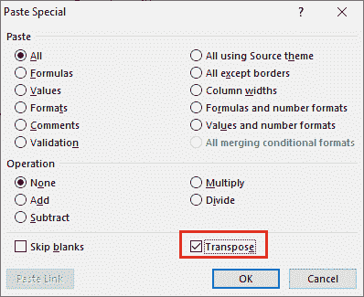

通过使用这些步骤，我们可以以转置的方式将内容复制到所需的单元格中。在下图中，内容从列转置到行:

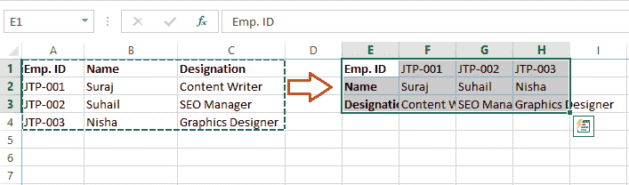

### 使用粘贴特殊快捷方式复制列宽

我们可以用这个方法快速的给 Excel 中的所有列设置需要的宽度。我们需要按照以下步骤使用粘贴特殊快捷方式配置宽度:

*   首先，我们必须根据需要调整任何单个列的宽度。列宽配置好之后，我们需要用快捷键 Ctrl + C 复制列。
*   接下来，我们需要选择一个列的范围，我们希望根据所需的宽度进行调整。要选择列，我们可以根据相邻或不相邻的列使用 Ctrl 或 Shift 键。
*   一旦选定范围，我们需要使用快捷键 **Ctrl + Alt + V** 打开粘贴特殊对话框。之后，我们需要按下键盘上的**【W】**键来选择**【列宽】**选项。
*   最后，我们必须按下**进入**键或点击对话框中的确定按钮。
    T3】

通过使用这些步骤，我们可以为所需的列设置相等的宽度。在下图中，使用“粘贴特殊快捷方式”调整列宽:

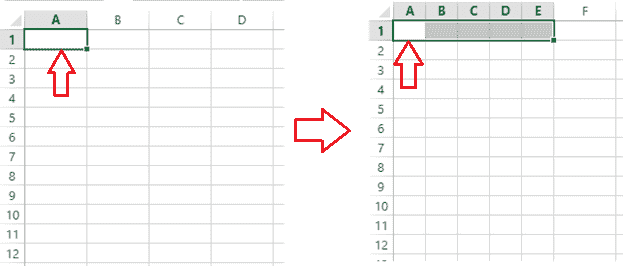

### 使用“粘贴特殊快捷方式”复制列宽及其内容

与上面的方法不同，我们还可以从源中粘贴宽度已调整的复制内容。我们不需要手动调整宽度来适应新的值。为此，我们需要遵循以下步骤:

*   首先，我们需要选择要复制到另一个单元格的数据，然后按快捷键 Ctrl +C。
*   接下来，我们需要选择目标范围，并在其上按下**右键**。
*   我们必须从列表中选择**“选择性粘贴”**选项，然后点击**“保持源列宽”**选项。或者，我们可以在选择“特殊粘贴”选项后按下“W”键，它将直接选择所需的选项。看样子:
    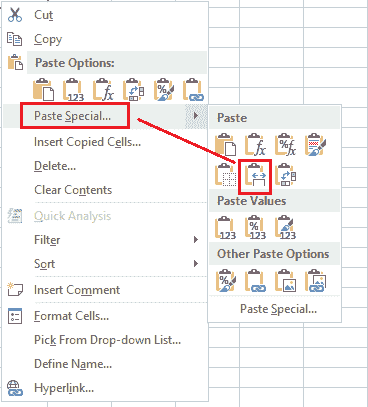

我们可以使用以下步骤将单元格或多个单元格中的内容复制到具有源宽度的工作表中的其他单元格。完成这些步骤后，我们复制的数据将粘贴如下图所示:

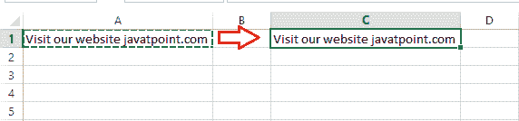

在上图中，我们可以看到单元格宽度是根据源格式自动调整的。

这就是我们如何在 Excel 中使用粘贴特殊快捷方式。

* * *