# Excel 中的间接()函数

> 原文：<https://www.javatpoint.com/indirect-function-in-excel>

间接()是 Excel 内置函数。当用户想要汇编可用作有效单元格引用的文本值时，此函数会提供帮助。在此函数中传递的文本被转换为单元格引用。然后，如果转换后的引用单元格包含任何值，该值将作为结果返回给用户。

**例如=间接(“B5”)**它将引用 B5 单元格。

使用该函数的主要目的是**从 Excel 工作表中的文本**创建单元格引用。函数的作用是:创建动态单元格引用。作为结果值，它返回由文本字符串指定的引用。这是一个非常有趣的功能。

## Excel 中间接()函数的使用

间接()函数功能不受限制；通过创建动态单元格引用来获得不同的结果会有很大帮助。这个公式最大的优点之一是，即使插入/删除新的行或列，它也不会改变引用。

#### 注意:间接()函数创建动态单元格引用。

**间接()函数**对于使用文本引用单元格非常有用。它不对 Excel 数据执行任何算术或逻辑计算。您可以在任何其他函数中使用它并获得结果。由于动态单元格引用功能，我们可以在不更改公式本身的情况下更改公式中的单元格引用。

### 句法

间接()函数的语法和它的定义一样简单-

=INDIRECT(ref_text, [a1])

在这里，

1.  **Ref_text** 是引用文本字符串，并且
2.  **a1** 是逻辑值，真或假。

第二个参数([a1])是可选参数。当它没有被传递时，间接()函数认为它为真。

*   ref_text 中的引用类型由 a1 指定。
*   如果 a1 为真或未在间接()函数中提供，ref_text 将被解释为 A1 Style 单元格引用。
*   如果 A1 为 FALSE，ref_text 将被视为 R1C1 样式的单元格引用。

### 返回值

函数的作用是:返回在函数中以双引号形式传递的单元格引用。

### 单元格引用样式

有两种类型的单元格引用，即，

1.  A1 样式单元格引用
2.  R1C1 样式单元格引用

两者正好相反。您应该了解这些样式单元格引用，以便理解 INTERVAL()函数，因为 ref_text 参数值依赖于它。

**1。A1 样式单元格引用**

A1 样式单元格引用是 Excel 中常见的引用类型。这是一个更好的样式单元格引用。在 A1 样式的单元格引用中，一列后面跟一个行号。**例如**，F3。这里，F 是列号，3 是行号。

**2。R1C1 样式单元格引用**

R1C1 样式单元格引用与 A1 样式单元格引用正好相反。与 A1 引用不同，一行后面跟一个列号。

#### 注意:在这种样式中，您必须提供第二个参数。

R1C1 顾名思义，R 指行，C 指列。**例如**，R2C4 指第二行第四列，即 D2 单元。如果字母后没有数字(例如 R3C)，则表示我们指的是同一行和同一列。

## 间接()函数的例子

间接()函数有几个基本的和高级的例子。首先，我们将向您展示 A1 和 B1C1 样式单元格引用的基本示例，以解释它们如何在 Excel 工作表中工作。

### 示例 1: A1 样式单元格引用

1.我们将以下数据存储在 Excel 工作表中。这里，我们将使用间接()函数在 A1 样式的单元格引用中创建一个单元格引用。

2.现在，编写一个间接()公式，该公式带有一个引用单元格的文本参数。**例如**，

=间接(“C5”)

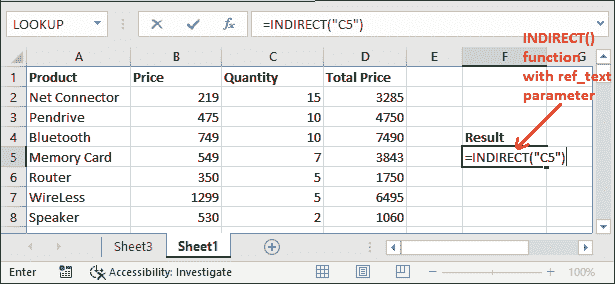

它将引用该工作表的 C5 单元格。

3.点击**进入**键，得到存储在 C5 单元格中的结果值。

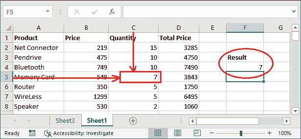

它返回存储在 C5 单元格中的值 7，作为 INternet()函数将 C5 文本转换为 C5 单元格引用。

#### 注意:如果转换后的单元格引用不包含任何值，间接()函数将返回 0。

4.请注意，我们已经在间接()函数中传递了 E5 文本字符串，它是 E5 单元格的引用。E5 是一个空单元格。

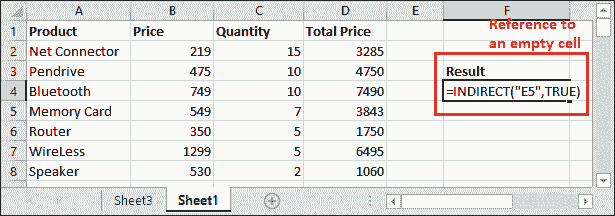

5.按**回车**键得到结果，看到它会返回 0，因为 E5 单元格不包含任何值。这是一个空的细胞。

### 示例 2: B1C1 样式单元格引用

1.我们在 Excel 工作表中存储了与上面相同的数据。这里，我们将使用间接()函数在 R1C1 样式的单元格引用中创建一个单元格引用。

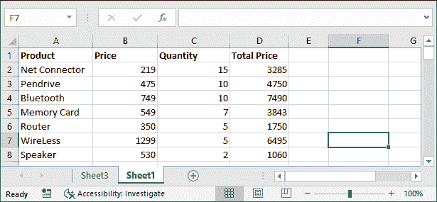

2.使用 R1C1 中的文本参数和 FALSE 作为第二个参数值，编写以下间接()公式。

=间接(“R5C4”，假)

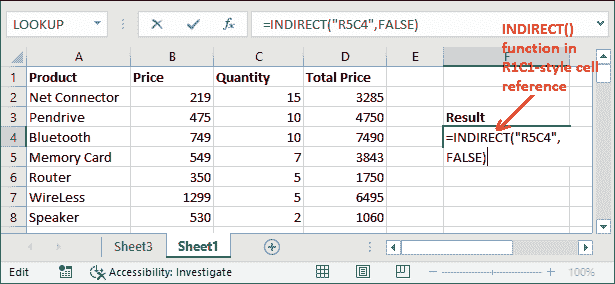

它指示第五行和第四列。因此，它将引用此工作表的 D5 单元格。

3.点击**进入**键，获取 D5 单元格中存储的结果值，并查看从中返回的值。

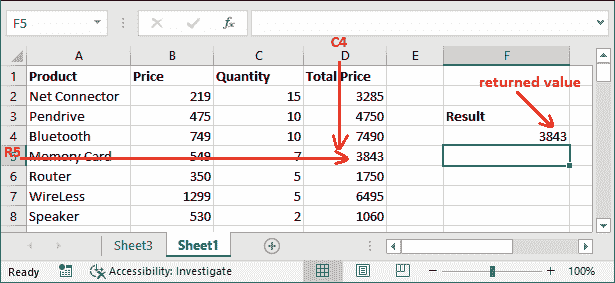

间接()函数返回了 3843，因为单元格引用是 D5。D5 细胞是包含存储卡的总价格，即 3843。

#### 注意:类似于 A1 样式的单元格引用，如果一个单元格不包含任何值，inheritable()函数也将在 R1C1 样式的单元格引用中返回 0。

4.请注意，我们已经将 R3C5 文本字符串传递给了间接()函数。它是 E3 单元的引用，不包含任何值。

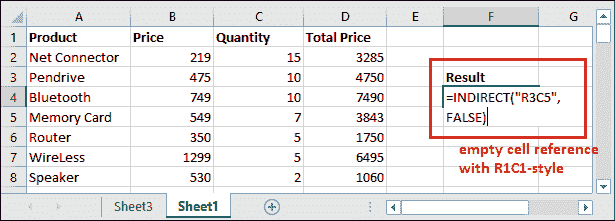

5.按下**进入**键得到结果，看到它将返回 0，因为 E3 单元格不包含任何值。这是一个空的细胞。

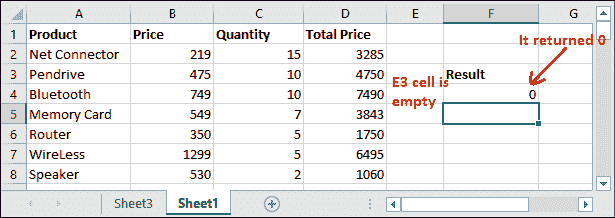

这些是间接()函数使用 A1 样式和 R1C1 样式单元格引用的最基本和最简单的用法。

### 带 ROW()的间接()函数

Excel 允许用户在其他函数中使用 INternet()函数，以及在 INternet()函数中嵌套其他函数。它们共同帮助实现特殊的结果，并动态地工作。

让我们通过一个例子来理解-

**第 1 步:**我们将通过创建具有间接()和行()函数的动态单元格引用来获取单元格数据。

以这种方式使用公式:

=间接(“B”& ROW())

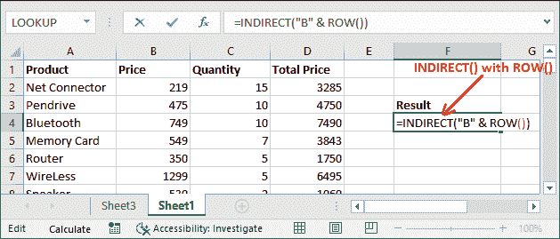

首先，ROW()函数将获取您的控件在 Excel 工作表中的行号，该行号随后将与间接()函数中传递的文本字符串连接，以在单元格引用中进行转换。

**第二步:**获取该公式的动态结果。请注意，它的值为 749，存储在 B4 单元格中。

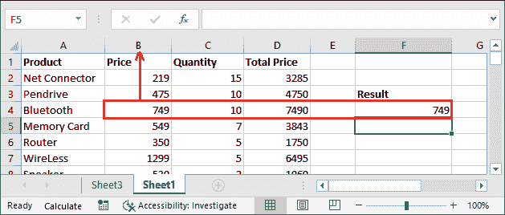

这里，ROW()函数返回了与列 B 连接的第 4 行，并通过将其转换为单元格引用来返回存储在 B4 单元格中的值。

## 间接()函数的高级用法

间接()函数不仅用于转换简单单元格引用。此外，它通过允许在另一个功能中使用它来提供高级功能。

我们可以将这个函数与其他 Excel 函数一起使用，或者嵌套在其中。例如，通过创建动态单元格引用来计算数字的总和。现在，我们将向您展示一些不同的东西，间接()函数是如何在另一个函数中使用来实现结果的。

### 示例 1:动态单元格的总和

**第一步:**我们有下面的数据，在上面的例子中也用到。我们将通过创建动态单元格引用来计算单元格的总和。

**第二步:**写出以下公式，得到产品总量的动态和。每种产品的数量存储在 c 栏中

=总和(间接(“C2:C8”))

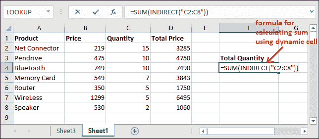

**第三步:**现在，获取其引用由间接()函数生成的单元格的总和。看到用这个公式计算出来的产品总数是 54。

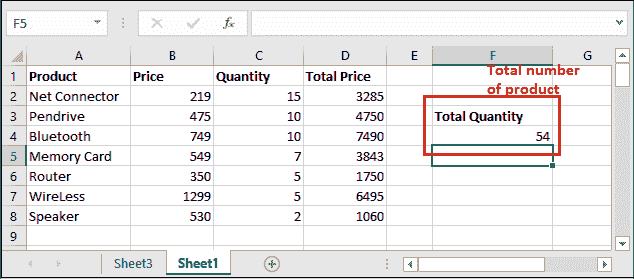

同样，我们可以使用此公式通过将 SUM()替换为 average()来计算列数据的平均值。

### 示例 1:动态单元格的平均值

现在，我们将通过使用间接()函数创建动态单元格引用来计算总价的**平均值。每种产品的总价储存在 d 栏。**

**第一步:**写出以下公式，得到产品总价的平均值。

=平均值(间接(“D2:D8”))

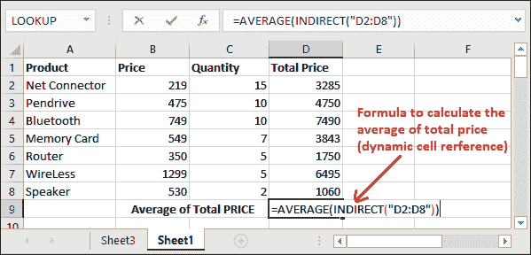

**第二步:**现在，获取其单元格引用由 inheritable()函数生成的总价的平均值。看到用这个公式计算出来的产品总价平均值是 4096.142857。

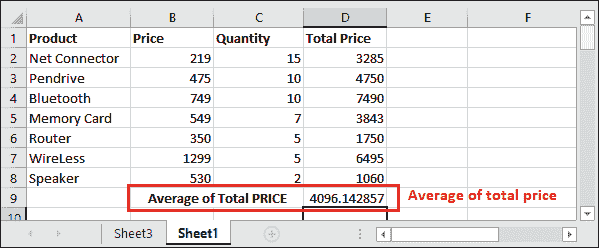

查看 INCLUDE()函数如何与其他函数一起工作。但是现在，您正在思考这个间接()函数将如何帮助用户。函数的作用是:锁定单元格引用。

寻找下一个例子，“使用 INternet()函数锁定单元格引用”。

## 使用间接()函数锁定单元格引用

一般来说，我们会在 Excel 工作表中添加或删除行和列。它导致-我们用来处理数据的单元格引用自动改变。间接()函数有助于防止更改单元格引用。

这里，我们有一个所有产品总量的总和。一种是用 SUM()函数简单计算，另一种是用 SUM()和 INDIRECT()函数计算平均值，即(SUM(INDIRECT())。

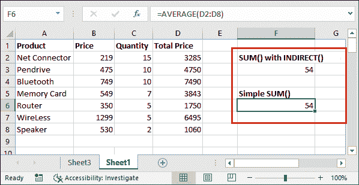

现在，如果我们在**价格**列之前插入一个新的列，我们已经计算了该列的平均值。看看它将如何影响两个公式的结果。

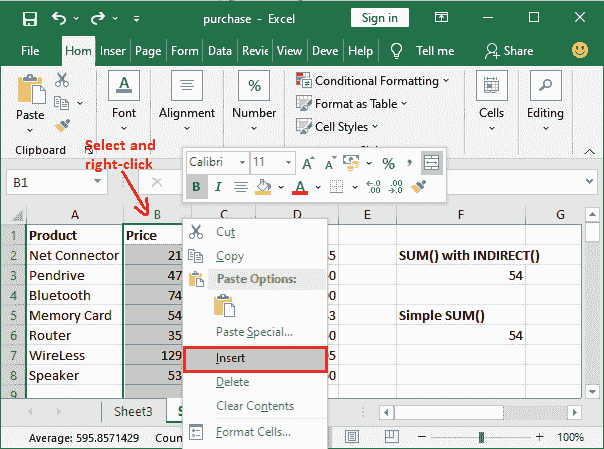

在这里，您可以看到工作表中添加了一个新的空白列(列 B)，列向右移动。

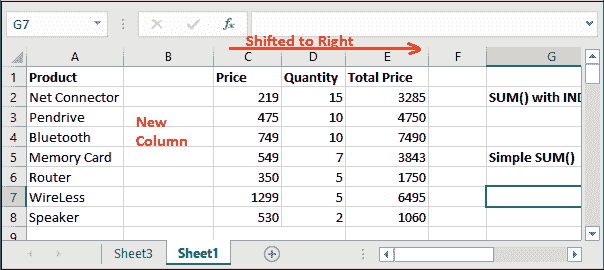

结果是“数量”列引用从 C 列更改为 D 列，但是我们为 C 列创建的引用没有更改。

**对计算总和的影响**

现在看看它如何影响使用这两个公式计算的总和。

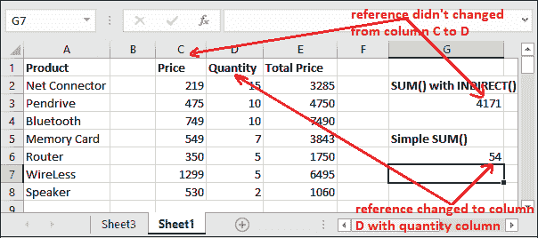

这样，我们就可以使用 INternet()函数锁定单元格引用。通过间接()函数设置的行/列的添加或删除不会改变单元格引用。

在这里，你可以清楚地看到-

**SUM(间接(“C2:C8”))-**由间接()函数创建的用于计算 SUM 的单元格引用仍然相同。由于动态单元格引用，仍在计算 C 列的和，目前存储的是**价格**列明细，而不是数量。

**SUM(“C2:C8”)-**简单 SUM()公式中的单元格引用随着列的移动而改变。单元格引用从 C 列更改为 D 列，现在仍在计算 D 列的总和。该列当前正在存储“数量”列详细信息。

* * *