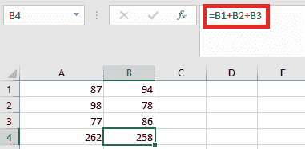

# 什么是 Excel 中的相对引用

> 原文：<https://www.javatpoint.com/what-is-relative-reference-in-excel>

在 Excel 中，**相对引用**是单元格引用的一种。 ***将公式复制到任何其他单元格或任何其他工作表*** 时，相对引用会发生变化。当必须重复计算时，我们使用相对参考。

换句话说，相对引用是指应用于单元格或公式的引用点，该引用点返回相对于单元格位置的值。单元格引用主要有两种类型:**相对**和**绝对**。当复制和填充到其他单元格时，相对引用和绝对引用的作用不同。每当公式被复制到另一个单元格时，相对引用就会改变。但另一方面，绝对引用保持不变，无论它们被复制到哪里。通过使用绝对引用，行和列都可以保持不变。公式中可以使用美元符号($)来实现这一点。我们必须在行和列前面加上美元符号($)。

在 Excel 中，相对引用与选择单元格但不填充数据是一样的。因此，单元格的值不会是固定的，每次我们复制或使用该单元格时，其值都会随着工作表的引用而被修改。默认情况下，所有单元格引用都是相对引用。当跨多个单元格复制时，它们会根据行和列的相对位置而变化。**例如，**如果我们将公式=A1+B1 从第 1 行复制到第 2 行，它将变成=A2+B2。当我们需要跨许多行或列重复计算时，相对引用非常有用。

## Excel 中的相对引用如何变化？

在相对引用中，当我们向上、向下、向左或向右移动时，每个引用单元格都会发生变化。默认情况下，Excel 中的每个单元格都有一个相对引用。

例如，如果我们引用单元格 B10，并以下面的方式移动单元格:

*   向上-参考变更为 B9。
*   向下-参考更改为 B11。
*   向左-参考 A10 的变化。
*   向右-参考值变为 C10。

## 如何使用相对引用创建和复制公式

让我们借助例子来理解相对指称的概念。在下面的例子中，我们想开发一个公式，将每件商品的价格乘以数量。我们可以在单元格 D2 中构建一个公式，并将其复制到剩余的行中，而不是为每一行创建单独的公式。为了确保公式准确计算每个项目的总和，我们可以使用相对引用。

我们必须按照以下步骤使用相对引用来创建和复制公式:

1.  首先，我们要选择将输入公式的**单元格**。在这种情况下，我们将选择**D2**T4
2.  然后，我们必须键入公式来计算所需的值。在这个例子中，我们将输入 **=B2*C2。**
    
3.  那我们就要按了公式会被计算出来，结果会出现在单元格里。
4.  接下来，我们必须找到所需单元格右下角的填充手柄。在本例中，我们将定位单元格
    的填充手柄
5.  通过在单元格上单击、按住并拖动填充手柄来填充单元格。在本例中，我们将选择单元格 D3:D10。
    
6.  接下来，我们必须释放鼠标。公式将被复制到具有相对引用的选定单元格中，并将计算每个单元格中的值。
    
    *   我们还可以双击填充的单元格来检查它们的公式是否正确。根据行的不同，每个单元格的相对单元格引用必须不同。
        

## 如何在 Excel 中使用相对引用？(举例说明)

让我们借助以下示例来探索更多关于相对引用的信息:

**例 1:** 借助一个例子，我们可以更好地理解 Excel 中相对单元格引用的概念。单元格 **A1、A2、**和 **A3** 总共需要三个数字。假设我们正在单元格 **A4 中寻找总和。**

因此，在单元格 **A4** 中，我们必须应用公式 **"=A1+A2+A2。"**

单元格 **A1、A2、**和 **A3** 之和等于 **262。**

现在，由于单元格 **B1、B2、**和 **B3** 的值不同，我们需要在单元格 **B4 中求和。**

计算总数有两种方法。我们可以使用 **B4** 单元格中的 Excel 加法公式，也可以将公式从 **A4** 单元格复制粘贴到 **B4 单元格中。**

复制单元格 A4 放入单元格 B4 时答案不是 262。这是因为被复制的单元格 A4 有公式而不是值。

单元格 A4 的输出取决于单元格 A1、A2 和 A3。复制单元格 A4 后，复制单元格 A1 后向右移动一个单元格，变成 B1，A2 变成 B2，A3 变成 B3。结果，单元格 B4 对单元格 B1、B2 和 B3 的值求和。

**例 2:** 我们再来看一个相对引用的 Excel 例子。公式**销售单位*单价=销售收入**将用于确定销售收入。

为了计算销售收入，我们将销售的单位数量乘以单价。

**产品-1** 的销售收入采用公式 **B2*C2 计算。**将该公式应用于所有项目会很麻烦。因此，我们将公式复制并粘贴到剩余的单元格中。

当我们将公式从单元格 **D2** 复制到单元格 **D3** 时，公式引用从 **B2*C2** 变为 **B3*C3** 。按 **Ctrl+D** 或将单元格 **D2** 复制粘贴到所选单元格中，确定所有产品的销售收入。

为产品编写公式可能需要一分钟，但是复制或拖动填充手柄只需要几秒钟。因此，我们将把填充手柄拖到剩余的单元格中，以确定所有剩余产品的销售收入。

**例 3:** 我们用这个例子来多讨论一下相对引用。在这个例子中，我们必须找出学生的身体质量指数。这是为了确定学生的健康风险以及他们是否在健康的体重范围内。少数学生的体重(公斤)和身高(米)数据已经有了。

为了计算身体质量指数，我们要用的公式是 **=kgm 2。T3】**

在 Yash 的情况下，将是= **70/(1.78*1，78)，**或者在 Excel 表达式中，将是 **=B4/(C4*C4)**

返回值为 **22.09317。**

为了计算剩下的一个，我们只需将公式复制粘贴到单元格 **E4** 中，并将其应用到其余的单元格 **(D5、D6、D7、D8)中。**

这个例子中的数据集都是可变的。每个学生的体重和身高都不一样。他们唯一的共同点是计算他们的**身体质量指数**，这需要我们对每个学生使用相同的公式。

* * *